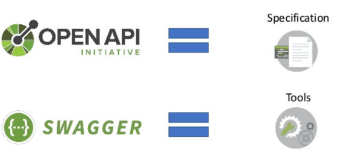

# API documentatie

Voor het schrijven van API documentatie bestaan wel wat tools. Swagger is een van de bekendste. Swagger is een set van open-source tools die samenwerken om REST API's te ontwerpen, builden, documenteren en consumeren. Swagger is gebaseerd op de OpenAPI specificatie. In dit hoofdstuk leer je hoe je een REST API documenteert met OpenAPI en Swagger.

<!-- TODO: startpunt en oplossing toevoegen -->

## Swagger vs Open API



### OpenAPI Specification

[OpenAPI Specification (OAS)](https://swagger.io/specification/), voorheen bekend als Swagger Specification, biedt een standaard, programmeertaal onafhankelijke beschrijving van een REST API in YAML- of JSON-formaat. Het geeft alleen aan welke functionaliteit de API biedt, niet welke implementatie of dataset achter die API schuilgaat.

Met OAS 3.0 kunnen zowel mensen als machines de functionaliteit van een REST API bekijken, begrijpen en interpreteren, zonder toegang tot de broncode, aanvullende documentatie. Uit de documentatie kan de client code worden gegenereerd. Een voorbeeld van de basis structuur vind je hier: <https://swagger.io/docs/specification/basic-structure/>.

**Een API is maar zo goed als jij (ja, jij) hem documenteert.**

### Swagger

Swagger is een set van open source tools opgebouwd rond de OpenAPI specificatie om REST API's te ontwerpen, builden, documenteren en consumeren:

- [Swagger Editor](https://editor.swagger.io/): browser-based editor voor het schrijven van OpenAPI specs.
- [Swagger UI](https://swagger.io/tools/swagger-ui/): creëert een documentatiepagina voor de OpenAPI specs als interactieve API documentation.
- [Swagger Codegen](https://github.com/swagger-api/swagger-codegen): genereert server stubs en client libraries vanuit de OpenAPI spec.

Swagger installeer je als volgt:

```bash
yarn add swagger-jsdoc koa2-swagger-ui
```

- `swagger-jsdoc`: deze library leest de [JSDoc](https://jsdoc.app/) annotated source code en genereert een OpenAPI (Swagger) specification. JSDoc is een API-documentatiegenerator voor JavaScript, vergelijkbaar met Javadoc. Je voegt documentatie-opmerkingen rechtstreeks toe aan de broncode, direct naast de code zelf. De JSDoc-tool scant de broncode en genereert de OpenAPI spec.
- `koa2-swagger-ui`: Swagger UI middleware voor Koa. Dit genereert een documentatiepagina vanuit de OpenAPI definities.

### Aanpassing voor koa-helmet

koa-helmet's Content Security Policy (CSP) is niet nodig in development, dit levert problemen op met de Swagger UI. Pas `src/core/installMiddleware.js`:

```js
// ...

const isDevelopment = NODE_ENV === 'development';

// ...

// Add some security headers
app.use(
  koaHelmet({
    // Not needed in development (destroys Swagger UI)
    contentSecurityPolicy: isDevelopment ? false : undefined,
  }),
);

// Add CORS
// ...
```

## API documentatie

OpenAPI definities schrijf je in YAML of JSON. Wij maken hier gebruik van YAML. Documenteer onderstaande aspecten:

- `Metadata`: bevat de OpenAPI versie en info over de API (title, version...).
- `Servers`: de API servers en base URL.
- `API tags`: tags worden gebruikt voor het groeperen van gerelateerde operaties bv. transactions en places.
- `API components`: documentatie van de verschillende herbruikbare data modellen: schema's, parameters, beveiligingsschema's, request bodies, responses, headers, voorbeelden, koppelingen en callbacks.
- `API paths`: paden naar de documentatie, relatief t.o.v. de root.

Voeg zelf o.b.v. de documentatie van [swagger-jsdoc](https://www.npmjs.com/package/swagger-jsdoc) en [koa2-swagger-ui](https://www.npmjs.com/package/koa2-swagger-ui) Swagger toe aan onze [voorbeeldapplicatie](https://github.com/HOGENT-frontendweb/webservices-budget).

- Maak gebruik van de Open API documentatie.
- Als startpunt kan je commit `5828969` gebruiken.
- Uiteraard kan dit ook meteen in je eigen project.
- (ja, als developer moet je zelf ook dingen kunnen uitzoeken en leren gebruiken)
- Een oplossing vind je in onze [voorbeeldapplicatie](https://github.com/HOGENT-frontendweb/webservices-budget) op de branch `authenticatie`.
