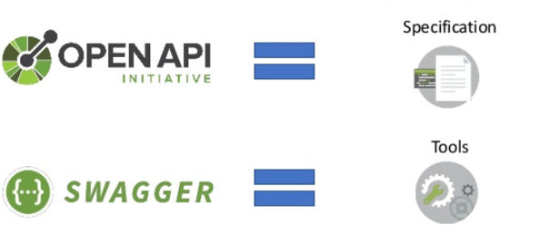

# Linting en Swagger

> **Startpunt voorbeeldapplicatie**
>
> ```bash
> git clone https://github.com/HOGENT-Web/webservices-budget.git
> cd webservices-budget
> yarn install
> git checkout -b les6 820b9fa
> yarn start
> ```

## Linting

- linting is statische analyse van code
- het wordt gebruikt om problemen zoals verkeerde syntax en twijfelachtig gebruik van code te detecteren
- waarom linting en formatting?
  - errors, typos en syntax errors vinden
  - best practices volgen
  - consistentie van code style (bv. tussen verschillende developers)
  - committen van "bad" code vermijden
  - warning bij gebruik van harmful methods
- [ESLint](https://github.com/eslint/eslint), gecreëerd door Nicholas C. Zakas in 2013, is een linting tool voor JavaScript.
- [Airbnb](https://github.com/airbnb/javascript) heeft een eigen coding style opgesteld. Je kan hiervan vertrekken, of van de standaard aanbevolen instellingen van ESLint.

### Linting: tools installeren

Voeg de [ESLint extensie](https://marketplace.visualstudio.com/items?itemName=dbaeumer.vscode-eslint) toe aan VS Code. Installeer ESLint in het project

```bash
> yarn add eslint --dev
> yarn add eslint-plugin-import --dev
```

`eslint-plugin-import`: meldingen over imports volgorde + vele andere mogelijkheden voor imports
Pas de `package.json` aan, voeg onderstaand script toe

```json
"scripts": {
  "lint": "npx eslint . --fix"
}
```

Maak een `.eslintrc.json` bestand in de root folder met een leeg JSON-object in. Dit bestand bevat onze configuratie voor linting en formatting.

`.eslintrc.json`

```json
{
  "env": {
    "es6": true,
    "es2021": true,
    "node": true,
    "jest": true
  }, // 👈 1
  "extends": "eslint:recommended", // 👈 2
  "parserOptions": {
    "ecmaVersion": 12,
    "sourceType": "module"
  }, // 👈 3
  "plugins": ["import"], // 👈 4
  "rules": {
    "import/order": [
      "error",
      {
        "groups": [
          "builtin",
          "external",
          "internal",
          "parent",
          "sibling",
          "index"
        ],
        "newlines-between": "always"
      }
    ]
  } // 👈 5
}
```

1. Met `env` geven we aan welke JS-environments we gebruiken/nodig hebben. In ons geval: ES6 en ES2021 syntax, NodeJS en Jest
2. We erven over van de aangeraden ESLint configuratie
3. We gebruiken [ECMAScript versie 12](https://dev.to/naimlatifi5/ecmascript-2021-es12-new-features-2l67) en ECMAScript modules
4. We voegen een plugin toe die onze imports voor ons zal sorteren
5. Om deze plugin aan te zetten, moeten we deze rule instellen

Je kan zelf nog rules toevoegen aan de `.eslintrc.json`. Je kan ESLint zo instellen dat automatisch herstel wordt uitgevoerd telkens je CTRL+S (of COMMAND+S) drukt. Open de JSON settings via F1 > Zoek naar "Preferences: Open Settings (JSON)" en voeg onderstaand toe (zonder de { })

```json
{
  "editor.codeActionsOnSave": {
    "source.fixAll.eslint": true
  },
  "eslint.validate": ["javascript"]
}
```

Run voor elke commit: `yarn lint`. Dit zal je code linten, sommige problemen zelf oplossen en fouten geven omtrent manueel op te lossen problemen.

### Linting: oefening

Voeg regels toe voor volgende vereisten:

- standaard gebruiken we 2 spaties om te indenteren, switch cases ook
- we willen alleen UNIX line endings
- we willen alleen enkele quotes gebruiken, geen dubbele
- elke lijn moet eindigen met een puntkomma
- een object met keys over meerdere lijnen moet op elke lijn een komma hebben achteraan
- er mogen geen tabs gebruikt worden
- de maximum lengte van een lijn is 120 karakters, strings worden genegeerd
- er moeten steeds haakjes staan rond de parameters van een arrow function
- de accolades moeten in één bestand op een uniforme manier gebruikt worden (bv. allemaal meteen na de parameterlijst of allemaal op de volgende lijn)
- we laten definitie van inline functies wel toe
  Alle mogelijke regels vind je in de [documentatie](https://eslint.org/docs/latest/rules/) (of via Google).

Een oplossing vind je in onze [voorbeeldapplicatie](https://github.com/HOGENT-Web/webservices-budget)

## Swagger vs Open API



### OpenAPI Specification

- [OpenAPI Specification (OAS)](https://swagger.io/specification/) (voorheen bekend als Swagger Specification)
- YAML of JSON
- Biedt een standaard, programmeertaal onafhankelijke beschrijving van een REST API
- Geeft alleen aan welke functionaliteit de API biedt, niet welke implementatie of dataset achter die API schuilgaat
- Met OAS 3.0 kunnen zowel mensen als machines de functionaliteit van een REST API bekijken, begrijpen en interpreteren, zonder toegang tot de broncode, aanvullende documentatie
- Uit de documentatie kan de client code worden gegenereerd
- Een [voorbeeld](https://swagger.io/docs/specification/basic-structure/) van de basis structuur

**Een API is maar zo goed als jij (ja, jij) hem documenteert.**

### Swagger

Een set van open-source tools opgebouwd rond de OpenAPI specificatie om REST API's te ontwerpen, builden, documenteren en consumeren.

- [Swagger Editor](https://editor.swagger.io/) – browser-based editor voor het schrijven van OpenAPI specs.
- [Swagger UI](https://swagger.io/tools/swagger-ui/) – creëert een documentatiepagina voor de OpenAPI specs als interactieve API documentation.
- [Swagger Codegen](https://github.com/swagger-api/swagger-codegen) – genereert server stubs en client libraries vanuit de OpenAPI spec.

### Swagger installeren

```bash
> yarn add swagger-jsdoc
> yarn add koa2-swagger-ui
```

- `swagger-jsdoc`: deze library leest de [JSDoc](https://jsdoc.app/)-annotated source code en genereert een OpenAPI (Swagger) specification. JSDoc is een API-documentatiegenerator voor JavaScript, vergelijkbaar met Javadoc. Je voegt documentatie-opmerkingen rechtstreeks toe aan de broncode, direct naast de code zelf. De JSDoc-tool scant de broncode en genereert de OpenAPI spec
- `koa2-swagger-ui`: Swagger UI middleware voor Koa. Dit genereert een documentatiepagina vanuit de OpenAPI definities

### API documentatie

OpenAPI definities schrijf je in YAML of JSON. We maken gebruik van YAML. Documenteer

- `Metadata`: bevat de OpenAPI versie en info over de API (title, version...)
- `Servers`: de API servers en base URL
- `API tags`: tags worden gebruikt voor het groeperen van gerelateerde operaties bvb transactions, places.
- `API components`: documentatie van de verschillende herbruikbare data modellen: schema's, parameters, beveiligingsschema's, requestBodies, responses, headers, voorbeelden, koppelingen en callbacks.
- `API paths`: paden naar de documentatie. Relatief t.o.v. de root

Voeg zelf o.b.v. de documentatie van [swagger-jsdoc](https://www.npmjs.com/package/swagger-jsdoc) en [koa2-swagger-ui](https://www.npmjs.com/package/koa2-swagger-ui) Swagger toe aan onze [voorbeeldapplicatie](https://github.com/HOGENT-Web/webservices-budget)

- Maak gebruik van de Open API documentatie
- Als startpunt kan je commit 3c3ceaa gebruiken
- Uiteraard kan dit ook meteen in je eigen project
- (ja, als developer moet je zelf ook dingen kunnen uitzoeken en leren gebruiken)
- Een oplossing vind je in onze [voorbeeldapplicatie](https://github.com/HOGENT-Web/webservices-budget)

## koa-helmet

Pas `installMiddleware.js`. Koa-helmet's CSP is niet nodig in development. Levert problemen op met Swagger UI.

`./core/installMiddleware.js`

```js
const koaHelmet = require('koa-helmet');
//..
const isDevelopment = NODE_ENV==='development';
// Add the body parser
app.use(bodyParser());

// Add some security headers
app.use(
  koaHelmet({
    // Not needed in development (destroys Swagger UI)
    contentSecurityPolicy: isDevelopment ? false : undefined,
  })
);

// Add CORS
//..
```
