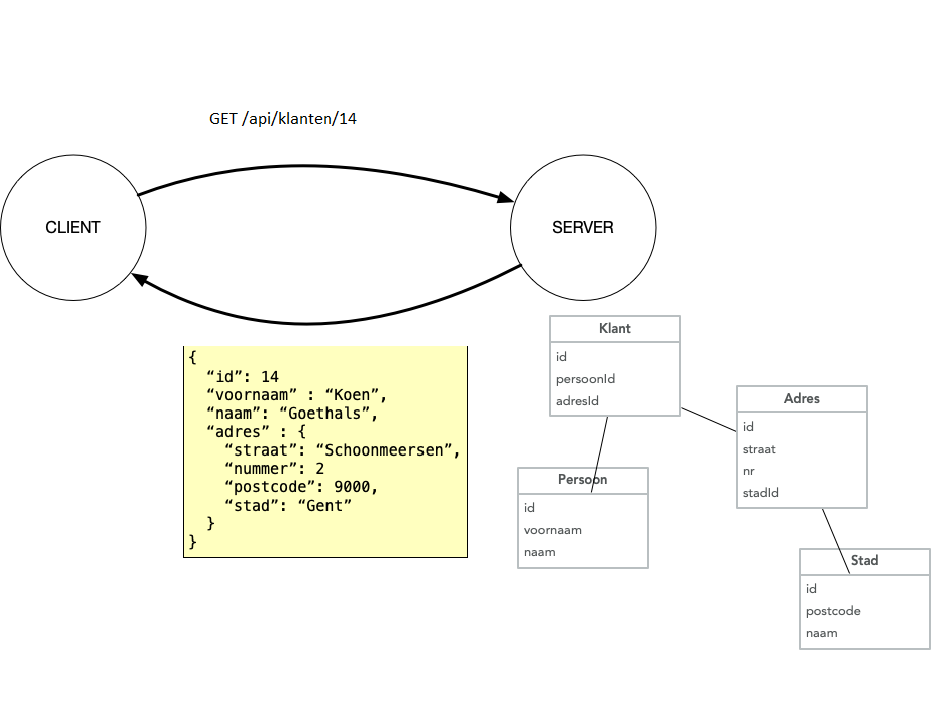
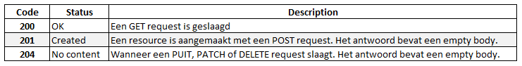
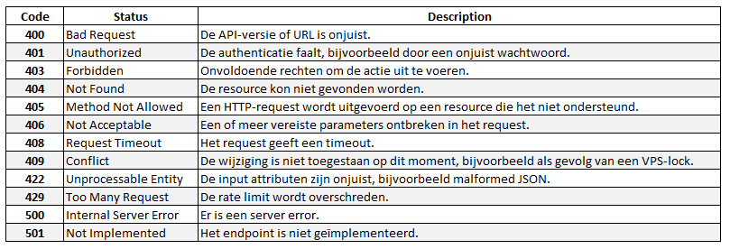
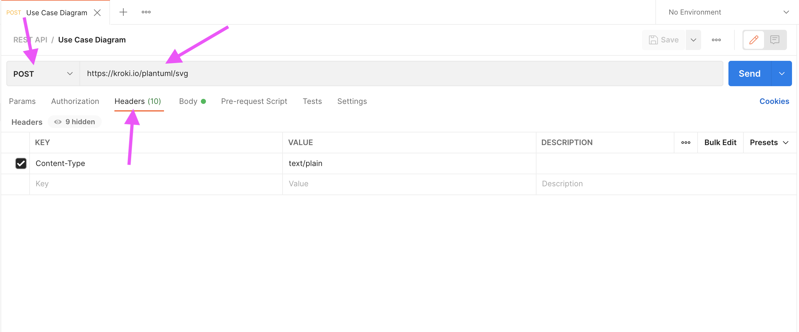
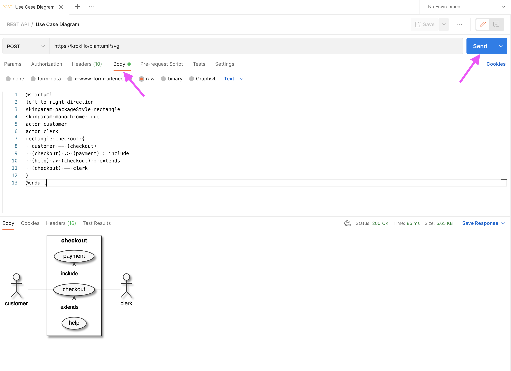
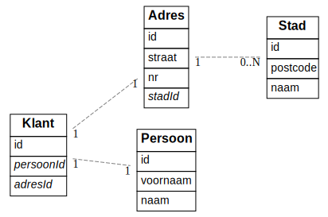

# REST API

## Wat is een API?

Een **API (Application Programming Interface)** is een software-interface die het mogelijk maakt dat twee applicaties met elkaar kunnen communiceren. Dit in tegenstelling tot een User Interface, die mensen met software laat werken. Ze maken de overdracht van gegevens van systeem naar systeem mogelijk. API’s bieden een gestandaardiseerde toegang tot de applicatiegegevens. Meer op [https://www.youtube.com/watch?v=s7wmiS2mSXY&t=29s](https://www.youtube.com/watch?v=s7wmiS2mSXY&t=29s)

### Een voorbeeld van het gebruik van een API

Stel als voorbeeld dat je een klantenbeheer systeem ontwerpt. Klanten hebben een naam, adres, koophistoriek, ... en je wilt dat je verkopers klanten en hun orders kunnen toevoegen / aanpassen / verwijderen.
Je kiest ervoor om alle data in een SQL databank op te slaan, en via een webinterface de gebruikers toe te laten om deze data te bekijken en beheren.
Je zou kunnen een monolitische applicatie bouwen, die op een server draait, de data via queries opvraagt, en daarmee dan html pagina's bouwt en die terug zendt naar de browser (en daar is niets mis mee, dat wordt heel vaak gedaan, en de technologieën daarvoor gaan jullie later nog leren)
Maar een alternatief is dat je het opsplitst in twee programma's. Het ene ('server') beheert de data en de toegang tot de databank. En de andere ('client') biedt een web UI aan. (bijvoorbeeld omdat je ook een android applicatie wilt aanbieden die dezelfde data aanspreekt, en je het server gedeelte wil hergebruiken; of gewoon omdat je verschillende teams hieraan laat werken en je zo makkelijker "separation of concerns" afdwingt)
En dan is het probleem: hoe 'praten' die twee programma's met elkaar?
In theorie kan je perfect SQL queries over een netwerk sturen, en de antwoorden ontvangen, maar je voelt direct aan dat dat niet zo een goed idee is. Bij de minste wijziging van het databank schema moeten alle clients volledig mee herschreven worden.
We hebben dus een betere methode nodig om over een netwerk data (en data wijzigingen) heen en terug te sturen, **REST** is zo'n manier.

### REST

**Representational state transfer (REST)** is een **architectuurstijl** waarmee software met andere software kan communiceren. De term werd geïntroduceerd en gedefinieerd in 2000 door Roy Fielding in zijn [doctoraatsstudie](http://www.ics.uci.edu/~fielding/pubs/dissertation/top.htm). REST wordt veelal gebruikt voor het ontwerpen van API's voor het internet. REST gebruikt de **HTTP-methoden(GET / POST / PUT /DELETE)** om data tussen een clientapparaat en een server op te halen en te posten.

Met het HTTP-protocol kunnen REST API’s software op het ene apparaat laten praten met software op een ander apparaat (of op hetzelfde apparaat), zelfs als deze verschillende besturingssystemen en architecturen gebruiken. De client kan om **resources** vragen in een taal die de server begrijpt, en de server reageert met de resource in een taal die de client kan verwerken. De server retourneert de **resource** in **JSON** (JavaScript Object Notation), XML (Extensible Markup Language) of tekstindelingen, maar veel API’s ondersteunen responses in aanvullende talen.

### API-requests

#### Resources

Het fundamentele concept van een RESTful API is de **resource**. Alle informatie die benoemd kan worden is een resource: een document, afbeelding, verzameling (collection) van resources, niet-virtueel object (bijvoorbeeld een klant) etc. REST gebruikt een **resource identifier** om een resource te identificeren.

De resources bevinden zich in een **collectie**, die een verzameling van objecten representeert. De uri verwijst naar een collectie. Gebruik hiervoor een zelfstandig naamwoord in het meervoud. Gebruik GEEN actiemethodes (een werkwoord)(uitz api/login en api/register voor het aanmelden en registreren). De data is dus opgebouwd uit resources en collecties, maar het is geen relationele database! Je bouwt zelf links tussen deze resources en collecties om de juiste informatie op te halen.



#### http methods

Een http request heeft naast een resource identifier ook altijd een **method**. Deze methods mappen perfect op de CRUD operaties, en worden dus zo gebruikt.

1. GET: Read, data opvragen

2. POST: Create, nieuwe data toevoegen

3. PUT: Update, data aanpassen

4. DELETE: Delete, data verwijderen

Voor de klant resource hebben we volgende uri's. Merk op een resource is steeds onderdeel van een collectie, hier ‘Klanten'.

| http-methode en uri      | resultaat                                  |
| ------------------------ | ------------------------------------------ |
| GET `/api/klanten`       | vraag een lijst van klanten op             |
| GET `/api/klanten/32`    | vraag informatie op van de klant met id 32 |
| POST `/api/klanten`      | voeg een klant toe                         |
| PUT `/api/klanten/145`   | wijzig de informatie van klant met id 145  |
| DELETE `/api/klanten/12` | verwijder klant met id 12                  |

Een ander voorbeeld: [de brewery api](https://www.openbrewerydb.org/documentation)

In de kern betekent REST dat je met collecties werkt met daarin resources, die je op een gestructureerde manier hebt opgebouwd, zodat de structuur voor iedere gebruiker helder is.

Bovendien kunnen resources gemanipuleerd worden door hun voorstelling. Als een client een voorstelling van een resource heeft (inclusief eventuele metadata) heeft hij genoeg om resources aan te passen of te wijzigen en die wijzigingen terug door te sturen naar de API.

Er zijn nog een aantal Http request methods (PATCH, CONNECT, HEAD, OPTIONS, TRACE), maar die worden in de context van REST servers (bijna) niet gebruikt. (PATCH kom je soms eens tegen)

#### POST vs PUT

Wat soms tot verwarring leidt is wanneer je POST en wanneer je PUT gebruikt.

Voor een enkelvoudig element is het verschil duidelijk, maar wat als een element toegevoegd wordt aan een lijst. Is dat een update van een bestaande lijst (PUT), of een POST, want er wordt een nieuw element toegevoegd?

Soms lees je wel eens dat je een POST gebruikt als het request resulteert in een nieuwe entry in de databank, en anders een PUT. Maar dat impliceert dat je de databank layout kent, en daar wil je niet op steunen natuurlijk.

Eerlijk gezegd, als het een situatie is waar het niet vanzelfsprekend is wat je best gebruikt, doet het er niet echt toe ook. Technisch maakt het helemaal niets uit, het is gewoon een kwestie van afspraken. Het is wel belangrijk dat je eenduidig bent (niet de ene keer PUT en de andere keer POST voor eenzelfde situatie met een andere resource)
Én dat je geen GET gebruikt, bvb. `GET /employee/create?name=rudy&age=27`, zoals je pre-REST soms wel eens zeg (of nu jammer genoeg nog altijd)

### API responses

De API-ontwikkelaar beslist welke formaten ze ondersteunen voor de respons. Een server kan bijvoorbeeld reageren met JSON, XML of tekst. De API moet de mogelijkheid hebben om de respons op te maken op basis van de behoeften van de client. IN het Klanten voorbeeld wordt JSON geretourneerd.

Voor de responses wordt ook steeds een **HTTP status code** gebruikt. Bij een succesvol request wordt er een 2xx HTTP status code teruggegeven:



Bij een foutmelding wordt een van de volgende status codes teruggegeven.



### Wat bedoelen we met REST-architectuurstijl?

REST is een reeks principes die een ontwikkelaar moet volgen voordat hij zijn API als “RESTful” kan beschouwen. De principes zeggen niets over hoe de API moet worden geïmplementeerd.

1.  **Uniforme interface**: een request identificeert een **resource** (zie verder), door gebruik te maken van **URI's** (uniform resource identifier). Er zijn vier architecturele beperkingen nodig om het gedrag van componenten vast te leggen:

- Identificatie van resources
- Manipulatie van resources door representations (JSON, XML,...)
- Zelf-omschrijvende berichten
- Hypermedia als de drijvende kracht van de applicatie status. De applicatie in deze context is de web applicatie die je server runt, hypermedia de hyperlinks/links die de server meestuurt in het antwoord.

2.  **Client/server-architectuur**: de clients van de API gebruiken HTTP-calls om een resource te vragen (een GET-methode) of data naar de server te sturen (een PUT,POST of DELETE-methode). De client moet voldoende hebben aan de verschillende URI's voor alle resources. De documentatie van de API bevat de beschikbare uri's/methoden die door de API worden ondersteund. De client en de server moeten onafhankelijk van mekaar kunnen evolueren. Door de gebruikers interface te scheiden van de opslag, kan een gebruikersinterface voor meerdere platformen gebouwd worden.
3.  **Stateless**: een stateless applicatie houdt geen verbinding in stand en slaat geen informatie op tussen requests van dezelfde client. Een client doet een request, de API voert de actie uit die in de request is gedefinieerd en reageert. Zodra de API reageert, verbreekt hij de verbinding en hij bewaart geen informatie over de client in het actieve geheugen. De API behandelt elke request als eerste request. Dit betekent dat ieder verzoek(request) van client naar server moet alle nodige informatie bevatten om het verzoek te begrijpen en kan geen gebruik maken van enige opgeslagen context op de server. De sessie status wordt volledig op de client opgeslagen.
4.  **Cacheable**: een REST API moet caching van vaak gevraagde data mogelijk maken. Om bandbreedte, latency en serverbelasting te verminderen moet een API identificeren wat cachebare resources zijn, wie ze kan cachen en hoelang ze in de cache kunnen blijven.Goede caching maakt dat de server beter schaalt (want minder requests dient te verwerken) én dat de client sneller reageert. Als een antwoord cacheable is, krijgt de client rechten om het antwoord opnieuw te gebruiken voor latere, soortgelijke verzoeken.
5.  **Gelaagd systeem**: een API kan meerdere lagen hebben, zoals proxyservers of loadbalancers, en de eindpuntserver kan extra servers inzetten om een respons te formuleren. De client weet niet welke server op de request reageert. Met een gelaagd systeem is een API makkelijker uit te breiden en dus schaalbaarder. Bvb de API staat op Server A, de data op Server B en de authenticatie wordt afgehandeld op Server C. Het grote voordeel is dat ze dan onafhankelijk van elkaar kunnen schalen, één grote zware database server met daarvoor een aantal kleine lichtere API servers bijvoorbeeld

## Postman

### GET

GET requests kan je altijd makkelijk testen, gewoon in de adresbalk de URL typen en je browser toont het resultaat.

Bijvoorbeeld, een API die het weer terug geeft [http://wttr.in/Gent?format=j1](http://wttr.in/Gent?format=j1)

### POST/PUT

POST en PUT requests zijn iets lastiger te testen, meestal moet je hier ook data meesturen in de body van de requests (waarom ben je anders een POST aan het doen?) en dat kan niet meer zo makkelijk in de browser
Uiteindelijk is het natuurlijk de bedoeling dat de API via de client (een programma) aangesproken wordt, maar als je aan het ontwikkelen bent is het handig om software te hebben die alle soorten requests kan genereren. (niet in het minst voor als er iets niet werkt, dan weet je tenminste snel of het probleem zich aan de front- of backend bevindt)

Een vaak gebruikt programma hiervoor is [https://www.postman.com](https://www.postman.com)

### Postman

Postman is ooit begonnen als een simpele applicatie om API's te testen maar is ondertussen gegroeid en gegroeid en een 'platform' geworden. Je kan allerlei collaboratie / automatisaties uitvoeren. Het is zowel als losstaande applicatie als in een browser bruikbaar. Maar je kan gelukkig nog altijd gewoon wat requests uitvoeren ook (al heb je tegenwoordig wel een account nodig om iets te kunnen doen 🙄)

### POST request


Je kiest de juiste method en typt de url in (we gebruiken hier een open API om afbeeldingen te generen:
[https://kroki.io/plantuml/svg](https://kroki.io/plantuml/svg))

Dan moeten we nog onze data in de body doorsturen, we specifiëren eerst dat de data plain text zal zijn in de headers (dit soort dingen is heel API afhankelijk)

In de body komt de UML code te staan (kopieer gerust, code staat onder de afbeelding!). Dit is de beschrijving voor een simpel use case diagram (uiteraard weer zeer API afhankelijk dit)



```js
@startuml
left to right direction
skinparam packageStyle rectangle
skinparam monochrome true
actor customer
actor clerk
rectangle checkout {
customer -- (checkout)
(checkout) .> (payment) : include
(help) .> (checkout) : extends
(checkout) -- clerk
}
@enduml
```

## 3rd party API's

Vaak worden API's en de client samen ontwikkeld (en een API leren ontwikkelen is in eerste instantie waar deze cursus over gaat), maar er zijn ook veel API's die op zich aangeboden worden en door (vele) verschillende clients gebruikt worden, bvb weersvoorspellingen, beursdata, ...
Soms volledig gratis, soms altijd betalend, maar heel vaak daar ergens tussenin (bvb. eerste XXX requests / maand gratis, en dan €YYY per 1000 requests)
Als ze (deels) betalend zijn komt er authorisatie bij kijken: om je te kunnen laten betalen, moet de API weten wie je bent en welke requests je doet natuurlijk.

Daarover later meer, maar we kennen nu al genoeg om een oefening te maken met een publieke API.

Een mooi voorbeeld van publieke API's zijn de 100+ datasets die de stad Gent aanbiedt als open data, van de bezetting van de parkeergarages tot de locatie van de grazende schapen [https://data.stad.gent/explore/](https://data.stad.gent/explore/?disjunctive.keyword&disjunctive.theme&sort=modified)

Maar er zijn er nog veel meer natuurlijk, een uitgebreide (niet exhaustieve) lijst van publiek beschikbare API's kan je hier vinden:[https://github.com/public-apis/public-apis](https://github.com/public-apis/public-apis)

### Oefening

- Installeer [Postman](https://www.postman.com) en maak een account aan
- Check dat alles werkt door de FBI's most wanted list op te vragen (GET request naar [https://api.fbi.gov/wanted/v1/list](https://api.fbi.gov/wanted/v1/list) )
- Gebruik [http://kroki.io](http://kroki.io/erd) om de volgende erd te creëeren:



## API routes beveiligen

Sommige API's zijn vrij te gebruiken door iedereen (zoals de FBI most wanted) maar heel vaak is dat niet zo.
Er zijn in essentie twee redenen om een API call af te schermen

- er zit gevoelige data achter die slechts één iemand of een beperkt aantal personen mag zien (neem bijvoorbeeld een facebook feed)
- de API aanbieden / beschikbaar stellen kost geld en de toegang moet dus gecontroleerd / gemeten worden

Als data persoonlijk is wordt er meestal met een **login** systeem gewerkt, en tokens / cookies. Daarover in een later hoofdstuk (veel) meer. Maar als het gaat om te traceren hoe vaak een API gebruikt wordt is een login systeem niet echt een optie:
Stel bijvoorbeeld dat jouw applicatie onderliggend google maps gebruikt. Het is niet echt realistisch dat iedereen die jouw applicatie gebruikt eerst met jouw credentials zou moeten inloggen of iets dergelijks.
Voor zo'n use cases maakt men vaak gebruik van **API keys**

### API keys

Er valt veel te zeggen over hoe die dingen opgebouwd worden en werken, maar dat valt een beetje buiten de scope van deze cursus. Maar we willen toch een aantal best practices meegeven, voor diegenen die een 3rd party API verwerken in hun opdracht. Simpel gezegd is een API key een soort random string die je identificeert en die niet kan geraden worden. Dus als iemand jouw API key heeft, kan hij zich als jou voordoen (en dus op jouw kosten een API gebruiken).
Dus nooit een API key in de client steken, maak requests naar je eigen API, en doe de third party access vanaf je eigen server. Hardcode nooit een API key in je code (sla op in een aparte file die niet in git opgenomen is). Gebruik access control als je API key dat toelaat (bij google kan je bijvoorbeeld een key enkel laten werken vanaf bepaalde domeinen, vanuit bepaalde apps).

[Hier kan je meer info vinden over de best practices voor het gebruik van google api keys](https://cloud.google.com/docs/authentication/api-keys)(maar hetzelfde geldt voor andere services hun keys ook)

## Server

We willen natuurlijk niet gewoon bestaande API's aanspreken maar zelf zo'n API server maken. Een web server is op zich geen magie, gewoon een programma dat luistert op een bepaalde poort en http requests parset en beschikbaar stelt. Aangezien http requests altijd hetzelfde zijn, schrijft niemand compleet van nul een webserver (behalve als interessante oefening eens). Je kan in elke programmeertaal een server schrijven, wij kiezen JavaScript en dus NodeJS

### Node.js

**Node.js** is "Server side JavaScript", º2009. Het is een single-threaded, open source, platformonafhankelijke runtime-omgeving gebouwd bovenop v8, de JavaScript engine van Chrome (werd open source in 2008). Meer info op [https://kinsta.com/nl/kennisbank/wat-is-node-js/](https://kinsta.com/nl/kennisbank/wat-is-node-js/).

**NPM** is het package ecosysteem van Node.js. Het is het grootste ecosysteem van alle open source bibliotheken ter wereld, met meer dan 1 miljoen pakketten en het groeit nog steeds. NPM is gratis te gebruiken en duizenden open source ontwikkelaars dragen er dagelijks aan bij.

Voor het bouwen van web API's wordt er meestal een framework gebruikt en geen 'naakte' Node.js (Express waarschijnlijk de gekendste). Wij gaan [Koa](https://koajs.com/) gebruiken, het nieuwe hippe framework van hetzelfde team achter Express.

## Koa

We maken eerst een nieuw project aan. Maak een nieuwe folder aan voor de webservice en installeer KOA.

```bash
> mkdir webservices-budget
> cd webservices-budget
> yarn add koa
```

### De obligate Hello World

Maak een bestand `index.js` aan in de root.

```js
const Koa = require('koa'); // 👈 1
const app = new Koa(); // 👈 1

app.use(async (ctx) => {
  // 👈 3
  ctx.body = 'Hello World';
});

app.listen(9000); // 👈 2
```

1. We importeren koa en initïaliseren een Koa object
2. We laten het luisteren op poort 9000
3. We geven als body de string "Hello World" terug, voor elke request
4. Dit kunnen we testen door `node index.js` uit te voeren en naar [http://localhost:9000](http://localhost:9000) te surfen.

## Middleware

Koa is niet meer dan een grote 'ketting' van zogeheten middleware functies. Het idee is dat je allemaal verschillende functies definieert die elk een (kleine) taak op zich nemen en dat die in een bepaalde volgorde geïnstalleerd worden.
Elke middleware functie voert dan zijn deel van het werk uit en roept dan gewoon 'next()' aan, de volgende functie kan dan verder werken met het bewerkte resultaat tot nu toe, tot de laatste die het antwoord terug geeft.


Pas `index.js` aan.

```js
const Koa = require('koa');
const app = new Koa();

app.use(async ctx, next) => {// 👈 1 en 2
ctx.body = 'Hello World';
await next();
});

app.use(async (ctx, next) => {// 👈 3
console.log(ctx);
await next();
});

app.listen(9000);

```

1. `app.use` met een functie aanroepen is zo'n middleware functie installeren
2. en de functie heeft een tweede parameter `next`, die de volgende functie in de ketting aanspreekt
3. we kunnen bijvoorbeeld het context object eens loggen nadat we de body gezet hebben. Je dient `index.js` te herstarten en dan eens refreshen om het resultaat te zien.

Koa doet heel wat werk voor ons doet (het request omzetten naar een geparsed object met alle info).

Onze server maken is nu een heleboel zo'n middlewares installeren en zelf schrijven om elke request te verwerken.

### Middlewares in Koa

Middlewares in Koa zijn een beetje specialer dan in Node.js of Express bijvoorbeeld. In Koa is het mogelijk om tweemaal in elke middleware te komen:

1. eens vóór de aanroep van `next()`
2. én eens ná de aanroep van `next()`

Dit is wat men het "onion model" noemt:


Het request komt binnen en alle middlewares worden in volgorde van definitie uitgevoerd. Elk van deze middlewares roept vervolgens `next()` aan om de volgende middleware in rij uit te voeren. Uiteindelijk komt men ooit aan de laatste middleware en dan keert Koa terug in omgekeerde volgorde doorheen alle middlewares.
Het is dus eenvoudig om iets voor en na `next()` uit te voeren:

```js
app.use(async (ctx, next) => {
  // doe iets vooraf
  await next();
  // doe iets achteraf
});
```

Hierbij is de **`await`** heel belangrijk! Als je deze vergeet, zal de code achter `next()` meteen uitgevoerd worden.

Wil je niets meer doen in de middleware, dan doe je beter `return next()`. Deze middleware zal dan automatisch overgeslagen worden.

Het mooie aan dit geheel is dat Koa hiervoor niets speciaal hoeft te doen, dit is het gedrag van Promises.

## Nodemon

```bash
~/webservices-budget$> yarn add nodemon --dev
```

Een live draaiende server herstart in principe natuurlijk nooit, maar tijdens het ontwikkelen is het wel onhandig om altijd de server te moeten stoppen en herstarten telkens we iets willen zien of testen. Daarom maken we gebruik van
[Nodemon](https://www.npmjs.com/package/nodemon). Nodemon houdt een folder in de gaten en herstart de server telkens er een file wijzigt. --dev installeert de package enkel in development (zie devDependencies)!!!

### package.json

```json
{
  "scripts": {
    "start": "nodemon index.js"
  },
  "dependencies": {
    "koa": "^2.14.2"
  },
  "devDependencies": {
    "nodemon": "^3.0.1"
  }
}
```

1. package.json houdt bij welke packages we allemaal geïnstalleerd hebben, met hun versie. Dit maakt dat een andere programmeur makkelijk dezelfde omgeving kan opzetten, zonder dat we onze immense node_modules folder (of andere binaries) moeten syncen
2. btw, NOOIT `node_modules` naar github pushen, gebruik .gitignore!!!
3. Maar naast dependencies kunnen we hier ook scripts definiëren, die bepalen hoe onze server start, hoe testen gerunt worden etc. We voegen nu een start script toe, dat onze nodemon aanroept. En dan kunnen we starten met `yarn start`

Wijzig de hello world en kijk hoe je de server niet meer dient te herstarten (eventueel wel je pagina herladen...)

## Winston

Manueel links en rechts wat middleware injecteren om iets te loggen is natuurlijk niet zo handig. Een goede logger laat toe om makkelijk meer of minder te loggen al naargelang we in productie of dev draaien.

Logs kan je ook met een zeker 'level' loggen, zodat je niet telkens alles moet in/uit commentaar zetten als je wat meer/minder detail wil. En nog veel meer..., een goede logger is best een uitgebreid stuk software.

Er bestaan gelukkig vele degelijke third party log libraries, we gaan [Winston](https://github.com/winstonjs/) gebruiken.

## Oefening 1

Zet een basis webserver op met Koa voor je **eigen project**. Zorg dat je `hello world zien krijgt als je er naartoe surft
Voeg [Winston](https://github.com/winstonjs/winston) toe aan je project, bekijk de documentatie hoe je dit doet en log dat de server correct opgestart is

Een werkend voorbeeld vind je op [Github](https://github.com/HOGENT-Web/webservices-budget)(maar doe het eerst zelf eens 😏). Check uit op commit `f8a1f12

```bash
~/webservices-budget$> git clone https://github.com/HOGENT-Web/webservices-budget.git
~/webservices-budget$> cd webservices-budget
~/webservices-budget$> git checkout -b oplossing f8a1f12
```

## Een uitgewerkt voorbeeld

We willen een website maken waar gebruikers recepten en bijhorende ingredienten kunnen aanmaken en opvragen. Gebruikers kunnen recepten ook opslaan. We dienen hiervoor de API aan te maken.

### ERD met Frequently Made Errors

Onderstaand ERD zou een oplossing zijn vol met bovenstaande frequently made errors:


Onderstaande code werd hiervoor gebruikt:

```
[Recipe]
*name

[Ingredient]
*name
amount
unit

[User]
*id
firstName
lastName
address

User 1--* Recipe
Recipe 1--* Ingredient
User *--* Recipe
```

Wat is er fout aan deze ERD?

### ERD

Een mogelijke oplossing ziet eruit als volgt:


Je merkt nog een samengestelde sleutel in SavedRecipe. Het kan wel nuttig zijn om geen samengestelde sleutels te gebruiken, dat is persoonlijke voorkeur. IN dat geval bevat de table SavedRecipe ook een id.

Qua invoer via de API calls heeft dit weinig invloed. Een gebruiker zal altijd aangemeld zijn en dus kennen we altijd het `userId`, het `recipeId` wordt meegegeven via de API call.

De service-functie voor het opslaan van een recipe kan wel complexer worden. Met samengestelde sleutels zal de databank een fout gooien als je tweemaal hetzelfde recept wil opslaan. Je moet vervolgens zelf deze error parsen, dat kan lastig zijn afhankelijk van de gekozen databank en/of client library. Zonder samengestelde sleutels moet je zelf checken of een recept al dan niet dubbel opgeslagen wordt.

Algemene regel: laat zoveel mogelijk door je databank afhandelen. Deze zijn hiervoor geoptimaliseerd en doen dergelijke checks razendsnel (en sparen extra queries).

Onderstaande code werd gebruikt voor de oplossing:

```
[Recipe]
*id
name
+createdBy

[Ingredient]
*id
name
amount
unit

[User]
*id
firstName
lastName
street
number
postalCode
city

[SavedRecipe]
*userId
*recipeId

User 1--* Recipe
Recipe 1--* Ingredient
User 1--* SavedRecipe
SavedRecipe *--1 Recipe
```

### API calls

#### Recipe

- `GET /api/recipes`: alle recepten zonder ingrediënten, evt. met createdBy
- `GET /api/recipes/:id`: één recept MET ingrediënten én createdBy
- `POST /api/recipes`: recept toevoegen met zijn ingrediënten
- `PUT /api/recipes/:id`: recept aanpassen
- `DELETE /api/recipes/:id`: recept verwijderen

#### User

- `GET /api/users/:id/recipes`: opgeslagen recepten opvragen
  - Soms wordt ook `GET /api/users/me/recipes` gedaan als je toch aangemeld moet zijn, id zit in de token (zie verder)

Lees ook de [Best practices for sub and nested resources](https://www.moesif.com/blog/technical/api-design/REST-API-Design-Best-Practices-for-Sub-and-Nested-Resources/).

### Frequently made errors (FME)

- Geen tussentabellen voor veel-op-veel relatie
- Geen foreign key voor een-op-veel relatie
- Samengestelde sleutels i.p.v. een id, strings als een id (lastig in API calls)
- Geen API call definities
- GET all request geeft alle relaties terug (vaak onnodig)
- Adres/locatie als string in een tabel (lastig om hierop queries uit te voeren)
- ERD niet voldoende om doel van de applicatie te verwezenlijken

## Oefening 2 - Je eigen project

- Maak een ERD
- Definieer de bijhorende endpoints
