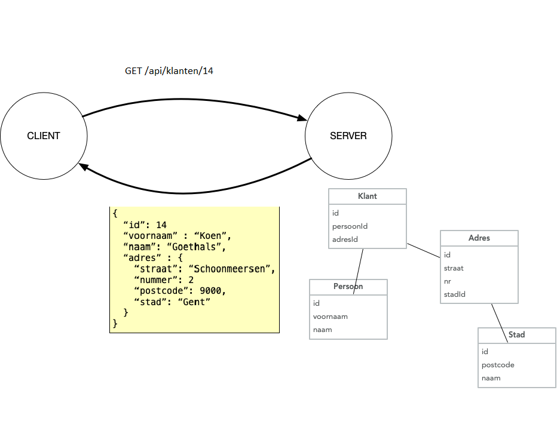
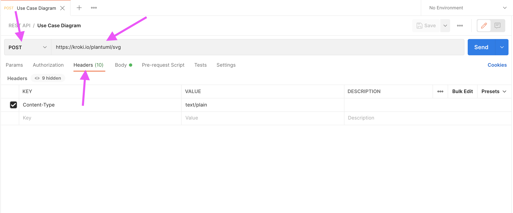
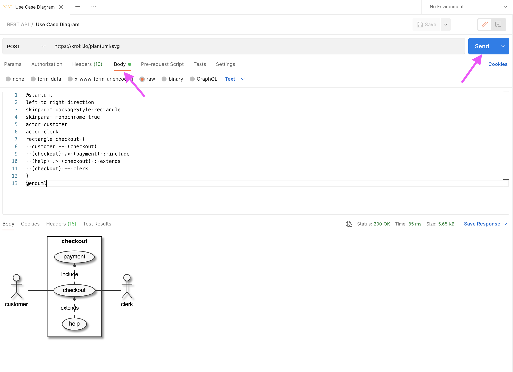
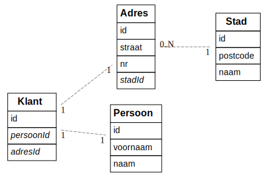

# REST API

## Wat is een API?

Een **API (Application Programming Interface)** is een software-interface die het mogelijk maakt dat twee applicaties met elkaar kunnen communiceren. Dit in tegenstelling tot een User Interface, die mensen met software laat werken. Ze maken de overdracht van gegevens van systeem naar systeem mogelijk. API’s bieden een gestandaardiseerde toegang tot de applicatiegegevens. Meer op <https://www.youtube.com/watch?v=s7wmiS2mSXY>.

### Voorbeeld van het gebruik van een API

Stel je voor dat je bezig bent met het ontwerp van een klantenbeheersysteem. In dit systeem wil je gegevens zoals klantnamen, adressen en koophistorie bijhouden. Daarnaast moeten verkopers de mogelijkheid hebben om klanten en hun bestellingen toe te voegen, te bewerken en te verwijderen.

Om deze gegevens op te slaan, heb je ervoor gekozen om gebruik te maken van een relationele databank. Om gebruikers in staat te stellen deze gegevens te bekijken en te beheren, overweeg je het gebruik van een webinterface.

Een benadering om dit te realiseren is het ontwikkelen van een monolithische applicatie, die op één server draait en gegevens ophaalt via database queries. Vervolgens worden HTML-pagina's gegenereerd en teruggestuurd naar de webbrowser. Dit is een veelgebruikte methode en zal later in de opleiding ook aan bod komen.

Echter, een alternatieve aanpak is om het systeem op te splitsen in twee afzonderlijke programma's. Eén programma (de **server**) beheert de gegevens en de toegang tot de database, terwijl het andere (de **client**) een webinterface biedt. Je kan deze keuze maken omdat je bv. ook een Android-applicatie wil aanbieden die dezelfde data aanspreekt, en je het servergedeelte wil hergebruiken. Het kan ook handig zijn als verschillende teams aan de ontwikkeling werken, om een zo het principe van "separation of concerns" af te dwingen.

Nu doemt de vraag op: hoe communiceren deze twee programma's met elkaar?

In theorie zou je SQL-query's (vanuit de client) over een netwerk kunnen verzenden en de resultaten kunnen ontvangen, maar al snel zul je inzien dat dit niet de beste aanpak is. Zelfs kleine wijzigingen in het databankschema zouden vereisen dat alle clients volledig herschreven moeten worden.

Daarom is het noodzakelijk om een efficiëntere methode te gebruiken om gegevens (en wijzigingen daarin) over het netwerk te verzenden, en **REST** is een van deze methoden.

### REST

**Representational state transfer (REST)** is een **architectuurstijl** waarmee software met andere software kan communiceren. De term werd geïntroduceerd en gedefinieerd in 2000 door Roy Fielding in zijn [doctoraatsstudie](http://www.ics.uci.edu/~fielding/pubs/dissertation/top.htm). REST wordt veelal gebruikt voor het ontwerpen van API's voor het internet. REST gebruikt de **HTTP-methoden(GET / POST / PUT /DELETE)** om data tussen een client en een server op te halen en te verzenden.

Met het HTTP-protocol kunnen REST API’s software op het ene apparaat laten praten met software op een ander apparaat (of op hetzelfde apparaat), zelfs als deze verschillende besturingssystemen en architecturen gebruiken. De client kan om **resources** vragen in een taal die de server begrijpt, en de server reageert met de resource in een taal die de client kan verwerken. De server retourneert de **resource** in **JSON** (JavaScript Object Notation), XML (Extensible Markup Language) of tekstindelingen, maar veel API’s ondersteunen responses in aanvullende talen.

### API requests

#### Resources

Het fundamentele concept van een RESTful API is de **resource**. Alle informatie die benoemd kan worden is een resource: een document, afbeelding, verzameling (= collection) van resources, niet-virtueel object (bv. een klant), enz. REST gebruikt een **resource identifier** om een resource te identificeren.

De resources bevinden zich in een **collectie**, die een verzameling van objecten representeert. De **Uniform Resource Identifier (URI)** verwijst naar een collectie. Gebruik hiervoor een zelfstandig naamwoord in het meervoud. Gebruik GEEN actiemethodes (een werkwoord), met uitzondering van `/api/users/login` en `/api/users/register` voor het aanmelden en registreren. De data is dus opgebouwd uit resources en collecties, maar het is geen relationele databank! Je bouwt zelf links tussen deze resources en collecties om de juiste informatie op te halen.

Bekijk onderstaand voorbeeld. Let op de opbouw van de databank (= ERD), van de URI bovenaan en van de response (geel). Je merkt een duidelijk verschil tussen het databankschema en de response. Het is dus niet altijd zo dat de databankstructuur overeenkomt met de response. De API-ontwikkelaar beslist hoe de response eruit ziet. Lek dus geen implementatiedetails door in de response.



#### HTTP methods

Een HTTP request heeft naast een resource identifier ook altijd een **method**. Deze methods mappen perfect op de CRUD operaties, en worden als volgt gebruikt:

1. GET: Read - data opvragen
2. POST: Create - nieuwe data toevoegen
3. PUT: Update - data aanpassen
4. DELETE: Delete - data verwijderen

Voor de resource uit ons klantenvoorbeeld hebben we volgende URI's. Merk op dat een resource steeds onderdeel is van een collectie, hier ‘Klanten'.

| HTTP method en URI       | Resultaat                                  |
| ------------------------ | ------------------------------------------ |
| GET `/api/klanten`       | vraag een lijst van klanten op             |
| GET `/api/klanten/32`    | vraag informatie op van de klant met id 32 |
| POST `/api/klanten`      | voeg een klant toe                         |
| PUT `/api/klanten/145`   | wijzig de informatie van klant met id 145  |
| DELETE `/api/klanten/12` | verwijder klant met id 12                  |

Een ander voorbeeld: [de brewery API](https://www.openbrewerydb.org/documentation)

In de kern betekent REST dat je met collecties werkt met daarin resources, die je op een gestructureerde manier hebt opgebouwd, zodat de structuur voor iedere gebruiker helder is.

Bovendien kunnen resources gemanipuleerd worden door hun voorstelling. Als een client een voorstelling van een resource heeft (inclusief eventuele metadata), heeft hij genoeg om resources aan te passen en die wijzigingen terug door te sturen naar de API.

Er zijn nog een aantal HTTP request methods (PATCH, CONNECT, HEAD, OPTIONS, TRACE), maar die worden in de context van REST servers (bijna) niet gebruikt. PATCH kom je soms eens tegen, en HEAD wordt frequent gebruikt in de context van bv. CORS, maar dat is voor later.

#### POST vs PUT

Wat soms tot verwarring leidt is wanneer je POST en wanneer je PUT gebruikt.

Als je een nieuw enkelvoudig element toevoegt, is het duidelijk dat je een POST gebruikt. Maar wat als je een nieuw element aan een lijst toevoegt (denk aan een nieuw item in een bestelling)? Is dat een update van een bestaande lijst (PUT), of een POST, want er wordt een nieuw element toegevoegd?

Voor een enkelvoudig element is het verschil duidelijk, maar wat als een element toegevoegd wordt aan een lijst. Is dat een update van een bestaande lijst (PUT), of een POST, want er wordt een nieuw element toegevoegd?

Soms lees je wel eens dat je een POST gebruikt als het request resulteert in een nieuwe entry in de databank, en anders een PUT. Maar dat impliceert dat je de databank layout kent, en daar wil je niet op steunen natuurlijk.

Eerlijk gezegd, als het een situatie is waar het niet vanzelfsprekend is wat je best gebruikt, doet het er niet echt toe ook. Technisch maakt het helemaal niets uit, het is gewoon een kwestie van afspraken. Het is wel belangrijk dat je eenduidig bent, niet de ene keer PUT en de andere keer POST voor eenzelfde situatie met een andere resource.

Gebruik in geen geval een GET, bv. `GET /employee/create?name=rudy&age=27`, zoals je pre-REST soms wel eens zag (of nu jammer genoeg nog altijd).

#### PUT vs PATCH

Ook het verschil tussen PUT en PATCH is niet altijd duidelijk.

PUT en PATCH zijn beide methodes om een resource aan te passen. Het verschil is dat PUT de volledige resource doorstuurt, terwijl PATCH enkel de gewijzigde velden doorstuurt. In het voorbeeld van onze klanten zal een PUT de hele klant doorsturen terwijl een PATCH bv. enkel de naam doorstuurt.

### API responses

De API-ontwikkelaar beslist welke formaten ze ondersteunen voor de response. Een server kan bijvoorbeeld reageren met JSON, XML of tekst. De API moet de mogelijkheid hebben om de response op te maken op basis van de behoeften van de client. In het voorbeeld van de klanten wordt JSON geretourneerd.

Voor de responses wordt ook steeds een **HTTP status code** gebruikt. Bij een succesvol request wordt er een 2xx HTTP status code teruggegeven:

| Code    | Status     | Beschrijving                                                                        |
| ------- | ---------- | ----------------------------------------------------------------------------------- |
| **200** | OK         | Het request is geslaagd.                                                            |
| **201** | Created    | Een resource is aangemaakt met een POST request. Het antwoord bevat een empty body. |
| **204** | No Content | Een PUT, PATCH of DELETE request slaagt. Het antwoord bevat een empty body.         |

Bij een foutmelding wordt een van de volgende status codes teruggegeven. Een code 4xx wordt gebruikt als de fout bij de client ligt, een code 5xx als de fout bij de server ligt.

| Code    | Status                | Beschrijving                                                                                                                              |
| ------- | --------------------- | ----------------------------------------------------------------------------------------------------------------------------------------- |
| **400** | Bad Request           | Het request is ongeldig (bv. foute parameters in URL of body).                                                                            |
| **401** | Unauthorized          | De authenticatie faalt, bv. door een onjuist wachtwoord of de client is simpelweg niet aangemeld.                                         |
| **403** | Forbidden             | De client is aangemeld maar heeft geen toegang tot de resource (= onvoldoende rechten).                                                   |
| **404** | Not Found             | De resource is niet gevonden.                                                                                                             |
| **405** | Method Not Allowed    | De HTTP method is niet toegelaten voor deze resource.                                                                                     |
| **406** | Not Acceptable        | De client heeft een accept header gestuurd die niet ondersteund wordt (bv. gevraagd om XML terwijl de server enkel JSON kan retourneren). |
| **429** | Too Many Requests     | De client heeft te veel requests gestuurd in een bepaalde tijdspanne.                                                                     |
| **500** | Internal Server Error | Er is een fout opgetreden aan de serverkant.                                                                                              |
| **501** | Not Implemented       | Het endpoint is niet geïmplementeerd.                                                                                                     |
| **503** | Service Unavailable   | De server is tijdelijk niet beschikbaar.                                                                                                  |

### Wat bedoelen we met REST-architectuurstijl?

REST is een reeks principes die een ontwikkelaar moet volgen voordat hij zijn API als “RESTful” kan beschouwen. De principes zeggen niets over hoe de API moet worden geïmplementeerd.

<!-- markdownlint-disable ol-prefix -->

1. **Uniforme interface**: een request identificeert een **resource** (zie verder), door gebruik te maken van **URI's**. Er zijn vier architecturele beperkingen nodig om het gedrag van componenten vast te leggen:

- Identificatie van resources.
- Manipulatie van resources door representations (JSON, XML..).
- Zelf-omschrijvende berichten.
- Hypermedia als de drijvende kracht van de applicatie status. De applicatie in deze context is de web applicatiedie je server draait, hypermedia de hyperlinks/links die de server meestuurt in het antwoord.

2. **Client/server-architectuur**: de clients van de API gebruiken HTTP calls om een resource te vragen (een GET-methode) of data naar de server te sturen (een PUT, POST of DELETE-methode). De client moet voldoende hebben aan de verschillende URI's voor alle resources. De documentatie van de API bevat de beschikbare URI's/methoden die door de API worden ondersteund. De client en de server moeten onafhankelijk van elkaar kunnen evolueren. Door de gebruikers interface te scheiden van de opslag, kan een gebruikersinterface voor meerdere platformen gebouwd worden.

3. **Stateless**: een stateless applicatie houdt geen verbinding in stand en slaat geen informatie op tussen requests van dezelfde client. Een client doet een request, de API voert de actie uit die in het request is gedefinieerd en reageert. Zodra de API reageert, verbreekt hij de verbinding en bewaart hij geen informatie over de client in het actieve geheugen. De API behandelt elke request als een eerste request. Dit betekent dat ieder request van client naar server alle nodige informatie moet bevatten om het verzoek te begrijpen en kan geen gebruik maken van enige opgeslagen context op de server. De sessie-status wordt volledig op de client opgeslagen.

4. **Cacheable**: een REST API moet caching van vaak gevraagde data mogelijk maken. Om bandbreedte, vertraging (= latency) en serverbelasting te verminderen moet een API identificeren wat cachebare resources zijn, wie ze kan cachen en hoelang ze in de cache kunnen blijven. Goede caching maakt dat de server beter schaalt (want minder requests te verwerken) én dat de client sneller reageert. Als een antwoord cacheable is, krijgt de client rechten om het antwoord opnieuw te gebruiken voor latere, soortgelijke verzoeken.

5. **Gelaagd systeem**: een API kan meerdere lagen hebben, zoals proxyservers of loadbalancers, en de eindpuntserver kan extra servers inzetten om een response te formuleren. De client weet niet welke server op het request reageert. Met een gelaagd systeem is een API eenvoudiger uit te breiden en dus schaalbaarder. Bv. de API staat op Server A, de data op Server B en de authenticatie wordt afgehandeld op Server C. Het grote voordeel is dat ze dan onafhankelijk van elkaar kunnen schalen, bv. één grote, zware databankserver met daarvoor een aantal kleine, lichtere API servers.

<!-- markdownlint-enable ol-prefix -->

## REST clients

### GET

GET requests kan je altijd eenvoudig testen. Typ de URL in de adresbalk van de browser en je browser toont het resultaat.

Probeer bijvoorbeeld eens het weer in Gent (of jouw gemeente/stad) op te vragen via: <http://wttr.in/Gent?format=j1>.

### POST/PUT

POST en PUT requests zijn iets lastiger te testen. Meestal moet je hier ook data meesturen in de body van de requests en dat kan niet zo eenvoudig in de browser. Uiteindelijk is het natuurlijk de bedoeling dat de API via de client (een programma) aangesproken wordt. Echter als je aan het ontwikkelen bent, is het handig om software te hebben die alle soorten requests kan genereren. Dit is zeker handig als er iets niet werkt, op die manier kan je testen of het probleem zich voordoet in de front- of back-end.

Een vaak gebruikt programma hiervoor is [Postman](https://www.postman.com). Er zijn ook alternatieven zoals bv. [Insomnia](https://insomnia.rest/) of [Thunder Client](https://marketplace.visualstudio.com/items?itemName=rangav.vscode-thunder-client) (een extensie voor VSCode).

### Postman

Postman is ooit begonnen als een simpele applicatie om API's te testen maar is ondertussen gegroeid en gegroeid en een heus platform geworden. Je kan allerlei collaboratie en automatisaties uitvoeren. Het is zowel als losstaande applicatie als in een browser bruikbaar. Maar je kan gelukkig nog altijd gewoon wat requests uitvoeren ook (al heb je tegenwoordig wel een account nodig om iets te kunnen doen 🙄).

### POST request



Je kiest de juiste method en typ de URL in het veld. We gebruiken hier een publieke API om afbeeldingen te generen:
<https://kroki.io/plantuml/svg>.

Vervolgens moeten we nog onze data in de body doorsturen. We specifiëren eerst in de `Content-Type` header dat we plain text zullen doorsturen.

Uiteindelijk komt in de body de UML code te staan (kopieer gerust, code staat onder de afbeelding!). Dit is de beschrijving voor een simpel use case diagram (in PlantUML syntax).



```js
@startuml
left to right direction
skinparam packageStyle rectangle
skinparam monochrome true
actor customer
actor clerk
rectangle checkout {
customer -- (checkout)
(checkout) .> (payment) : include
(help) .> (checkout) : extends
(checkout) -- clerk
}
@enduml
```

## 3rd party API's

Vaak worden API's en de client samen ontwikkeld, en een API leren ontwikkelen is in eerste instantie waar deze cursus over gaat. Natuurlijk zijn er ook veel API's die op zich aangeboden worden en door (vele) verschillende clients gebruikt worden, zoals bv. weersvoorspellingen, beursdata...

Soms zijn API's volledig gratis, soms volledig betalend, maar heel vaak daar ergens tussenin (bv. eerste XXX requests, eerste x maanden gratis, en dan €YYY per 1000 requests). Als ze (deels) betalend zijn, komt er authorisatie bij kijken: om je te kunnen laten betalen, moet de API weten wie je bent en welke requests je doet natuurlijk. Daarover later meer, maar we kennen nu al genoeg om een oefening te maken met een publieke API.

Een mooi voorbeeld van publieke API's zijn de 100+ datasets die de stad Gent aanbiedt als open data, van de bezetting van de parkeergarages tot de locatie van de grazende schapen: [https://data.stad.gent/explore/](https://data.stad.gent/explore/?disjunctive.keyword&disjunctive.theme&sort=modified).

Maar er zijn nog veel meer publieke API's natuurlijk! Een uitgebreide (niet exhaustieve) lijst van publiek beschikbare API's kan je hier vinden: <https://github.com/public-apis/public-apis>.

### Oefening

- Installeer [Postman](https://www.postman.com) en maak een account aan.
- Check dat alles werkt door de FBI's most wanted list op te vragen.
  - Stuur hiervoor een GET request naar <https://api.fbi.gov/wanted/v1/list>.
- Gebruik <http://kroki.io/erd> om onderstaand ERD te creëeren.
  - Als je via de browser klikt op de link is het logisch dat je een 404 krijgt, je moet een POST uitvoeren via Postman.



## API routes beveiligen

Sommige API's zijn door iedereen vrij te gebruiken, zoals de FBI most wanted, maar heel vaak is dat niet zo.
Er zijn in essentie twee redenen om een API call af te schermen

- er zit gevoelige data achter die slechts één iemand of een beperkt aantal personen mag zien (neem bijvoorbeeld een Facebook feed)
- de API aanbieden / beschikbaar stellen kost geld en de toegang moet dus gecontroleerd / gemeten worden

Als data persoonlijk is wordt er meestal met een **login** systeem gewerkt (en tokens of cookies). Daarover in een later hoofdstuk (veel) meer. Maar als het gaat om te traceren hoe vaak een API gebruikt wordt is een login systeem niet echt een optie.

Stel bijvoorbeeld dat jouw applicatie onderliggend Google Maps gebruikt. Het is niet echt realistisch dat iedereen die jouw applicatie gebruikt eerst met jouw credentials zou moeten inloggen of iets dergelijks. Voor zo'n use cases maakt men vaak gebruik van **API keys**.

### API keys

Er valt veel te zeggen over hoe API keys opgebouwd worden en werken, maar dat valt een beetje buiten de scope van deze cursus. Maar we willen toch een aantal best practices meegeven voor diegenen die een 3rd party API verwerken in hun opdracht.

Simpel gezegd is een API key een soort random string die je identificeert en die niet kan geraden worden. Dus als iemand jouw API key heeft, kan hij zich als jou voordoen (en dus op jouw kosten een API gebruiken).

Steek dus nooit een API key in de client. Maak daarentegen requests naar je eigen API, en doe de third party access vanaf je eigen server. Hardcode nooit een API key in je code (sla op in een apart bestand dat niet in git opgenomen is). Gebruik access control als je API key dat toelaat (bij Google kan je bijvoorbeeld een key enkel laten werken vanaf bepaalde domeinen vanuit of vanuit bepaalde apps).

[Hier kan je meer info vinden over de best practices voor het gebruik van Google API keys](https://cloud.google.com/docs/authentication/api-keys) (maar hetzelfde geldt voor de keys van andere services).

## REST - Een uitgewerkt voorbeeld

We maken een applicatie waarmee hobbykoks recepten kunnen opslaan en delen met elkaar. Koks kunnen daarbij recepten van andere koks opslaan om bv. later eens uit te proberen.

### Entiteiten

We hebben drie entiteiten met volgende attributen:

- User
  - firstName
  - lastName
- adres
- Recipe
  - name
  - createdBy (wie het recept toegevoegd heeft)
- Ingredient
  - name
  - amount
  - unit
  - Relaties

### Relaties

We onderscheiden volgende relaties:

Een gebruiker heeft meerdere opgeslagen recepten (niet verplicht om er te hebben)
Een recept wordt toegevoegd door één gebruiker
Een recept heeft meerdere ingrediënten
Een ingrediënt hoort maar bij één recept

### Frequently made errors (FME)

Door de jaren heen merkten we een aantal terugkomende fouten in het ontwerp van applicaties die gemaakt werden voor onze examenopdracht. We sommen ze hier even op:

- Geen tussentabellen voor veel-op-veel relatie
- Geen foreign key voor een-op-veel relatie
- Samengestelde sleutels i.p.v. een id, strings als een id (lastig in API calls)
- Geen API call definities
- GET all request geeft alle relaties terug (vaak onnodig)
- Adres/locatie als string in een tabel (lastig om hierop queries uit te voeren)
- ERD niet voldoende om doel van de applicatie te verwezenlijken

### ERD met Frequently Made Errors

Onderstaand ERD zou een oplossing zijn voor onze receptenapplicatie, vol met bovenstaande frequently made errors:


Onderstaande code werd hiervoor gebruikt:

```erd
[Recipe]
*name

[Ingredient]
*name
amount
unit

[User]
*id
firstName
lastName
address

User 1--* Recipe
Recipe 1--* Ingredient
User *--* Recipe
```

Wat is er fout aan dit ERD?

### ERD

Een mogelijke oplossing ziet eruit als volgt:


Je merkt nog een samengestelde sleutel in SavedRecipe. Het kan wel nuttig zijn om geen samengestelde sleutels te gebruiken, dat is persoonlijke voorkeur. In dat geval bevat de tabel SavedRecipe ook een id, naast de `userId` en `recipeId`.

Qua invoer via de API calls heeft dit weinig invloed. Een gebruiker zal altijd aangemeld zijn en dus kennen we altijd het `userId`, het `recipeId` wordt meegegeven via de API call.

De code voor het opslaan van een recept kan wel complexer worden. Met samengestelde sleutels zal de databank een fout gooien als je tweemaal hetzelfde recept wil opslaan. Je moet vervolgens zelf deze error parsen, dat kan lastig zijn afhankelijk van de gekozen databank en/of client library. Zonder samengestelde sleutels moet je zelf checken of een recept al dan niet dubbel opgeslagen wordt.

Algemene regel: laat zoveel mogelijk door je databank afhandelen. Deze zijn hiervoor geoptimaliseerd en doen dergelijke checks razendsnel (en sparen extra queries).

Onderstaande code werd gebruikt voor de oplossing:

```erd
[Recipe]
*id
name
+createdBy

[Ingredient]
*id
name
amount
unit

[User]
*id
firstName
lastName
street
number
postalCode
city

[SavedRecipe]
*userId
*recipeId

User 1--* Recipe
Recipe 1--* Ingredient
User 1--* SavedRecipe
SavedRecipe *--1 Recipe
```

### API calls

Hieronder lijsten we de vereiste functionaliteiten van de applicatie op. Denk even na (niet meteen verder scrollen/kijken) en definieer de nodige API calls (volgens de REST principes) om deze functionaliteiten te implementeren.

- Een gebruiker moet alle recepten kunnen bekijken.
- Een gebruiker moet een recept in detail kunnen bekijken (met zijn ingrediënten dus).
- Een gebruiker moet een recept kunnen toevoegen/aanpassen/verwijderen.
- Een gebruiker moet de ingrediënten van een recept kunnen bekijken.
- Een gebruiker moet een ingredient van een recept kunnen toevoegen/aanpassen/verwijderen.
- Een gebruiker moet zijn opgeslagen recepten kunnen bekijken.

#### Recipe

- `GET /api/recipes`: alle recepten zonder ingrediënten, evt. met createdBy
- `GET /api/recipes/:id`: één recept MET ingrediënten én createdBy
- `POST /api/recipes`: recept toevoegen met zijn ingrediënten
- `PUT /api/recipes/:id`: recept aanpassen
- `DELETE /api/recipes/:id`: recept verwijderen
- `GET /api/recipes/:recipeId/ingredients`: alle ingrediënten van een recept ophalen
- `POST /api/recipes/:recipeId/ingredients`: een ingrediënt toevoegen aan een recept
- `PUT /api/recipes/:recipeId/ingredients/:id`: een ingrediënt van een recept aanpassen
- `DELETE /api/recipes/:recipeId/ingredients/:id`: een ingrediënt van een recept verwijderen

#### User

- `GET /api/users/:id/recipes`: opgeslagen recepten opvragen
  - Soms wordt ook `GET /api/users/me/recipes` gedaan als je toch aangemeld moet zijn, het id van de gebruiker zit nl. in de token (hierover later meer)

Lees ook de [REST API Design Best Practices for Sub and Nested Resources](https://www.moesif.com/blog/technical/api-design/REST-API-Design-Best-Practices-for-Sub-and-Nested-Resources/).

## Server

We willen natuurlijk niet gewoon bestaande API's aanspreken maar zelf zo'n API server maken. Een web server is op zich geen magie. Het is gewoon een programma dat luistert op een bepaalde poort, HTTP requests parset en beschikbaar stelt. Aangezien HTTP requests altijd hetzelfde zijn, schrijft niemand compleet van nul een webserver (behalve als interessante oefening eens). Je kan in elke programmeertaal een server schrijven, wij kiezen JavaScript en dus [Node.js](https://nodejs.org/en).

### Node.js

**Node.js** is "Server side JavaScript", het kwam uit in 2009. Het is een single-threaded, open source, platformonafhankelijke runtime-omgeving gebouwd bovenop v8, de JavaScript engine van Chrome (werd open source in 2008). Meer info op <https://kinsta.com/nl/kennisbank/wat-is-node-js/>.

**NPM** is het package ecosysteem van Node.js. Het is het grootste ecosysteem van alle open source bibliotheken ter wereld, met meer dan 1 miljoen pakketten en het groeit nog steeds. NPM is gratis te gebruiken en duizenden open source ontwikkelaars dragen er dagelijks aan bij.

Voor het bouwen van web API's wordt er meestal een framework gebruikt en geen 'naakte' Node.js. Express is waarschijnlijk de meest gekende. Wij gebruiken in deze cursus [Koa](https://koajs.com/), het nieuwe hippe framework van hetzelfde team achter Express.

## Koa

We maken eerst een nieuw project aan. Maak een nieuwe map aan voor de web service en ga naar deze map.

```bash
mkdir webservices-budget
cd webservices-budget
```

Vervolgens initialiseren we een nieuw Yarn project. Je bent vrij om te kiezen voor alternatieven zoals [npm](https://www.npmjs.com/package/npm) of [pnpm](https://pnpm.io/), maar we gebruiken hier [Yarn](https://yarnpkg.com/).

```bash
yarn init
```

Beantwoord alle vragen:

- name: webservices-budget (of een andere naam in het geval van je eigen project)
- version: 1.0.0
- description: Demo application for the course Web Services.
- entry point: index.js
- repository url: mag je leeg laten
- author: VOORNAAM NAAM &lt;EMAIL&gt;
- license: MIT
- private: true

Vervolgens installeer je Koa.

```bash
yarn add koa
```

### yarn

[yarn](https://yarnpkg.com/) is het programma dat alle dependencies zal installeren, een andere misschien iets gekendere is [npm](https://www.npmjs.com/package/npm). Ze doen beide hetzelfde en zijn inwisselbaar maar de ene keer `yarn` gebruiken en de andere keer `npm` is dan weer geen goed idee. Ze kunnen andere versies van packages cachen e.d. en dan kan je rare fouten tegenkomen.

### package.json

De [package.json](https://docs.npmjs.com/cli/v10/configuring-npm/package-json) bevat alle metadata van ons project, meer in het bijzonder alle dependencies en commando's om onze app te starten. Het `yarn init` commando zou een `package.json` gemaakt moeten hebben in de root van je project. Open deze, en je zou iets als volgt moeten zien:

[package.json](examples/package.json ':include :type=code')

De `package.json` bevat enkele properties:

- `dependencies`: de packages waarvan deze applicatie gebruik maakt
- `devDependencies`: packages enkel nodig in development (en dus niet in productie)
- `scripts`: laten toe om een soort van shortcuts te maken voor scripts (bv. de applicatie starten, testen, builden voor productie, etc.)

Met een simpele `yarn install` installeren we meteen een identieke omgeving (met zowel `dependencies` als `devDependencies`) en dat maakt het handiger om in een team te werken (`yarn install --prod` installeert enkel de `dependencies`).

Het verschil tussen `dependencies` en `devDependencies` is het moment wanneer ze gebruikt worden. De `dependencies` zijn nodig in productie, m.a.w. de applicatie kan niet werken zonder deze packages. De `devDependencies` zijn enkel nodig om bv. het leven van de developer makkelijker te maken (types in TypeScript, linting, etc.) of bevatten packages die enkel gebruikt worden *at build time*, of dus wanneer de applicatie (door webpack) omgevormd wordt tot iets wat browsers begrijpen.

Dependencies maken gebruik van [semantic versioning](https://semver.org/) (lees gerust eens door de specificatie). Kort gezegd houdt dit in dat elk versienummer bestaat uit drie delen: `MAJOR.MINOR.PATCH`, elke deel wordt met één verhoogd in volgende gevallen:

- `MAJOR`: wijzigingen die ***niet*** compatibel zijn met oudere versies
- `MINOR`: wijzigen die ***wel*** compatibel zijn met oudere versies
- `PATCH`: kleine bugfixes (compatibel met oudere versies)

In een `package.json` zie je ook vaak versies zonder prefix of met een tilde (~) of hoedje (^) als prefix, dit heeft volgende betekenis:

- geen prefix: exact deze versie
- tilde (~): ongeveer deze versie (zie <https://docs.npmjs.com/cli/v6/using-npm/semver#tilde-ranges-123-12-1>)
- hoedje (^): compatibel met deze versie (<https://docs.npmjs.com/cli/v6/using-npm/semver#caret-ranges-123-025-004>)

Kortom, een tilde is strenger dan een hoedje.

Het lijkt misschien een beetje raar, maar zo'n `package.json` wordt voor vele toepassingen en frameworks gebruikt. JavaScript programmeurs zijn gewoon van een `git pull`, `yarn install` en `yarn start` te doen, zonder per se te moeten weten hoe een specifiek framework opgestart wordt.

We hebben in bovenstaand voorbeeld een start-script toegevoegd dat je kan gebruiken om de server te starten. Kopieer de `scripts` naar jouw `package.json`. Dit script kan je nu uitvoeren met `yarn start`.

Er zijn nog heel wat andere opties voor de `package.json`. Je vindt alles op <https://docs.npmjs.com/cli/v10/configuring-npm/package-json>.

### yarn.lock

Wanneer je een package installeert, zal yarn een `yarn.lock` bestand aanmaken. Dit bestand bevat de exacte versies van de packages die geïnstalleerd zijn. Dit bestand moet je zeker mee opnemen in je git repository. Dit zorgt ervoor dat iedereen exact dezelfde versies van de packages gebruikt.

Dit bestand vermijdt versieconflicten aangezien in de `package.json` niet altijd de exacte versie staat maar een bepaalde syntax die aangeeft welke versies toegelaten zijn (zie vorige sectie).

### .gitignore

Voor we verder gaan, maken we nog een `.gitignore` bestand aan. Dit bestand zorgt ervoor dat bepaalde bestanden/mappen niet naar GitHub gepusht worden. Dit is bv. handig voor de `node_modules` folder, die we niet willen pushen omdat deze heel groot is en we deze niet nodig hebben om de applicatie te laten werken. Je kan nl. de dependencies eenvoudig opnieuw installeren d.m.v. `yarn install`.

Download de `.gitignore` van <https://github.com/github/gitignore/blob/main/Node.gitignore> en plaats deze in de root van je project. Het is belangrijk dat je het bestand exact de naam `.gitignore` heeft.

Kijk gerust eens welke bestanden er allemaal genegeerd worden. Je kan dit bestand ook aanpassen naar eigen wens, maar dit is een vrij complete voor een Node.js project.

### De obligate Hello World

Maak een bestand `index.js` aan in de root van de map die je net gemaakt hebt. Plak onderstaande code in het bestand.

```js
const Koa = require('koa'); // 👈 1
const app = new Koa(); // 👈 1

app.use(async (ctx) => {
  // 👇 3
  ctx.body = 'Hello World';
});

app.listen(9000); // 👈 2
```

1. We importeren Koa en initïaliseren een Koa object, i.e. een webserver.
2. We laten de applicatie luisteren op poort 9000.
3. We geven als body de string "Hello World" terug (voor elke request).
4. Dit kunnen we testen door `node index.js` uit te voeren en naar <http://localhost:9000> te surfen.
   - Mocht je een conflict krijgen op poort 9000, bv. door een andere applicatie die op die poort luistert, kan je de poort aanpassen in de code en opnieuw uitvoeren. Dit geeft telkens de error code `EADDRINUSE` (Address already in use) in de terminal.

## Middleware

Koa is niet meer dan een grote 'ketting' van zogeheten middleware functies. Het idee is dat je allemaal verschillende functies definieert die elk een (kleine) taak op zich nemen, en dat die functies in een bepaalde volgorde geïnstalleerd worden in de Koa applicatie.

Elke middleware functie voert dan zijn deel van het werk uit en roept vervolgens gewoon de `next`-functie aan. De volgende functie kan dan verder werken met het bewerkte resultaat tot nu toe, tot de laatste middleware, die het antwoord terug geeft.


Pas `index.js` aan.

```js
const Koa = require('koa');
const app = new Koa();

app.use(async (ctx, next) => {// 👈 1 en 2
  ctx.body = 'Hello World';
  await next();
});

app.use(async (ctx, next) => {// 👈 3
  console.log(ctx);
  await next();
});

app.listen(9000);

```

1. Via `app.use` kan je een middleware installeren in de applicatie. De meegegeven functie is wat men de middleware noemt.
2. De middleware-functie heeft twee parameters: `ctx` en `next`. `ctx` is het context object, dat alle info bevat over de request en de response. `next` is een functie die de volgende middleware in de ketting aanspreekt.
3. We kunnen bijvoorbeeld het context object eens loggen nadat we de body gezet hebben. Stop het vorige commando in de terminal en voer opnieuw `node index.js` uit. Ga naar de browser en refresh om het resultaat te zien.

Koa doet heel wat werk voor ons doet, zoals bv. het request omzetten naar een geparsed object met alle info.

Onze server maken is nu zo'n heleboel middlewares installeren en zelf schrijven om elke request te verwerken.

### Middlewares in Koa

Middlewares in Koa zijn een beetje specialer dan in Node.js of Express bijvoorbeeld. In Koa is het mogelijk om tweemaal in elke middleware te komen:

1. eens vóór de aanroep van `next()`
2. én eens ná de aanroep van `next()`

Dit is wat men het **onion model** noemt:


Het request komt binnen en alle middlewares worden in volgorde van definitie uitgevoerd. Elk van deze middlewares roept vervolgens `next()` aan om de volgende middleware in rij uit te voeren. Uiteindelijk komt men ooit aan de laatste middleware en dan keert Koa terug in omgekeerde volgorde doorheen alle middlewares.
Het is dus eenvoudig om iets voor en na `next()` uit te voeren:

```js
app.use(async (ctx, next) => {
  // doe iets vooraf
  await next();
  // doe iets achteraf
});
```

Hierbij is de `await` heel belangrijk! Als je deze vergeet, zal de code achter `next()` meteen uitgevoerd worden.

Wil je niets meer doen in de middleware, dan doe je beter `return next()`. Deze middleware zal dan automatisch overgeslagen worden.

Het mooie aan dit geheel is dat Koa hiervoor niets speciaal hoeft te doen: dit is het standaardgedrag van Promises.

## Nodemon

Een live draaiende server herstart in principe natuurlijk nooit, maar tijdens het ontwikkelen is het wel onhandig om altijd manueel de server te moeten stoppen en herstarten telkens we iets willen zien of testen. Daarom maken we gebruik van
[Nodemon](https://www.npmjs.com/package/nodemon). Nodemon houdt een map in de gaten en herstart de server telkens er een bestand wijzigt.

Installeer nodemon in de map van je project:

```bash
yarn add nodemon --dev
```

De optie `--dev` zorgt ervoor dat het package als dev dependency geïnstalleerd wordt. Pas het `start` script als volgt aan:

```json
{
  "scripts": {
    "start": "nodemon index.js"
  }
}
```

Voer `yarn start` uit, wijzig de string "Hello world" en kijk hoe je de server niet meer dient te herstarten (eventueel wel je pagina herladen...).

## Winston

Manueel links en rechts wat middleware injecteren om iets te loggen is natuurlijk niet zo handig. Een goede logger laat toe om eenvoudig meer of minder te loggen al naargelang we in productie of development draaien.

Logs kan je ook met een zeker 'level' loggen, zodat je niet telkens alles moet in/uit commentaar zetten als je wat meer/minder detail wil. En nog veel meer..., een goede logger is best een uitgebreid stuk software.

Er bestaan gelukkig veel degelijke third party log libraries, we gebruiken [Winston](https://github.com/winstonjs/) in deze cursus.

## Oefening 1 - Winston

Zet een basis webserver op met Koa voor je **eigen project**. Zorg dat je "Hello world" te zien krijgt als je er naartoe surft in een browser.

Voeg [Winston](https://github.com/winstonjs/winston) toe aan je project. Bekijk in de documentatie hoe je dit doet en log dat de server correct opgestart is. Maak jouw oplossing niet complexer dan nodig, later zullen we de logger nog uitbreiden.

> 💡 Hint: voeg een callback toe aan `app.listen`, na poort 9000. Deze callback wordt uitgevoerd als de server opgestart en klaar is. Kijk eens naar de documentatie van `listen op <https://nodejs.org/api/net.html#serverlisten>.

Een werkend voorbeeld vind je op [GitHub](https://github.com/HOGENT-Web/webservices-budget) (maar doe het eerst zelf eens 😏), check uit op commit `625fb6a`.

```bash
git clone https://github.com/HOGENT-Web/webservices-budget.git
cd webservices-budget
git checkout -b oplossing 625fb6a
```

## Oefening 2 - Je eigen project

Vorige les heb je (normaal gezien) nagedacht over het onderwerp van de examenopdracht. Daarop gaan we nu verder bouwen.

Teken een ERD van je databank m.b.v. <https://kroki.io>. Je vindt de syntax op <https://github.com/BurntSushi/erd>. Hou hierbij rekening met relaties en hoe je deze wegwerkt in een relationele databank (indien van toepassing).

Definieer vervolgens de bijhorende endpoints. Gebruik hiervoor de best practices die je in dit hoofdstuk geleerd hebt. Je kan ook de API calls van de voorbeeldoplossing van de vorige oefening als leidraad gebruiken.

Vraag hulp/feedback aan je lector als je een eerste versie van het ERD hebt. Je kan dit doen tijdens de les of na de les via een issue op jouw GitHub repository (gebruik het feedbacktemplate).
