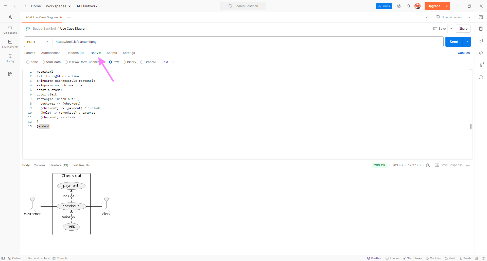

# REST API intro

## Leerdoelen

- Je kent de basisprincipes van een API en REST.
- Je kan een REST API ontwerpen en implementeren.
- Je kan een REST API aanspreken met Postman.
- Je kent de basisprincipes van Node.js.
- Je kan een eenvoudige REST API server opzetten met NestJS.

## Wat is een API?

<iframe width="560" height="315" src="https://www.youtube-nocookie.com/embed/s7wmiS2mSXY?si=7u14hhoBHVRS5Rqk" frameborder="0" referrerpolicy="no-referrer" allowfullscreen></iframe>

Een **API (Application Programming Interface)** is een software-interface die het mogelijk maakt dat twee applicaties met elkaar kunnen communiceren. Dit in tegenstelling tot een User Interface, die mensen met software laat werken. Ze maken de overdracht van gegevens van systeem naar systeem mogelijk. API’s bieden een gestandaardiseerde toegang tot de applicatiegegevens.

### Voorbeeld van het gebruik van een API

Stel je voor dat je bezig bent met het ontwerp van een klantenbeheersysteem. In dit systeem wil je gegevens zoals klantnamen, adressen en koophistorie bijhouden. Daarnaast moeten verkopers de mogelijkheid hebben om klanten en hun bestellingen toe te voegen, te bewerken en te verwijderen.

Om deze gegevens op te slaan, heb je ervoor gekozen om gebruik te maken van een relationele databank. Om gebruikers in staat te stellen deze gegevens te bekijken en te beheren, overweeg je het gebruik van een webinterface.

Een benadering om dit te realiseren is het ontwikkelen van een monolithische applicatie, die op één server draait en gegevens ophaalt via database queries. Vervolgens worden HTML-pagina's gegenereerd en teruggestuurd naar de webbrowser. Dit is een veelgebruikte methode en zal later in de opleiding ook aan bod komen.

Echter, een alternatieve aanpak is om het systeem op te splitsen in twee afzonderlijke programma's. Eén programma (de **server**) beheert de gegevens en de toegang tot de database, terwijl het andere (de **client**) een webinterface biedt. Je kan deze keuze maken omdat je bv. ook een Android-applicatie wil aanbieden die dezelfde data aanspreekt, en je het servergedeelte wil hergebruiken. Het kan ook handig zijn als verschillende teams aan de ontwikkeling werken, om een zo het principe van "separation of concerns" af te dwingen.

Nu doemt de vraag op: hoe communiceren deze twee programma's met elkaar?

In theorie zou je SQL-query's (vanuit de client) over een netwerk kunnen verzenden en de resultaten kunnen ontvangen, maar al snel zul je inzien dat dit niet de beste aanpak is. Zelfs kleine wijzigingen in het databankschema zouden vereisen dat alle clients volledig herschreven moeten worden.

Daarom is het noodzakelijk om een efficiëntere methode te gebruiken om gegevens (en wijzigingen daarin) over het netwerk te verzenden, en **REST** is een van deze methoden.

## REST

**Representational state transfer (REST)** is een **architectuurstijl** waarmee software met andere software kan communiceren. De term werd geïntroduceerd en gedefinieerd in 2000 door Roy Fielding in zijn [doctoraatsstudie](http://www.ics.uci.edu/~fielding/pubs/dissertation/top.htm). REST wordt veelal gebruikt voor het ontwerpen van API's voor het internet. REST gebruikt de **HTTP-methoden (GET / POST / PUT /DELETE)** om data tussen een client en een server op te halen en te verzenden.

Met het HTTP-protocol kunnen REST API’s software op het ene apparaat laten praten met software op een ander apparaat (of op hetzelfde apparaat), zelfs als deze verschillende besturingssystemen en architecturen gebruiken. De client kan om **resources** vragen in een taal die de server begrijpt, en de server reageert met de resource in een taal die de client kan verwerken. De server retourneert de **resource** in **JSON** (JavaScript Object Notation), XML (Extensible Markup Language) of tekstindelingen, maar veel API’s ondersteunen responses in aanvullende talen.

### API requests

#### Resources

Het fundamentele concept van een RESTful API is de **resource**. Alle informatie die benoemd kan worden is een resource: een document, afbeelding, verzameling (= collection) van resources, niet-virtueel object (bv. een klant), enz. REST gebruikt een **resource identifier** om een resource te identificeren.

De resources bevinden zich in een **collectie**, die een verzameling van objecten representeert. De **Uniform Resource Identifier (URI)** verwijst naar een collectie, zoals bvb `/api/klanten` verwijst naar de verzameling van de klant objecten. De data is dus opgebouwd uit resources en collecties, maar het is geen relationele databank! Je bouwt zelf links tussen deze resources en collecties om de juiste informatie op te halen. Gebruik altijd een **zelfstandig naamwoord in het meervoud** als naam voor een collectie. Gebruik GEEN actiemethodes (een werkwoord), zoals `/api/klanten/getAll`.

Bekijk onderstaand voorbeeld. Let op de opbouw van de databank (= ERD), van de URI bovenaan en van de response (geel). Je merkt een duidelijk verschil tussen het databankschema en de response. Het is dus niet altijd zo dat het databankschema overeenkomt met de response. De API-ontwikkelaar beslist hoe de response eruit ziet. Lek dus geen implementatiedetails in de response, **het response is zelden een 1-op-1 kopie van de databank**.


#### HTTP methods

Een HTTP request heeft naast een resource identifier ook altijd een **method**. Deze methods mappen perfect op de CRUD operaties, en worden als volgt gebruikt:

1. `GET`: Read - data opvragen
2. `POST`: Create - nieuwe data toevoegen
3. `PUT`: Update - data aanpassen
4. `DELETE`: Delete - data verwijderen

Voor de resource uit ons klantenvoorbeeld hebben we volgende URI's. Merk op dat een resource steeds onderdeel is van een collectie, in dit voorbeeld 'Klanten'.

| HTTP method en URI       | Resultaat                                  |
| ------------------------ | ------------------------------------------ |
| GET `/api/klanten`       | vraag een lijst van klanten op             |
| GET `/api/klanten/32`    | vraag informatie op van de klant met id 32 |
| POST `/api/klanten`      | voeg een klant toe                         |
| PUT `/api/klanten/145`   | wijzig de informatie van klant met id 145  |
| DELETE `/api/klanten/12` | verwijder klant met id 12                  |

Een ander voorbeeld: [de brewery API](https://www.openbrewerydb.org/documentation)

In de kern betekent REST dat je met collecties van resources werkt, die je op een gestructureerde manier hebt opgebouwd, zodat de structuur voor iedere gebruiker helder is.

Bovendien kunnen resources gemanipuleerd worden door hun voorstelling. Als een client een **voorstelling** van een resource heeft (inclusief eventuele metadata), heeft hij genoeg om resources aan te passen en die wijzigingen terug door te sturen naar de API.

Er zijn nog een aantal HTTP request methods (PATCH, CONNECT, HEAD, OPTIONS, TRACE), maar die worden in de context van REST servers (bijna) niet gebruikt. PATCH kom je soms eens tegen, en OPTIONS wordt frequent gebruikt in de context van bv. CORS, maar dat is voor later.

#### POST vs PUT

Wat soms tot verwarring leidt is wanneer je POST en wanneer je PUT gebruikt.

Als je een nieuw enkelvoudig element toevoegt (bv. een klant), is het duidelijk dat je een POST gebruikt. Maar wat als je een nieuw element aan een lijst toevoegt (bv. een nieuw item in een bestelling)? Is dat een update van een bestaande lijst (PUT)? Of is dit een POST omdat een nieuw element toegevoegd wordt?

Soms lees je wel eens dat je een POST gebruikt als het request resulteert in een nieuwe entry in de databank, en anders een PUT. Maar dat impliceert dat je de databank layout kent, en daar wil je niet op steunen natuurlijk.

Als het een situatie is waar het niet vanzelfsprekend is wat je best gebruikt, doet het er niet echt toe ook. Technisch maakt het helemaal niets uit, het is gewoon een kwestie van afspraken. Het is wel belangrijk dat je eenduidig bent, niet de ene keer PUT en de andere keer POST voor eenzelfde situatie met een andere resource.

#### PUT vs PATCH

Ook het verschil tussen PUT en PATCH is niet altijd duidelijk.

PUT en PATCH zijn beide methodes om een resource aan te passen. Het verschil is dat PUT de volledige resource doorstuurt, terwijl PATCH enkel de gewijzigde velden doorstuurt. In het voorbeeld van onze klanten zal een PUT de hele klant doorsturen terwijl een PATCH bv. enkel de naam doorstuurt.

### API responses

De API-ontwikkelaar beslist welke formaten ze ondersteunen voor de response. Een server kan bijvoorbeeld reageren met JSON, XML of tekst. De API moet de mogelijkheid hebben om de response op te maken op basis van de behoeften van de client. In het voorbeeld van de klanten wordt JSON geretourneerd.

Voor de responses wordt ook steeds een **HTTP status code** gebruikt. Bij een succesvol request wordt er een 2xx HTTP status code teruggegeven:

| Code    | Status     | Beschrijving                                                                        |
| ------- | ---------- | ----------------------------------------------------------------------------------- |
| **200** | OK         | Het request is geslaagd.                                                            |
| **201** | Created    | Een resource is aangemaakt met een POST request. Het antwoord bevat een empty body. |
| **204** | No Content | Een PUT, PATCH of DELETE request slaagt. Het antwoord bevat een empty body.         |

Bij een foutmelding wordt een van de volgende status codes teruggegeven. Een code 4xx wordt gebruikt als de fout bij de client ligt, een code 5xx als de fout bij de server ligt.

| Code    | Status                | Beschrijving                                                                                                                              |
| ------- | --------------------- | ----------------------------------------------------------------------------------------------------------------------------------------- |
| **400** | Bad Request           | Het request is ongeldig (bv. foute parameters in URL of body).                                                                            |
| **401** | Unauthorized          | De authenticatie faalt, bv. door een onjuist wachtwoord of de client is simpelweg niet aangemeld.                                         |
| **403** | Forbidden             | De client is aangemeld maar heeft geen toegang tot de resource (= onvoldoende rechten).                                                   |
| **404** | Not Found             | De resource is niet gevonden.                                                                                                             |
| **405** | Method Not Allowed    | De HTTP method is niet toegelaten voor deze resource.                                                                                     |
| **406** | Not Acceptable        | De client heeft een accept header gestuurd die niet ondersteund wordt (bv. gevraagd om XML terwijl de server enkel JSON kan retourneren). |
| **429** | Too Many Requests     | De client heeft te veel requests gestuurd in een bepaalde tijdspanne.                                                                     |
| **500** | Internal Server Error | Er is een fout opgetreden aan de serverkant.                                                                                              |
| **501** | Not Implemented       | Het endpoint is niet geïmplementeerd.                                                                                                     |
| **503** | Service Unavailable   | De server is tijdelijk niet beschikbaar.                                                                                                  |

Een volledige lijst van HTTP status codes kan je vinden op [developer.mozilla.org](https://developer.mozilla.org/en-US/docs/Web/HTTP/Status).

### REST architectuurstijl

REST is [een reeks principes](https://ics.uci.edu/~fielding/pubs/dissertation/rest_arch_style.htm#sec_5_1_7) die een ontwikkelaar moet volgen voordat die zijn API als "RESTful" kan beschouwen. De principes zeggen niets over hoe de API moet worden geïmplementeerd.

<!-- markdownlint-disable ol-prefix -->

1. **Uniforme interface**: een request identificeert een **resource**, door gebruik te maken van **URI's**. Er zijn vier architecturale beperkingen nodig om het gedrag van componenten vast te leggen:

- Identificatie van resources.
- Manipulatie van resources door representations (JSON, XML...).
- Zelf-omschrijvende berichten.
- Hypermedia als de drijvende kracht van de applicatie status. De applicatie in deze context is de web applicatie die je server draait, hypermedia de hyperlinks/links die de server meestuurt in het antwoord.

2. **Client/server-architectuur**: de clients van de API gebruiken HTTP calls om een resource te vragen (een GET-methode) of data naar de server te sturen (een PUT, POST of DELETE-methode). De client moet voldoende hebben aan de verschillende URI's voor alle resources. De documentatie van de API bevat de beschikbare URI's/methoden die door de API worden ondersteund. De client en de server moeten onafhankelijk van elkaar kunnen evolueren. Door de gebruikersinterface te scheiden van de opslag, kan een gebruikersinterface voor meerdere platformen gebouwd worden.

3. **Stateless**: een stateless applicatie houdt geen verbinding in stand en slaat geen informatie op tussen requests van dezelfde client. Een client doet een request, de API voert de actie uit die in het request is gedefinieerd en reageert. Zodra de API reageert, verbreekt hij de verbinding en bewaart hij geen informatie over de client in het actieve geheugen. De API behandelt elke request als een eerste request. Dit betekent dat ieder request van client naar server alle nodige informatie moet bevatten om het verzoek te begrijpen en kan geen gebruik maken van enige opgeslagen context op de server. De sessie-status wordt volledig op de client opgeslagen.

4. **Cacheable**: een REST API moet caching van vaak gevraagde data mogelijk maken. Om bandbreedte, vertraging (= latency) en serverbelasting te verminderen moet een API identificeren wat cacheable resources zijn, wie ze kan cachen en hoelang ze in de cache kunnen blijven. Goede caching maakt dat de server beter schaalt (want minder requests te verwerken) én dat de client sneller reageert. Als een antwoord cacheable is, krijgt de client rechten om het antwoord opnieuw te gebruiken voor latere, soortgelijke verzoeken.

5. **Gelaagd systeem**: een API kan meerdere lagen hebben, zoals proxyservers of load balancers, en de eindpuntserver kan extra servers inzetten om een response te formuleren. De client weet niet welke server op het request reageert. Met een gelaagd systeem is een API eenvoudiger uit te breiden en dus schaalbaarder. Bijvoorbeeld: de API staat op Server A, de data op Server B en de authenticatie wordt afgehandeld op Server C. Het grote voordeel is dat de servers onafhankelijk van elkaar kunnen schalen, bv. één grote, zware databankserver met daarvoor een aantal kleine, lichtere API servers.

<!-- markdownlint-enable ol-prefix -->

### REST clients

#### GET

GET requests kan je altijd eenvoudig testen. Typ de URL in de adresbalk van de browser en je browser toont het resultaat.

Probeer bijvoorbeeld eens het weer in Gent (of jouw gemeente/stad) op te vragen via: <http://wttr.in/Gent?format=j1>.

#### POST/PUT

POST en PUT requests zijn iets lastiger te testen. Meestal moet je hier ook data meesturen in de body van de requests en dat kan niet zo eenvoudig in de browser. Uiteindelijk is het natuurlijk de bedoeling dat de API via de client (een programma) aangesproken wordt. Echter als je aan het ontwikkelen bent, is het handig om software te hebben die alle soorten requests kan genereren. Dit is zeker handig als er iets niet werkt, op die manier kan je testen of het probleem zich voordoet in de front- of back-end.

Een vaak gebruikt programma hiervoor is [Postman](https://www.postman.com). Postman heeft ook [een extensie voor VS Code](https://marketplace.visualstudio.com/items?itemName=Postman.postman-for-vscode). Er zijn natuurlijk nog alternatieven zoals bv. [Insomnia](https://insomnia.rest/), [Bruno](https://www.usebruno.com/) (ziet er veelbelovend uit) of [Thunder Client](https://marketplace.visualstudio.com/items?itemName=rangav.vscode-thunder-client) (een extensie voor VSCode). Als je de [nodige software](../0-intro/software.md) reeds geïnstalleerd hebt, dan heb je Postman reeds op je systeem staan.

#### Postman

Postman is ooit begonnen als een simpele applicatie om API's te testen maar is ondertussen enorm gegroeid en een heus platform geworden. Je kan samenwerken met anderen en allerlei automatisaties uitvoeren. Het is zowel als losstaande applicatie als in een browser bruikbaar. Maar je kan gelukkig nog altijd gewoon wat requests uitvoeren, al heb je tegenwoordig wel een account nodig om iets te kunnen doen.

Laten we een POST request uitvoeren in Postman:

1. Kies de `POST` als method.
2. Typ de URL in het veld. We gebruiken hier een publieke API om afbeeldingen te generen:
<https://kroki.io/plantuml/png> (niet klikken, enkel kopiëren :upside_down_face:).
3. Vervolgens moeten we nog onze data in de body doorsturen. Kies in bij het tabblad `Body` voor `raw` en wijzig `JSON` naar `text`.


<!-- markdownlint-disable ol-prefix -->

4. Uiteindelijk komt in de body de UML code te staan (kopieer gerust, code staat onder de afbeelding!). Dit is de beschrijving voor een simpel use case diagram in PlantUML syntax. Klik op `Send` en je zou hetzelfde use case diagram moeten zien.

<!-- markdownlint-enable ol-prefix -->



```text
@startuml
left to right direction
skinparam packageStyle rectangle
skinparam monochrome true
actor customer
actor clerk
rectangle "Check out" {
  customer -- (checkout)
  (checkout) .> (payment) : include
  (help) .> (checkout) : extends
  (checkout) -- clerk
}
@enduml
```

### 3rd party API's

Vaak worden API's en de client samen ontwikkeld, en een API leren ontwikkelen is in eerste instantie waar deze cursus over gaat. Natuurlijk zijn er ook veel API's die op zich aangeboden worden en door (vele) verschillende clients gebruikt worden, zoals bv. weersvoorspellingen, beursdata...

Soms zijn API's volledig gratis, soms volledig betalend, maar heel vaak daar ergens tussenin (bv. eerste XXX requests, eerste x maanden gratis, en dan €YYY per 1000 requests). Als ze (deels) betalend zijn, komt er autorisatie bij kijken: om je te kunnen laten betalen, moet de API weten wie je bent en welke requests je doet natuurlijk. Daarover later meer, maar we kennen nu al genoeg om een oefening te maken met een publieke API.

Een mooi voorbeeld van publieke API's zijn de 100+ datasets die de stad Gent aanbiedt als open data, van de bezetting van de parkeergarages tot de locatie van de grazende schapen: [https://data.stad.gent/explore/](https://data.stad.gent/explore/?disjunctive.keyword&disjunctive.theme&sort=modified).

Maar er zijn nog veel meer publieke API's natuurlijk! Een uitgebreide (niet exhaustieve) lijst van publiek beschikbare API's kan je hier vinden: <https://github.com/public-apis/public-apis>.

### Oefening

- Gebruik Postman om de most wanted list van de FBI op te vragen.
  - Stuur hiervoor een GET request naar <https://api.fbi.gov/wanted/v1/list>
- Gebruik <https://kroki.io/erd/svg> om onderstaand ERD te creëren.
  - Als je via de browser klikt op de link is het logisch dat je een HTTP 405 krijgt, je moet een POST request uitvoeren via Postman.


- Oplossing +

  ```erd
  [Klant]
  *id
  +persoonId
  +adresId

  [Adres]
  *id
  straat
  nr
  +stadId

  [Stad]
  *id
  postcode
  naam

  [Persoon]
  *id
  voornaam
  naam

  Klant 1--1 Adres
  Klant 1--1 Persoon
  Adres *--1 Stad
  ```

## REST - Een uitgewerkt voorbeeld

Doorheen de jaren merken we dat vaak dezelfde fouten gemaakt worden bij het ontwerpen van API's voor de examenopdracht. In deze sectie werken we een extra voorbeeld uit, dit staat los van de applicatie die we later in de cursus zullen maken. Het dient louter als voorbeeld voor de veelgemaakte fouten.

In dit extra voorbeeld maken we een applicatie waarmee hobbykoks recepten kunnen opslaan en delen met elkaar. Koks kunnen daarbij recepten van andere koks opslaan om bv. later eens uit te proberen.

### Entiteiten

We hebben drie entiteiten met volgende attributen:

- User
  - firstName
  - lastName
  - address
- Recipe
  - name
- Ingredient
  - name
  - amount
  - unit

### Relaties

We onderscheiden volgende relaties:

- Een gebruiker heeft meerdere opgeslagen recepten (niet verplicht om er te hebben)
- Een recept wordt toegevoegd door één gebruiker, een gebruiker kan meerdere recepten toevoegen
- Een recept heeft meerdere ingrediënten
- Een ingrediënt hoort maar bij één recept

### Veelgemaakte fouten

Door de jaren heen merkten we een aantal terugkomende fouten in het ontwerp van applicaties die gemaakt werden voor onze examenopdracht. We sommen ze hier even op:

- Geen tussentabel voor een veel-op-veel relatie
  - Zie cursus Databases I
- Geen foreign key voor een een-op-veel relatie
  - Zie cursus Databases I
- Samengestelde sleutels i.p.v. een uniek id
  - Eerder praktische afwijking van de cursus Databases I
  - Samengestelde sleutels zijn niet fout, maar in sommige gevallen onhandig in URLs van de API calls
- Adres/locatie als string in een tabel
  - Dit is in principe geen fout, maar het maakt het wel lastiger om queries uit te voeren op het adres
- ERD niet voldoende om doel van de applicatie te verwezenlijken
  - Dit is puur een ontwerpfout
  - Denk vooraf goed na over de functionaliteiten van je applicatie en wat je daarvoor nodig hebt in de databank
- Geen API call definities
  - Dit is ook een ontwerpfout, maar eerder op het niveau van documentatie
  - Denk vooraf goed na over de functionaliteiten van je applicatie en welke API calls je daarvoor nodig hebt
- GET all request geeft alle relaties van een entiteit terug
  - Dit is vaak onnodig en kan de databank onnodig belasten
  - In sommige gevallen is het wel nuttig, het hangt allemaal af van de verwachtingen van de client
  - Aangezien je zelf de client ontwerpt in Front-end Web Development, kan je dit zelf bepalen o.b.v. wat je toont in bijvoorbeeld lijsten of tabellen van die entiteit

### ERD met veelgemaakte fouten

Onderstaand ERD zou een oplossing zijn voor onze receptenapplicatie, vol met bovenstaande veelgemaakte fouten:


- Broncode +

  Onderstaande code werd hiervoor gebruikt:

  ```erd
  [Recipe]
  *name

  [Ingredient]
  *name
  amount
  unit

  [User]
  *id
  firstName
  lastName
  address

  User 1--* Recipe
  Recipe 1--* Ingredient
  User *--* Recipe
  ```

Wat is er fout aan dit ERD?

### ERD

Een mogelijke oplossing ziet eruit als volgt:


- Broncode +

  Onderstaande code werd gebruikt voor de oplossing:

  ```erd
  [Recipe]
  *id
  name
  +createdBy

  [Ingredient]
  *id
  name
  amount
  unit
  +recipeId

  [User]
  *id
  firstName
  lastName
  street
  number
  postalCode
  city

  [SavedRecipe]
  *+userId
  *+recipeId

  User 1--* Recipe
  Recipe 1--* Ingredient
  User 1--* SavedRecipe
  SavedRecipe *--1 Recipe
  ```

Je merkt nog een samengestelde sleutel in SavedRecipe. Het kan wel nuttig zijn om geen samengestelde sleutels te gebruiken, dat is persoonlijke voorkeur. In dat geval bevat de tabel SavedRecipe ook een id, naast de `userId` en `recipeId`.

Qua invoer via de API calls heeft dit weinig invloed. Een gebruiker zal altijd aangemeld zijn en dus kennen we altijd het `userId`, het `recipeId` wordt meegegeven via de API call.

De code voor het opslaan van een recept kan wel complexer worden. Met samengestelde sleutels zal de databank een fout gooien als je tweemaal hetzelfde recept wil opslaan. Je moet vervolgens zelf deze error parsen, dat kan lastig zijn afhankelijk van de gekozen databank en/of client library. Zonder samengestelde sleutels moet je zelf checken of een recept al dan niet dubbel opgeslagen wordt.

Algemene regel: laat zoveel mogelijk door je databank afhandelen. Deze zijn hiervoor geoptimaliseerd en doen dergelijke checks razendsnel (en sparen extra queries).

### API calls

Hieronder lijsten we de vereiste functionaliteiten van de applicatie op. Denk even na (niet meteen verder scrollen/kijken) en definieer de nodige API calls (volgens de REST principes) om deze functionaliteiten te implementeren.

- Een gebruiker moet alle recepten kunnen bekijken.
- Een gebruiker moet een recept in detail kunnen bekijken (met zijn ingrediënten dus).
- Een gebruiker moet een recept kunnen toevoegen/aanpassen/verwijderen.
- Een gebruiker moet de ingrediënten van een recept kunnen bekijken.
- Een gebruiker moet een ingredient van een recept kunnen toevoegen/aanpassen/verwijderen.
- Een gebruiker moet zijn opgeslagen recepten kunnen bekijken.

#### Recipe

- `GET /api/recipes`: alle recepten zonder ingrediënten, evt. met de gebruiker die het recept toegevoegd heeft
- `GET /api/recipes/:id`: één recept met ingrediënten én de gebruiker die het recept toegevoegd heeft
- `POST /api/recipes`: recept toevoegen met/zonder zijn ingrediënten
  - Of je de ingrediënten in dezelfde call toevoegt of in een aparte call is een ontwerpbeslissing
  - Dat hangt vaak af van de opbouw van de front-end, kijk wat het handigst is voor jouw geval
- `PUT /api/recipes/:id`: recept aanpassen
- `DELETE /api/recipes/:id`: recept verwijderen
- `GET /api/recipes/:recipeId/ingredients`: alle ingrediënten van een recept ophalen
- `POST /api/recipes/:recipeId/ingredients`: een ingrediënt toevoegen aan een recept
- `PUT /api/recipes/:recipeId/ingredients/:id`: een ingrediënt van een recept aanpassen
- `DELETE /api/recipes/:recipeId/ingredients/:id`: een ingrediënt van een recept verwijderen

#### User

- `GET /api/users/:id/recipes`: opgeslagen recepten opvragen
  - Soms wordt ook `GET /api/users/me/recipes` gedaan als je toch aangemeld moet zijn, het id van de gebruiker zit nl. in de token (hierover later meer)

Lees ook de [REST API Design Best Practices for Sub and Nested Resources](https://www.moesif.com/blog/technical/api-design/REST-API-Design-Best-Practices-for-Sub-and-Nested-Resources/).

## Node.js

We willen natuurlijk niet gewoon bestaande API's aanspreken maar zelf zo'n API server maken. Een web server is op zich geen magie. Het is gewoon een programma dat luistert op een bepaalde poort, HTTP requests leest, verwerkt en voorziet van een antwoord. Aangezien HTTP requests altijd hetzelfde zijn, schrijft niemand een webserver compleet van nul (behalve als interessante oefening eens). Je kan in elke programmeertaal een server schrijven, wij kiezen JavaScript en dus [Node.js](https://nodejs.org/en).

**Node.js** is server-side JavaScript, het kwam uit in 2009. Het is een single-threaded, open source, platformonafhankelijke runtime-omgeving gebouwd bovenop v8, de JavaScript engine van Chrome (werd open source in 2008). Meer info op <https://kinsta.com/nl/kennisbank/wat-is-node-js/>.

[**npm**](https://www.npmjs.com/) is het package ecosysteem van Node.js. Het is het grootste ecosysteem van alle open source bibliotheken ter wereld, met meer dan 1 miljoen pakketten en het groeit nog steeds. npm is gratis te gebruiken en duizenden open source ontwikkelaars dragen er dagelijks aan bij.

Voor het bouwen van web API's wordt er meestal een framework gebruikt en geen 'naakte' Node.js. [Express](https://github.com/expressjs/express) is waarschijnlijk de meest gekende en meest gebruikte, was een paar jaar dood maar kreeg recent een nieuwe release. Er zijn echter nog andere frameworks zoals [Koa](https://koajs.com/), [Fastify](https://www.fastify.io/), [NestJS](https://nestjs.com/) en [Hapi](https://hapi.dev/). In deze cursus gebruiken we [NestJS](https://nestjs.com/) wat bovenop Express gebouwd is en bovendien heel wat leuke features en handigheden ingebouwd heeft.

?> Tegenwoordig bestaan ook andere JavaScript runtimes zoals [Deno](https://deno.land/) en [Bun](https://bun.sh/), maar Node.js is nog steeds [de meest gebruikte](https://2024.stateofjs.com/en-US/other-tools/#runtimes).

### pnpm

Een goeie IT'er werkt met package managers, zowel op diens besturingssysteem als in een programmeertaal. Ook Node.js heeft een package manager, namelijk [npm](https://www.npmjs.com/). Deze is echter niet de snelste en heeft een aantal nadelen. Zo downloadt npm alle dependencies steeds naar elk project.

Daarom gebruiken we [pnpm](https://pnpm.io/), een alternatieve package manager die sneller is en minder schijfruimte gebruikt. pnpm maakt gebruik van een centrale cache voor alle packages, waardoor het sneller is en minder schijfruimte gebruikt. Het is compatibel met npm en kan eenvoudig geïnstalleerd worden. Als je de software reeds hebt geïnstalleerd, heb je pnpm al op je systeem staan.

## NestJS

Als IT'er is het belangrijk om te leren documentatie te lezen. De documentatie van NestJS is zeer uitgebreid en goed geschreven. We raden je aan om de documentatie grondig door te nemen, zeker als je vastloopt of iets niet begrijpt. De documentatie is beschikbaar op <https://docs.nestjs.com/>.

Om deze trend goed in te zetten, beginnen we met het lezen van de ["Introduction" sectie](https://docs.nestjs.com/) van de NestJS documentatie. Deze sectie geeft een beknopt overzicht van wat NestJS is, wat het doet, waarom je het zou gebruiken en hoe je een project opzet.

### Project opzetten

NestJS beschikt over een zeer uitgebreide Command Line Interface (CLI) die je helpt bij het opzetten van een nieuw project en het genereren van alle benodigde onderdelen. De CLI is een krachtig hulpmiddel dat je veel tijd kan besparen bij het ontwikkelen van je applicatie.

?> Merk op: we gebruiken min of meer de commando's vanop de NestJS documentatie, we zijn enkel gewisseld naar pnpm.

Allereerst installeer je de NestJS CLI globaal op je systeem. Dit kan je doen met het volgende commando:

```bash
pnpm add -g @nestjs/cli
```

Vervolgens maken we een nieuw project aan met de CLI. Dit kan je doen met het onderstaand commando. Tijdens de installatie kies je voor `pnpm` als package manager.

!> **Info voor de examenopdracht:** zorg ervoor dat je onderstaand commando in de root van jouw GitHub Classroom repository uitvoert, anders zal het project niet in de juiste map aangemaakt worden. Natuurlijk kan je het nadien verplaatsen.

```bash
nest new --strict webservices-budget
```

Hiermee maken we een nieuw NestJS project aan in de map `webservices-budget`. De `--strict` optie zorgt ervoor dat TypeScript strict is ingesteld, wat we aanraden om bugs te voorkomen. Dit is een goede gewoonte, zeker als je met TypeScript werkt. Het project wordt aangemaakt met de standaard mappenstructuur en een aantal voorbeeldbestanden.

Open deze map in VS Code.

### package.json

De [package.json](https://docs.npmjs.com/cli/v10/configuring-npm/package-json) bevat alle metadata van ons project, meer in het bijzonder alle dependencies en commando's om onze app te starten. Open de `package.json` en bekijk de inhoud. Deze bevat enkele properties:

- `name`: de naam van het project
- `version`: de versie van het project
- `description`: een korte beschrijving van het project
  - Deze mag je gerust aanvullen
- `author`: de auteur van de applicatie
  - Deze mag je gerust aanvullen
- `private`: of de applicatie publiek is of niet, npm zal bv. niet toelaten om een private package te publiceren
- `license`: de licentie van de applicatie
- `dependencies`: de packages waarvan deze applicatie gebruik maakt
- `devDependencies`: packages enkel nodig in development (en dus niet in productie)
- `scripts`: laten toe om een soort van shortcuts te maken voor scripts (bv. de applicatie starten, testen, builden voor productie, etc.)
- `jest`: de configuratie voor Jest, het test framework die gebruikt wordt (zie later)
- `packageManager`: de package manager die gebruikt wordt (in dit geval pnpm)

Voor de volledigheid kan je ook de volgende properties voorzien:

- `main`: het entry point van de applicatie
- `repository`: informatie over de repository van de applicatie

Met een simpele `pnpm install` installeren we meteen een identieke omgeving (met zowel `dependencies` als `devDependencies`) en dat maakt het handiger om in een team te werken (`pnpm install --prod` installeert enkel de `dependencies`).

Het verschil tussen `dependencies` en `devDependencies` is het moment wanneer ze gebruikt worden. De `dependencies` zijn nodig in productie, m.a.w. de applicatie kan niet werken zonder deze packages. De `devDependencies` zijn enkel nodig om bv. het leven van de developer makkelijker te maken (types in TypeScript, linting, etc.) of bevatten packages die enkel gebruikt worden _at build time_, of dus wanneer de applicatie omgevormd wordt tot iets wat browsers of JavaScript runtimes begrijpen.

Dependencies maken gebruik van [semantic versioning](https://semver.org/) (lees gerust eens door de specificatie). Kort gezegd houdt dit in dat elk versienummer bestaat uit drie delen: `MAJOR.MINOR.PATCH`, elke deel wordt met één verhoogd in volgende gevallen:

- `MAJOR`: wijzigingen die **_niet_** compatibel zijn met oudere versies
- `MINOR`: wijzigen die **_wel_** compatibel zijn met oudere versies
- `PATCH`: kleine bugfixes (compatibel met oudere versies)

In een `package.json` zie je ook vaak versies zonder prefix of met een tilde (~) of hoedje (^) als prefix, dit heeft volgende betekenis:

- geen prefix: exact deze versie
- tilde (~): ongeveer deze versie (zie <https://docs.npmjs.com/cli/v6/using-npm/semver#tilde-ranges-123-12-1>)
- hoedje (^): compatibel met deze versie (<https://docs.npmjs.com/cli/v6/using-npm/semver#caret-ranges-123-025-004>)

Kortom, een tilde is strenger dan een hoedje.

Het lijkt misschien een beetje raar, maar zo'n `package.json` wordt voor vele toepassingen en frameworks gebruikt. JavaScript programmeurs zijn gewoon van een `git pull`, `pnpm install` en `pnpm start` te doen, zonder per se te moeten weten hoe een specifiek framework opgestart wordt.

In jouw `package.json` zal je verschillende scripts zien om de server te starten:

- `start`: start de applicatie (zonder debugging of hot reloading)
- `start:dev`: start de applicatie in development modus (met hot reloading)
- `start:debug`: start de applicatie in debug modus
- `start:prod`: start de applicatie in productie modus

Deze scripts kan je uitvoeren met `pnpm <SCRIPT>`, bijvoorbeeld `pnpm start:dev`.

Er zijn nog heel wat andere opties voor de `package.json`. Je vindt alles op <https://docs.npmjs.com/cli/v10/configuring-npm/package-json>.

### pnpm-lock.yaml

Wanneer je een package installeert, zal pnpm een `pnpm-lock.yaml` bestand aanmaken. Dit bestand bevat de exacte versies van de packages die geïnstalleerd zijn. Dit bestand moet je zeker mee opnemen in je git repository. Dit zorgt ervoor dat iedereen exact dezelfde versies van de packages gebruikt.

Dit bestand vermijdt versieconflicten aangezien in de `package.json` niet altijd de exacte versie staat maar een bepaalde syntax die aangeeft welke versies toegelaten zijn (zie vorige sectie).

### .gitignore

Merk op dat er een `.gitignore` bestand aanwezig is in de root van het project. Dit bestand zorgt ervoor dat bepaalde bestanden en mappen niet naar GitHub gepusht worden. Dit is handig om te voorkomen dat je onnodige bestanden of mappen in je repository hebt, zoals de `node_modules` map die alle geïnstalleerde packages bevat. Je kan nl. de dependencies eenvoudig opnieuw installeren d.m.v. `pnpm install`.

Kijk gerust eens welke bestanden er allemaal genegeerd worden. Je kan dit bestand ook aanpassen naar eigen wens, maar dit is een vrij complete voor een Node.js project. Een vrij uitgebreide `.gitignore` voor Node.JS projecten is te vinden op GitHub: <https://github.com/github/gitignore/blob/main/Node.gitignore>.

### Projectstructuur

Alvorens we verder gaan, is het belangrijk om de projectstructuur van de basisapplicatie te begrijpen. Lees hiervoor de [First steps sectie](https://docs.nestjs.com/first-steps) in de NestJS documentatie. Een paar opmerkingen voor tijdens het lezen:

- Bootstrapping = het opstarten van de applicatie
- De sectie "Linting and formatting" mag je voorlopig nog negeren, we gaan dit later behandelen

### De obligate Hello World

Eens een developer een idee heeft van de basis van een framework, is het tijd om de obligate Hello World applicatie te maken. Gelukkig is dit net wat de NestJS CLI voor ons gegenereerd heeft. Open de `src/app.controller.ts` en `src/app.service.ts` bestanden en bekijk de code.

De `AppService` klasse bevat één methode `getHello()` die een string retourneert. Deze string wordt gebruikt in de `AppController` klasse, die een route definieert voor de root URL (`/`).

Start de applicatie in development modus met het volgende commando:

```bash
pnpm start:dev
```

Je zou nu een bericht moeten zien in de terminal dat de applicatie draait op `http://localhost:3000`. Open deze URL in je browser en je zou een "Hello World!" bericht moeten zien.

Ga naar de `AppService` klasse en pas de `getHello()` methode aan om een andere string te retourneren, bijvoorbeeld "Hallo wereld!". Sla het bestand op en herlaad de pagina in je browser. Je zou zien dat de tekst aangepast is naar "Hallo wereld!".

## Health controller

Voor het volgende voorbeeld gaan we een eenvoudige controller maken die een health check uitvoert. Deze controller zal een endpoint aanbieden dat we kunnen gebruiken om te controleren of de server draait. Het is een veelvoorkomende praktijk in webservices om te controleren of de service beschikbaar is, NestJS heeft uitgebreide mogelijkheden om dit te doen <https://docs.nestjs.com/recipes/terminus#setting-up-a-healthcheck>. Voor deze oefening gaan we echter een eenvoudige controller maken die een `ping` endpoint aanbiedt.

### Controller genereren

Controllers in NestJS zijn verantwoordelijk voor het afhandelen van inkomende verzoeken en het retourneren van antwoorden. Ze zijn de brug tussen de client en de service laag van de applicatie. Lees eerst volgende secties in de documentatie:

- [Controllers](https://docs.nestjs.com/controllers#controllers)
- [Routing](https://docs.nestjs.com/controllers#routing)

NestJS biedt een CLI commando om automatisch een controller te genereren:

```bash
nest generate controller health
```

Dit commando maakt de volgende bestanden aan:

- `src/health/health.controller.ts`: de controller zelf
- `src/health/health.controller.spec.ts`: test bestand voor de controller

De controller wordt ook automatisch toegevoegd aan de `app.module.ts` (zie de `controllers` array). Zonder deze toevoeging zou de controller niet beschikbaar zijn in de applicatie.

### Route implementeren

Open het bestand `src/health/health.controller.ts` en vervang de inhoud door:

```typescript
import { Controller, Get } from '@nestjs/common';

@Controller('health')
export class HealthController {
  @Get('ping')
  ping(): string {
    return 'pong';
  }
}
```

Deze controller zal alle requests op `/health` afhandelen. De `@Controller('health')` decorator geeft aan dat deze controller verantwoordelijk is voor alle routes die beginnen met `/health`.

De `@Get('ping')` decorator geeft aan dat de `ping()` methode reageert op `GET` verzoeken op de route `/health/ping`. De methode `ping()` retourneert een string "pong".

Start de server (als deze nog niet draait) en open de url <http://localhost:3000/health/ping> in je browser of Postman. Je zou de string "pong" moeten zien.

## /api prefix

Het is een best practice om alle API routes te prefixen met `/api`. Dit maakt het duidelijk dat deze routes bedoeld zijn voor API calls en niet voor andere doeleinden zoals het hosten van statische bestanden of webpagina's.

Open het bestand `src/main.ts` en pas de `app.setGlobalPrefix` aan zoals hieronder:

```ts
async function bootstrap() {
  const app = await NestFactory.create(AppModule);

  app.setGlobalPrefix('api'); // 👈

  // rest van de code
}
```

Contolleer of alles nog steeds werkt door naar <http://localhost:3000/api/health/ping> te surfen.

## Debugging

Een applicatie ontwikkelen zonder eens te moeten debuggen is een utopie, ook in Node.js.

Net zoals in vanilla JavaScript kan je hier gebruik maken van o.a. `console.log`, maar op die manier debuggen is tijdrovend en lastig. Het zou handig zijn als we in VS Code konden debuggen... Uiteraard kan dit ook!

Maak een bestand `launch.json` aan in de `.vscode` map en voeg volgende configuratie toe:

?> Als je zowel Front-end Web Development als Web Services volgt én je opent steeds de root van jouw GitHub repository, dan moet je de `.vscode` map in de root van je GitHub repository te zetten. Anders zal VS Code de debug configuratie niet inladen.

```json
{
  "version": "0.2.0",
  "configurations": [
    {
      "name": "Attach to NestJS server",
      "address": "localhost",
      "port": 9229,
      "request": "attach",
      "skipFiles": ["<node_internals>/**"],
      "type": "node",
      "restart": true,
      "timeout": 10000
    }
  ]
}
```

Dit zorgt ervoor dat VS Code de debugger zal koppelen aan localhost:9229. Indien de debugger om een of andere reden ontkoppeld wordt, zal VS Code proberen opnieuw te koppelen voor maximaal 10 seconden.

Voor NestJS hoef je geen extra opties toe te voegen aan het start-commando. NestJS heeft standaard debugging ondersteuning ingebouwd.

Start je applicatie in debug modus met `pnpm start:debug`. Vervolgens kan je in VS Code debugger starten door op het play-icoontje (naast 'Attach to NestJS server') te klikken in de debug tab:


Vervolgens zal je in de terminal zien dat de debugger verbonden is en kan je breakpoints toevoegen in je code.


Voeg breakpoints toe door op de lijnnummers te klikken. De debugger zal nu stoppen op deze lijn wanneer deze uitgevoerd wordt (doordat je bv. een request uitvoert in Postman). Je kan een breakpoint zetten in je `HealthController` op de lijn `return 'pong';` en zien dat de debugger stopt op deze lijn als je naar <http://localhost:3000/api/health/ping> surft. Bovenaan krijg je een paar knoppen die je zou moeten herkennen van bv. Eclipse of IntelliJ IDEA.


In de documentatie van VS Code kan je meer lezen over de [debug actions in de toolbar bovenaan](https://code.visualstudio.com/docs/debugtest/debugging#_debug-actions).

## Oefening - Je eigen project

In de vorige les heb je nagedacht over het onderwerp van je examenopdracht. Nu gaan we deze ideeën verder uitwerken tot een concrete API.

### Stap 1: Database ontwerp (ERD)

Ontwerp de database voor je project door een Entity Relationship Diagram (ERD) te maken:

1. Ga naar <https://kroki.io> en gebruik de ERD syntax van <https://github.com/BurntSushi/erd>
2. Denk goed na over:
   - Welke entiteiten je nodig hebt
   - Hoe deze entiteiten met elkaar gerelateerd zijn
   - Hoe je deze relaties wegwerkt in een relationele database
3. Voeg je ERD toe aan je projectdossier (in het bestand `dossier.md`)

### Stap 2: API endpoints definiëren

Maak een markdown document waarin je alle API endpoints van je webservice beschrijft:

1. **URL structuur**: Schrijf de volledige URLs van alle API calls neer
2. **Input/Output**: Beschrijf kort wat elke endpoint verwacht als invoer en wat het teruggeeft
3. **HTTP methoden**: Gebruik de juiste HTTP methoden (GET, POST, PUT, DELETE)
4. **Best practices**: Pas de REST principes toe die je in dit hoofdstuk geleerd hebt

> **Tip**: Gebruik de API calls van het [uitgewerkte voorbeeld](#rest---een-uitgewerkt-voorbeeld) als referentie.

### Stap 3: Feedback vragen

Zodra je een eerste versie van je ERD hebt:

1. **Tijdens de les (bij voorkeur)**: Vraag feedback aan je lector
2. **Na de les**: Maak een issue aan op je GitHub repository
   - Gebruik het feedback template
   - Voeg een afbeelding van je ERD bij
   - Voeg je lector toe als assignee (anders krijgt deze geen melding)

### Stap 4: NestJS project aanmaken

Maak nu je webservice aan:

1. **Projectnaam**: Kies een duidelijke naam met suffix zoals `-webservice` of `-api`
2. **Locatie**: Maak het project aan in de root van je GitHub repository
3. **Setup**: Volg de NestJS setup stappen zoals eerder beschreven

### Stap 5: Git configuratie

Omdat NestJS automatisch een git repository aanmaakt, moet je dit aanpassen:

1. **Verwijder** de (verborgen) `.git` map in je webservice directory:
2. **Controleer** de `.gitignore` om ervoor te zorgen dat `node_modules` niet wordt geüpload
3. **Upload** je webservice naar je GitHub repository

### Stap 6: Documentatie bijwerken

Werk de `README.md` in de root van je repository bij met instructies om de dependencies te installeren en de server te starten.

Verwijder de `README.md` in je webservice map - de `README.md` in de root is voldoende.

> **Oplossing voorbeeldapplicatie**
>
> ```bash
> git clone https://github.com/HOGENT-frontendweb/webservices-budget.git
> cd webservices-budget
> git checkout -b les2-opl TODO:
> pnpm install
> pnpm start:dev
> ```
