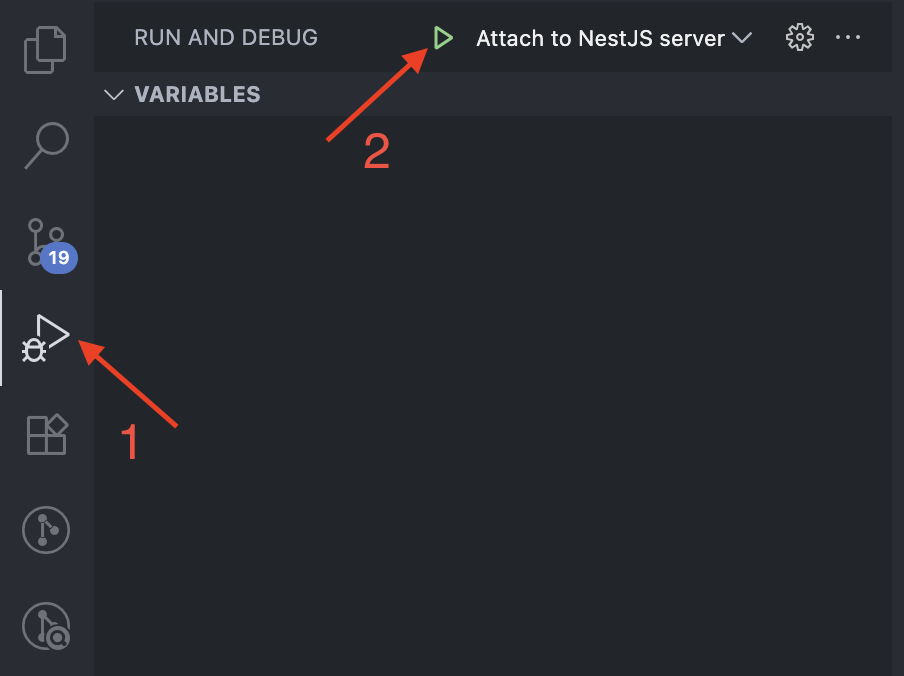
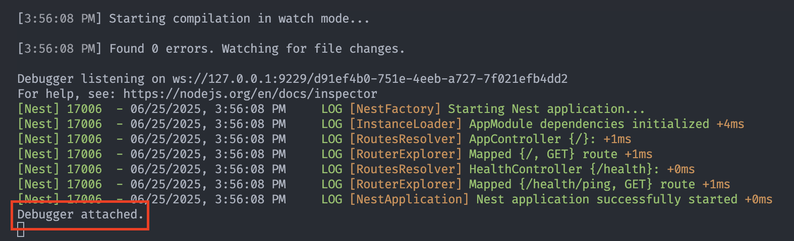
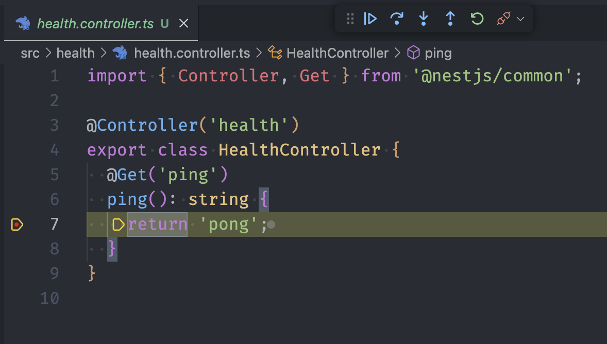

# REST API intro

## Wat is een API?

<iframe width="560" height="315" src="https://www.youtube-nocookie.com/embed/s7wmiS2mSXY?si=7u14hhoBHVRS5Rqk" frameborder="0" referrerpolicy="no-referrer" allowfullscreen></iframe>

Een **API (Application Programming Interface)** is een software-interface die het mogelijk maakt dat twee applicaties met elkaar kunnen communiceren. Dit in tegenstelling tot een User Interface, die mensen met software laat werken. Ze maken de overdracht van gegevens van systeem naar systeem mogelijk. API’s bieden een gestandaardiseerde toegang tot de applicatiegegevens.

### Voorbeeld van het gebruik van een API

Stel je voor dat je bezig bent met het ontwerp van een klantenbeheersysteem. In dit systeem wil je gegevens zoals klantnamen, adressen en koophistorie bijhouden. Daarnaast moeten verkopers de mogelijkheid hebben om klanten en hun bestellingen toe te voegen, te bewerken en te verwijderen.

Om deze gegevens op te slaan, heb je ervoor gekozen om gebruik te maken van een relationele databank. Om gebruikers in staat te stellen deze gegevens te bekijken en te beheren, overweeg je het gebruik van een webinterface.

Een benadering om dit te realiseren is het ontwikkelen van een monolithische applicatie, die op één server draait en gegevens ophaalt via database queries. Vervolgens worden HTML-pagina's gegenereerd en teruggestuurd naar de webbrowser. Dit is een veelgebruikte methode en zal later in de opleiding ook aan bod komen.

Echter, een alternatieve aanpak is om het systeem op te splitsen in twee afzonderlijke programma's. Eén programma (de **server**) beheert de gegevens en de toegang tot de database, terwijl het andere (de **client**) een webinterface biedt. Je kan deze keuze maken omdat je bv. ook een Android-applicatie wil aanbieden die dezelfde data aanspreekt, en je het servergedeelte wil hergebruiken. Het kan ook handig zijn als verschillende teams aan de ontwikkeling werken, om een zo het principe van "separation of concerns" af te dwingen.

Nu doemt de vraag op: hoe communiceren deze twee programma's met elkaar?

In theorie zou je SQL-query's (vanuit de client) over een netwerk kunnen verzenden en de resultaten kunnen ontvangen, maar al snel zul je inzien dat dit niet de beste aanpak is. Zelfs kleine wijzigingen in het databankschema zouden vereisen dat alle clients volledig herschreven moeten worden.

Daarom is het noodzakelijk om een efficiëntere methode te gebruiken om gegevens (en wijzigingen daarin) over het netwerk te verzenden, en **REST** is een van deze methoden.

## REST

**Representational state transfer (REST)** is een **architectuurstijl** waarmee software met andere software kan communiceren. De term werd geïntroduceerd en gedefinieerd in 2000 door Roy Fielding in zijn [doctoraatsstudie](http://www.ics.uci.edu/~fielding/pubs/dissertation/top.htm). REST wordt veelal gebruikt voor het ontwerpen van API's voor het internet. REST gebruikt de **HTTP-methoden (GET / POST / PUT /DELETE)** om data tussen een client en een server op te halen en te verzenden.

Met het HTTP-protocol kunnen REST API’s software op het ene apparaat laten praten met software op een ander apparaat (of op hetzelfde apparaat), zelfs als deze verschillende besturingssystemen en architecturen gebruiken. De client kan om **resources** vragen in een taal die de server begrijpt, en de server reageert met de resource in een taal die de client kan verwerken. De server retourneert de **resource** in **JSON** (JavaScript Object Notation), XML (Extensible Markup Language) of tekstindelingen, maar veel API’s ondersteunen responses in aanvullende talen.

### API requests

#### Resources

Het fundamentele concept van een RESTful API is de **resource**. Alle informatie die benoemd kan worden is een resource: een document, afbeelding, verzameling (= collection) van resources, niet-virtueel object (bv. een klant), enz. REST gebruikt een **resource identifier** om een resource te identificeren.

De resources bevinden zich in een **collectie**, die een verzameling van objecten representeert. De **Uniform Resource Identifier (URI)** verwijst naar een collectie, zoals bvb `/api/klanten` verwijst naar de verzameling van de klant objecten. Gebruik hiervoor een **zelfstandig naamwoord in het meervoud**. Gebruik GEEN actiemethodes (een werkwoord). De data is dus opgebouwd uit resources en collecties, maar het is geen relationele databank! Je bouwt zelf links tussen deze resources en collecties om de juiste informatie op te halen.

Bekijk onderstaand voorbeeld. Let op de opbouw van de databank (= ERD), van de URI bovenaan en van de response (geel). Je merkt een duidelijk verschil tussen het databankschema en de response. Het is dus niet altijd zo dat het databankschema overeenkomt met de response. De API-ontwikkelaar beslist hoe de response eruit ziet. Lek dus geen implementatiedetails in de response.


#### HTTP methods

Een HTTP request heeft naast een resource identifier ook altijd een **method**. Deze methods mappen perfect op de CRUD operaties, en worden als volgt gebruikt:

1. `GET`: Read - data opvragen
2. `POST`: Create - nieuwe data toevoegen
3. `PUT`: Update - data aanpassen
4. `DELETE`: Delete - data verwijderen

Voor de resource uit ons klantenvoorbeeld hebben we volgende URI's. Merk op dat een resource steeds onderdeel is van een collectie, in dit voorbeeld 'Klanten'.

| HTTP method en URI       | Resultaat                                  |
| ------------------------ | ------------------------------------------ |
| GET `/api/klanten`       | vraag een lijst van klanten op             |
| GET `/api/klanten/32`    | vraag informatie op van de klant met id 32 |
| POST `/api/klanten`      | voeg een klant toe                         |
| PUT `/api/klanten/145`   | wijzig de informatie van klant met id 145  |
| DELETE `/api/klanten/12` | verwijder klant met id 12                  |

Een ander voorbeeld: [de brewery API](https://www.openbrewerydb.org/documentation)

In de kern betekent REST dat je met collecties werkt met daarin resources, die je op een gestructureerde manier hebt opgebouwd, zodat de structuur voor iedere gebruiker helder is.

Bovendien kunnen resources gemanipuleerd worden door hun voorstelling. Als een client een **voorstelling** van een resource heeft (inclusief eventuele metadata), heeft hij genoeg om resources aan te passen en die wijzigingen terug door te sturen naar de API.

Er zijn nog een aantal HTTP request methods (PATCH, CONNECT, HEAD, OPTIONS, TRACE), maar die worden in de context van REST servers (bijna) niet gebruikt. PATCH kom je soms eens tegen, en OPTIONS wordt frequent gebruikt in de context van bv. CORS, maar dat is voor later.

#### POST vs PUT

Wat soms tot verwarring leidt is wanneer je POST en wanneer je PUT gebruikt.

Als je een nieuw enkelvoudig element toevoegt (bv. een klant), is het duidelijk dat je een POST gebruikt. Maar wat als je een nieuw element aan een lijst toevoegt (bv. een nieuw item in een bestelling)? Is dat een update van een bestaande lijst (PUT)? Of is dit een POST omdat een nieuw element toegevoegd wordt?

Soms lees je wel eens dat je een POST gebruikt als het request resulteert in een nieuwe entry in de databank, en anders een PUT. Maar dat impliceert dat je de databank layout kent, en daar wil je niet op steunen natuurlijk.

Als het een situatie is waar het niet vanzelfsprekend is wat je best gebruikt, doet het er niet echt toe ook. Technisch maakt het helemaal niets uit, het is gewoon een kwestie van afspraken. Het is wel belangrijk dat je eenduidig bent, niet de ene keer PUT en de andere keer POST voor eenzelfde situatie met een andere resource.

Gebruik in geen geval een GET, bv. `GET /employee/create?name=rudy&age=27`, zoals je pre-REST soms wel eens zag (of nu jammer genoeg nog altijd).

#### PUT vs PATCH

Ook het verschil tussen PUT en PATCH is niet altijd duidelijk.

PUT en PATCH zijn beide methodes om een resource aan te passen. Het verschil is dat PUT de volledige resource doorstuurt, terwijl PATCH enkel de gewijzigde velden doorstuurt. In het voorbeeld van onze klanten zal een PUT de hele klant doorsturen terwijl een PATCH bv. enkel de naam doorstuurt.

### API responses

De API-ontwikkelaar beslist welke formaten ze ondersteunen voor de response. Een server kan bijvoorbeeld reageren met JSON, XML of tekst. De API moet de mogelijkheid hebben om de response op te maken op basis van de behoeften van de client. In het voorbeeld van de klanten wordt JSON geretourneerd.

Voor de responses wordt ook steeds een **HTTP status code** gebruikt. Bij een succesvol request wordt er een 2xx HTTP status code teruggegeven:

| Code    | Status     | Beschrijving                                                                        |
| ------- | ---------- | ----------------------------------------------------------------------------------- |
| **200** | OK         | Het request is geslaagd.                                                            |
| **201** | Created    | Een resource is aangemaakt met een POST request. Het antwoord bevat een empty body. |
| **204** | No Content | Een PUT, PATCH of DELETE request slaagt. Het antwoord bevat een empty body.         |

Bij een foutmelding wordt een van de volgende status codes teruggegeven. Een code 4xx wordt gebruikt als de fout bij de client ligt, een code 5xx als de fout bij de server ligt.

| Code    | Status                | Beschrijving                                                                                                                              |
| ------- | --------------------- | ----------------------------------------------------------------------------------------------------------------------------------------- |
| **400** | Bad Request           | Het request is ongeldig (bv. foute parameters in URL of body).                                                                            |
| **401** | Unauthorized          | De authenticatie faalt, bv. door een onjuist wachtwoord of de client is simpelweg niet aangemeld.                                         |
| **403** | Forbidden             | De client is aangemeld maar heeft geen toegang tot de resource (= onvoldoende rechten).                                                   |
| **404** | Not Found             | De resource is niet gevonden.                                                                                                             |
| **405** | Method Not Allowed    | De HTTP method is niet toegelaten voor deze resource.                                                                                     |
| **406** | Not Acceptable        | De client heeft een accept header gestuurd die niet ondersteund wordt (bv. gevraagd om XML terwijl de server enkel JSON kan retourneren). |
| **429** | Too Many Requests     | De client heeft te veel requests gestuurd in een bepaalde tijdspanne.                                                                     |
| **500** | Internal Server Error | Er is een fout opgetreden aan de serverkant.                                                                                              |
| **501** | Not Implemented       | Het endpoint is niet geïmplementeerd.                                                                                                     |
| **503** | Service Unavailable   | De server is tijdelijk niet beschikbaar.                                                                                                  |

### REST architectuurstijl

REST is een reeks principes die een ontwikkelaar moet volgen voordat die zijn API als “RESTful” kan beschouwen. De principes zeggen niets over hoe de API moet worden geïmplementeerd.

<!-- markdownlint-disable ol-prefix -->

1. **Uniforme interface**: een request identificeert een **resource**, door gebruik te maken van **URI's**. Er zijn vier architecturale beperkingen nodig om het gedrag van componenten vast te leggen:

- Identificatie van resources.
- Manipulatie van resources door representations (JSON, XML...).
- Zelf-omschrijvende berichten.
- Hypermedia als de drijvende kracht van de applicatie status. De applicatie in deze context is de web applicatie die je server draait, hypermedia de hyperlinks/links die de server meestuurt in het antwoord.

2. **Client/server-architectuur**: de clients van de API gebruiken HTTP calls om een resource te vragen (een GET-methode) of data naar de server te sturen (een PUT, POST of DELETE-methode). De client moet voldoende hebben aan de verschillende URI's voor alle resources. De documentatie van de API bevat de beschikbare URI's/methoden die door de API worden ondersteund. De client en de server moeten onafhankelijk van elkaar kunnen evolueren. Door de gebruikersinterface te scheiden van de opslag, kan een gebruikersinterface voor meerdere platformen gebouwd worden.

3. **Stateless**: een stateless applicatie houdt geen verbinding in stand en slaat geen informatie op tussen requests van dezelfde client. Een client doet een request, de API voert de actie uit die in het request is gedefinieerd en reageert. Zodra de API reageert, verbreekt hij de verbinding en bewaart hij geen informatie over de client in het actieve geheugen. De API behandelt elke request als een eerste request. Dit betekent dat ieder request van client naar server alle nodige informatie moet bevatten om het verzoek te begrijpen en kan geen gebruik maken van enige opgeslagen context op de server. De sessie-status wordt volledig op de client opgeslagen.

4. **Cacheable**: een REST API moet caching van vaak gevraagde data mogelijk maken. Om bandbreedte, vertraging (= latency) en serverbelasting te verminderen moet een API identificeren wat cacheable resources zijn, wie ze kan cachen en hoelang ze in de cache kunnen blijven. Goede caching maakt dat de server beter schaalt (want minder requests te verwerken) én dat de client sneller reageert. Als een antwoord cacheable is, krijgt de client rechten om het antwoord opnieuw te gebruiken voor latere, soortgelijke verzoeken.

5. **Gelaagd systeem**: een API kan meerdere lagen hebben, zoals proxyservers of load balancers, en de eindpuntserver kan extra servers inzetten om een response te formuleren. De client weet niet welke server op het request reageert. Met een gelaagd systeem is een API eenvoudiger uit te breiden en dus schaalbaarder. Bijvoorbeeld: de API staat op Server A, de data op Server B en de authenticatie wordt afgehandeld op Server C. Het grote voordeel is dat de servers onafhankelijk van elkaar kunnen schalen, bv. één grote, zware databankserver met daarvoor een aantal kleine, lichtere API servers.

<!-- markdownlint-enable ol-prefix -->

### REST clients

#### GET

GET requests kan je altijd eenvoudig testen. Typ de URL in de adresbalk van de browser en je browser toont het resultaat.

Probeer bijvoorbeeld eens het weer in Gent (of jouw gemeente/stad) op te vragen via: <http://wttr.in/Gent?format=j1>.

#### POST/PUT

POST en PUT requests zijn iets lastiger te testen. Meestal moet je hier ook data meesturen in de body van de requests en dat kan niet zo eenvoudig in de browser. Uiteindelijk is het natuurlijk de bedoeling dat de API via de client (een programma) aangesproken wordt. Echter als je aan het ontwikkelen bent, is het handig om software te hebben die alle soorten requests kan genereren. Dit is zeker handig als er iets niet werkt, op die manier kan je testen of het probleem zich voordoet in de front- of back-end.

Een vaak gebruikt programma hiervoor is [Postman](https://www.postman.com). Recent kwam [Postman met een extensie voor VS Code](https://marketplace.visualstudio.com/items?itemName=Postman.postman-for-vscode). Er zijn natuurlijk nog alternatieven zoals bv. [Insomnia](https://insomnia.rest/), [Bruno](https://www.usebruno.com/) (ziet er veelbelovend uit) of [Thunder Client](https://marketplace.visualstudio.com/items?itemName=rangav.vscode-thunder-client) (een extensie voor VSCode). Als je de [nodige software](../0-intro/software.md) reeds geïnstalleerd hebt, dan heb je Postman reeds op je systeem staan.

#### Postman

Postman is ooit begonnen als een simpele applicatie om API's te testen maar is ondertussen enorm gegroeid en een heus platform geworden. Je kan samenwerken met anderen en allerlei automatisaties uitvoeren. Het is zowel als losstaande applicatie als in een browser bruikbaar. Maar je kan gelukkig nog altijd gewoon wat requests uitvoeren, al heb je tegenwoordig wel een account nodig om iets te kunnen doen.

Laten we een POST request uitvoeren in Postman. Kies de juiste method en typ de URL in het veld. We gebruiken hier een publieke API om afbeeldingen te generen:
<https://kroki.io/plantuml/png>.

Vervolgens moeten we nog onze data in de body doorsturen. Kies in bij het tabblad `Body` voor `raw` en wijzig `JSON` naar `text`.


Uiteindelijk komt in de body de UML code te staan (kopieer gerust, code staat onder de afbeelding!). Dit is de beschrijving voor een simpel use case diagram in PlantUML syntax. Klik op `Send` en je zou hetzelfde use case diagram moeten zien.


```text
@startuml
left to right direction
skinparam packageStyle rectangle
skinparam monochrome true
actor customer
actor clerk
rectangle "Check out" {
  customer -- (checkout)
  (checkout) .> (payment) : include
  (help) .> (checkout) : extends
  (checkout) -- clerk
}
@enduml
```

## 3rd party API's

Vaak worden API's en de client samen ontwikkeld, en een API leren ontwikkelen is in eerste instantie waar deze cursus over gaat. Natuurlijk zijn er ook veel API's die op zich aangeboden worden en door (vele) verschillende clients gebruikt worden, zoals bv. weersvoorspellingen, beursdata...

Soms zijn API's volledig gratis, soms volledig betalend, maar heel vaak daar ergens tussenin (bv. eerste XXX requests, eerste x maanden gratis, en dan €YYY per 1000 requests). Als ze (deels) betalend zijn, komt er autorisatie bij kijken: om je te kunnen laten betalen, moet de API weten wie je bent en welke requests je doet natuurlijk. Daarover later meer, maar we kennen nu al genoeg om een oefening te maken met een publieke API.

Een mooi voorbeeld van publieke API's zijn de 100+ datasets die de stad Gent aanbiedt als open data, van de bezetting van de parkeergarages tot de locatie van de grazende schapen: [https://data.stad.gent/explore/](https://data.stad.gent/explore/?disjunctive.keyword&disjunctive.theme&sort=modified).

Maar er zijn nog veel meer publieke API's natuurlijk! Een uitgebreide (niet exhaustieve) lijst van publiek beschikbare API's kan je hier vinden: <https://github.com/public-apis/public-apis>.

### Oefening

- Gebruik Postman om most wanted list van de FBI op te vragen.
  - Stuur hiervoor een GET request naar <https://api.fbi.gov/wanted/v1/list>
- Gebruik <https://kroki.io/erd/svg> om onderstaand ERD te creëren.
  - Als je via de browser klikt op de link is het logisch dat je een 405 krijgt, je moet een POST uitvoeren via Postman.


- Oplossing +

  ```erd
  [Klant]
  *id
  +persoonId
  +adresId

  [Adres]
  *id
  straat
  nr
  +stadId

  [Stad]
  *id
  postcode
  naam

  [Persoon]
  *id
  voornaam
  naam

  Klant 1--1 Adres
  Klant 1--1 Persoon
  Adres *--1 Stad
  ```

## API routes beveiligen

Sommige API's zijn door iedereen vrij te gebruiken, zoals de FBI most wanted, maar heel vaak is dat niet zo.
Er zijn in essentie twee redenen om een API call af te schermen

- er zit gevoelige data achter die slechts één iemand of een beperkt aantal personen mag zien (neem bijvoorbeeld een Facebook feed)
- de API aanbieden / beschikbaar stellen kost geld en de toegang moet dus gecontroleerd / gemeten worden

Als data persoonlijk is wordt er meestal met een **login** systeem gewerkt (en tokens of cookies). Daarover in een later hoofdstuk (veel) meer. Maar als het gaat om te traceren hoe vaak een API gebruikt wordt is een login systeem niet echt een optie.

Stel bijvoorbeeld dat jouw applicatie onderliggend Google Maps gebruikt. Het is niet echt realistisch dat iedereen die jouw applicatie gebruikt eerst met jouw credentials zou moeten inloggen of iets dergelijks. Voor zo'n use cases maakt men vaak gebruik van **API keys**.

### API keys

Er valt veel te zeggen over hoe API keys opgebouwd worden en werken, maar dat valt een beetje buiten de scope van deze cursus. Maar we willen toch een aantal best practices meegeven voor diegenen die een 3rd party API verwerken in hun opdracht.

Simpel gezegd is een API key een soort random string die je identificeert en die niet kan geraden worden. Dus als iemand jouw API key heeft, kan hij zich als jou voordoen (en dus op jouw kosten een API gebruiken).

Steek dus nooit een API key in de client. Maak daarentegen requests naar je eigen API, en doe de third party access vanaf je eigen server. Hardcode nooit een API key in je code (sla op in een apart bestand dat niet in git opgenomen is). Gebruik access control als je API key dat toelaat (bij Google kan je bijvoorbeeld een key enkel laten werken vanaf bepaalde domeinen vanuit of vanuit bepaalde apps).

[Hier kan je meer info vinden over de best practices voor het gebruik van Google API keys](https://cloud.google.com/docs/authentication/api-keys), maar hetzelfde geldt voor de keys van andere services.

## REST - Een uitgewerkt voorbeeld

Doorheen de jaren merken we dat vaak dezelfde fouten gemaakt worden bij het ontwerpen van API's voor de examenopdracht. In deze sectie werken we een extra voorbeeld uit, dit staat los van de applicatie die we later in de cursus zullen maken. Het dient louter als voorbeeld voor de veelgemaakte fouten.

In dit extra voorbeeld maken we een applicatie waarmee hobbykoks recepten kunnen opslaan en delen met elkaar. Koks kunnen daarbij recepten van andere koks opslaan om bv. later eens uit te proberen.

### Entiteiten

We hebben drie entiteiten met volgende attributen:

- User
  - firstName
  - lastName
  - address
- Recipe
  - name
- Ingredient
  - name
  - amount
  - unit

### Relaties

We onderscheiden volgende relaties:

- Een gebruiker heeft meerdere opgeslagen recepten (niet verplicht om er te hebben)
- Een recept wordt toegevoegd door één gebruiker, een gebruiker kan meerdere recepten toevoegen
- Een recept heeft meerdere ingrediënten
- Een ingrediënt hoort maar bij één recept

### Veelgemaakte fouten

Door de jaren heen merkten we een aantal terugkomende fouten in het ontwerp van applicaties die gemaakt werden voor onze examenopdracht. We sommen ze hier even op:

- Geen tussentabel voor een veel-op-veel relatie
  - Zie cursus Databases I
- Geen foreign key voor een een-op-veel relatie
  - Zie cursus Databases I
- Samengestelde sleutels i.p.v. een uniek id
  - Eerder praktische afwijking van de cursus Databases I
  - Samengestelde sleutels zijn niet fout, maar in sommige gevallen onhandig in URLs van de API calls
- Adres/locatie als string in een tabel
  - Dit is in principe geen fout, maar het maakt het wel lastiger om queries uit te voeren op het adres
- ERD niet voldoende om doel van de applicatie te verwezenlijken
  - Dit is puur een ontwerpfout
  - Denk vooraf goed na over de functionaliteiten van je applicatie en wat je daarvoor nodig hebt in de databank
- Geen API call definities
  - Dit is ook een ontwerpfout, maar eerder op het niveau van documentatie
  - Denk vooraf goed na over de functionaliteiten van je applicatie en welke API calls je daarvoor nodig hebt
- GET all request geeft alle relaties van een entiteit terug
  - Dit is vaak onnodig en kan de databank onnodig belasten
  - In sommige gevallen is het wel nuttig, het hangt allemaal af van de verwachtingen van de client
  - Aangezien je zelf de client ontwerpt in Front-end Web Development, kan je dit zelf bepalen o.b.v. wat je toont in bijvoorbeeld lijsten of tabellen van die entiteit

### ERD met veelgemaakte fouten

Onderstaand ERD zou een oplossing zijn voor onze receptenapplicatie, vol met bovenstaande veelgemaakte fouten:


- Broncode +

  Onderstaande code werd hiervoor gebruikt:

  ```erd
  [Recipe]
  *name

  [Ingredient]
  *name
  amount
  unit

  [User]
  *id
  firstName
  lastName
  address

  User 1--* Recipe
  Recipe 1--* Ingredient
  User *--* Recipe
  ```

Wat is er fout aan dit ERD?

### ERD

Een mogelijke oplossing ziet eruit als volgt:


- Broncode +

  Onderstaande code werd gebruikt voor de oplossing:

  ```erd
  [Recipe]
  *id
  name
  +createdBy

  [Ingredient]
  *id
  name
  amount
  unit
  +recipeId

  [User]
  *id
  firstName
  lastName
  street
  number
  postalCode
  city

  [SavedRecipe]
  *+userId
  *+recipeId

  User 1--* Recipe
  Recipe 1--* Ingredient
  User 1--* SavedRecipe
  SavedRecipe *--1 Recipe
  ```

Je merkt nog een samengestelde sleutel in SavedRecipe. Het kan wel nuttig zijn om geen samengestelde sleutels te gebruiken, dat is persoonlijke voorkeur. In dat geval bevat de tabel SavedRecipe ook een id, naast de `userId` en `recipeId`.

Qua invoer via de API calls heeft dit weinig invloed. Een gebruiker zal altijd aangemeld zijn en dus kennen we altijd het `userId`, het `recipeId` wordt meegegeven via de API call.

De code voor het opslaan van een recept kan wel complexer worden. Met samengestelde sleutels zal de databank een fout gooien als je tweemaal hetzelfde recept wil opslaan. Je moet vervolgens zelf deze error parsen, dat kan lastig zijn afhankelijk van de gekozen databank en/of client library. Zonder samengestelde sleutels moet je zelf checken of een recept al dan niet dubbel opgeslagen wordt.

Algemene regel: laat zoveel mogelijk door je databank afhandelen. Deze zijn hiervoor geoptimaliseerd en doen dergelijke checks razendsnel (en sparen extra queries).

### API calls

Hieronder lijsten we de vereiste functionaliteiten van de applicatie op. Denk even na (niet meteen verder scrollen/kijken) en definieer de nodige API calls (volgens de REST principes) om deze functionaliteiten te implementeren.

- Een gebruiker moet alle recepten kunnen bekijken.
- Een gebruiker moet een recept in detail kunnen bekijken (met zijn ingrediënten dus).
- Een gebruiker moet een recept kunnen toevoegen/aanpassen/verwijderen.
- Een gebruiker moet de ingrediënten van een recept kunnen bekijken.
- Een gebruiker moet een ingredient van een recept kunnen toevoegen/aanpassen/verwijderen.
- Een gebruiker moet zijn opgeslagen recepten kunnen bekijken.

#### Recipe

- `GET /api/recipes`: alle recepten zonder ingrediënten, evt. met de gebruiker die het recept toegevoegd heeft
- `GET /api/recipes/:id`: één recept met ingrediënten én de gebruiker die het recept toegevoegd heeft
- `POST /api/recipes`: recept toevoegen met/zonder zijn ingrediënten
  - Of je de ingrediënten in dezelfde call toevoegt of in een aparte call is een ontwerpbeslissing
  - Dat hangt vaak af van de opbouw van de front-end, kijk wat het handigst is voor jouw geval
- `PUT /api/recipes/:id`: recept aanpassen
- `DELETE /api/recipes/:id`: recept verwijderen
- `GET /api/recipes/:recipeId/ingredients`: alle ingrediënten van een recept ophalen
- `POST /api/recipes/:recipeId/ingredients`: een ingrediënt toevoegen aan een recept
- `PUT /api/recipes/:recipeId/ingredients/:id`: een ingrediënt van een recept aanpassen
- `DELETE /api/recipes/:recipeId/ingredients/:id`: een ingrediënt van een recept verwijderen

#### User

- `GET /api/users/:id/recipes`: opgeslagen recepten opvragen
  - Soms wordt ook `GET /api/users/me/recipes` gedaan als je toch aangemeld moet zijn, het id van de gebruiker zit nl. in de token (hierover later meer)

Lees ook de [REST API Design Best Practices for Sub and Nested Resources](https://www.moesif.com/blog/technical/api-design/REST-API-Design-Best-Practices-for-Sub-and-Nested-Resources/).

## Server

We willen natuurlijk niet gewoon bestaande API's aanspreken maar zelf zo'n API server maken. Een web server is op zich geen magie. Het is gewoon een programma dat luistert op een bepaalde poort, HTTP requests parset en beschikbaar stelt. Aangezien HTTP requests altijd hetzelfde zijn, schrijft niemand compleet van nul een webserver (behalve als interessante oefening eens). Je kan in elke programmeertaal een server schrijven, wij kiezen JavaScript en dus [Node.js](https://nodejs.org/en).

> Tegenwoordig bestaan ook andere JavaScript runtimes zoals [Deno](https://deno.land/) en [Bun](https://bun.sh/), maar Node.js is nog steeds [de meest gebruikte](https://2023.stateofjs.com/en-US/other-tools/#runtimes).

### Node.js

**Node.js** is server-side JavaScript, het kwam uit in 2009. Het is een single-threaded, open source, platformonafhankelijke runtime-omgeving gebouwd bovenop v8, de JavaScript engine van Chrome (werd open source in 2008). Meer info op <https://kinsta.com/nl/kennisbank/wat-is-node-js/>.

**NPM** is het package ecosysteem van Node.js. Het is het grootste ecosysteem van alle open source bibliotheken ter wereld, met meer dan 1 miljoen pakketten en het groeit nog steeds. NPM is gratis te gebruiken en duizenden open source ontwikkelaars dragen er dagelijks aan bij.

Voor het bouwen van web API's wordt er meestal een framework gebruikt en geen 'naakte' Node.js. Express is waarschijnlijk de meest gekende en meest gebruikte, maar krijgt nog weinig tot geen updates. Wij gebruiken in deze cursus [Koa](https://koajs.com/), het nieuwe hippe framework van hetzelfde team achter Express.

## Koa

Allereerst maken we een nieuw project aan. Maak een nieuwe map aan en ga naar deze map.

```bash
mkdir webservices-budget
cd webservices-budget
```

Vervolgens initialiseren we een nieuw Yarn project. Je bent vrij om te kiezen voor alternatieven zoals [npm](https://www.npmjs.com/package/npm) of [pnpm](https://pnpm.io/), maar we gebruiken hier [Yarn](https://yarnpkg.com/). [Yarn](https://yarnpkg.com/) is het programma dat alle dependencies zal installeren, een andere misschien iets bekendere is [npm](https://www.npmjs.com/package/npm). Ze doen beide hetzelfde en zijn inwisselbaar maar de ene keer `yarn` gebruiken en de andere keer `npm` is dan weer geen goed idee. Ze kunnen andere versies van packages cachen e.d. en dan kan je rare fouten tegenkomen.

```bash
yarn init -p
```

Vervolgens kies je de meeste recente versie van Yarn (v4 op dit moment).

```bash
yarn set version berry
```

Vervolgens maken we een `.yarnrc.yml` bestand aan in de root van je project. Dit bestand bevat de configuratie voor Yarn 2. In dit bestand zetten we de `nodeLinker` op `node-modules`. Dit zorgt ervoor dat Yarn 2 de packages installeert in de `node_modules` map. Er zjn nog andere opties, maar deze is de meest gebruikte en de meest compatibel met bestaande projecten. Voeg volgende lijn toe aan `.yarnrc.yml`:

```yaml
nodeLinker: node-modules
```

Ten laatste installeer je Koa.

```bash
yarn add koa
```

### package.json

De [package.json](https://docs.npmjs.com/cli/v10/configuring-npm/package-json) bevat alle metadata van ons project, meer in het bijzonder alle dependencies en commando's om onze app te starten. Het `yarn init` commando zou een `package.json` gemaakt moeten hebben in de root van je project. Open deze, vul verder aan:

[package.json](examples/package.json ':include :type=code')

De `package.json` bevat enkele properties:

- `name`: de naam van het project
- `version`: de versie van het project
- `description`: een korte beschrijving van het project
- `main`: het entry point van de applicatie
- `repository`: de URL van de git repository
- `author`: de auteur van de applicatie
- `license`: de licentie van de applicatie
- `private`: of de applicatie publiek is of niet, npm zal bv. niet toelaten om een private package te publiceren
- `dependencies`: de packages waarvan deze applicatie gebruik maakt
- `devDependencies`: packages enkel nodig in development (en dus niet in productie)
- `scripts`: laten toe om een soort van shortcuts te maken voor scripts (bv. de applicatie starten, testen, builden voor productie, etc.)
- `packageManager`: de package manager die gebruikt wordt (in dit geval Yarn)

Met een simpele `yarn install` installeren we meteen een identieke omgeving (met zowel `dependencies` als `devDependencies`) en dat maakt het handiger om in een team te werken (`yarn install --prod` installeert enkel de `dependencies`).

Het verschil tussen `dependencies` en `devDependencies` is het moment wanneer ze gebruikt worden. De `dependencies` zijn nodig in productie, m.a.w. de applicatie kan niet werken zonder deze packages. De `devDependencies` zijn enkel nodig om bv. het leven van de developer makkelijker te maken (types in TypeScript, linting, etc.) of bevatten packages die enkel gebruikt worden _at build time_, of dus wanneer de applicatie (bv. door webpack) omgevormd wordt tot iets wat browsers begrijpen.

Dependencies maken gebruik van [semantic versioning](https://semver.org/) (lees gerust eens door de specificatie). Kort gezegd houdt dit in dat elk versienummer bestaat uit drie delen: `MAJOR.MINOR.PATCH`, elke deel wordt met één verhoogd in volgende gevallen:

- `MAJOR`: wijzigingen die **_niet_** compatibel zijn met oudere versies
- `MINOR`: wijzigen die **_wel_** compatibel zijn met oudere versies
- `PATCH`: kleine bugfixes (compatibel met oudere versies)

In een `package.json` zie je ook vaak versies zonder prefix of met een tilde (~) of hoedje (^) als prefix, dit heeft volgende betekenis:

- geen prefix: exact deze versie
- tilde (~): ongeveer deze versie (zie <https://docs.npmjs.com/cli/v6/using-npm/semver#tilde-ranges-123-12-1>)
- hoedje (^): compatibel met deze versie (<https://docs.npmjs.com/cli/v6/using-npm/semver#caret-ranges-123-025-004>)

Kortom, een tilde is strenger dan een hoedje.

Het lijkt misschien een beetje raar, maar zo'n `package.json` wordt voor vele toepassingen en frameworks gebruikt. JavaScript programmeurs zijn gewoon van een `git pull`, `yarn install` en `yarn start` te doen, zonder per se te moeten weten hoe een specifiek framework opgestart wordt.

We hebben in bovenstaand voorbeeld een start-script toegevoegd dat je kan gebruiken om de server te starten. Kopieer de `scripts` naar jouw `package.json`. Dit script kan je nu uitvoeren met `yarn start`.

Er zijn nog heel wat andere opties voor de `package.json`. Je vindt alles op <https://docs.npmjs.com/cli/v10/configuring-npm/package-json>.

### yarn.lock en .yarn map

Wanneer je een package installeert, zal yarn een `yarn.lock` bestand aanmaken. Dit bestand bevat de exacte versies van de packages die geïnstalleerd zijn. Dit bestand moet je zeker mee opnemen in je git repository. Dit zorgt ervoor dat iedereen exact dezelfde versies van de packages gebruikt.

Dit bestand vermijdt versieconflicten aangezien in de `package.json` niet altijd de exacte versie staat maar een bepaalde syntax die aangeeft welke versies toegelaten zijn (zie vorige sectie).

Yarn zal ook een `.yarn` map aanmaken. Deze map bevat de geïnstalleerde versie van Yarn en wordt door [Corepack](https://nodejs.org/api/corepack.html) gebruikt om de packages te installeren. Deze map moet je niet opnemen in je git repository.

### .gitignore

Voor we verder gaan, maken we nog een `.gitignore` bestand aan. Dit bestand zorgt ervoor dat bepaalde bestanden/mappen niet naar GitHub gepusht worden. Dit is bv. handig voor de `node_modules` map, die we niet willen pushen omdat deze heel groot is en we deze niet nodig hebben om de applicatie te laten werken. Je kan nl. de dependencies eenvoudig opnieuw installeren d.m.v. `yarn install`.

Download de `.gitignore` van <https://github.com/github/gitignore/blob/main/Node.gitignore> en plaats deze in de root van je project. Het is belangrijk dat je het bestand exact de naam `.gitignore` heeft.

Kijk gerust eens welke bestanden er allemaal genegeerd worden. Je kan dit bestand ook aanpassen naar eigen wens, maar dit is een vrij complete voor een Node.js project.

### De obligate Hello World

Maak een bestand `index.js` aan in de root van de map die je net gemaakt hebt. Plak onderstaande code in het bestand.

```js
// index.js
const Koa = require('koa'); // 👈 1
const app = new Koa(); // 👈 1

app.use(async (ctx) => {
  // 👇 3
  ctx.body = 'Hello World';
});

app.listen(9000); // 👈 2
```

1. We importeren Koa en initialiseren een Koa object, i.e. een webserver.
   - Je hoeft deze syntax van importeren niet te onthouden, later schakelen we over naar TypeScript.
2. We laten de applicatie luisteren op poort 9000.
3. We geven als body de string "Hello World" terug (voor elke request).
4. Dit kunnen we testen door `node index.js` uit te voeren in een terminal in deze map. Surf vervolgens naar <http://localhost:9000>.
   - Het is perfect normaal als je geen uitvoer krijgt in de terminal, dat komt later.
   - Mocht je een conflict krijgen op poort 9000, bv. door een andere applicatie die op die poort luistert, kan je de poort aanpassen in de code en opnieuw uitvoeren. Dit geeft telkens de error code `EADDRINUSE` (Address already in use) in de terminal.

## Middleware

Koa is niet meer dan een grote 'ketting' van zogeheten middleware functies. Het idee is dat je allemaal verschillende functies definieert die elk een (kleine) taak op zich nemen, en dat die functies in een bepaalde volgorde geïnstalleerd worden in de Koa applicatie.

Elke middleware functie voert dan zijn deel van het werk uit en roept vervolgens gewoon de `next`-functie aan. De volgende functie kan dan verder werken met het bewerkte resultaat tot nu toe, tot de laatste middleware, die het antwoord terug geeft.


Pas `index.js` aan.

```js
// index.js
const Koa = require('koa');

const app = new Koa();

// 👇 1 en 2
app.use(async (ctx, next) => {
  ctx.body = 'Hello World';
  await next();
});

app.use(async (ctx, next) => {
  // 👇 3
  console.log(ctx);
  await next();
});

app.listen(9000);
```

1. Via `app.use` kan je een middleware installeren in de applicatie. De meegegeven functie is wat men de middleware noemt.
2. De middleware-functie heeft twee parameters: `ctx` en `next`. `ctx` is het context object, dat alle info bevat over de request en de response. `next` is een functie die de volgende middleware in de ketting aanspreekt.
3. We kunnen bijvoorbeeld het context object eens loggen nadat we de body gezet hebben. Stop het vorige commando in de terminal en voer opnieuw `node index.js` uit. Ga naar de browser en refresh om het resultaat te zien in de terminal.
   - Nadien kan je deze middleware terug verwijderen, we hebben deze enkel toegevoegd om te tonen hoe de `next`-functie werkt.

Koa doet heel wat werk voor ons doet, zoals bv. het request omzetten naar een geparsed object met alle info.

Onze server maken is nu zo'n heleboel middlewares installeren en zelf schrijven om elke request te verwerken.

### Middlewares in Koa

Middlewares in Koa zijn een beetje specialer dan in bijvoorbeeld Node.js of Express. In Koa is het mogelijk om tweemaal in elke middleware te komen:

1. eens vóór de aanroep van `next()`
2. én eens ná de aanroep van `next()`

Dit is wat men het **onion model** noemt:


Het request komt binnen en alle middlewares worden in volgorde van definitie uitgevoerd. Elk van deze middlewares roept vervolgens `next()` aan om de volgende middleware in rij uit te voeren. Uiteindelijk komt men ooit aan de laatste middleware en dan keert Koa terug in omgekeerde volgorde doorheen alle middlewares. Dit is standaardgedrag van Promises in JavaScript, dus eigenlijk doet Koa hier niets speciaals voor.

Het is dus eenvoudig om iets voor en na `next()` uit te voeren:

```js
app.use(async (ctx, next) => {
  // doe iets vooraf
  await next();
  // doe iets achteraf
});
```

Hierbij is de `await` heel belangrijk! Als je deze vergeet, zal de code achter `next()` meteen uitgevoerd worden.

Wil je niets meer doen in de middleware, dan doe je beter `return next()`. Deze middleware zal dan automatisch overgeslagen worden.

Het mooie aan dit geheel is dat Koa hiervoor niets speciaal hoeft te doen: dit is het standaardgedrag van Promises.

## TypeScript

Nu is het tijd om over te schakelen naar TypeScript. Daarvoor moeten we eerst een aantal packages installeren als dev dependencies (zie `--dev` optie). We hebben deze packages enkel nodig in development, voor productie wordt TypeScript omgezet naar JavaScript.

```bash
yarn add --dev typescript tsx @types/node
```

- [`typescript`](https://www.npmjs.com/package/typescript): de TypeScript transpiler
- [`tsx`](https://www.npmjs.com/package/tsx): TypeScript runtime
  - Dit is nodig om eenvoudig TypeScript te kunnen uitvoeren zonder het telkens te moeten vertalen naar JavaScript.
  - Vroeger werd [`ts-node`](https://www.npmjs.com/package/ts-node) gebruikt, maar [`tsx`](https://www.npmjs.com/package/tsx) is sneller en eenvoudiger.
- [`@types/node`](https://www.npmjs.com/package/@types/node): TypeScript definities voor Node.js
  - Dit is nodig om TypeScript te laten weten wat er allemaal in Node.js zit.
  - Later zal duidelijk worden wanneer je wel en niet een `@types` package nodig hebt.

Vervolgens converteren we `index.js` naar `index.ts`, wijzig de extensie van het bestand en pas de code aan.

```ts
// index.ts
import Koa from 'koa'; // 👈 1

const app = new Koa();

app.use(async (ctx) => {
  ctx.body = 'Hello World from TypeScript'; // 👈 2
});

app.listen(9000);
```

1. Een package importeren in TypeScript gebeurt met `import` in plaats van `require`. Deze syntax is intuïtiever en is de standaard in moderne JavaScript (= ES modules).
2. Voor de duidelijk passen we onze string aan naar "Hello World from TypeScript".

Pas ook het `start` script in `package.json` aan. Het handige aan `tsx` is dat de argumenten van het commando identiek zijn aan die van het `node` commando, dat is lekker makkelijk.

```json
{
  "scripts": {
    "start": "tsx index.ts"
  }
}
```

Stop de web server, indien deze nog draait, en start deze opnieuw met `yarn start`. Ga naar <http://localhost:9000> en je zou nog steeds "Hello World from TypeScript" moeten zien.

### Types

Je hebt misschien al een info-bericht gekregen in VS Code (als je de Error Lens extensie gebruikt). Zo niet, hover eens met je muis over `'koa'` in de import statement. Je zou een tooltip moeten zien met de melding "Could not find a declaration file for module 'koa'".

Dit komt omdat het `koa` package geen types voorziet. Dit is geen probleem, maar het is wel handig om types te hebben. Gelukkig zijn er voor de meeste packages types beschikbaar op [DefinitelyTyped](https://definitelytyped.org/). Tegenwoordig daalt wel het aantal packages waarvoor je dit soort packages moet installeren, maar met oudere packages kan het nog wel eens voorkomen (lees: packages van voor de populariteit van TypeScript).

Deze types kan je installeren met:

```bash
yarn add --dev @types/koa
```

Herinner je: types hebben we enkel nodig in development. Daarom installeren we deze als dev dependency m.b.v. de `--dev` optie.

Nu zou de melding in VS Code verdwenen moeten zijn. Als je nu hovert over `ctx`, zou je ook een tooltip moeten zien met het type van `ctx`. Je kan altijd eens Ctrl-klikken op de `use`-functie om eens te kijken naar de definitie van deze functie en diens parameters.

### Configuratie

Om TypeScript in te stellen, hebben we een `tsconfig.json` nodig. Dit bestand bevat de configuratie voor de TypeScript transpiler. Hiermee kan je bijvoorbeeld instellen hoe strikt TypeScript moet checken op types.

Maak een nieuw `tsconfig.json` bestand met het commando `yarn tsc --init` en bekijk de mogelijke opties.

Wij hebben een goede start voor het `tsconfig.json` samengesteld. Vervang de inhoud van het `tsconfig.json` bestand door onderstaande code. Typisch ga je steeds van hetzelfde basisbestand vertrekken en dit aanpassen naargelang je project. Meestal is de configuratie binnen bv. een bedrijf identiek, of heb je als developer een eigen configuratie die je steeds hergebruikt.


De belangrijkste basis `compilerOptions` zijn:

- `target`: de versie van JavaScript die de transpiler moet genereren
- `module`: het module systeem dat gebruikt wordt (voor imports en exports)
- `resolveJsonModule`: of JSON files als modules gezien moeten worden (of je dus JSON kan importeren)
- `outDir`: de map waar de gegenereerde JavaScript bestanden terecht komen
- `removeComments`: of comments verwijderd moeten worden in de gegenereerde JavaScript bestanden
- `newline`: welke newline character gebruikt moet worden in de gegenereerde JavaScript bestanden
- `noEmitOnError`: of er geen JavaScript gegenereerd moet worden als er errors zijn
- `esModuleInterop`: of ES modules en CommonJS modules gemixt mogen worden, zorgt voor betere compatibiliteit met bestaande CommonJS modules
- `forceConsistentCasingInFileNames`: of de bestandsnamen consistent moeten zijn (case sensitive)

Daarnaast heb je nog een heleboel andere `compilerOptions` specifiek gericht op het typeren van je code:

- `strict`: of alle strictness opties aan moeten staan, dit is een shortcut voor alle onderstaande opties
  - `noImplicitAny`: verbied dat variabelen impliciet van het type `any` zijn, en dus geen duidelijk type hebben
  - `noImplicitThis`: idem maar voor `this`
  - `alwaysStrict`: print `"use strict"` in elke JavaScript module
  - `strictBindCallApply`: zorgt ervoor dat de `bind`, `call` en `apply` methodes van functies correct getypeerd zijn
  - `strictNullChecks`: zorgt ervoor dat `null` en `undefined` niet toegewezen kunnen worden aan een variabele zonder expliciet te zeggen dat dit mag
  - `strictFunctionTypes`: zorgt ervoor dat functieparameters dieper gecontroleerd worden
  - `strictPropertyInitialization`: zorgt ervoor dat alle properties van een klasse geïnitialiseerd zijn in de constructor
  - `useUnknownInCatchVariables`: zorgt ervoor dat de catch variabele van een `try-catch` blok van het type `unknown` is, hierdoor moet je expliciet het type error checken voor je die kan afhandelen
- `noUnusedLocals`: of variabelen die niet gebruikt worden een error moeten geven
- `noUnusedParameters`: idem maar voor parameters
- `exactOptionalPropertyTypes`: definieert of je `undefined` moet toelaten als waarde voor optionele properties
- `noImplicitReturns`: of elke code branch een return statement moet hebben
- `noFallthroughCasesInSwitch`: of je `break` moet gebruiken in een `switch` statement
- `noUncheckedIndexedAccess`: zorgt ervoor dat je niet zomaar een key kan gebruiken op een object zonder expliciet te zeggen dat deze key in het object zit
- `noImplicitOverride`: of je expliciet moet aangeven dat je een methode overschrijft

Je ziet dat we heel wat opties voor types ingeschakeld hebben. Dit is een goede gewoonte, zo ben je zeker dat je code correct is en je geen onverwachte bugs tegenkomt. Natuurlijk is het zeer eenvoudig om alle opties uit te schakelen, maar dan verlies je de voordelen van TypeScript. Wees dus niet bang om TypeScript streng te maken. Lees de foutmeldingen over types en probeer ze op te lossen, zo leer je het snelst.

In de `tsconfig.json` zie je ook een `include` en `exclude` property. Hiermee kan je aangeven welke bestanden wel en niet getranspileerd moeten worden. In dit geval willen alle `.ts` bestanden in eender welke map getranspileerd worden, behalve de `__tests__` map. De laatste map bevat testbestanden die we niet nodig hebben in productie. Die heb je enkel nodig tijdens het ontwikkelen of in een CI/CD pipeline (zie verder).

### Project builden

Nu we TypeScript geïnstalleerd hebben en een `tsconfig.json` hebben, kunnen we onze code transpilen naar JavaScript. Dit doen we met het `tsc` commando. Voor het gemak slaan we dit commando op in een script in `package.json`. Zo hoef je niet te onthouden met welk exact commando je de code moet transpilen.

```json
{
  "scripts": {
    "build": "tsc"
  }
}
```

Voer `yarn build` uit in de terminal. Je zou nu een `index.js` bestand moeten zien in de `build` map. Vergelijk de inhoud van dit bestand met de inhoud van `index.ts`. Je ziet heel wat extra code die TypeScript toevoegt om ervoor te zorgen dat je code correct werkt in de gekozen versie van JavaScript (`es2022` in ons geval). In de [GitHub wiki van TypeScript repository](https://github.com/microsoft/TypeScript/wiki/Node-Target-Mapping) vind je de aangewezen configuratie voor een bepaalde Node.js versie.

Voeg zeker de `build` map toe aan je `.gitignore` bestand. Deze map bevat gegenereerde bestanden en moet niet in je git repository terecht komen.

### Project starten in development

Wanneer je nu een wijziging maakt aan de code, zal je steeds het `yarn start` commando moeten stoppen en opnieuw moeten uitvoeren. Dit is niet handig, daarom maken we gebruik van een ingebouwde watch functionaliteit van `tsx`.

Daarnaast is het een goede gewoonte om alle code in een `src` map te plaatsen. Dit maakt het duidelijk waar de broncode staat en waar de gegenereerde code staat. Maak een `src` map aan en verplaats `index.ts` naar deze map.

Pas vervolgens het `start` script aan naar `start:dev` in de `package.json`:

```json
{
  "scripts": {
    "start:dev": "tsx watch src/index.ts"
  }
}
```

Wanneer je `yarn start:dev` uitvoert in de terminal, zou je terug de "Hello World from TypeScript" boodschap moeten zien wanneer je naar <http://localhost:9000> surft. Wanneer je nu deze string aanpast in `src/index.ts`, zal je in de terminal zien dat de server herstart wordt en zal je de nieuwe boodschap zien in de browser.

## Debugging

Een applicatie ontwikkelen zonder eens te moeten debuggen is een utopie, ook in Node.js.

Net zoals in vanilla JavaScript kan je hier gebruik maken van o.a. `console.log`, maar op die manier debuggen is tijdrovend en lastig. Het zou handig zijn als we in VS Code konden debuggen... Uiteraard kan dit ook!

Maak een bestand `launch.json` aan in de `.vscode` map en voeg volgende configuratie toe:

```json
{
  "version": "0.2.0",
  "configurations": [
    {
      "name": "Attach to server",
      "address": "localhost",
      "port": 9001,
      "request": "attach",
      "skipFiles": ["<node_internals>/**"],
      "type": "node",
      "restart": true,
      "timeout": 10000
    }
  ]
}
```

Dit zorgt ervoor dat VS Code de debugger zal koppelen aan localhost:9001. Indien de debugger om een of andere reden ontkoppeld wordt, zal VS Code proberen opnieuw te koppelen voor maximaal 10 seconden.

Alvorens je aan het debuggen gaat, voeg aan jouw start-commando de optie `--inspect=0.0.0.0:9001` toe (voor `src/index.ts`).

Start je applicatie met `yarn start:dev`. Je zou in de terminal moeten zien dat de debugger luistert op <0.0.0.0:9001>, of dus op poort 9001. Vervolgens kan je in VS Code debugger starten door op het play-icoontje (naast 'Attach to server') te klikken in de debug tab:



Vervolgens zal je in de terminal zien dat de debugger verbonden is en kan je breakpoints toevoegen in je code.



Voeg breakpoints toe door op de lijnnummers te klikken. De debugger zal nu stoppen op deze lijn wanneer deze uitgevoerd wordt (doordat je bv. een request uitvoert in Postman). Je kan een breakpoint zetten op de lijn `ctx.body = 'Hello World from TypeScript';` en zien dat de debugger stopt op deze lijn als je naar <http://localhost:9000> surft. Bovenaan krijg je een paar knoppen die je zou moeten herkennen van bv. Eclipse of IntelliJ IDEA.



Je kan ook `--inspect-brk` toevoegen aan het start-commando zodat de debugger automatisch stopt bij de eerste lijn van je applicatie. Dit is handig als je bv. het configureren van je app wil checken aangezien de applicatie al opgestart zal zijn wanneer de debugger pas koppelt. Let op dat je deze optie niet altijd laat staan in het commando aangezien de applicatie dan nooit zal starten zonder dat er een debugger gekoppeld is.

## Logging

Manueel links en rechts wat middleware injecteren om iets te loggen is natuurlijk niet zo handig. Een goede logger laat toe om eenvoudig meer of minder te loggen al naargelang we in productie of development draaien.

Logs kan je ook met een zeker 'level' loggen, zodat je niet telkens alles moet in/uit commentaar zetten als je wat meer/minder detail wil. En nog veel meer..., een goede logger is best een uitgebreid stuk software.

Er bestaan gelukkig veel degelijke third party log libraries, we gebruiken [Winston](https://github.com/winstonjs/) in deze cursus. We installeren deze met:

```bash
yarn add winston
```

Vervolgens maken we een map `core` in de `src` map. Deze map bevat alle core functionaliteit van onze applicatie, zoals de logger. In deze map maken we een bestand `logging.ts` aan en voegen we volgende code toe:

```ts
// src/core/logging.ts
import winston from 'winston'; // 👈 1

// 👇 2
const rootLogger: winston.Logger = winston.createLogger({
  level: 'silly',
  format: winston.format.simple(),
  transports: [new winston.transports.Console()],
});

// 👇 3
export const getLogger = () => {
  return rootLogger;
};
```

1. We importeren de `winston` package.
2. We maken een root logger aan met een log level van `silly` en een eenvoudige formattering. We loggen enkel naar de console.
   - Je kan andere transports toevoegen, zoals een file transport, een transport naar een database, een transport naar een cloud service, etc. Winston handelt dit allemaal voor je af.
   - We maken slechts één logger voor de hele applicatie, maar je kan er ook meerdere maken voor verschillende delen van de applicatie. In dit geval hanteren we het [singleton](https://www.patterns.dev/vanilla/singleton-pattern/) patroon.
3. We exporteren een functie `getLogger` die de root logger teruggeeft.

Vervolgens passen we `src/index.ts` aan om de logger te gebruiken:

```ts
// src/index.ts
import { getLogger } from './core/logging'; // 👈 1

// ...

// 👇 2
app.listen(9000, () => {
  getLogger().info('🚀 Server listening on http://127.0.0.1:9000');
});
```

1. We importeren de `getLogger` functie.
2. We loggen een bericht wanneer de server opgestart is.
   - We maakten daarnet een zogenaamde _named export_, dit betekent dat we de functie moeten importeren tussen `{}`.

Voor nu volstaat dit, maar in het volgende hoofdstuk zullen we de logger nog uitbreiden met bv. een file transport in test modus, een aangepast formaat voor de logs, etc.

## Linting

Linting is statische analyse van code om problemen zoals verkeerde syntax en twijfelachtig gebruik van code te detecteren. Waarom zou je gebruiken maken van linting en formatting? Het kan vroegtijdig fouten, typo's en syntax errors vinden. Het verplicht developers dezelfde codeerstijl te gebruiken, best practices te volgen en vermijdt het committen van slechte code.

[ESLint](https://github.com/eslint/eslint), gecreëerd door Nicholas C. Zakas in 2013, is een linting tool voor JavaScript. Je kan een eigen configuratie ontwerpen of gebruik maken van een reeds gedefinieerde zoals die van [Airbnb](https://github.com/airbnb/javascript). Er zijn tal van plugins beschikbaar om ESLint uit te breiden met extra linting rules.

### Linting: tools installeren

Voeg, indien nog niet gedaan, de [ESLint extensie](https://marketplace.visualstudio.com/items?itemName=dbaeumer.vscode-eslint) toe aan VS Code.

Installeer ESLint in het project:

```bash
yarn add --dev eslint @eslint/js typescript-eslint @stylistic/eslint-plugin
```

- [`eslint`](https://www.npmjs.com/package/eslint): de ESLint linter
- [`@eslint/js`](https://www.npmjs.com/package/@eslint/js): JavaScript specifieke functionaliteiten voor ESLint
- [`typescript-eslint`](https://www.npmjs.com/package/typescript-eslint): TypeScript specifieke functionaliteiten voor ESLint
- [`@stylistic/eslint-plugin`](https://www.npmjs.com/package/@stylistic/eslint-plugin): een plugin voor ESLint om codeerstijl te controleren

Pas de `package.json` aan, voeg onderstaand script toe:

```json
"scripts": {
  "lint": "eslint ."
}
```

Maak een `eslint.config.mjs` bestand in de root met onderstaande configuratie. De extensie `mjs` staat voor [ES modules](https://nodejs.org/api/esm.html) en laat ons toe om ES modules te gebruiken in Node.js. Je kan de configuratie ook in TypeScript schrijven, maar dat vereist extra stappen die een beetje overkill zijn.

```js
import eslint from '@eslint/js';
import tseslint from 'typescript-eslint';
import stylistic from '@stylistic/eslint-plugin';

// 👇 1
export default tseslint.config(
  eslint.configs.recommended, // 👈 2
  ...tseslint.configs.recommended, // 👈 2
  {
    // 👇 3
    files: ['**/*.ts', '**/*.spec.ts'],
    plugins: {
      '@stylistic': stylistic,
    },
    rules: {
      '@stylistic/no-multiple-empty-lines': [
        'error',
        {
          max: 1,
          maxEOF: 1,
          maxBOF: 0,
        },
      ],
      '@stylistic/indent': ['error', 2, { SwitchCase: 1 }],
      '@stylistic/quotes': ['error', 'single'],
      '@stylistic/semi': ['error', 'always'],
      '@stylistic/comma-dangle': ['error', 'always-multiline'],
      '@stylistic/no-tabs': ['error'],
      '@stylistic/max-len': [
        'error',
        {
          code: 120,
          tabWidth: 2,
        },
      ],
      '@stylistic/arrow-parens': ['error', 'always'],
      '@stylistic/brace-style': ['error', '1tbs', { allowSingleLine: false }],
      '@stylistic/no-inner-declarations': 'off',
      '@typescript-eslint/no-explicit-any': 'off',
      '@typescript-eslint/consistent-type-imports': 'error',
      '@typescript-eslint/no-empty-object-type': 'off',
    },
  },
);
```

1. Dit is een helperfunctie zodat we IntelliSense krijgen in onze configuratie.
2. We vertrekken van de aanbevolen configuratie ESLint en TypeScript ESLint. Deze laatste bevat ook alle nodige configuratie om TypeScript-bestanden te kunnen lezen, dit kan nl. niet zomaar.
3. Vervolgens definiëren we onze eigen configuratie:
   - We linten enkel bestanden met de extensie `.ts` en `.spec.ts` (in eender welke map).
   - We voegen de `@stylistic` plugin toe. Deze helpt ons met het controleren van de codeerstijl.
   - Daarna definiëren we onze eigen regels. Voor regels gebruik je altijd dezelfde prefix als het property in de plugins, in dit geval `@stylistic`. Pas deze gerust naar eigen wens aan of baseer je op een bestaande configuratie.

Je kan VS Code zo instellen dat automatisch herstel van fouten wordt uitgevoerd telkens je CTRL+S (of COMMAND+S) drukt. Open de JSON settings via F1 > Zoek naar "Preferences: Open Settings (JSON)" en voeg onderstaand toe (zonder de { }):

```json
{
  "editor.codeActionsOnSave": {
    "source.fixAll": "always"
  },
  "eslint.validate": [
    "javascript",
    "javascriptreact",
    "typescript",
    "typescriptreact"
  ]
}
```

Run voor elke commit `yarn lint`. Dit zal je code linten, sommige problemen zelf oplossen en fouten geven omtrent manueel op te lossen problemen.

Indien je een foutmelding krijgt dat `typescript-eslint` jouw versie van TypeScript niet ondersteund. Pas dan de versie van TypeScript in `package.json` aan naar een ondersteunde versie. Soms helpt het ook om de `^` te vervangen door een `~` voor de versie van `typescript` in de `package.json`.

## Oplossing voorbeeldapplicatie

```bash
git clone https://github.com/HOGENT-frontendweb/webservices-budget.git
cd webservices-budget
git checkout -b les2-opl 3acce6c
yarn install
yarn start:dev
```

## Oefening - Je eigen project

Vorige les heb je (normaal gezien) nagedacht over het onderwerp van de examenopdracht. Daarop gaan we nu verder bouwen.

Teken een ERD van je databank m.b.v. <https://kroki.io>. Je vindt de syntax op <https://github.com/BurntSushi/erd>. Hou hierbij rekening met relaties en hoe je deze wegwerkt in een relationele databank (indien van toepassing). Je kan je ERD al toevoegen aan je dossier.

Definieer vervolgens de bijhorende endpoints in een markdown-document. Schrijf de URLs van de API calls neer en beschrijf kort wat ze verwachten als invoer en teruggeven als uitvoer. Gebruik hiervoor de best practices die je in dit hoofdstuk geleerd hebt. Je kan ook de API calls van de voorbeeldoplossing van de vorige oefening als leidraad gebruiken.

Vraag hulp/feedback aan je lector als je een eerste versie van het ERD hebt. Je kan dit doen tijdens de les of na de les via een issue op jouw GitHub repository. Gebruik het template voor feedback en voeg hier zeker de code voor jouw ERD aan toe.

Maak een webservice aan met de naam van je project in de map van je Git repository. Gebruik een zinnige naam zodat duidelijk is in welke map jouw webservice zich bevindt (bv. suffix -webservice). Volg de stapjes zoals hierboven beschreven.

Vul ook de `README.md` aan met de nodige instructies om de dependencies te installeren en de server te starten.
