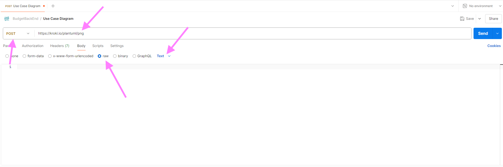

<!-- markdownlint-disable first-line-h1 -->

## REST

**Representational state transfer (REST)** is een **architectuurstijl** waarmee software met andere software kan communiceren. De term werd geïntroduceerd en gedefinieerd in 2000 door Roy Fielding in zijn [doctoraatsstudie](http://www.ics.uci.edu/~fielding/pubs/dissertation/top.htm). REST wordt veelal gebruikt voor het ontwerpen van API's voor het internet. REST gebruikt de **HTTP-methoden (GET / POST / PUT /DELETE)** om data tussen een client en een server op te halen en te verzenden.

Met het HTTP-protocol kunnen REST API’s software op het ene apparaat laten praten met software op een ander apparaat (of op hetzelfde apparaat), zelfs als deze verschillende besturingssystemen en architecturen gebruiken. De client kan om **resources** vragen in een taal die de server begrijpt, en de server reageert met de resource in een taal die de client kan verwerken. De server retourneert de **resource** in **JSON** (JavaScript Object Notation), XML (Extensible Markup Language) of tekstindelingen, maar veel API’s ondersteunen responses in aanvullende talen.

### API requests

#### Resources

Het fundamentele concept van een RESTful API is de **resource**. Alle informatie die benoemd kan worden is een resource: een document, afbeelding, verzameling (= collection) van resources, niet-virtueel object (bv. een klant), enz. REST gebruikt een **resource identifier** om een resource te identificeren.

De resources bevinden zich in een **collectie**, die een verzameling van objecten representeert. De **Uniform Resource Identifier (URI)** verwijst naar een collectie, zoals bvb `/api/klanten` verwijst naar de verzameling van de klant objecten. De data is dus opgebouwd uit resources en collecties, maar het is geen relationele databank! Je bouwt zelf links tussen deze resources en collecties om de juiste informatie op te halen. Gebruik altijd een **zelfstandig naamwoord in het meervoud** als naam voor een collectie. Gebruik GEEN actiemethodes (een werkwoord), zoals `/api/klanten/getAll`.

Bekijk onderstaand voorbeeld. Let op de opbouw van de databank (= ERD), van de URI bovenaan en van de response (geel). Je merkt een duidelijk verschil tussen het databankschema en de response. Het is dus niet altijd zo dat het databankschema overeenkomt met de response. De API-ontwikkelaar beslist hoe de response eruit ziet. Lek dus geen implementatiedetails in de response, **het response is zelden een 1-op-1 kopie van de databank**.


#### HTTP methods

Een HTTP request heeft naast een resource identifier ook altijd een **method**. Deze methods mappen perfect op de CRUD operaties, en worden als volgt gebruikt:

1. `GET`: Read - data opvragen
2. `POST`: Create - nieuwe data toevoegen
3. `PUT`: Update - data aanpassen
4. `DELETE`: Delete - data verwijderen

Voor de resource uit ons klantenvoorbeeld hebben we volgende URI's. Merk op dat een resource steeds onderdeel is van een collectie, in dit voorbeeld 'Klanten'.

| HTTP method en URI       | Resultaat                                  |
| ------------------------ | ------------------------------------------ |
| GET `/api/klanten`       | vraag een lijst van klanten op             |
| GET `/api/klanten/32`    | vraag informatie op van de klant met id 32 |
| POST `/api/klanten`      | voeg een klant toe                         |
| PUT `/api/klanten/145`   | wijzig de informatie van klant met id 145  |
| DELETE `/api/klanten/12` | verwijder klant met id 12                  |

Een ander voorbeeld: [de brewery API](https://www.openbrewerydb.org/documentation)

In de kern betekent REST dat je met collecties van resources werkt, die je op een gestructureerde manier hebt opgebouwd, zodat de structuur voor iedere gebruiker helder is.

Bovendien kunnen resources gemanipuleerd worden door hun voorstelling. Als een client een **voorstelling** van een resource heeft (inclusief eventuele metadata), heeft hij genoeg om resources aan te passen en die wijzigingen terug door te sturen naar de API.

Er zijn nog een aantal HTTP request methods (PATCH, CONNECT, HEAD, OPTIONS, TRACE), maar die worden in de context van REST servers (bijna) niet gebruikt. PATCH kom je soms eens tegen, en OPTIONS wordt frequent gebruikt in de context van bv. CORS, maar dat is voor later.

#### POST vs PUT

Wat soms tot verwarring leidt is wanneer je POST en wanneer je PUT gebruikt.

Als je een nieuw enkelvoudig element toevoegt (bv. een klant), is het duidelijk dat je een POST gebruikt. Maar wat als je een nieuw element aan een lijst toevoegt (bv. een nieuw item in een bestelling)? Is dat een update van een bestaande lijst (PUT)? Of is dit een POST omdat een nieuw element toegevoegd wordt?

Soms lees je wel eens dat je een POST gebruikt als het request resulteert in een nieuwe entry in de databank, en anders een PUT. Maar dat impliceert dat je de databank layout kent, en daar wil je niet op steunen natuurlijk.

Als het een situatie is waar het niet vanzelfsprekend is wat je best gebruikt, doet het er niet echt toe ook. Technisch maakt het helemaal niets uit, het is gewoon een kwestie van afspraken. Het is wel belangrijk dat je eenduidig bent, niet de ene keer PUT en de andere keer POST voor eenzelfde situatie met een andere resource.

#### PUT vs PATCH

Ook het verschil tussen PUT en PATCH is niet altijd duidelijk.

PUT en PATCH zijn beide methodes om een resource aan te passen. Het verschil is dat PUT de volledige resource doorstuurt, terwijl PATCH enkel de gewijzigde velden doorstuurt. In het voorbeeld van onze klanten zal een PUT de hele klant doorsturen terwijl een PATCH bv. enkel de naam doorstuurt.

### API responses

De API-ontwikkelaar beslist welke formaten ze ondersteunen voor de response. Een server kan bijvoorbeeld reageren met JSON, XML of tekst. De API moet de mogelijkheid hebben om de response op te maken op basis van de behoeften van de client. In het voorbeeld van de klanten wordt JSON geretourneerd.

Voor de responses wordt ook steeds een **HTTP status code** gebruikt. Bij een succesvol request wordt er een 2xx HTTP status code teruggegeven:

| Code    | Status     | Beschrijving                                                                        |
| ------- | ---------- | ----------------------------------------------------------------------------------- |
| **200** | OK         | Het request is geslaagd.                                                            |
| **201** | Created    | Een resource is aangemaakt met een POST request. Het antwoord bevat een empty body. |
| **204** | No Content | Een PUT, PATCH of DELETE request slaagt. Het antwoord bevat een empty body.         |

Bij een foutmelding wordt een van de volgende status codes teruggegeven. Een code 4xx wordt gebruikt als de fout bij de client ligt, een code 5xx als de fout bij de server ligt.

| Code    | Status                | Beschrijving                                                                                                                              |
| ------- | --------------------- | ----------------------------------------------------------------------------------------------------------------------------------------- |
| **400** | Bad Request           | Het request is ongeldig (bv. foute parameters in URL of body).                                                                            |
| **401** | Unauthorized          | De authenticatie faalt, bv. door een onjuist wachtwoord of de client is simpelweg niet aangemeld.                                         |
| **403** | Forbidden             | De client is aangemeld maar heeft geen toegang tot de resource (= onvoldoende rechten).                                                   |
| **404** | Not Found             | De resource is niet gevonden.                                                                                                             |
| **405** | Method Not Allowed    | De HTTP method is niet toegelaten voor deze resource.                                                                                     |
| **406** | Not Acceptable        | De client heeft een accept header gestuurd die niet ondersteund wordt (bv. gevraagd om XML terwijl de server enkel JSON kan retourneren). |
| **429** | Too Many Requests     | De client heeft te veel requests gestuurd in een bepaalde tijdspanne.                                                                     |
| **500** | Internal Server Error | Er is een fout opgetreden aan de serverkant.                                                                                              |
| **501** | Not Implemented       | Het endpoint is niet geïmplementeerd.                                                                                                     |
| **503** | Service Unavailable   | De server is tijdelijk niet beschikbaar.                                                                                                  |

Een volledige lijst van HTTP status codes kan je vinden op [developer.mozilla.org](https://developer.mozilla.org/en-US/docs/Web/HTTP/Status).

### REST architectuurstijl

REST is [een reeks principes](https://ics.uci.edu/~fielding/pubs/dissertation/rest_arch_style.htm#sec_5_1_7) die een ontwikkelaar moet volgen voordat die zijn API als "RESTful" kan beschouwen. De principes zeggen niets over hoe de API moet worden geïmplementeerd.

<!-- markdownlint-disable ol-prefix -->

1. **Uniforme interface**: een request identificeert een **resource**, door gebruik te maken van **URI's**. Er zijn vier architecturale beperkingen nodig om het gedrag van componenten vast te leggen:

- Identificatie van resources.
- Manipulatie van resources door representations (JSON, XML...).
- Zelf-omschrijvende berichten.
- Hypermedia als de drijvende kracht van de applicatie status. De applicatie in deze context is de web applicatie die je server draait, hypermedia de hyperlinks/links die de server meestuurt in het antwoord.

2. **Client/server-architectuur**: de clients van de API gebruiken HTTP calls om een resource te vragen (een GET-methode) of data naar de server te sturen (een PUT, POST of DELETE-methode). De client moet voldoende hebben aan de verschillende URI's voor alle resources. De documentatie van de API bevat de beschikbare URI's/methoden die door de API worden ondersteund. De client en de server moeten onafhankelijk van elkaar kunnen evolueren. Door de gebruikersinterface te scheiden van de opslag, kan een gebruikersinterface voor meerdere platformen gebouwd worden.

3. **Stateless**: een stateless applicatie houdt geen verbinding in stand en slaat geen informatie op tussen requests van dezelfde client. Een client doet een request, de API voert de actie uit die in het request is gedefinieerd en reageert. Zodra de API reageert, verbreekt hij de verbinding en bewaart hij geen informatie over de client in het actieve geheugen. De API behandelt elke request als een eerste request. Dit betekent dat ieder request van client naar server alle nodige informatie moet bevatten om het verzoek te begrijpen en kan geen gebruik maken van enige opgeslagen context op de server. De sessie-status wordt volledig op de client opgeslagen.

4. **Cacheable**: een REST API moet caching van vaak gevraagde data mogelijk maken. Om bandbreedte, vertraging (= latency) en serverbelasting te verminderen moet een API identificeren wat cacheable resources zijn, wie ze kan cachen en hoelang ze in de cache kunnen blijven. Goede caching maakt dat de server beter schaalt (want minder requests te verwerken) én dat de client sneller reageert. Als een antwoord cacheable is, krijgt de client rechten om het antwoord opnieuw te gebruiken voor latere, soortgelijke verzoeken.

5. **Gelaagd systeem**: een API kan meerdere lagen hebben, zoals proxyservers of load balancers, en de eindpuntserver kan extra servers inzetten om een response te formuleren. De client weet niet welke server op het request reageert. Met een gelaagd systeem is een API eenvoudiger uit te breiden en dus schaalbaarder. Bijvoorbeeld: de API staat op Server A, de data op Server B en de authenticatie wordt afgehandeld op Server C. Het grote voordeel is dat de servers onafhankelijk van elkaar kunnen schalen, bv. één grote, zware databankserver met daarvoor een aantal kleine, lichtere API servers.

<!-- markdownlint-enable ol-prefix -->

### REST clients

#### GET

GET requests kan je altijd eenvoudig testen. Typ de URL in de adresbalk van de browser en je browser toont het resultaat.

Probeer bijvoorbeeld eens het weer in Gent (of jouw gemeente/stad) op te vragen via: <http://wttr.in/Gent?format=j1>.

#### POST/PUT

POST en PUT requests zijn iets lastiger te testen. Meestal moet je hier ook data meesturen in de body van de requests en dat kan niet zo eenvoudig in de browser. Uiteindelijk is het natuurlijk de bedoeling dat de API via de client (een programma) aangesproken wordt. Echter als je aan het ontwikkelen bent, is het handig om software te hebben die alle soorten requests kan genereren. Dit is zeker handig als er iets niet werkt, op die manier kan je testen of het probleem zich voordoet in de front- of back-end.

Een vaak gebruikt programma hiervoor is [Postman](https://www.postman.com). Postman heeft ook [een extensie voor VS Code](https://marketplace.visualstudio.com/items?itemName=Postman.postman-for-vscode). Er zijn natuurlijk nog alternatieven zoals bv. [Insomnia](https://insomnia.rest/), [Bruno](https://www.usebruno.com/) (ziet er veelbelovend uit) of [Thunder Client](https://marketplace.visualstudio.com/items?itemName=rangav.vscode-thunder-client) (een extensie voor VSCode). Als je de [nodige software](../0-intro/software.md) reeds geïnstalleerd hebt, dan heb je Postman reeds op je systeem staan.

#### Postman

Postman is ooit begonnen als een simpele applicatie om API's te testen maar is ondertussen enorm gegroeid en een heus platform geworden. Je kan samenwerken met anderen en allerlei automatisaties uitvoeren. Het is zowel als losstaande applicatie als in een browser bruikbaar. Maar je kan gelukkig nog altijd gewoon wat requests uitvoeren, al heb je tegenwoordig wel een account nodig om iets te kunnen doen.

Laten we een POST request uitvoeren in Postman:

1. Kies de `POST` als method.
2. Typ de URL in het veld. We gebruiken hier een publieke API om afbeeldingen te generen:
<https://kroki.io/plantuml/png> (niet klikken, enkel kopiëren :upside_down_face:).
3. Vervolgens moeten we nog onze data in de body doorsturen. Kies in bij het tabblad `Body` voor `raw` en wijzig `JSON` naar `text`.



<!-- markdownlint-disable ol-prefix -->

4. Uiteindelijk komt in de body de UML code te staan (kopieer gerust, code staat onder de afbeelding!). Dit is de beschrijving voor een simpel use case diagram in PlantUML syntax. Klik op `Send` en je zou hetzelfde use case diagram moeten zien.

<!-- markdownlint-enable ol-prefix -->


```text
@startuml
left to right direction
skinparam packageStyle rectangle
skinparam monochrome true
actor customer
actor clerk
rectangle "Check out" {
  customer -- (checkout)
  (checkout) .> (payment) : include
  (help) .> (checkout) : extends
  (checkout) -- clerk
}
@enduml
```

### 3rd party API's

Vaak worden API's en de client samen ontwikkeld, en een API leren ontwikkelen is in eerste instantie waar deze cursus over gaat. Natuurlijk zijn er ook veel API's die op zich aangeboden worden en door (vele) verschillende clients gebruikt worden, zoals bv. weersvoorspellingen, beursdata...

Soms zijn API's volledig gratis, soms volledig betalend, maar heel vaak daar ergens tussenin (bv. eerste XXX requests, eerste x maanden gratis, en dan €YYY per 1000 requests). Als ze (deels) betalend zijn, komt er autorisatie bij kijken: om je te kunnen laten betalen, moet de API weten wie je bent en welke requests je doet natuurlijk. Daarover later meer, maar we kennen nu al genoeg om een oefening te maken met een publieke API.

Een mooi voorbeeld van publieke API's zijn de 100+ datasets die de stad Gent aanbiedt als open data, van de bezetting van de parkeergarages tot de locatie van de grazende schapen: [https://data.stad.gent/explore/](https://data.stad.gent/explore/?disjunctive.keyword&disjunctive.theme&sort=modified).

Maar er zijn nog veel meer publieke API's natuurlijk! Een uitgebreide (niet exhaustieve) lijst van publiek beschikbare API's kan je hier vinden: <https://github.com/public-apis/public-apis>.

### Oefening

- Gebruik Postman om de most wanted list van de FBI op te vragen.
  - Stuur hiervoor een GET request naar <https://api.fbi.gov/wanted/v1/list>
- Gebruik <https://kroki.io/erd/svg> om onderstaand ERD te creëren.
  - Als je via de browser klikt op de link is het logisch dat je een HTTP 405 krijgt, je moet een POST request uitvoeren via Postman.


- Oplossing +

  ```erd
  [Klant]
  *id
  +persoonId
  +adresId

  [Adres]
  *id
  straat
  nr
  +stadId

  [Stad]
  *id
  postcode
  naam

  [Persoon]
  *id
  voornaam
  naam

  Klant 1--1 Adres
  Klant 1--1 Persoon
  Adres *--1 Stad
  ```
