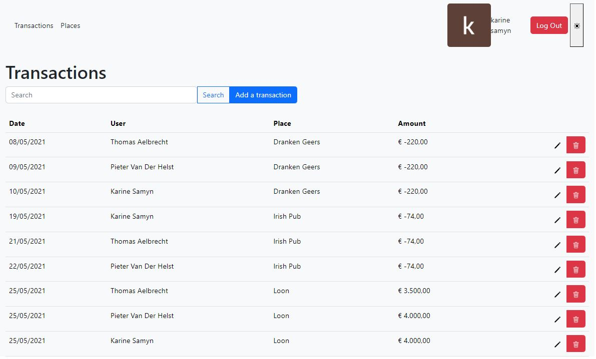
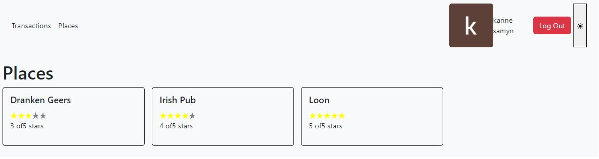

# REST API bouwen

> "The first step of any project is to grossly underestimate its complexity and difficulty." - Nicoll Hunt

## budget app startpunt

```bash
~> git clone git@github.com:HOGENT-Web/webservices-budget.git (of git pull als het niet de eerste keer is)
~> cd webservices-budget
~/webservices-budget$> git checkout -b les3 08186c6
~/webservices-budget$> yarn install
```

### Oefening: De Budget app

De app die we gaan maken bevat volgende pagina's

1. de transactions pagina
   

2. de places pagina
   

- Maak het ERD
- Welke endpoints moeten we voorzien?

## Configuratie

- Voor we aan de API beginnen maken we onze server beter configureerbaar.
- Typisch wil je verschillende settings al naargelang een development / production / test build (settings als databank locatie / login, welke port gehost wordt, logging niveau; enz.)
- De configuratie doen we liefst op 1 plaats. In `app.js` verwijzen we bvb naar poort 3000, dit zetten we best niet in code. In de logger staat het level op `info`, maar dit willen we in productie. In development willen we level `debug`.

### packages

```bash
~webservices-budget$> yarn add config
~webservices-budget$> yarn add env-cmd
```

- We gaan de packages [**config**](https://www.npmjs.com/package/config) en [**env-cmd**](https://www.npmjs.com/package/env-cmd) gebruiken.
- **config** laat toe om eenvoudig configuratie te switchen op basis van een environment variabele.
- **env-cmd** laat toe om een programma te draaien waar de environment variabelen uit een file gehaald worden.

### de package config

- De `NODE_ENV` variabele moet gedefinieerd zijn (typisch 'development', 'production', ...).
- De config library zoekt dan in de `config` folder naar een file met die naam (bvb. `config/development.js` ).
- Eventueel kan je een extra file definiëren `config/custom-environment-variables.js` met mappings om andere environment variabelen ook via de config in de app te laden.

Maak een `.env` file aan in de root met onderstaande code

```js
NODE_ENV = production;
```

Die .env file zal niet in github komen (en dat is de bedoeling!). Dus het is ook de ideale plaats om 'geheimen' (apikeys, jwt secrets, ...) in op te nemen, later meer hierover.

We definiëren een paar log configuratie variabelen zodat we iets kunnen testen. Maak hiervoor `config/development.js`
aan.

```js
module.exports = {
  log: {
    level: 'silly',
    disabled: false,
  },
};
```

en dan hetzelfde voor productie, `config/production.js`, met net iets andere waarden natuurlijk, anders zien we het verschil niet

```js
module.exports = {
  log: {
    level: 'ìnfo',
    disabled: false,
  },
};
```

Meer hoeven we niet te doen, we kunnen de config beginnen gebruiken. Pas `src/index.js` aan

```js
const Koa = require('koa');
const config = require('config'); // 👈 1
const { getLogger } = require('./core/logging');

const NODE_ENV = process.env.NODE_ENV; // 👈 4
const LOG_LEVEL = config.get('log.level'); // 👈 2
const LOG_DISABLED = config.get('log.disabled'); // 👈 2

console.log(`log level ${LOG_LEVEL}, logs enabled: ${LOG_DISABLED !== true}`); // 👈 3

const app = new Koa();
const logger = getLogger();

app.use(async (ctx, next) => {
  ctx.body = 'Goodbye world';
  next();
});

logger.info(`🚀 Server listening on http://localhost:9000`);
app.listen(9000);
```

1. Het config object opvragen
2. en dan zijn alle gedefinieerde variabelen beschikbaar via een `.get`
3. Start de app en controleer dat alles werkt (we moeten dus 'info' zien, want 'production')
4. Je kan de environment variabelen ook expliciet opvragen, via de `process.env`. Dat is natuurlijk een beetje onhandig, je moet weten welke config via de environment binnen komt, en welke via de config files. En wat als iets in beide gedefinieerd is?

Gelukkig heeft `config` een methode om environment variabelen mee in te lezen, en alles beschikbaar te maken via `config.get()`. Maak een file binnen de `config` folder met de naam `custom-environment-variables.js`.

```js
module.exports = {
  env: 'NODE_ENV',
};
```

Daarbinnen definieer je welke config variabelen gedefinieerd worden door welke environment variabele. Dus `config.get('env')` krijgt de waarde van `process.env.NODE_ENV`. Als iets zowel binnen een config file gedefinieerd is als binnen de environment, zal de environment gebruikt worden (overschrijft m.a.w. wat er in de config staat).

Dus we kunnen de `process.env` vervangen door een `config.get`

```js
const Koa = require('koa');
const config = require('config');
const { getLogger } = require('./core/logging');

const NODE_ENV = config.get('env'); // 👈
const LOG_LEVEL = config.get('log.level');
const LOG_DISABLED = config.get('log.disabled');

console.log(`log level ${LOG_LEVEL}, logs enabled: ${LOG_DISABLED !== true}`);

const app = new Koa();
const logger = getLogger();

app.use(async (ctx, next) => {
  ctx.body = 'Goodbye world';
  next();
});

logger.info(`🚀 Server listening on http://localhost:9000`);
app.listen(9000);
```

## CRUD operaties

We kunnen aan de API starten. We willen eigenlijk voor een aantal requests data heen en terug sturen

- `GET /api/transactions` alle transacties opvragen
- `GET /api/transactions/(id)` een specifieke transactie opvragen
- `POST /api/transactions` een nieuwe transactie aanmaken
- `PUT /api/transactions/(id)` een transactie aanpassen
- `DELETE /api/transactions/(id)` een transactie verwijderen

### Request object

Binnen onze middleware functies bevat de context alle info over de request zoals die bij onze server toekomt.

Dus als we een `logger.info(JSON.stringify(ctx.request));` toevoegen aan `index.js`krijgen we de structuur te zien:

`info: {"method":"GET","url":"/","header":{"host":"localhost:9000", ... }}`.

```js
app.use(async (ctx, next) => {
  logger.info(JSON.stringify(ctx.request)); // 👈 1
  if (
    ctx.request.method === 'GET' && // 👈 2
    ctx.request.url === '/api/transactions'
  ) {
    ctx.body =
      "[{'user': 'Benjamin', 'amount': 100, 'place': 'Irish Pub', date: '2021-08-15' }]"; // 👈 3
  } else {
    ctx.body = 'Goodbye world';
  }
  next();
});
```

1. Pas de middleware aan om het request object te bekijken.
2. Identificeer op basis van de method en url de juiste actie.
3. Geef de data in de body mee, zodat de gebruiker een lijst van transacties krijgt.

## Router

Je zou zo alles kunnen opbouwen maar je voelt al dat er veel werk altijd hetzelfde zal zijn. Voor zo een simpele GET request valt het mee, maar wat als je ook de body moet parsen, headers, authenticatie afhandelen, ... Dus, zoals zo vaak, een goede library is 't halve werk (bij programmeren anno 2023 is 't vaak belangrijker om een goede library te kennen / kunnen vinden dan algoritmes uit te denken en te implementeren, c'est la vie). We voegen [**@koa/router**](https://www.npmjs.com/package/koa-router) en [**koa-bodyparser**](https://www.npmjs.com/package/koa-body-parser) toe om requests makkelijker af te handelen.

```bash
~/webservices-budget$> yarn add @koa/router
~/webservices-budget$> yarn add koa-bodyparser
```

- **koa-bodyparser** is een stuk middleware, die we dus moeten 'usen' voor het request bij onze middleware toekomt, het zal de request body parsen voor ons
- **@koa/router** is ook een middleware en zal de routing op zich nemen (m.a.w. de juiste code uitvoeren als bv. een `POST /api/transactions` uitgevoerd wordt)

```js
const Koa = require('koa');
const config = require('config');
const { getLogger } = require('./core/logging');
const bodyParser = require('koa-bodyparser'); // 👈 1

const app = new Koa();
const logger = getLogger();

app.use(bodyParser()); // 👈 2

app.use(async (ctx, next) => {
  logger.info(JSON.stringify(ctx.request));
  logger.info(JSON.stringify(ctx.request.body)); // 👈 3
  if (ctx.request.method === 'GET' && ctx.request.url === '/api/transactions') {
    ctx.body =
      "[{'user': 'Benjamin', 'amount': 100, 'place': 'Irish Pub', date: '2021-08-15' }]";
  } else {
    ctx.body = 'Goodbye world';
  }
  next();
});

logger.info(`🚀 Server listening on http://localhost:9000`);
app.listen(9000);
```

1. Importeer de bodyParser
2. en geef mee aan het Koa object. Doe dit vóór je eigen middleware functies, anders zijn ze nog niet uitgevoerd (en in dit geval de body dus nog niet geparsed)
3. Log de request body
4. Je kan dit snel testen door een POST request -met body- via postman te sturen. Open postman en doe een POST naar `localhost:9000/api`en geef als json in `{message:’hello world’}` en voer uit. Verwijder dan eens de bodyParser middleware en bekijk dan het resultaat van de POST.

We willen nu ook gebruik maken van de router.

```js
const Koa = require('koa');
const Router = require('@koa/router'); // 👈 1
// ...

/* app.use(async (ctx, next) => {// 👈 6
logger.info(JSON.stringify(ctx.request));
logger.info(JSON.stringify(ctx.request.body));
if (ctx.request.method === 'GET' && ctx.request.url === "/api/transactions") {
  ctx.body = "[{'user': 'Benjamin', 'amount': 100, 'place': 'Irish Pub', date: '2021-08-15' }]";
} else {
  ctx.body = 'Goodbye world';
}
next();
}); */
const router = new Router(); // 👈 2

router.get('/api/transactions', async (ctx) => {
  // 👈 4
  logger.info(JSON.stringify(ctx.request));
  ctx.body =
    "[{'user': 'Benjamin', 'amount': 100, 'place': 'Irish Pub', date: '2021-08-15' }]"; // 👈 5
});

app.use(router.routes()).use(router.allowedMethods()); // 👈 3
```

1. Eerst importeren we het Router type
2. Dan creëren we een instantie van dit type
3. Om te zorgen dat onze app alle routes gebruikt voegen we `routes()` en `allowedMethods()` toe als middlewares. `routes()` zorgt voor de routing, `allowedMethods()` zorgt voor een HTTP 405 indien een HTTP method niet toegelaten is en om te antwoorden op OPTIONS requests (met een Allow header)
4. Dan kunnen we routes definiëren, elke route is een 'werkwoord' met een path op ons router object
   dus je kan `router.get` , `router.put` , .... gebruiken
5. Uiteindelijk zorgen we dan dat de return waarde gezet wordt,
6. en verwijderen we ons manueel gepruts

Uiteraard willen we geen hardcoded data terugsturen. Deze data zal uit een databank moeten komen. Voorlopig gaan we even gewoon met mockdata werken. Creër een nieuwe file `src/data/mock_data.js`, in een nieuwe `data` folder.

```js
let PLACES = [
  {
    id: 1,
    name: 'Dranken Geers',
    rating: 3,
  },
  {
    id: 2,
    name: 'Irish Pub',
    rating: 2,
  },
  {
    id: 3,
    name: 'Loon',
    rating: 4,
  },
];

let TRANSACTIONS = [
  {
    id: 1,
    amount: -2000,
    date: '2021-05-08T00:00:00.000Z',
    user: {
      id: 1,
      name: 'Thomas Aelbrecht',
    },
    place: {
      id: 2,
      name: 'Irish Pub',
    },
  },
  {
    id: 2,
    amount: -74,
    date: '2021-05-21T12:30:00.000Z',
    user: {
      id: 1,
      name: 'Thomas Aelbrecht',
    },
    place: {
      id: 2,
      name: 'Irish Pub',
    },
  },
  {
    id: 3,
    amount: 3500,
    date: '2021-05-25T17:40:00.000Z',
    user: {
      id: 1,
      name: 'Thomas Aelbrecht',
    },
    place: {
      id: 3,
      name: 'Loon',
    },
  },
];

module.exports = { TRANSACTIONS, PLACES };
```

We houden hier voorlopig een variabele bij met onze transacties en places (en die moet dan uiteindelijk in de databank belanden).
Als we ook de transacties willen updaten gaan we een id nodig hebben om elementen eenduidig van elkaar te onderscheiden. We maken gebruik van een simpele auto-increment (= een geheel getal dat telkens met 1 verhoogd wordt)
Ook aan de places voegen we een unieke id toe. Bij toevoegen/updaten van de transacties dienen we een plaats te kiezen.

We creëren een nieuwe file `transaction.js`, in een nieuwe `service` folder. Voorlopig hebben we enkel de methode `getAll()` nodig, de rest implementeren we later. Maar opdat alles zou compileren gaan we ze al declareren en een error throwen als ze gebruikt worden.

```js
let { TRANSACTIONS } = require('../data/mock-data');

const getAll = () => {
  return { items: TRANSACTIONS, count: TRANSACTIONS.length };
};

const getById = (id) => {
  throw new Error('not implemented yet');
};

const create = ({ amount, date, placeId, user }) => {
  throw new Error('not implemented yet');
};
const updateById = (id, { amount, date, placeId, user }) => {
  throw new Error('not implemented yet');
};

const deleteById = (id) => {
  throw new Error('not implemented yet');
};

module.exports = {
  getAll,
  getById,
  create,
  updateById,
  deleteById,
};
```

Let al op de signatuur van de create en update operaties, als we data nodig hebben gaan we ze als object doorgeven `{amount, date, placeId, user}`.

De route aanpassen is nu niet veel werk.

In `index.js`

```js
const Koa = require('koa');
const Router = require('@koa/router');
const transactionService = require('./service/transaction'); // 👈 1

router.get('/api/transactions', async (ctx) => {
  logger.info(JSON.stringify(ctx.request));
  //	ctx.body = "[{'user': 'Benjamin', 'amount': 100, 'place': 'Irish Pub', date: '2021-08-15' }]"// 👈 2
  ctx.body = transactionService.getAll(); // 👈 2
});

app.use(router.routes()).use(router.allowedMethods());
```

1. We importeren de service
2. en vervangen de hardcoded data door een getAll() call, that's it

### Oefening

In je eigen project:

- installeer alle packages
- importeer alle packages
- Maak een GET route aan voor het opvragen van alle resources en test uit

## De POST route

De POST route om een nieuwe transactie toe te voegen is zeer gelijkaardig.

```js
const Koa = require('koa');
const Router = require('@koa/router');
const transactionService = require('./service/transaction');

router.get('/api/transactions', async (ctx) => {
  logger.info(JSON.stringify(ctx.request));
  ctx.body = transactionService.getAll();
});

router.post('/api/transactions', async (ctx) => {
  // 👈 1
  const newTransaction = transactionService.create({
    ...ctx.request.body, // 👈 2
    placeId: Number(ctx.request.body.placeId),
    date: new Date(ctx.request.body.date),
  });
  ctx.body = newTransaction; // 👈 3
});

app.use(router.routes()).use(router.allowedMethods());
```

1. Voeg de POST route toe
2. Roep de `create` functie van de service aan. We destructuren de `request.body` (waarin de transaction als json verwacht wordt) om onze datum alvast om te zetten naar een `Date` type.
3. Geef de net toegevoegde transaction ook weer terug vanuit de create via de response body. Het lijkt misschien wat raar om eigenlijk hetzelfde terug te geven dan wat je binnen kreeg maar dat is meestal een goed idee
   daarmee weet de gebruiker van de API hoe je het opgeslagen hebt, wat niet noodzakelijk hetzelfde is als hoe hij het doorgaf bv. bij ons kan de datum omzetting iets wijzigen en sowieso zal er een 'id' toegevoegd zijn.

Dan moeten we nog onze `create` implementeren in de `service` laag.

```js
//...
const create = ({ amount, date, placeId, user }) => {
  // 👈 1
  let existingPlace;
  if (placeId) {
    existingPlace = PLACES.find((place) => place.id === placeId);

    if (!existingPlace) {
      getLogger().error(`There is no place with id ${id}.`, { id });
    }
  }

  // 👈 2
  if (typeof user === 'string') {
    user = { id: Math.floor(Math.randrom() * 100000), name: user };
  }
  const maxId = Math.max(...TRANSACTIONS.map((i) => i.id));

  // 👈 3
  const newTransaction = {
    id: maxId + 1,
    amount,
    date: date.toISOString(),
    place: existingPlace,
    user,
  };
  TRANSACTIONS = [...TRANSACTIONS, newTransaction]; // 👈 4
  return newTransaction;
};
//...
```

1. We halen de place met bijhorend id op. Indien niet gevonden loggen we voorlopig de fout.
2. In de definitieve applicatie is de user de aangemelde gebruiker. Momenteel geven we een string door en maken we de gebruiker aan. Een gebruiker heeft een unieke id. We dienen een uniek id te genereren en maken hiervoor gebruik van Math.random (later zullen we dit degelijker implementeren)
3. We voegen gewoon een nieuw element aan onze TRANSACTIONS array toe, weliswaar met een uniek id. Dan creëren we onze transactie, met het id erbij en voegen ze toe aan onze array.
4. En we geven deze nieuw toegevoegde transactie dan weer terug

Dit kan je 't makkelijkst testen via Postman.

### Oefening

- Maak een create route aan in je project en test uit

## Routes met een parameter

Niet alle routes kunnen gewoon een hardcoded string zijn, soms heb je een parameter nodig bvb. `/api/transactions/15, /api/transactions/43, ...` om een transactie voor een id op te vragen.

In `@koa/router` doen we dit door `:naam_van_de_parameter` in de url op te nemen. De variabele is dan beschikbaar in `ctx.params.naam_van_de_parameter`. (Merk op dat een url nooit een : kan bevatten (behalve die in http://), dus er kan nooit dubbelzinnigheid optreden of het : deel uitmaakt van de url of een parameter aankondigd)

We willen dus een transactie kunnen opvragen op basis van zijn id, bvb `/api/transactions/15`.

In `src/index.js`

```js
router.get('/api/transactions', async (ctx) => {
  logger.info(JSON.stringify(ctx.request));
  ctx.body = transactionService.getAll();
});

router.post('/api/transactions', async (ctx) => {
  const newTransaction = transactionService.create({
    ...ctx.request.body,
    placeId: Number(ctx.request.body.placeId),
    date: new Date(ctx.request.body.date),
  });
  ctx.body = newTransaction;
});

router.get('/api/transactions/:id', async (ctx) => {
  // 👈 1
  ctx.body = transactionService.getById(ctx.params.id); // 👈 2
});
```

1. We doen dit door weer een get request te definiëren, maar nu met een :id parameter erbij
2. Wat er in de url stond op die plaats kan je dan terug vinden in `ctx.params.id`. Die id gebruiken we dan om onze `getById` aan te spreken

In de `service` laag implementeer je de getById methode

```js
const getById = (id) => {
  return TRANSACTIONS.filter((t) => t.id === id);
};
```

### Oefening

- Implementeer in je project een `get by id` endpoint en de bijhorende `getById` in de service laag en test uit.
- Maak dan zelf de PUT en DELETE routes en hun bijhorende service methods.
- Extra (voor de ervaren JavaScripters): maak al de service methodes async (zoals de databank zal zijn), (geef promises terug / gebruik async-await in de routes)

## Time to refactor

### de rest laag

Alle endpoints in 1 file plaatsen voldoet niet aan de Best Practices. We voorzien een aparte rest laag, voor het ontvangen van de requests. Hiervoor voorzien we een folder `rest`. Maak de file `transaction.js` aan. Deze bevat de transaction endpoints. We voorzien een methode voor elk van de endpoints en definiëren vervolgens de routes.

```js
const Router = require('@koa/router');
const transactionService = require('../service/transaction');

const getAllTransactions = async (ctx) => {
  ctx.body = transactionService.getAll();
};

const createTransaction = async (ctx) => {
  const newTransaction = transactionService.create({
    ...ctx.request.body,
    placeId: Number(ctx.request.body.placeId),
    date: new Date(ctx.request.body.date),
  });
  ctx.body = newTransaction;
};

const getTransactionById = async (ctx) => {
  ctx.body = transactionService.getById(ctx.params.id);
};

const updateTransaction = async (ctx) => {
  ctx.body = transactionService.updateById(ctx.params.id, {
    ...ctx.request.body,
    placeId: new Date(ctx.request.body.placeId),
    date: new Date(ctx.request.body.date),
  });
};

const deleteTransaction = async (ctx) => {
  transactionService.deleteById(ctx.params.id);
  ctx.status = 204;
};

/**
 * Install transaction routes in the given router.
 *
 * @param {Router} app - The parent router.
 */
module.exports = (app) => {
  const router = new Router({
    prefix: '/transactions',
  });

  router.get('/', getAllTransactions);
  router.post('/', createTransaction);
  router.get('/:id', getTransactionById);
  router.put('/:id', updateTransaction);
  router.delete('/:id', deleteTransaction);

  app.use(router.routes()).use(router.allowedMethods());
};
```

Voeg een file `index.js` toe in de `rest` folder. Hierin definiëren we alle api routes.

```js
const Router = require('@koa/router');
const installTransactionRouter = require('./transaction');
/**
 * Install all routes in the given Koa application.
 *
 * @param {Koa} app - The Koa application.
 */
module.exports = (app) => {
  const router = new Router({
    prefix: '/api',
  });

  installTransactionRouter(router);

  app.use(router.routes()).use(router.allowedMethods());
};
```

Dit zorgt voor het installeren van alle routes.

Pas `src/index.js` aan

```js
//...
const installRest = require('./rest'); // 👈 2

//...

const app = new Koa();
const logger = getLogger();

app.use(bodyParser());

//zet alles in commentaar  👈 1
installRest(app); // 👈 2

logger.info(`🚀 Server listening on http://localhost:9000`);
app.listen(9000);
```

1. Verwijder alle routes
2. En installeer dan de app route

### health checks

Een statuscheck is een manier waarop een service kan rapporteren of deze goed werkt of niet. Webservices maken dit meestal zichtbaar via een /health HTTP-eindpunt. Vervolgens ondervragen orkestratiecomponenten, zoals load balancers of service-ontdekkingssystemen, dat eindpunt om de gezondheid van een reeks services te monitoren en een aantal belangrijke beslissingen te nemen.

We voorzien 2 endpoints

- `/api/health/ping` : retourneert pong
- `/api/health/version` : retourneert info over de versie van de webservice

Creër een `health.js` file in de `service` folder die 2 methodes bevat

- `ping` : retourneert pong
- `getVersion` : retourneert info over de versie van de webservice

```js
const packageJson = require('../../package.json');

/**
 * Check if the server is healthy. Can be extended
 * with database connection check, etc.
 */
const ping = () => ({ pong: true });

/**
 * Get the running server's information.
 */
const getVersion = () => ({
  env: process.env.NODE_ENV,
  version: packageJson.version,
  name: packageJson.name,
});

module.exports = {
  ping,
  getVersion,
};
```

In de `rest` folder maak je een nieuwe file `health.js` aan. Deze bevat de 2 endpoints

```js
const Router = require('@koa/router');
const healthService = require('../service/health');

const ping = async (ctx) => {
  ctx.status = 200;
  ctx.body = healthService.ping();
};

const getVersion = async (ctx) => {
  ctx.status = 200;
  ctx.body = healthService.getVersion();
};

/**
 * Install health routes in the given router.
 *
 * @param {Router} app - The parent router.
 */
module.exports = function installHealthRoutes(app) {
  const router = new Router({
    prefix: '/health',
  });

  router.get('/ping', ping);
  router.get('/version', getVersion);

  app.use(router.routes()).use(router.allowedMethods());
};
```

Pas `index.js` aan in de `rest` folder zodat de route ook geïnstalleerd wordt.

### Logging

Lees [Best practices for logging](https://betterstack.com/community/guides/logging/nodejs-logging-best-practices/)

Pas `core/logging.js` als volgt aan

```js
const winston = require('winston');
const { combine, timestamp, colorize, printf } = winston.format;

let rootLogger;

/**
 * Get the root logger.
 */
const getLogger = () => {
  if (!rootLogger) {
    throw new Error('You must first initialize the logger');
  }

  return rootLogger;
};

/**
 * Define the logging format. We output a timestamp, context (name), level, message and the stacktrace in case of an error
 */
const loggerFormat = () => {
  const formatMessage = ({
    level,
    message,
    timestamp,
    name = 'server',
    ...rest
  }) =>
    `${timestamp} | ${name} | ${level} | ${message} | ${JSON.stringify(rest)}`;

  const formatError = ({ error: { stack }, ...rest }) =>
    `${formatMessage(rest)}\n\n${stack}\n`;
  const format = (info) =>
    info.error instanceof Error ? formatError(info) : formatMessage(info);
  return combine(colorize(), timestamp(), printf(format));
};

/**
 * Initialize the root logger.
 *
 * @param {string} level - The log level.
 * @param {boolean} disabled - Disable all logging.
 * @param {object} defaultMeta - Default metadata to show.
 */
const initializeLogging = (level, disabled = false, defaultMeta = {}) => {
  rootLogger = winston.createLogger({
    level,
    format: loggerFormat(),
    defaultMeta,
    transports: [
      new winston.transports.Console({
        silent: disabled,
      }),
    ],
  });

  return rootLogger;
};

module.exports = {
  initializeLogging,
  getLogger,
};
```

Pas `src\index.js` aan

```js
\\...
const { initializeLogger, getLogger } = require('./core/logging');
\\...

initializeLogger({
  level: LOG_LEVEL,
  disabled: LOG_DISABLED,
  defaultMeta: { NODE_ENV },
});

const app = new Koa();
\\...
```

### Oefening

Refactor je project

## CORS

Als je vanuit de SPA een HTTP request stuurt naar een ander domein dan krijg je volgende fout `Access to fetch at 'https://app.mydomain.com' from origin 'http://localhost:9000' has been blocked by CORS policy: Response to preflight request doesn't pass access control check:`

CORS is een HTTP-functie waarmee een webtoepassing die wordt uitgevoerd onder één domein, toegang kan krijgen tot resources in een ander domein. Webbrowsers implementeren een beveiligingsbeperking die bekend staat als `same-origin-beleid` dat voorkomt dat een webpagina API's aanroept in een ander domein. CORS biedt een veilige manier om vanuit het ene domein (het oorspronkelijke domein) API's in een ander domein aan te roepen. Zie de CORS-specificatie voor meer informatie over [CORS](https://fetch.spec.whatwg.org/).

Een CORS-aanvraag van een oorsprongdomein kan bestaan uit twee afzonderlijke aanvragen:

1. Een eerste aanvraag, waarin de CORS-beperkingen worden opgevraagd die door de service zijn opgelegd. De eerste aanvraag is vereist, tenzij de aanvraagmethode een eenvoudige methode is, dat wil zeggen GET, HEAD of POST.
2. De werkelijke aanvraag, gemaakt op de gewenste resource.

### package

```bash
~webservices-budget$> yarn add @koa/cors
```

`@koa/cors` handelt het hele CORS-verhaal voor ons af (bv. preflight request)

In `config/development.js`

```js
module.exports = {
  log: {
    level: 'silly',
    disabled: false,
  },

  cors: {
    // 👈 1
    origins: ['http://localhost:3000'], // 👈 2
    maxAge: 3 * 60 * 60, // 👈 13
  },
};
```

1. Pas de config aan voor development en production, voeg de cors settings toe.
2. origins : de oorspronkelijke domeinen die via CORS een aanvraag mogen indienen. Dit is de URL van de webapp die gemaakt wordt in Front-end Web Development
3. maxAge: de maximale tijd die een browser nodig heeft om de preflight OPTIONS-aanvraag in de cache op te nemen.

`ìndex.js`

```js
// ...
const koaCors = require('@koa/cors'); // 👈 1

//..
const CORS_ORIGINS = config.get('cors.origins'); // 👈 2
const CORS_MAX_AGE = config.get('cors.maxAge'); // 👈 2

//..

const app = new Koa();

// 👈 3
app.use(
  koaCors({
    origin: (ctx) => {
      if (CORS_ORIGINS.indexOf(ctx.request.header.origin) !== -1) {
        // 👈 4
        return ctx.request.header.origin;
      }
      // Not a valid domain at this point, let's return the first valid as we should return a string
      return CORS_ORIGINS[0];
    },
    allowHeaders: ['Accept', 'Content-Type', 'Authorization'], // 👈 5
    maxAge: CORS_MAX_AGE, // 👈 6
  })
);
``;

const logger = getLogger();
// ...
```

1. Importeer CORS
2. Haal de config parameters op
3. Definieer CORS
4. origin: gebruik een functie om te checken of het request origin in onze array voorkomt. Voordeel: laat meerdere domeinen toe
5. allowHeaders: de aanvraagheaders die het oorspronkelijke domein kan opgeven voor de CORS-aanvraag
6. maxAge: geef de maximum cache leeftijd door

### Oefening

Voeg CORS toe aan je eigen project
