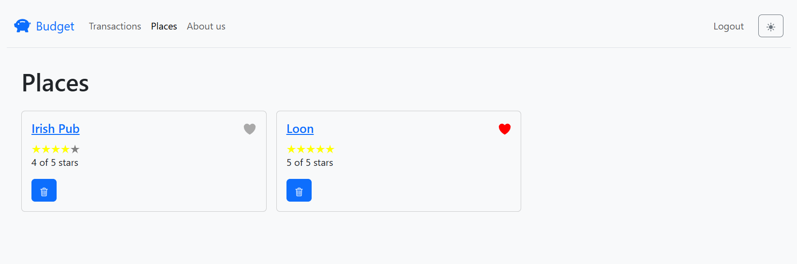
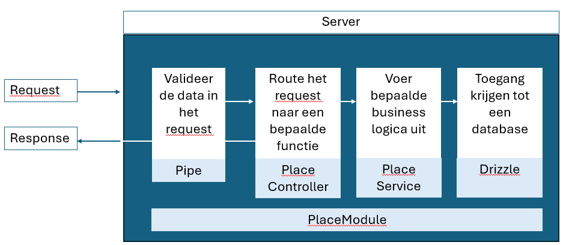

# REST API bouwen

> **Startpunt voorbeeldapplicatie**
>
> ```bash
> git clone https://github.com/HOGENT-frontendweb/webservices-budget.git
> cd webservices-budget
> git checkout -b les3 3acce6c
> yarn install
> yarn start:dev
> ```

## Leerdoelen

- Je krijgt inzicht in de werking van controllers in NestJS
  - Je weet hoe je routes definieert
  - Je weet hoe je meerdere routes binnen één controller groepeert
  - Je weet hoe je verschillende HTTP-methoden implementeert in een controller
  - Je begrijpt hoe je toegang krijgt tot HTTP-aanvraaggegevens (zoals headers, body, params, etc.)
- Je krijgt inzicht in de werking van providers, services en dependency injection in NestJS
  - Je weet hoe je een service maakt en deze beschikbaar stelt als provider
  - Je weet hoe je een service injecteert in een controller
  - Je begrijpt het concept van dependency injection en de voordelen ervan
- Je kan gebruik maken van DTO's
- Je krijgt inzicht in de werking van modules in NestJS

## De budget app

In de olods Front-end Web Development en Web Services maken we een budgetapplicatie. Deze applicatie bestaat uit een front-end en back-end. De front-end is een Single Page Application (SPA) in React, de back-end is een REST API in Node.js m.b.v. NestJS. In deze les beginnen we met het bouwen van de REST API.

De applicatie die we gaan maken bevat volgende pagina's:

<!-- tabs:start -->

### **Transaction pagina**

Deze pagina geeft een overzicht van alle plaatsen van alle gebruikers. Later toont deze enkel de plaatsen van de ingelogde gebruiker.


### **Places pagina**

Deze pagina toont een overzicht van alle plaatsen waar je plaatsen kan doen.



### **Add/edit transaction pagina**

De laatste pagina laat toe om een nieuwe plaats toe te voegen of een bestaande aan te passen.


<!-- tabs:end -->

### Oefening 1 - De budget app

1. Maak het ERD voor de budget app.
   - Gebruik hiervoor <https://kroki.io/> en de ERD syntax: <https://github.com/BurntSushi/erd>
2. Definieer de endpoints die we moeten voorzien in de REST API.
   - Denk na over de HTTP-methoden die je nodig hebt (GET, POST, PUT, DELETE,...)
   - Denk na over de opbouw van de URL's
   - Hebben we geneste routes nodig (bv. de plaatsen van een plaats opvragen)?

<!-- markdownlint-disable header-start-left -->

- Oplossing +

  Het ERD ziet er als volgt uit:

  

  De endpoints die we moeten voorzien zijn:

  #### Transactions

  - `GET /api/transactions`: alle plaatsen opvragen
  - `GET /api/transactions/:id`: een specifieke transactie opvragen
  - `POST /api/transactions`: een nieuwe transactie aanmaken
  - `PUT /api/transactions/:id`: een transactie aanpassen
  - `DELETE /api/transactions/:id`: een transactie verwijderen

  #### Places

  - `GET /api/places`: alle plaatsen opvragen
  - `GET /api/places/:id`: een specifieke plaats opvragen
  - `POST /api/places`: een nieuwe plaats aanmaken
  - `PUT /api/places/:id`: een plaats aanpassen
  - `DELETE /api/places/:id`: een plaats verwijderen
  - `GET /api/places/:id/transactions`: plaatsen van een specifieke plaats opvragen

  #### Users

  - `GET /api/users`: alle gebruikers opvragen
  - `GET /api/users/:id`: een specifieke gebruiker opvragen
  - `POST /api/users`: een nieuwe gebruiker aanmaken
  - `PUT /api/users/:id`: een gebruiker aanpassen
  - `DELETE /api/users/:id`: een gebruiker verwijderen
  - `GET /api/users/:id/transactions`: plaatsen van een specifieke gebruiker opvragen

  Op basis van de gegeven screenshots kan je wel bepaalde API calls schrappen. Zo is er bijvoorbeeld geen nood aan bv. `GET /api/places/:id` of `POST /api/places`. Voor de volledigheid hebben we alle mogelijke API calls neergeschreven.

  !> Kijk goed hoe de twee geneste routes gedefinieerd zijn (`GET /api/places/:id/transactions` en `GET /api/users/:id/transactions`)! Hiertegen worden heel wat fouten gemaakt.

<!-- markdownlint-enable header-start-left -->

## CRUD operaties voor plaatsen

Nu is het tijd om aan onze API te starten! In dit voorbeeld werken we alle CRUD operaties uit voor plaatsen, d.w.z.:

- `GET /api/places`: alle plaatsen opvragen
- `GET /api/places/:id`: een specifieke plaats opvragen
- `POST /api/places`: een nieuwe plaats aanmaken
- `PUT /api/places/:id`: een plaats aanpassen
- `DELETE /api/places/:id`: een plaats verwijderen

NestJS biedt de nodige tools om de inkomende requests af te handelen en een response terug te sturen:



## Datalaag

De datalaag beheert onze data. Uiteraard willen we geen hardgecodeerde data terugsturen. Deze data zal in de toekomst uit een databank moeten komen, maar voorlopig werken we even met mock data (in-memory).

Creëer een nieuw bestand `src/data/mock_data.ts`, in een nieuwe `data` map. We gebruiken ook nog geen relaties, deze worden in een volgend hoofdstuk toegevoegd. We definiëren ook een interface `Place` die vastlegt hoe een plaats eruitziet.

```ts
// src/data/mock_data.ts
export interface Place {
  id: number;
  name: string;
  rating: number;
}

export const PLACES: Place[] = [
  {
    id: 1,
    name: 'Dranken Geers',
    rating: 3,
  },
  {
    id: 2,
    name: 'Irish Pub',
    rating: 2,
  },
  {
    id: 3,
    name: 'Loon',
    rating: 4,
  },
];
```

We houden hier voorlopig een variabele `PLACES` bij met onze places. Deze moeten uiteindelijk in de databank terechtkomen. Je merkt dat we hier een `export` gebruiken. Dit is een manier om variabelen, functies, klassen, enz. beschikbaar te maken voor andere bestanden. In dit geval gebruiken we een named export, dus moeten we deze variabelen importeren met exact dezelfde naam.

Als we ook de `PLACES` willen updaten, hebben we een id nodig om elementen eenduidig van elkaar te onderscheiden. We maken gebruik van een simpele auto-increment (= een geheel getal dat telkens met 1 verhoogd wordt). Bij toevoegen van een plaats moeten we het grootste id zoeken en daar 1 bij optellen. Bij het updaten hoeven we enkel de plaats te zoeken en aan te passen.

## PlaceController

Controllers zijn verantwoordelijk voor het verwerken van binnenkomende verzoeken en het terugsturen van een antwoord naar de client. Het routingmechanisme bepaalt welke controller een verzoek afhandelt. Vaak heeft een controller meerdere routes, en elke route kan een andere actie uitvoeren. Onze controller zal alle [bovenstaande routes](#crud-operaties-voor-plaatsen) bevatten.

### Generatie controller

NestJS biedt een CLI commando om automatisch een controller te genereren:

```bash
nest generate controller place --no-spec
```

Dit commando maakt een map `place` met een bestand `place.controller.ts` aan. Dit bestand bevat de basisstructuur van een controller. De `no-spec` flag zorgt ervoor dat er geen unit test bestand wordt aangemaakt. Voorlopig laten we de testen achterwege, in een later hoofdstuk voegen we daarentegen integratietesten toe.

De controller wordt ook automatisch toegevoegd aan de `app.module.ts` (zie de `controllers` array). Zonder deze toevoeging is de controller niet beschikbaar in de applicatie.

Open het bestand `src/place/place.controller.ts`. De `@Controller('place')` decorator geeft aan dat deze controller verantwoordelijk is voor alle routes die beginnen met `/api/place`.

De Best Practices geven aan dat alle routes zelfstandige naamwoorden in het meervoud dienen te zijn. Pas de naam van de route aan `@Controller('places')`

### HTTP decorators

Elke route in je applicatie wordt afgehandeld door een specifieke methode in je controller. Met behulp van HTTP decorators kan je aangeven welke methode welke HTTP-verzoeken afhandelt:

- `@Get()`: voor GET-verzoeken
- `@Post()`: voor POST-verzoeken
- `@Put()`: voor PUT-verzoeken
- `@Delete()`: voor DELETE-verzoeken
- Enzovoort...

### Statische route `GET /api/places`

Als eerste zullen we de statische route `GET /api/places` implementeren. Deze route haalt alle plaatsen op. Voeg onderstaande inhoud toe aan de controller.

```typescript
// src/place/place.controller.ts
@Get()
getAllPlaces(): string {
  return 'this action returns all places';
}
```

Importeer `Get` uit de `@nestjs/common` package.

De `@Get()` decorator geeft aan dat de `getAllPlaces()` methode reageert op GET verzoeken op de route `/api/places`.

Het routepad is het resultaat van `global prefix + controller pad + methode pad`. Hier dus `/api/places`.

De methodenaam `getAllPlaces` is willekeurig. Je kan even goed de methodenaam `listAllPlaces` of iets anders gebruiken.

De methode `getAllPlaces()` retourneert momenteel een string.

Start de server (als deze nog niet draait) en open de url <http://localhost:3000/api/places> in je browser of Postman. Je zou de string "this action returns all places" moeten zien. We retourneren hier een primitief datatype, dus Nest retourneert de waarde en past hier geen JSON serialisatie toe. Het request retourneert ook een statuscode 200, dit is de standaard voor een succesvolle GET request.

### Route parameters: `GET /api/places/:id`

Niet alle routes kunnen gewoon een hardgecodeerde string zijn, soms heb je een parameter nodig zoals bv. `/api/places/15` of `/api/places/43` om een plaats met een bepaald id op te vragen.

Een request bestaat uit een aantal lijnen met een specifieke betekenis. Aan de hand van decorators kan NestJS specifieke informatie uit het request extraheren.


Om dynamische waarden uit de URL te halen, zoals een id, gebruiken we route parameters.

Lees eerst volgende secties in de documentatie:

- [Request objects](https://docs.nestjs.com/controllers#request-object)
- [Route parameters](https://docs.nestjs.com/controllers#route-parameters)

Voeg onderstaande code toe aan de Controller.

```typescript
// src/place/place.controller.ts
@Get(':id')
getPlaceById(@Param() params: any): string {
  return `This action returns a #${params.id} place`;
}
```

Zorg dat je `@Param` importeert uit `@nestjs/common`.

- `@Get(':id')`: Dit betekent dat elk verzoek naar `/api/places/:id` door deze handler wordt afgehandeld. Het stukje `:id` is een routeparameter die een dynamische waarde vertegenwoordigt.
- `@Param()`: Maakt alle route parameters beschikbaar in de methode.
- `params.id`: Hiermee haal je de waarde van de `:id` uit de URL op.

Je kan het id ook direct ophalen door de parameter direct te benoemen in `@Param()`. Zo is de code korter en duidelijker.

```typescript
// src/place/place.controller.ts
@Get(':id')
getPlaceById(@Param('id') id:string): string {
  return `This action returns a #${id} place`;
}
```

**Belangrijk**: zet routes met parameters na de statische routes in je controller.

Waarom? Als je een route zoals `@Get(':id')` vóór een statische route `@Get('transactions')` plaatst, dan zal een verzoek naar `/api/places/transactions` behandeld worden alsof `transactions` een id is.

### Request body: `POST /api/places`

Een POST-handler gebruik je om nieuwe data te creëren, in dit geval een plaats. De data voor de plaats wordt als JSON data meegestuurd naar de server. De `@Body()` decorator wordt gebruikt om gegevens uit het body-gedeelte van een inkomend HTTP-verzoek op te halen. Dit is vooral handig bij POST-, PUT- of PATCH-verzoeken.

Voeg onderstaande inhoud toe aan de controller.

```typescript
// src/place/place.controller.ts
@Post()
createPlace(@Body() body: any): string {
  console.log(body);
  return `This action adds a new place for ${body.name}`;
}
```

- `@Post()`: Handelt een POST-verzoek af. Importeer dit uit `@nestjs/common`.
- `@Body() body: any`: Haalt de volledige body op als object. Importeer dit uit `@nestjs/common`. Voor de eenvoud gebruiken we nu `any` als type (= mag eender wat zijn), maar later zullen we dit verfijnen.
- `body.name`: Benader de waarden rechtstreeks.

Test dit uit in Postman. Maak een POST request naar <http://localhost:3000/api/places> met volgende body:

```json
{
  "name": "HOGENT",
  "rating": 5
}
```

### HTTP statuscodes

In een RESTful API geven HTTP status codes aan of een verzoek geslaagd is, wat er gebeurd is, of waarom iets is mislukt.

Lees eerst volgende sectie in de documentatie:

- [Status code](https://docs.nestjs.com/controllers#status-code)

Standaard retourneert NestJS de status "200 OK". Echter bij een succesvolle POST zou je expliciet "201 Created" moeten teruggeven, omdat je iets nieuws aanmaakt.

```typescript
// src/place/place.controller.ts
@Post()
@HttpCode(HttpStatus.CREATED) // 👈
createPlace(@Body() body: any): string {
  console.log(body);
  return `This action adds a new place ${body.name}`;
}
```

`@HttpCode` en `HttpStatus` importeer je uit `@nestjs/common`.

Als je meer controle wenst over de response kan je `@Res()` gebruiken. Een voorbeeld:

```typescript
// src/place/place.controller.ts
@Post()
createPlace(@Body() body: any,  @Res() res: Response): string {
  console.log(body);
  res.status(HttpStatus.CREATED).json({
    message: 'place successfully created',
    data: body,
  });// 👈
  return `This action adds a new place ${body.name}`;
}
```

Als je `@Res()` gebruikt, moet je zelf de response altijd volledig afhandelen. `Response` importeer je uit de `express` namespace. Probeer wel om zoveel mogelijk de voorziene decorators te gebruiken.

### Best practice: gebruik DTO's

Een DTO (Data Transfer Object) is een object of klasse die gebruikt wordt om data over te dragen tussen lagen van een applicatie, bijvoorbeeld van de client naar de server, of van de controller naar de service in een NestJS.

In NestJS gebruik je DTO’s vooral om de structuur en validatie van binnenkomende en uitgaande gegevens te definiëren, bijvoorbeeld bij POST- of PUT-verzoeken.

Lees eerst volgende sectie in de documentatie:

- [DTO](https://docs.nestjs.com/controllers#request-payloads)

Maak in de `places` map een bestand `place.dto.ts`. Hierin plaatsen we alle DTO's die binnen places gebruikt worden.

```typescript
// src/place/place.dto.ts
export class CreatePlaceRequestDto {
  name: string;
  rating: number;
}
```

Importeer deze klasse in de `PlaceController` en pas de code voor de `CreatePlace` aan.

```typescript
// src/place/place.controller.ts
@Post()
@HttpCode(HttpStatus.CREATED)
CreatePlace(@Body() createPlaceDto: CreatePlaceRequestDto): string {
  return `This action adds a new place ${createPlaceDto.name}`;
}
```

De validatie komt later aan bod. Dit kan je het eenvoudigst testen via Postman. Gebruik bijvoorbeeld deze body:

```json
{
  "name": "HOGENT",
  "rating": 5,
}
```

### Query parameters: `GET /api/places?page=2&limit=10`

Lees de sectie [Query parameters](https://docs.nestjs.com/controllers#query-parameters) in de documentatie.

In de meeste apps wordt gebruik gemaakt van grote (1000den plaatsen) datasets. Paginatie is dan cruciaal om de prestaties te verbeteren, de server en de client niet te overbelasten, en de gebruikers een beter overzicht te geven. Bij paginatie haal je slechts een deel (= een pagina) van de dataset op. Met `GET /api/places?page=2&limit=10` haal je pagina 2 op met 10 plaatsen op de pagina.

```typescript
// src/place/place.controller.ts
@Get()
getAllPlaces(
  @Query('page') page = 1,
  @Query('limit') limit = 10
) {
  return `This action returns all places. Limit ${limit}, page: ${page}`;
}
```

Query parameters worden vaak ook gebruikt voor zoekopdrachten, bv. `GET /api/places?search=xxx`.

### Oefening: PUT en DELETE

Implementeer volgende routes:

- `PUT /api/places/:id`: een plaats aanpassen
- `DELETE /api/places/:id`: een plaats verwijderen

Voeg een DTO toe voor de body van de `PUT` request.

- Oplossing +

  Het DTO:

  ```typescript
  // src/place/place.dto.ts
  export class UpdatePlaceRequestDto extends CreatePlaceRequestDto {}
  ```

  De code in de controller:

  ```typescript
  // src/place/place.controller.ts
  @Put(':id')
  updatePlace(@Param('id') id: string, @Body() updatePlaceDto:UpdatePlaceRequestDto) {
    return `This action updates the place ${updatePlaceDto.name} with #${id}`;
  }

  @Delete(':id')
  deletePlace(@Param('id') id: string) {
    return `This action removes the place with id #${id}`;
  }
  ```

### Oefening: DTO voor paginatie

Maak een DTO aan voor de query parameters van de paginatie.
Gebruik deze DTO in de `getAllPlaces` methode.

- Oplossing +

  ```typescript
  // src/common/common.dto.ts
  export class PaginationQuery {
    page?: number = 1;
    limit?: number = 10;
  }
  ```

## Providers

Een provider is elk stuk logica dat NestJS kan instantiëren en injecteren, zoals services, repositories, helpers,... In NestJS zijn providers klassen die via de `@Injectable()` decorator beschikbaar worden gemaakt voor `dependency injection`.

Lees de sectie [Providers](https://docs.nestjs.com/providers) in de documentatie.

Dependency Injection (DI) is een design pattern waarbij de afhankelijkheden van een klasse van buitenaf worden binnengebracht, hier door NestJS, in plaats van dat de klasse ze zelf aanmaakt. Dit maakt testen makkelijker, bevordert loskoppeling en herbruikbare en configureerbare code.

## Services

Controllers moeten HTTP-verzoeken afhandelen en complexere taken delegeren aan providers. Een service in NestJS is bedoeld om logica en functionaliteit van je applicatie op een centrale, herbruikbare en testbare manier te organiseren. Services bevatten de domeinlogica (zoals businesslogica, data ophalen, berekeningen, ...), dit is onze domeinlaag. Ze zijn herbruikbaar in andere onderdelen van de app zoals controllers of andere services, en ze kunnen via dependency injection gebruikt worden. Services zijn dus `providers`.

### Generatie service

NestJS biedt een CLI commando om automatisch een service te genereren:

```bash
nest generate service place --no-spec
```

Dit commando maakt de service aan in het bestand `src/place/place.service.ts`.

De service wordt ook automatisch toegevoegd aan de `app.module.ts` (zie de `providers` array). Zonder deze toevoeging zou de service niet beschikbaar zijn in de applicatie en niet injecteerbaar zijn.

De service ziet er als volgt uit:

```typescript
// src/place/place.service.ts
import { Injectable } from '@nestjs/common';

@Injectable()
export class PlaceService {}
```

De `@Injectable()` decorator koppelt metadata aan de klasse, wat aangeeft dat `PlaceService` een klasse is die beheerd kan worden door de Nest IoC-container (zie verder).

### Dependency injection

We passen de `PlaceController` aan om van de service gebruik te maken.

```typescript
// src/place/place.controller.ts
// andere imports...
import { PlaceService } from './place.service';// 👈

@Controller('places')
export class PlaceController {
  constructor(private readonly placeService: PlaceService) {} // 👈

  // ...
}
```

We injecteren de service in de constructor

- `private`:  TypeScript maakt daar automatisch een attribuut van en vult dit in. Het attribuut is bovendien enkel toegankelijk in de klasse.
- `readonly`: is een best practice. Dit verzekert dat we de service reference niet kunnen aanpassen.
- `PlaceService`: het type is belangrijk! NestJS bepaalt op basis van het type welke provider er moet geïnjecteerd worden.

Om een instantie van een klasse aan te maken dienen we normaalgezien deze code te schrijven

```typescript
const placeController = new PlaceController(new PlaceService())
```

Maar NestJS fungeert als een "Dependency Injection (DI) container" of "Inversion of Control (IoC) container. Het IoC-framework maakt hierdoor automatisch objecten aan op basis van aanvragen en injecteert ze indien nodig. NestJS zal een instantie van de `PlaceService` aanmaken en doorgeven aan de `PlaceController`. In het geval van een singleton, zal het de reeds bestaande instantie aanleveren indien deze reeds gecreëerd werd.

Een DI container bevat 2 sets van informatie:

- een lijst met alle Provider klassen uit onze app en hun dependencies
- een lijst van alle instanties die deze container reeds gecreëerd heeft

Providers hebben meestal een levensduur (of scope) die overeenkomt met de levenscyclus van de applicatie. Dat betekent dat ze worden geïnstantieerd wanneer de applicatie opstart, en weer worden vernietigd bij het afsluiten. Het is echter ook mogelijk om een provider request-scoped te maken. In dat geval wordt de provider aangemaakt en beheerd per individuele aanvraag, in plaats van één keer voor de hele applicatie. Zo kan je meer controle krijgen over afhankelijkheden die specifieke context of data per verzoek nodig hebben.

In onderstaand voorbeeld gaan we ervan uit dat de service een afhankelijkheid heeft met een repository (wat we later zullen toevoegen aan de Rest API).


Bij dependency injection noem je het object dat de afhankelijkheid ontvangt de `client`, en het object dat wordt doorgegeven (de geïnjecteerde afhankelijkheid) de `service`. De code die deze service aan de client levert, heet de `injector`. In plaats van dat jij in de client expliciet aangeeft welke service je wil gebruiken, bepaalt de injector dat voor jou. Injection verwijst dus naar het proces waarbij een afhankelijkheid (de service) wordt doorgegeven aan de client die ze nodig heeft.

Wil je meer info? Lees het stuk over [Dependency injection](https://docs.nestjs.com/providers#dependency-injection) in de documentatie.

### Implementatie service

Voor de implementatie van de service maken we gebruik van de in-memory data `PLACES`. Dit is onze data source. In een volgende hoofdstuk vervangen we dit door een database.

Binnen de service voorzien we alle CRUD acties die we later vanuit de controller zullen aanroepen. We implementeren momenteel enkel de GET en de POST methodes. Maar opdat alles uitvoerbaar zou zijn, declareren we alle methoden met de correcte types, en laten we ze een error gooien als ze gebruikt worden.

We dienen ook het returntype van de methodes vast te leggen. Hiervoor maken we eerst de nodige DTO's aan in `src/place/place.dto.ts`.

```typescript
// src/place/place.dto.ts
export class PlaceResponseDto extends CreatePlaceRequestDto {
  id: number;
}

export class PlaceListResponseDto {
  items: PlaceResponseDto[];
}
```

- `PlaceResponseDto` beschrijft hoe een enkele plaats eruitziet in een API-response: wanneer er een plaats wordt opgehaald of wanneer een plaats gecreëerd of aangepast wordt.
- `PlaceListResponseDto` beschrijft de lijst van de plaatsen die zal worden teruggegeven bij het ophalen van alle plaatsen.

De service wordt als volgt aangepast:

```typescript
// src/place/place.service.ts
import { Injectable } from '@nestjs/common';
import { PLACES } from '../data/mock-data';
import { CreatePlaceRequestDto, UpdatePlaceRequestDto, PlaceListResponseDto, PlaceResponseDto } from './place.dto';

@Injectable()
export class PlaceService {

  getAll(): PlaceListResponseDto {
    return { items: PLACES };
  }

  getById(id: number): PlaceResponseDto {
    return PLACES.find(item => item.id === id);
  }

  create({ name, rating }: CreatePlaceRequestDto): PlaceResponseDto {
    const newplace = { id: Math.max(...PLACES.map(item => item.id)) + 1, name, rating };
    PLACES.push(newplace);
    return newplace;
  }

  updateById(id: number, { name, rating }: CreatePlaceRequestDto): PlaceResponseDto {
    throw new Error('not yet implemented');
  }

  deleteById(id: number): void {
    throw new Error('not yet implemented');
  }
}
```

In de `create` methode creëren we een nieuwe plaats met het id erbij en voegen deze toe aan onze array. We genereren een nieuw id voor onze plaats door het hoogste id te zoeken en er 1 bij op te tellen.

### Implementatie controller

In de controller kunnen we nu gebruik maken van de `PlaceService`. De code wordt:

```typescript
// src/place/place.controller.ts
import {
  Body, Controller, Delete, Get, Param, Put, Post, HttpStatus, HttpCode
} from '@nestjs/common';
import { PlaceService } from './place.service';
import { CreatePlaceRequestDto, UpdatePlaceRequestDto, PlaceListResponseDto, PlaceResponseDto } from './place.dto';

@Controller('places')
export class PlaceController {
  constructor(private readonly placeService: PlaceService) { }

  @Get()
  getAllPlaces(): PlaceListResponseDto {
    return this.placeService.getAll();
  }

  @Get(':id')
  getPlaceById(@Param('id') id: string): PlaceResponseDto {
    return this.placeService.getById(Number(id));
  }

  @Post()
  @HttpCode(HttpStatus.CREATED)
  createPlace(@Body() createPlaceDto: CreatePlaceRequestDto): PlaceResponseDto {
    return this.placeService.create(createPlaceDto);
  }
}
```

Vervang de hardgecodeerde data door de aanroep van de methodes in de `PlaceService`, that's it!

Merk op:

- `getAllplaces`: Het is een slecht idee om een JSON array terug te geven in een HTTP response. Het is beter om een object terug te geven met een items property die de array bevat. Een JSON array is geldige JavaScript en kan bijgevolg uitgevoerd worden. Dit kan een XSS aanval mogelijk maken. Een object kan niet uitgevoerd worden en is dus veiliger. Dit heet JSON Hijacking. Tegenwoordig is dit niet meer zo'n groot probleem, maar het is een goede gewoonte om het correct te doen.
- `getPlaceById`: De service verwacht een number, vandaar `Number(id)`.
- `create`: Geef de net toegevoegde place ook weer terug vanuit de `create` via de response body. Het lijkt misschien wat raar om eigenlijk hetzelfde terug te geven dan wat je binnen kreeg maar dat is meestal een goed idee. Daarmee weet de gebruiker van de API hoe je het opgeslagen hebt, wat niet noodzakelijk hetzelfde is als hoe hij het doorgaf. Bijvoorbeeld: bij ons kan de omzetting van de datum iets wijzigen en sowieso zal er een 'id' toegevoegd zijn.

Test alle endpoints uit in Postman:

- Doe een GET request naar <http://localhost:9000/api/places/1> en je zou de eerste plaats moeten zien. Als je een id opgeeft van een plaats die niet bestaat, krijg je een HTTP 200 OK en een leeg antwoord. Voor nu is dit goed, later geven we een foutmelding terug.
- Bij de POST request zou je de nieuwe plaats moeten zien verschijnen in de response en in de lijst van plaatsen als je een GET request doet naar `/api/places`. Natuurlijk is dit nog niet persistent en verdwijnt de plaats als je de server herstart.

### Oefening

Maak vervolgens zelf de PUT en DELETE routes en hun bijhorende service-methoden:

- `PUT /api/places/:id`:
  - een plaats aanpassen
  - geeft de aangepaste plaats terug
- `DELETE /api/places/:id`:
  - een plaats verwijderen
  - geeft niets terug
  - geef status "204 No Content" terug
- Extra (voor de ervaren JavaScript'ers): maak alle service-methoden async (zoals de databank zal zijn). Geef promises terug en gebruik async/await in de routes.

<br/>

- Oplossing +

  De service:

  ```typescript
  // src/place/place.service.ts
  updateById(id: number, { name, rating }: UpdatePlaceRequestDto): PlaceResponseDto {
    let existingplace = this.getById(id);
    if (existingplace) {
      existingplace = { id: id, name, rating }
    }
    return existingplace;
  }

  deleteById(id: number): void {
    const index = PLACES.findIndex(item => item.id === id);
    if (index >= 0) {
      PLACES.splice(index, 1);
    }
  }
  ```

  De controller:

  ```typescript
  // src/place/place.controller.ts
  @Put(':id')
  updatePlace(@Param('id') id: string, @Body() updatePlaceDto: UpdatePlaceRequestDto): PlaceResponseDto {
    return this.placeService.updateById(Number(id), updatePlaceDto);
  }

  @Delete(':id')
  @HttpCode(HttpStatus.NO_CONTENT)
  deletePlace(@Param('id') id: string): void {
    this.placeService.deleteById(Number(id));
  }
  ```

### Oefening - Je eigen project

- Maak alle CRUD endpoints voor één entiteit uit je project (nog zonder relaties)
- Maak mock data
- Maak de service

## Exception handling

Als de gebruiker een plaats probeert op te vragen waarvan de id niet bestaat, dan wensen we een `404 NOT FOUND` terug te geven.

`NotFoundException` is een ingebouwde HTTP-exception in NestJS die je gebruikt om aan te geven dat een bepaald item niet gevonden is. Wanneer je deze exception gooit, stuurt NestJS automatisch een HTTP-response terug met statuscode 404 en een duidelijke foutboodschap.

```typescript
// src/place/place.service.ts
import { Injectable, NotFoundException } from '@nestjs/common'; // 👈 1

// ...

getById(id: number): PlaceResponseDto {
  const place = PLACES.find(item => item.id === id); // 👈 2

  // 👇 3
  if (!place) {
    throw new NotFoundException(`place #${id} not found`);
  }

return place; // 👈 3
}
```

1. Importeer `NotFoundException` uit de `@nestjs/common`namespace.
2. Definieer een constante die de de opgevraagde plaats bevat.
3. Als geen plaats gevonden, throw dan `NotFoundException`, anders retourneer de gevonden plaats.

NestJS heeft helpermethodes voor alle mogelijke status codes, zoals `InternalServerError` (500), `BadRequestException` (404),...

Probeer uit in Postman.

## Modules

In NestJS is een module een manier om je applicatie op te delen in overzichtelijke, goed georganiseerde stukken. Een module is eigenlijk een TypeScript-klasse met de `@Module()` decorator. Binnen zo’n module geef je aan welke controllers, services en andere providers erbij horen.

Je kan het zien als een container die alles groepeert wat bij een bepaald domein of functie hoort. Bijvoorbeeld: je maakt een `PlaceModule` om alles rond beheer van places (controllers, services...) bij elkaar te houden.

Modules helpen je applicatie modulair en schaalbaar te maken. Ze zorgen ervoor dat je code gestructureerd is, makkelijk te onderhouden en herbruikbaar. Elke NestJS-applicatie heeft minstens één root module (meestal `AppModule`), maar je kan er zoveel maken als je wil om je app logisch op te splitsen.

Lees de documentatie over [modules](https://docs.nestjs.com/modules).

NestJS biedt een CLI commando om automatisch een module te genereren:

```bash
nest g module place
```

De module klasse wordt toegevoegd aan de `place` folder en wordt geïmporteerd in de `AppModule`.

```typescript
// src/place/place.module.ts
import { Module } from '@nestjs/common';

@Module({})
export class PlaceModule {}
```

De `@Module()` decorator maakt van een TypeScript-klasse een NestJS-module. Hierin geef je aan wat bij deze module hoort. Het is als een container die controllers, services en andere dependencies groepeert.

- `imports`: Hier geef je andere modules op die je nodig hebt in deze module.
- `controllers`: Dit is een lijst van controllers die bij deze module horen.
- `providers`: Dit zijn services of andere providers die NestJS beschikbaar maakt in de dependency injection container.
- `exports`: Hiermee deel je providers met andere modules.

Pas de code aan:

```typescript
// src/place/place.module.ts
import { Module } from '@nestjs/common';
import { PlaceController } from './place.controller'; // 👈
import { PlaceService } from './place.service'; // 👈

@Module({
  imports: [], // 👈
  controllers: [PlaceController], // 👈
  providers: [PlaceService], // 👈
})
export class PlaceModule {}
```

Verwijder dan de `PlaceController` en `PlaceService` uit `AppModule`.

Het is een goed idee om steeds eerst de module aan te maken en dan de controllers en services. Dan wordt alles in de correcte module geplaatst.

### Oefening - Je eigen project

Doe dezelfde refactoring in je eigen project:

- Voeg exceptionhandling toe.
- Voeg een module toe.

## CORS

Als je geen Front-end Web Development volgt, is dit onderdeel niet vereist. Als je natuurlijk later een eigen front-end wil koppelen aan je back-end, is dit wel vereist.

Als je vanuit een front-end een HTTP request stuurt naar een ander domein dan krijg je volgende fout:

```text
Access to fetch at 'https://app.mydomain.com' from origin 'http://localhost:9000'
has been blocked by CORS policy: Response to preflight request doesn't pass access
control check:
```

CORS is een HTTP-functie waarmee een webapplicatie, die wordt uitgevoerd onder één domein, toegang kan krijgen tot resources in een ander domein. Webbrowsers implementeren een beveiligingsbeperking die bekend staat als "same-origin-beleid" dat voorkomt dat een webpagina API's in een ander domein aanspreekt. CORS biedt een veilige manier om vanuit het ene domein (het oorspronkelijke domein) API's in een ander domein aan te spreken. Zie de [CORS-specificatie](https://fetch.spec.whatwg.org/) voor meer informatie.

Een CORS-aanvraag van een oorsprongdomein kan bestaan uit twee afzonderlijke aanvragen:

1. Een eerste aanvraag, waarin de CORS-beperkingen worden opgevraagd die door de service zijn opgelegd. Dit heet het preflight request.
2. De werkelijke aanvraag, gemaakt op de gewenste resource.

Lees de documentatie over [CORS](https://docs.nestjs.com/security/cors).

Pas de code in `main.ts` aan:

```ts
// src/main.ts
// ...

app.enableCors({
  origins: ['http://localhost:5173'],
  maxAge: 3 * 60 * 60,
})

// ...
```

Deze code zorgt ervoor dat je NestJS-backend CORS toestaat:

- `origins`: de oorspronkelijke domeinen die via CORS een aanvraag mogen indienen. Dit is de URL van de webapp die gemaakt wordt in het olod Front-end Web Development.
  - Als je een API maakt die door meerdere front-ends gebruikt wordt, kan je hier een array van domeinen meegeven.
  - Natuurlijk zal ons domein in productie iets anders dan <http://localhost:5173> zijn, maar dat lossen we op in het hoofdstuk rond CI/CD.
- `maxAge`: de maximale tijd die een browser nodig heeft om de preflight OPTIONS-aanvraag in de cache op te nemen (hier 3u), zodat niet bij elk verzoek opnieuw toestemming gevraagd hoeft te worden.

### Oefening - Je eigen project

Voeg CORS toe aan je eigen project.

> **Oplossing voorbeeldapplicatie**
>
> ```bash
> git clone https://github.com/HOGENT-frontendweb/webservices-budget.git
> cd webservices-budget
> git checkout -b les2-opl TODO:
> pnpm install
> pnpm start:dev
> ```
