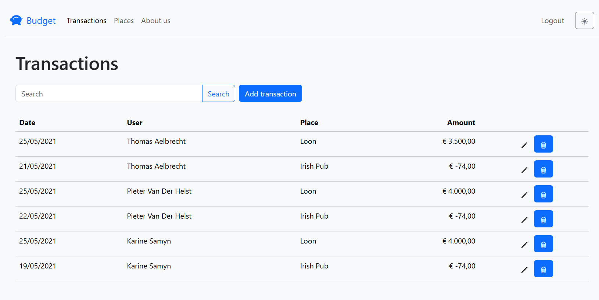

# REST API bouwen

l> ws start 0e38b85 les2

## De budget app

In de olods Front-end Web Development en Web Services maken we een budgetapplicatie. Deze applicatie bestaat uit een front-end en back-end. De front-end is een Single Page Application (SPA) in React, de back-end is een REST API in Node.js m.b.v. Koa. In deze les beginnen we met het bouwen van de REST API.

De applicatie die we gaan maken bevat volgende pagina's

<!-- tabs:start -->

### **Transactions pagina**

Deze pagina geeft een overzicht van alle transacties van alle gebruikers. Later toont deze enkel de transacties van de ingelogde gebruiker.

   

### **Places pagina**

Deze pagina toont een overzicht van alle plaatsen waar je transacties kan doen.

   

### **Add/edit transaction pagina**

De laatste pagina laat toe om een nieuwe transactie toe te voegen of een bestaande aan te passen.

   

<!-- tabs:end -->

### Oefening 1 - De budget app

- Maak het ERD.
- Welke endpoints moeten we voorzien?

<!-- markdownlint-disable-next-line -->
+ Oplossing +

  Het ERD ziet er als volgt uit:

  

  De endpoints die we moeten voorzien zijn:

  <!-- markdownlint-disable-next-line -->
  **Transactions**

  - `GET /api/transactions`: alle transacties opvragen
  - `GET /api/transactions/:id`: een specifieke transactie opvragen
  - `POST /api/transactions`: een nieuwe transactie aanmaken
  - `PUT /api/transactions/:id`: een transactie aanpassen
  - `DELETE /api/transactions/:id`: een transactie verwijderen

  **Places**

  - `GET /api/places`: alle plaatsen opvragen
  - `GET /api/places/:id`: een specifieke plaats opvragen
  - `POST /api/places`: een nieuwe plaats aanmaken
  - `PUT /api/places/:id`: een plaats aanpassen
  - `DELETE /api/places/:id`: een plaats verwijderen
  - `GET /api/places/:id/transactions`: transacties van een specifieke plaats opvragen

  **Users**

  - `GET /api/users`: alle gebruikers opvragen
  - `GET /api/users/:id`: een specifieke gebruiker opvragen
  - `POST /api/users`: een nieuwe gebruiker aanmaken
  - `PUT /api/users/:id`: een gebruiker aanpassen
  - `DELETE /api/users/:id`: een gebruiker verwijderen
  - `GET /api/users/:id/transactions`: transacties van een specifieke gebruiker opvragen

  Op basis van de gegeven screenshots kan je wel bepaalde API calls schrappen. Zo is er bijvoorbeeld geen nood aan bv. `GET /api/places/:id` of `POST /api/places`. Voor de volledigheid hebben we alle mogelijke API calls neergeschreven.

  !> Kijk goed hoe de twee geneste routes gedefineerd zijn (`GET /api/places/:id/transactions` en `GET /api/users/:id/transactions`)! Hiertegen worden heel wat fouten gemaakt.

## Configuratie

Voor we aan de API beginnen, moeten we onze server beter configureerbaar maken. Typisch wil je verschillende instellingen al naargelang je in een development, productie of test omgeving bent. Hiermee bedoelen we instellingen zoals databankgegevens (locatie, poort, gebruikersnaam, wachtwoord..), op welke poort de server luistert, logging niveau, enzovoort.

De configuratie doen we liefst op 1 plaats. In `src/index.ts` verwijzen we bv. naar poort 9000, dit zetten we best niet in code. In `src/core/logging.ts` staat het level op `info`, maar dit willen we enkel in productie - in development willen we level `debug`.

Eerst installeren het [config](https://www.npmjs.com/package/config) en de bijhorende types. Dit package laat toe om eenvoudig configuratie te switchen op basis van de environment variabele `NODE_ENV`.

```terminal
yarn add config
yarn add --dev @types/config
```

Het package `config` vereist dat de `NODE_ENV` environment variabele gedefinieerd is. Deze stel je typisch in op bv. 'development' of 'production'. De library zoekt in de `config` map naar een bestand met de naam uit `NODE_ENV` (bv. `config/development.js`).

Eventueel kan je een extra bestand `config/custom-environment-variables.js` definiëren. Dit bestand bevat mappings om andere environment variabelen ook via de config in de app te laden. Dit maakt het eenvoudig om configuratie tijdelijk aan te passen zonder dat je het specifieke configuratiebestand moet aanpassen.

Maak een `.env` bestand aan in de root met onderstaande code

```ini
NODE_ENV=production
```

Dit `.env` bestand zal niet in GitHub komen door onze `.gitignore` (en dat is de bedoeling!). Dus het is ook de ideale plaats om 'geheimen' (API keys, JWT secrets...) in op te nemen, later meer hierover.

We passen ons `start:dev` script in de `package.json` aan zodat het `.env` bestand ingelezen wordt. Node.js heeft [sinds v20.6.0](https://nodejs.org/en/blog/release/v20.6.0) ondersteuning voor `.env` bestanden, je kan ze inlezen met de `--env-file` optie.

```json
{
  "scripts": {
    "start:dev": "tsx watch --env-file .env --inspect=0.0.0.0:9001 src/index.ts",
  }
}
```

We definiëren een paar log configuratievariabelen zodat we iets kunnen testen. Maak hiervoor `config/development.ts`
aan met volgende inhoud

```ts
export default {
  log: {
    level: 'silly',
    disabled: false,
  },
};
```

Doe hetzelfde voor productie, nl. in `config/production.js`, met net iets andere waarden natuurlijk, anders zien we het verschil niet.

```ts
export default {
  log: {
    level: 'info',
    disabled: false,
  },
};
```

We gebruiken `export default` om een object te exporteren uit het bestand. Het `default` keyword zorgt ervoor dat je het object kan importeren zonder accolades, bv. `import config from 'config/development'`. Automatisch kiest TypeScript de default export als je `import` zonder accolades gebruikt. Het `config` package verplicht om de configuratiebestanden te exporteren als een object in de default export.

Meer hoeven we niet te doen, we kunnen de config beginnen gebruiken. Pas `src/core/logging.ts` aan:

```ts
// src/core/logging.ts
import winston from 'winston';
import config from 'config'; // 👈 1

const NODE_ENV = process.env.NODE_ENV; // 👈 4
const LOG_LEVEL = config.get<string>('log.level'); // 👈 2
const LOG_DISABLED = config.get<boolean>('log.disabled'); // 👈 2

console.log(`node env: ${NODE_ENV}, log level ${LOG_LEVEL}, logs enabled: ${LOG_DISABLED !== true}`); // 👈 7

const rootLogger: winston.Logger = winston.createLogger({
  level: LOG_LEVEL, // 👈 3
  format: winston.format.simple(),
  transports: [new winston.transports.Console({ silent: LOG_DISABLED })], // 👈 3
});

export const getLogger = () => {
  return rootLogger;
};
```

1. We vragen het config object op
2. Alle gedefinieerde configuratievariabelen zijn beschikbaar via een `.get()`. Je kan een syntax met punten gebruiken om dieper in de structuur te gaan, bv. `log.level` om het property `level` binnen het object `log` op te vragen.
   - Let op dat je de types meegeeft tussen de `<>` haakjes. Dit zijn generieke types, je kan ze zien als een soort van argumenten die je meegeeft aan een functie. In dit geval geef je het type van de waarde die je verwacht terug te krijgen mee. TypeScript zorgt er vervolgens voor dat de returnwaarde van `config.get` van dat type is.
   - Als je bv. `config.get('log.level')` zou schrijven, zou TypeScript klagen bij het instellen van het `level` dat het type van de variabele `LOG_LEVEL` niet overeenkomt met het type dat de optie `level` verwacht. Probeer dit eens uit.
3. Pas ook de hardgecodeerde waarden aan, zodat we de config gebruiken. We schakelen de logging uit als `log.disabled` de waarde `true` heeft.
4. Je kan de environment variabelen ook expliciet opvragen, via de `process.env`. Dat is natuurlijk een beetje onhandig, je moet weten welke configuratie via het environment binnenkomt, en welke via de configuratiebestanden. En wat als iets in beide gedefinieerd is? Het is beter om alles via de configuratie te laten lopen, dit lossen we op in de volgende stap.
5. Start de app en controleer dat alles werkt. We moeten dus 'info' zien, want `NODE_ENV` is gelijk aan 'production'.
6. Pas de waarde van `NODE_ENV` aan in je `.env` bestand aan naar `development` en start de app opnieuw. Je zou nu 'development' moeten zien.
7. Verwijder de `console.log` als alles werkt, deze hebben we enkel gebruikt om te testen.

Gelukkig heeft `config` een manier om environment variabelen mee in te lezen in de configuratie zodat we alles kunnen opvragen via `config.get()`. Op die manier staat **alle configuratie centraal**, dit is een best practice! Maak een bestand binnen de `config` map met de naam `custom-environment-variables.ts`. Let op de schrijfwijze, een schrijffout zal ervoor zorgen dat het niet werkt.

Zet daarin volgende inhoud:

```ts
export default {
  env: 'NODE_ENV',
};
```

In dit bestand definieer je welke configuratievariabelen gedefinieerd worden door welke environment variabele. In dit voorbeeld krijgt `config.get('env')` de waarde van `process.env.NODE_ENV`. Als iets zowel binnen een configuratiebestand gedefinieerd is als via een environment variabele, zal de environment variabele gebruikt worden. Environment variabelen overschrijven dus steeds de configuratiebestanden. Dit zal zeer handig zijn voor bv. geheime sleutels die je niet in je code wil hebben.

Dus we kunnen de `process.env` vervangen door een `config.get(...)`:

```ts
// src/core/logging.ts
import winston from 'winston';
import config from 'config';

const NODE_ENV = config.get<string>('env'); // 👈

// ...
```

## CRUD operaties

Nu is het tijd om aan onze API te starten! In dit voorbeeld werken we alle CRUD operaties uit voor transacties, d.w.z.:

- `GET /api/transactions`: alle transacties opvragen
- `GET /api/transactions/:id`: een specifieke transactie opvragen
- `POST /api/transactions`: een nieuwe transactie aanmaken
- `PUT /api/transactions/:id`: een transactie aanpassen
- `DELETE /api/transactions/:id`: een transactie verwijderen

Binnen onze middlewarefuncties bevat de context alle informatie over het request zoals die bij onze server toekomt.

Voeg onderstaande code toe aan `index.js`:

```ts
// ...
app.use(async (ctx) => {
  getLogger().info(JSON.stringify(ctx.request));
  ctx.body = 'Hello World from TypeScript';
});

// ...
```

Start de server en voer een request uit naar `http://localhost:9000` (bv. via Postman). Je zou volgende output moeten zien:

```text
info: {"method":"GET","url":"/","header":{"host":"localhost:9000", ... }}
```

Het request object bevat alle informatie over het request, zoals de HTTP methode, de URL, de headers, de body... Je kan dus eigenlijk controleren welk request binnenkomt en op basis daarvan een response sturen. Pas de middleware als volgt aan:

```ts
app.use(async (ctx) => {
  logger.info(JSON.stringify(ctx.request));
  if (
    ctx.request.method === 'GET' && // 👈 1
    ctx.request.url === '/api/transactions'
  ) {
    ctx.body = '[{"user": "Benjamin", "amount": 100, "place": "Irish Pub", "date": "2021-08-15" }]'; // 👈 2
  } else {
    ctx.body = 'Hello World from TypeScript'; // 👈 3
  }
});
```

1. Identificeer op basis van de method en URL de juiste actie.
2. Geef de data in de body mee, zodat de gebruiker een lijst van transacties krijgt.
3. We laten de 'Hello World from TypeScript' staan voor alle andere requests.

Probeer dit uit door een request te versturen naar <http://localhost:9000/api/transactions> (bv. via Postman). Je zou de lijst van transacties moeten zien.

## Router

Je zou op deze manier een hele server kunnen bouwen maar je voelt al dat veel werk altijd hetzelfde zal zijn. Voor zo'n simpele GET request valt het mee, maar wat als je ook de body/headers moet parsen, authenticatie moet afhandelen... Dus, zoals zo vaak, een goede library is het halve werk. Bij programmeren anno 2023 is het vaak belangrijker om een goede library te kennen/kunnen vinden dan algoritmes uit te denken en te implementeren.

We voegen [@koa/router](https://www.npmjs.com/package/koa-router) [koa-bodyparser](https://www.npmjs.com/package/koa-body-parser), en hun types toe om requests makkelijker af te handelen.

```terminal
yarn add @koa/router koa-bodyparser
yarn add --dev @types/koa__router @types/koa-bodyparser
```

- **koa-bodyparser** is een middleware die we moeten toevoegen voor Koa bij onze routes aankomt. Het zal de request body parsen voor ons. Het heeft ondersteuning voor JSON, form en text bodies.
- **@koa/router** is ook een middleware en zal de routing op zich nemen. Met andere woorden het zal de juiste code uitvoeren als bv. een `POST /api/transactions` toekomt op de server.
  - Het package voor de types is `@types/koa__router` (let op de dubbele underscore). De dubbele underscore is nodig aangezien je maar één / in een package naam mag hebben.

We voegen alvast de bodyparser toe.

```ts
// src/index.ts
import Koa from 'koa';
import bodyParser from 'koa-bodyparser' // 👈 1
import { getLogger } from './core/logging';

const app = new Koa();

app.use(bodyParser()); // 👈 2

app.use(async (ctx) => {
  getLogger().info(JSON.stringify(ctx.request));
  getLogger().info(JSON.stringify(ctx.request.body)); // 👈 3
  if (
    ctx.request.method === 'GET' &&
    ctx.request.url === '/api/transactions'
  ) {
    ctx.body = '[{"user": "Benjamin", "amount": 100, "place": "Irish Pub", "date": "2021-08-15" }]';
  } else {
    ctx.body = 'Hello World from TypeScript';
  }
});

app.listen(9000, () => {
  getLogger().info('🚀 Server listening on http://127.0.0.1:9000');
});
```

1. Importeer de bodyparser.
2. Geef deze mee aan het Koa object. Doe dit vóór je eigen middlewarefuncties, anders is deze nog niet uitgevoerd (en in dit geval zal de body dus nog niet geparsed).
3. Log de request body.
4. Je kan dit snel testen door een POST request -met body- via Postman te sturen. Open postman en doe een POST naar <http://localhost:9000/api/transactions> en geef als JSON body `{ "message": "Hello world" }` in en voer uit. Verwijder dan eens de bodyparser middleware en bekijk dan het resultaat van de POST. Je kan de middleware eens uitschakelen om het verschil te zien.

We willen nu ook gebruik maken van de router.

```ts
import Koa from 'koa';
import bodyParser from 'koa-bodyparser'
import Router from '@koa/router'; // 👈 1
import { getLogger } from './core/logging';

const app = new Koa();

app.use(bodyParser());

const router = new Router(); // 👈 2

// 👇 3
router.get('/api/transactions', async (ctx) => {
  ctx.body = '[{"user": "Benjamin", "amount": 100, "place": "Irish Pub", "date": "2021-08-15" }]'; // 👈 4
});

app.use(router.routes()) // 👈 4
   .use(router.allowedMethods()); // 👈 4

app.listen(9000, () => {
  getLogger().info('🚀 Server listening on http://127.0.0.1:9000');
});
```

1. Verwijder ons manueel gepruts en importeer de Koa Router.
2. Dan creëren we een instantie van deze router.
3. Daarna kunnen we routes definiëren, elke route is een 'werkwoord' met een path op ons router object. Dus je kan `router.get`, `router.put`... gebruiken. Na het path geef je de middlewares die uitgevoerd moeten worden bij dit request. In ons geval is dit slechts één middleware, maar meerdere kunnen zeker (denk aan authenticatie, validatie...).
4. We zorgen ervoor dat de response body ingesteld wordt. De overige code van onze middleware van daarnet mag weg.
5. Om te zorgen dat onze app alle routes gebruikt voegen we `routes()` en `allowedMethods()` toe als middlewares.
   - `routes()` zorgt voor de routing.
   - `allowedMethods()` zorgt voor een HTTP 405 indien een HTTP method niet toegelaten is, en antwoordt op OPTIONS requests met een `Allow` header.

## Mappenstructuur

In wat volgt gaan we de code wat herstructureren zodat we een mooie gelaagde applicatie krijgen. We gaan de code (voorlopig) opsplitsen in 2 lagen:

- **data**: beheert onze data (momenteel in-memory maar later in een databank)
- **service**: de business logica

### Datalaag

Uiteraard willen we geen hardgecodeerde data terugsturen. Deze data zal uit een databank moeten komen. Voorlopig gaan we even met mock data werken (in-memory). Creëer een nieuw bestand `src/data/mock_data.js`, in een nieuwe `data` map.

```ts
export const PLACES = [
  {
    id: 1,
    name: 'Dranken Geers',
    rating: 3,
  },
  {
    id: 2,
    name: 'Irish Pub',
    rating: 2,
  },
  {
    id: 3,
    name: 'Loon',
    rating: 4,
  },
];

export const TRANSACTIONS = [
  {
    id: 1,
    amount: -2000,
    date: '2021-05-08T00:00:00.000Z',
    user: {
      id: 1,
      name: 'Thomas Aelbrecht',
    },
    place: {
      id: 2,
      name: 'Irish Pub',
    },
  },
  {
    id: 2,
    amount: -74,
    date: '2021-05-21T12:30:00.000Z',
    user: {
      id: 1,
      name: 'Thomas Aelbrecht',
    },
    place: {
      id: 2,
      name: 'Irish Pub',
    },
  },
  {
    id: 3,
    amount: 3500,
    date: '2021-05-25T17:40:00.000Z',
    user: {
      id: 1,
      name: 'Thomas Aelbrecht',
    },
    place: {
      id: 3,
      name: 'Loon',
    },
  },
];
```

We houden hier voorlopig een variabele bij met onze transactions en places. Deze moeten uiteindelijk in de databank terechtkomen. Je merkt dat we hier een `export` gebruiken. Dit is een manier om variabelen, functies of klassen beschikbaar te maken voor andere bestanden. In dit geval maken we de variabelen `PLACES` en `TRANSACTIONS` beschikbaar voor andere bestanden. In dit geval gebruiken we een named export, dus moeten we deze variabelen importeren met exact dezelfde naam.

Als we ook de transactions willen updaten gaan we een id nodig hebben om elementen eenduidig van elkaar te onderscheiden. We maken gebruik van een simpele auto-increment (= een geheel getal dat telkens met 1 verhoogd wordt). Ook aan de places voegen we een uniek id toe. Bij toevoegen van transactions/places moeten we het grootste id zoeken en daar 1 bij optellen. Bij het updaten hoeven we enkel de transaction/place te zoeken en aan te passen.

### Servicelaag

We creëren een nieuw bestand `transaction.ts`, in een nieuwe `service` map. Voorlopig hebben we enkel de functie `getAll()` nodig, de rest implementeren we later. Maar opdat alles uitvoerbaar zou zijn, declareren we ze alle functies met de correcte types, en laten we ze een error gooien als ze gebruikt worden. Voor de functies `create` en `updateById` geven we een object mee met de nodige data. Voor de eenvoud gebruiken we nu `any` als type (= mag eender wat zijn), maar later zullen we dit verfijnen.

```ts
// src/service/transaction.ts
import { TRANSACTIONS, PLACES } from '../data/mock_data';

export const getAll = () => {
  return { items: TRANSACTIONS, count: TRANSACTIONS.length };
};

export const getById = (id: string) => {
  throw new Error('Not implemented yet!');
};

export const create = ({ amount, date, placeId, user }: any) => {
  throw new Error('Not implemented yet!');
};

export const updateById = (id: string, { amount, date, placeId, user }: any) => {
  throw new Error('Not implemented yet!');
};

export const deleteById = (id: string) => {
  throw new Error('Not implemented yet!');
};
```

Let al op de signatuur van de `create` en `updateById` functies. Als we data nodig hebben, gaan we ze als object doorgeven: `{ amount, date, placeId, user }`.

De route aanpassen is nu niet veel werk. Pas aan in de `index.js`:

```js
import Koa from 'koa';
import bodyParser from 'koa-bodyparser'
import Router from '@koa/router';
import { getLogger } from './core/logging';
import * as transactionService from './service/transaction'; // 👈 1

// ...

// 👇 2
router.get('/api/transactions', async (ctx) => {
  ctx.body = transactionService.getAll();
});

// ...
```

1. We importeren de service. We gebruiken hier `import *` om alle exports van de module te importeren in één object. Dit is een handige manier om niet steeds opnieuw een functie te moeten importeren als je een nieuwe functie nodig hebt uit hetzelfde bestand.
2. En vervangen de hardgecodeerde data door een `getAll()` aanroep, that's it!

### Oefening 2 - Je eigen project

Doe nu hetzelfde in je eigen project:

- Installeer alle packages:
  - `config`
  - `koa-router`
  - `koa-bodyparser`
  - `@types/config`
  - `@types/koa__router`
  - `@types/koa-bodyparser`
- Zorg dat je de configuratie kan lezen.
- Gebruiker de bodyparser en test uit.
- Maak een GET route aan voor het opvragen van alle resources (van een entiteit naar keuze) en test uit.
- Zorg voor een degelijke mappenstructuur met mock data en een service laag.

## De POST route

De POST route om een nieuwe transactie toe te voegen is zeer gelijkaardig.

```js
const Koa = require('koa');
const Router = require('@koa/router');
const transactionService = require('./service/transaction');

router.get('/api/transactions', async (ctx) => {
  ctx.body = transactionService.getAll();
});

router.post('/api/transactions', async (ctx) => { // 👈 1
  const newTransaction = transactionService.create({
    ...ctx.request.body, // 👈 2
    placeId: Number(ctx.request.body.placeId),
    date: new Date(ctx.request.body.date),
  });
  ctx.body = newTransaction; // 👈 3
});

app.use(router.routes())
   .use(router.allowedMethods());
```

1. Voeg de POST route toe.
2. Roep de `create` functie van de service aan. We destructuren de `request.body` (waarin de transaction als JSON verwacht wordt) om onze datum alvast om te zetten naar een `Date` type, en de `placeId` naar een `Number` type. In het hoofdstuk rond validatie volgt hiervoor een betere oplossing!
3. Geef de net toegevoegde transaction ook weer terug vanuit de `create` via de response body. Het lijkt misschien wat raar om eigenlijk hetzelfde terug te geven dan wat je binnen kreeg maar dat is meestal een goed idee. Daarmee weet de gebruiker van de API hoe je het opgeslagen hebt, wat niet noodzakelijk hetzelfde is als hoe hij het doorgaf. Bv. bij ons kan de omzetting van de datum iets wijzigen en sowieso zal er een 'id' toegevoegd zijn.

Dan moeten we nog onze `create` implementeren in de servicelaag.

```js
//...
const create = ({ amount, date, placeId, user }) => {
  // 👇 1
  let existingPlace;
  if (placeId) {
    existingPlace = PLACES.find((place) => place.id === placeId);

    if (!existingPlace) {
      throw new Error(`There is no place with id ${placeId}.`);
    }
  }

  // 👇 2
  if (typeof user === 'string') {
    user = { id: Math.floor(Math.random() * 100000), name: user };
  }
  const maxId = Math.max(...TRANSACTIONS.map((i) => i.id));

  // 👇 3
  const newTransaction = {
    id: maxId + 1,
    amount,
    date: date.toISOString(),
    place: existingPlace,
    user,
  };
  TRANSACTIONS.push(newTransaction); // 👈 4
  return newTransaction;
};
//...
```

1. We halen de place met bijhorend id op. Indien niet gevonden, gooien we voorlopig een fout.
2. In de definitieve applicatie is de user de aangemelde gebruiker. Momenteel geven we een string door en maken we de gebruiker aan. Een gebruiker heeft een uniek id. We dienen een uniek id te genereren en maken hiervoor gebruik van `Math.random` (later zullen we dit degelijker implementeren).
3. We voegen gewoon een nieuw element aan onze TRANSACTIONS array toe, weliswaar met een uniek id. Dan creëren we onze transactie, met het id erbij en voegen ze toe aan onze array.
4. We geven deze nieuw toegevoegde transactie weer terug.

Dit kan je het eenvoudigst testen via Postman. Gebruik bijvoorbeeld deze body:

```json
{
  "placeId": 1,
  "user": "Karine",
  "date": "2023-09-17T15:12:39.856Z",
  "amount": 100
}
```

### Oefening 3 - Je eigen project

Maak een create route aan in je project en test uit

## Routes met een parameter

Niet alle routes kunnen gewoon een hardgecodeerde string zijn, soms heb je een parameter nodig zoals bv. `/api/transactions/15`, `/api/transactions/43`... om een transactie met een bepaald id op te vragen.

In @koa/router doen we dit door `:naam_van_de_parameter` in de URL op te nemen. De variabele is dan beschikbaar in `ctx.params.naam_van_de_parameter`. Merk op dat een URL nooit een ":" kan bevatten, behalve die in `http://`. Dus er kan nooit dubbelzinnigheid optreden of het ":" deel uitmaakt van de URL of een parameter aankondigt.

We willen dus een transactie kunnen opvragen op basis van zijn id, via bv. `/api/transactions/15`.

Voeg in `src/index.js` een nieuwe route toe:

```js
router.get('/api/transactions', async (ctx) => {
  // ...
});

router.post('/api/transactions', async (ctx) => {
  // ...
});

router.get('/api/transactions/:id', async (ctx) => { // 👈 1
  ctx.body = transactionService.getById(Number(ctx.params.id)); // 👈 2
});
```

1. We doen dit door opnieuw een GET request te definiëren, maar nu met een :id parameter erbij.
2. Wat er in de URL stond op die plaats kan je terugvinden in `ctx.params.id`. Dat id gebruiken we vervolgens om onze `getById` aan te spreken. We moeten de parameter omzetten naar een getal aangezien de URL een string is, zo is ook de parameter een string. In het hoofdstuk rond validatie volgt hiervoor een betere oplossing!

In de servicelaag implementeer je de `getById` functie:

```js
const getById = (id) => {
  return TRANSACTIONS.find((t) => t.id === id);
};
```

### Oefening 4 - Je eigen project

- Implementeer in je project een "get by id" endpoint en de bijhorende `getById` in de servicelaag en test uit.
- Maak vervolgens zelf de PUT en DELETE routes en hun bijhorende servicefuncties.
- Extra (voor de ervaren JavaScript'ers): maak alle servicefuncties async (zoals de databank zal zijn). Geef promises terug en gebruik async/await in de routes.

## Time to refactor

### De REST-laag

Alle endpoints in één bestand plaatsen voldoet niet aan de best practices. We voorzien een aparte REST-laag voor het ontvangen van de requests. Hiervoor voorzien we een map `rest`. Maak het bestand `transaction.js` aan. Dit bevat de endpoints voor onze transacties. We voorzien een functie voor elk van de endpoints en definiëren vervolgens de routes in één functie die we exporteren. Deze laatste functie krijgt een router mee als parameter. In deze functie hangen we onze transactions-router aan de meegegeven router. Hier maken we gebruik van geneste routers. Dit is een manier om onze routes te groeperen. We kunnen dan bv. een prefix meegeven aan de router. Dit prefix wordt dan voor elke route geplaatst. We kunnen hiermee ook een middleware meegeven die dan voor elke route uitgevoerd wordt (bv. authenticatie - maar zie later).

```js
const Router = require('@koa/router');
const transactionService = require('../service/transaction');

const getAllTransactions = async (ctx) => {
  ctx.body = transactionService.getAll();
};

const createTransaction = async (ctx) => {
  const newTransaction = transactionService.create({
    ...ctx.request.body,
    placeId: Number(ctx.request.body.placeId),
    date: new Date(ctx.request.body.date),
  });
  ctx.body = newTransaction;
};

const getTransactionById = async (ctx) => {
  ctx.body = transactionService.getById(Number(ctx.params.id));
};

const updateTransaction = async (ctx) => {
  ctx.body = transactionService.updateById(Number(ctx.params.id), {
    ...ctx.request.body,
    placeId: Number(ctx.request.body.placeId),
    date: new Date(ctx.request.body.date),
  });
};

const deleteTransaction = async (ctx) => {
  transactionService.deleteById(Number(ctx.params.id));
  ctx.status = 204;
};

/**
 * Install transaction routes in the given router.
 *
 * @param {Router} app - The parent router.
 */
module.exports = (app) => {
  const router = new Router({
    prefix: '/transactions',
  });

  router.get('/', getAllTransactions);
  router.post('/', createTransaction);
  router.get('/:id', getTransactionById);
  router.put('/:id', updateTransaction);
  router.delete('/:id', deleteTransaction);

  app.use(router.routes())
     .use(router.allowedMethods());
};
```

Voeg een bestand `index.js` toe in de `rest` map. Hierin definiëren we alle API routes. We exporteren opnieuw maar één functie om alle routes in een gegeven Koa applicatie te installeren (= idem als hiervoor).

```js
const Router = require('@koa/router');
const installTransactionRouter = require('./transaction');

/**
 * Install all routes in the given Koa application.
 *
 * @param {Koa} app - The Koa application.
 */
module.exports = (app) => {
  const router = new Router({
    prefix: '/api',
  });

  installTransactionRouter(router);

  app.use(router.routes())
     .use(router.allowedMethods());
};
```

Verwijder nu alle code omtrent routing uit `src/index.js` en installeer de routes via de geëxporteerde functie uit het `rest/index.js` bestand.

```js
// andere imports...
// Verwijder de @koa/router en service import 👈 1
const installRest = require('./rest'); // 👈 2

//...

const app = new Koa();

// ...

app.use(bodyParser());

// verwijder de routing code 👈 1

installRest(app); // 👈 2

app.listen(9000, () => {
  logger.info('🚀 Server listening on http://localhost:9000');
});
```

1. Verwijder alle code omtrent routing, ook de imports.
2. Installeer dan de app router via de zonet gedefinieerde functie.

Test uit en controleer of alles nog werkt.

### Health checks

Een statuscheck is een manier waarop een service kan rapporteren of deze goed werkt of niet. Web services maken dit meestal zichtbaar via een `/health` HTTP endpoint. Vervolgens ondervragen orkestratiecomponenten, zoals load balancers of service-ontdekkingssystemen, dat endpoint om de gezondheid van een reeks services te monitoren en een aantal belangrijke beslissingen te nemen.

We voorzien 2 endpoints:

- `/api/health/ping` : retourneert pong als de server actief is
- `/api/health/version` : retourneert info over de versie van de web service

Creëer een `health.js` bestand in de `service` map dat 2 functies bevat:

- `ping` : retourneert pong
- `getVersion` : retourneert info over de versie van de webservice

```js
const packageJson = require('../../package.json');

/**
 * Check if the server is healthy. Can be extended
 * with database connection check, etc.
 */
const ping = () => ({ pong: true });

/**
 * Get the running server's information.
 */
const getVersion = () => ({
  env: process.env.NODE_ENV,
  version: packageJson.version,
  name: packageJson.name,
});

module.exports = {
  ping,
  getVersion,
};
```

In de `rest` map maak je een nieuw bestand `health.js` aan. Dit bevat de 2 endpoints:

```js
const Router = require('@koa/router');
const healthService = require('../service/health');

const ping = async (ctx) => {
  ctx.status = 200;
  ctx.body = healthService.ping();
};

const getVersion = async (ctx) => {
  ctx.status = 200;
  ctx.body = healthService.getVersion();
};

/**
 * Install health routes in the given router.
 *
 * @param {Router} app - The parent router.
 */
module.exports = function installHealthRoutes(app) {
  const router = new Router({
    prefix: '/health',
  });

  router.get('/ping', ping);
  router.get('/version', getVersion);

  app.use(router.routes()).use(router.allowedMethods());
};
```

Pas `src/rest/index.js` aan zodat de health routes ook geïnstalleerd worden.

### Logging

Lees [Best practices for logging](https://betterstack.com/community/guides/logging/nodejs-logging-best-practices/).

Als laatste refactoring gaan we onze logger in een aparte module plaatsen. Maak een bestand `logging.js` aan in een nieuwe map `core`. Voeg hierin onderstaande code toe. Bekijk de code en probeer zelf te achterhalen wat er gebeurt.

```js
const winston = require('winston');
const { combine, timestamp, colorize, printf } = winston.format;

let rootLogger;

/**
 * Get the root logger.
 */
const getLogger = () => {
  if (!rootLogger) {
    throw new Error('You must first initialize the logger');
  }

  return rootLogger;
};

/**
 * Define the logging format. We output a timestamp, context (name), level, message and the stacktrace in case of an error
 */
const loggerFormat = () => {
  const formatMessage = ({
    level,
    message,
    timestamp,
    name = 'server',
    ...rest
  }) =>
    `${timestamp} | ${name} | ${level} | ${message} | ${JSON.stringify(rest)}`;

  const formatError = ({ error: { stack }, ...rest }) =>
    `${formatMessage(rest)}\n\n${stack}\n`;
  const format = (info) =>
    info.error instanceof Error ? formatError(info) : formatMessage(info);
  return combine(colorize(), timestamp(), printf(format));
};

/**
 * Initialize the root logger.
 *
 * @param {object} options - The options.
 * @param {string} options.level - The log level.
 * @param {boolean} options.disabled - Disable all logging.
 * @param {object} options.defaultMeta - Default metadata to show.
 */
const initializeLogger = ({
  level,
  disabled = false,
  defaultMeta = {}
}) => {
  rootLogger = winston.createLogger({
    level,
    format: loggerFormat(),
    defaultMeta,
    transports: [
      new winston.transports.Console({
        silent: disabled,
      }),
    ],
  });

  return rootLogger;
};

module.exports = {
  initializeLogger,
  getLogger,
};
```

Pas `src\index.js` aan zodat de logger geïnitialiseerd wordt, en zodat we hiervan gebruik maken:

```js
//  andere imports...
const config = require('config');
const { initializeLogger, getLogger } = require('./core/logging');

const NODE_ENV = config.get('env');
const LOG_LEVEL = config.get('log.level');
const LOG_DISABLED = config.get('log.disabled');

// app aanmaken, enz.

// ... (verwijder de vorige code van de logger)

initializeLogger({
  level: LOG_LEVEL,
  disabled: LOG_DISABLED,
  defaultMeta: {
    NODE_ENV,
  },
});

const app = new Koa();
// ...

app.listen(9000, () => {
  getLogger().info('🚀 Server listening on http://localhost:9000');
});
```

Pas `src/service/transaction.js` aan zodat de error van een niet gevonden place gelogd wordt i.p.v. gegooid. In een latere fase zullen we wel een mooi response voorzien.

### Oefening 5 - Je eigen project

Doe dezelfde refactoring in je eigen project.

## CORS

Als je vanuit een front-end een HTTP request stuurt naar een ander domein dan krijg je volgende fout:

```text
Access to fetch at 'https://app.mydomain.com' from origin 'http://localhost:9000'
has been blocked by CORS policy: Response to preflight request doesn't pass access
control check:
```

CORS is een HTTP-functie waarmee een webapplicatie, die wordt uitgevoerd onder één domein, toegang kan krijgen tot resources in een ander domein. Webbrowsers implementeren een beveiligingsbeperking die bekend staat als "same-origin-beleid" dat voorkomt dat een webpagina API's in een ander domein aanspreekt. CORS biedt een veilige manier om vanuit het ene domein (het oorspronkelijke domein) API's in een ander domein aan te spreken. Zie de [CORS-specificatie](https://fetch.spec.whatwg.org/) voor meer informatie.

Een CORS-aanvraag van een oorsprongdomein kan bestaan uit twee afzonderlijke aanvragen:

1. Een eerste aanvraag, waarin de CORS-beperkingen worden opgevraagd die door de service zijn opgelegd. De eerste aanvraag is vereist, tenzij de aanvraagmethode een eenvoudige methode is, dat wil zeggen GET, HEAD of POST. Dit heet het preflight request.
2. De werkelijke aanvraag, gemaakt op de gewenste resource.

Voeg het CORS package toe:

```bash
yarn add @koa/cors
```

@koa/cors` handelt het hele CORS-verhaal voor ons af (zoals bv. preflight request).

Voeg wat configuratie toe in `config/development.js` en `config/production.js`:

```js
module.exports = {
  log: {
    level: 'silly',
    disabled: false,
  },
  cors: { // 👈 1
    origins: ['http://localhost:5173'], // 👈 2
    maxAge: 3 * 60 * 60, // 👈 3
  },
};
```

1. Pas de config aan voor development en production, voeg de cors settings toe.
2. `origins`: de oorspronkelijke domeinen die via CORS een aanvraag mogen indienen. Dit is de URL van de webapp die gemaakt wordt in Front-end Web Development.
3. `maxAge`: de maximale tijd die een browser nodig heeft om de preflight OPTIONS-aanvraag in de cache op te nemen (hier 3u).

Installeer nu de CORS middleware in `src/index.js`:

```js
// ...
const koaCors = require('@koa/cors'); // 👈 1

//..
const CORS_ORIGINS = config.get('cors.origins'); // 👈 2
const CORS_MAX_AGE = config.get('cors.maxAge'); // 👈 2

// ...

const app = new Koa();

// 👇 3
app.use(
  koaCors({
    origin: (ctx) => { // 👈 4
      if (CORS_ORIGINS.indexOf(ctx.request.header.origin) !== -1) {
        return ctx.request.header.origin;
      }
      // Not a valid domain at this point, let's return the first valid as we should return a string
      return CORS_ORIGINS[0];
    },
    allowHeaders: ['Accept', 'Content-Type', 'Authorization'], // 👈 5
    maxAge: CORS_MAX_AGE, // 👈 6
  })
);

app.use(bodyParser());

// ...
```

1. Importeer CORS.
2. Haal de configuratievariabelen op.
3. Definieer de CORS middleware.
4. `origin`: gebruik een functie om te checken of het request origin in onze array voorkomt. Door een functie te gebruiken, kan je meerdere domeinen toelaten.
5. `allowHeaders`: de toegelaten headers in het request.
6. `maxAge`: geef de maximum cache leeftijd door.

### Oefening 6 - Je eigen project

Voeg CORS toe aan je eigen project.
