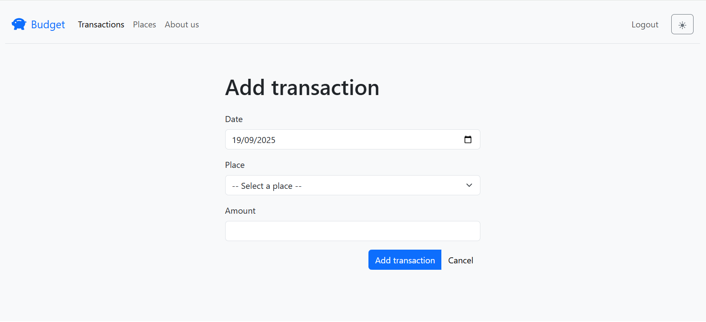
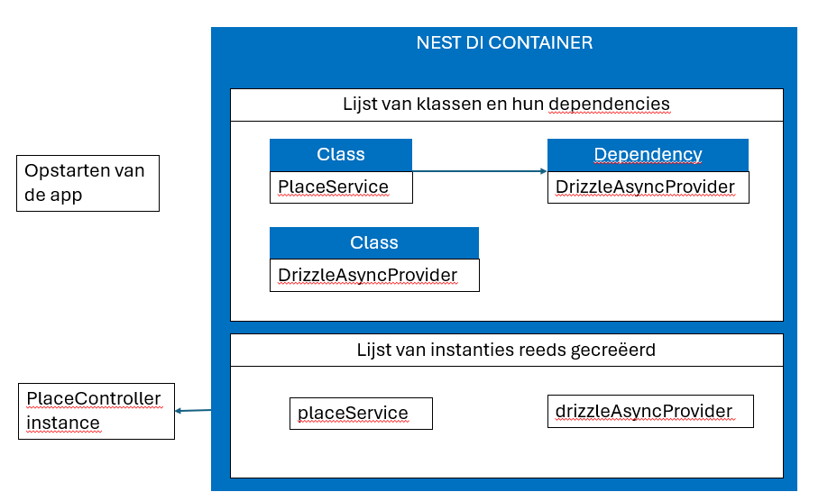

# REST API bouwen

> **Startpunt voorbeeldapplicatie**
>
> ```bash
> git clone https://github.com/HOGENT-frontendweb/webservices-budget.git
> cd webservices-budget
> git checkout -b les3 3acce6c
> yarn install
> yarn start:dev
> ```

## Leerdoelen

- Inzicht krijgen in de werking van controllers in NestJS, hoe routes worden gedefinieerd en hoe je meerdere routes binnen één controller groepeert.

- Begrijpen hoe je toegang krijgt tot HTTP-aanvraaggegevens (zoals headers, body, params, etc.) in NestJS met behulp van decoratoren en hoe je verschillende HTTP-methoden implementeert in controllers.

- Inzicht krijgen in Providers, dependency injection, Services

- Gebruik maken van DTO's voor invoervalidatie.

- Inzicht krijgen in de werking van modules in NestJS

## De budget app

In de olods Front-end Web Development en Web Services maken we een budgetapplicatie. Deze applicatie bestaat uit een front-end en back-end. De front-end is een Single Page Application (SPA) in React, de back-end is een REST API in Node.js m.b.v. Koa. In deze les beginnen we met het bouwen van de REST API.

De applicatie die we gaan maken bevat volgende pagina's

<!-- tabs:start -->

### **Transactions pagina**

Deze pagina geeft een overzicht van alle transacties van alle gebruikers. Later toont deze enkel de transacties van de ingelogde gebruiker.


### **Places pagina**

Deze pagina toont een overzicht van alle plaatsen waar je transacties kan doen.


### **Add/edit transaction pagina**

De laatste pagina laat toe om een nieuwe transactie toe te voegen of een bestaande aan te passen.



<!-- tabs:end -->

### Oefening 1 - De budget app

- Maak het ERD.
- Welke endpoints moeten we voorzien?

<!-- markdownlint-disable header-start-left -->

- Oplossing +

  Het ERD ziet er als volgt uit:

  

  De endpoints die we moeten voorzien zijn:

  #### Transactions

  - `GET /api/transactions`: alle transacties opvragen
  - `GET /api/transactions/:id`: een specifieke transactie opvragen
  - `POST /api/transactions`: een nieuwe transactie aanmaken
  - `PUT /api/transactions/:id`: een transactie aanpassen
  - `DELETE /api/transactions/:id`: een transactie verwijderen

  #### Places

  - `GET /api/places`: alle plaatsen opvragen
  - `GET /api/places/:id`: een specifieke plaats opvragen
  - `POST /api/places`: een nieuwe plaats aanmaken
  - `PUT /api/places/:id`: een plaats aanpassen
  - `DELETE /api/places/:id`: een plaats verwijderen
  - `GET /api/places/:id/transactions`: transacties van een specifieke plaats opvragen

  #### Users

  - `GET /api/users`: alle gebruikers opvragen
  - `GET /api/users/:id`: een specifieke gebruiker opvragen
  - `POST /api/users`: een nieuwe gebruiker aanmaken
  - `PUT /api/users/:id`: een gebruiker aanpassen
  - `DELETE /api/users/:id`: een gebruiker verwijderen
  - `GET /api/users/:id/transactions`: transacties van een specifieke gebruiker opvragen

  Op basis van de gegeven screenshots kan je wel bepaalde API calls schrappen. Zo is er bijvoorbeeld geen nood aan bv. `GET /api/places/:id` of `POST /api/places`. Voor de volledigheid hebben we alle mogelijke API calls neergeschreven.

  !> Kijk goed hoe de twee geneste routes gedefinieerd zijn (`GET /api/places/:id/transactions` en `GET /api/users/:id/transactions`)! Hiertegen worden heel wat fouten gemaakt.

<!-- markdownlint-enable header-start-left -->


## CRUD operaties voor transacties

Nu is het tijd om aan onze API te starten! In dit voorbeeld werken we alle CRUD operaties uit voor transacties, d.w.z.:

- `GET /api/transactions`: alle transacties opvragen
- `GET /api/transactions/:id`: een specifieke transactie opvragen
- `POST /api/transactions`: een nieuwe transactie aanmaken
- `PUT /api/transactions/:id`: een transactie aanpassen
- `DELETE /api/transactions/:id`: een transactie verwijderen

TODO VRAAG Werken we nog met /api of houden we dit voor swagger? Momenteel zonder /api geimplementeerd

NestJS biedt de tools om de inkomende requests af te handelen en een response terug te sturen.


## Datalaag

Deze beheert onze data. Uiteraard willen we geen hardgecodeerde data terugsturen. Deze data zal uit een databank moeten komen. Voorlopig gaan we even met mock data werken (in-memory). Creëer een nieuw bestand `src/data/mock_data.ts`, in een nieuwe `data` map. We gebruiken ook nog geen relaties, deze worden in het volgende hoofdstuk toegevoegd.

```ts
export const TRANSACTIONS = [
  {
    id: 1,
    amount: -2000,
    date: new Date(),
    user:  'Thomas Aelbrecht',
    place: 'Irish Pub',
  },
  {
    id: 2,
    amount: -74,
    date: new Date(new Date().getDate() - 2), // 2 days ago
    user: 'Thomas Aelbrecht',
    place: 'Irish Pub',
  },
  {
    id: 3,
    amount: 3500,
    date: new Date(new Date().getDate() - 3),
    user: 'Thomas Aelbrecht',
    place: 'Loon',
  },
];
```

We houden hier voorlopig een variabele bij met onze transactions. Deze moeten uiteindelijk in de databank terechtkomen. Je merkt dat we hier een `export` gebruiken. Dit is een manier om variabelen, functies of klassen beschikbaar te maken voor andere bestanden. In dit geval maken we de variabelen `TRANSACTIONS` beschikbaar voor andere bestanden. In dit geval gebruiken we een named export, dus moeten we deze variabelen importeren met exact dezelfde naam.

Als we ook de transactions willen updaten gaan we een id nodig hebben om elementen eenduidig van elkaar te onderscheiden. We maken gebruik van een simpele auto-increment (= een geheel getal dat telkens met 1 verhoogd wordt). Bij toevoegen van transactions moeten we het grootste id zoeken en daar 1 bij optellen. Bij het updaten hoeven we enkel de transaction te zoeken en aan te passen.

## Transaction controller

Controllers zijn verantwoordelijk voor het verwerken van binnenkomende verzoeken en het terugsturen van een antwoord naar de client. Het routingmechanisme bepaalt welke controller elk verzoek afhandelt. Vaak heeft een controller meerdere routes, en elke route kan een andere actie uitvoeren. Onze controller zal alle bovenstaande routes bevatten.

### Generatie controller

NestJS biedt een CLI commando om automatisch een controller te genereren:

```bash
nest generate controller transaction
```

Dit commando maakt de volgende bestanden aan:

- `src/transaction/transaction.controller.ts`: de controller zelf
- `src/transaction/transaction.controller.spec.ts`: test bestand voor de controller

De controller wordt ook automatisch toegevoegd aan de `app.module.ts` (zie de `controllers` array). Zonder deze toevoeging zou de controller niet beschikbaar zijn in de applicatie.

Open het bestand `src/transaction/transaction.controller.ts`. De `@Controller('transactions')` decorator geeft aan dat deze controller verantwoordelijk is voor alle routes die beginnen met `/transactions`.

### Overzicht van de decorators
Elke route in je applicatie wordt afgehandeld door een specifieke methode in je controller. Met behulp van HTTP-decoratoren `Get()`, `@Post()`,... decoreer je de methode met een routepad.

### Static routes: `GET /transactions`

Voeg onderstaande inhoud toe aan de Controller.

```typescript
  @Get('')
  getAllTransactions(): string {
    return 'this action returns all transactions';
  }
```

Importeer `@Get` uit de `@nestjs/common` package.

De `@Get('')` decorator geeft aan dat de `getAllTransactions()` methode reageert op GET verzoeken op de route `/transactions`.

Het routepad is het resultaat van `@controller-pad + @methode-pad`. Hier dus `/transactions`.

De methodenaam `getAllTransactions` is willekeurig. Je kan even goed de methodenaam listAllTransactions(),... gebruiken.

De methode `getAllTransactions()` retourneert momenteel een string.

Start de server (als deze nog niet draait) en open de url <http://localhost:3000/transactions> in je browser of Postman. Je zou de string "this action returns all transactions" moeten zien. We retourneren hier een primitief datatype, dus Nest retourneert de waarde en past hier geen JSON serialisatie toe. De request retourneert ook een statuscode 200 (d.i. de standaard).

### Route parameters: `GET /transaction/:id`

Niet alle routes kunnen gewoon een hardgecodeerde string zijn, soms heb je een parameter nodig zoals bv. `/transactions/15` of `/transactions/43` om een transactie met een bepaald id op te vragen.

Een request bestaat uit een aantal lijnen met een specifieke betekenis. A.d.h.v. decorators kan NestJS specifieke informatie uit de request extraheren.


Hiervoor gebruik je `route parameters` – stukjes in de URL die dynamisch kunnen zijn, zoals een id.

Lees eerst volgende secties in de documentatie:

- [Request objects](https://docs.nestjs.com/controllers#request-object)
- [Route parameters](https://docs.nestjs.com/controllers#route-parameters)

Voeg onderstaande inhoud toe aan de Controller.

```typescript
  @Get(':id')
  getTransactionById(@Param() params: any): string {
    return `This action returns a #${params.id} transaction`;
  }
```
Zorg dat je ``@Param`` importeert uit `@nestjs/common`.
- `@Get(':id')`: Dit betekent dat elk verzoek naar /transactions/{id} door deze handler wordt afgehandeld.
- `@Param()`: Maakt de routeparameter beschikbaar in de methode.
- `params.id`: Hiermee haal je de waarde van de :id uit de URL op.

Je kan de id ook direct ophalen door de parameter direct te benoemen in `@Param()`. Zo is de code korter en duidelijker.

```typescript
  @Get(':id')
  getTransactionById(@Param('id') id:string): string {
    return `This action returns a #${id} transaction`;
  }
```

Belangrijk: Zet routes met parameters na de statische routes in je controller.

Waarom?
Als je een route zoals @Get(':id') vóór een statische route @Get('places') plaatst, dan zal een verzoek naar /transactions/places behandeld worden alsof places een id is.

### Request Body: `POST /transactions`

Een POST-handler gebruik je om nieuwe data te creëren, hier een transactie. De data voor de transactie wordt als JSON data meegestuurd naar de server. De `@Body()` decorator wordt gebruikt om gegevens uit het body-gedeelte van een inkomend HTTP-verzoek op te halen. Dit is vooral handig bij POST-, PUT- of PATCH-verzoeken.

Voeg onderstaande inhoud toe aan de Controller.

```typescript
  @Post('')
  createTransaction(@Body() body: any): string {
    console.log(body);
    return `This action adds a new transaction for ${body.user}`;
  }
```

- `@Post()`: Handelt een POST-verzoek af. Importeer uit `@nestjs/common`
- `@Body() body`: any: Haalt de volledige body op als object. Importeer uit `@nestjs/common`. Voor de eenvoud gebruiken we nu any als type (= mag eender wat zijn), maar later zullen we dit verfijnen.
- `body.user`: Benader de waarden rechtstreeks.

### Status Codes

In een RESTful API geven HTTP status codes aan of een verzoek geslaagd is, wat er gebeurd is, of waarom iets is mislukt.

Lees eerst volgende secties in de documentatie:

- [Status Code](https://docs.nestjs.com/controllers#status-code)

Standaard retourneert NestJS 200 OK, maar bij een succesvolle POST zou je expliciet 201 Created moeten teruggeven, omdat je iets nieuws aanmaakt.

```typescript
  @Post('')
  @HttpCode(HttpStatus.CREATED)
  createTransaction(@Body() body): string {
    console.log(body);
    return `This action adds a new transaction for ${body.user}`;
  }
```

@HttpCode en HttpStatus importeer je uit `@nestjs/common`

Als je meer controle wenst over de response kan je `@Res()` gebruiken. Een voorbeeld:

```typescript
  @Post('')
  createTransaction(@Body() body,  @Res() res: Response): string {
    console.log(body);
    res.status(HttpStatus.CREATED).json({
      message: 'Transaction successfully created',
      data: body,
    });
    return `This action adds a new transaction for ${body.user}`;
  }
```
Als je `@Res()` gebruikt, moet je zelf de response altijd volledig afhandelen. `Response` importeer je uit de `express` namespace.


### Best practice: gebruik DTO's
Een DTO (Data Transfer Object) is een object of klasse die gebruikt wordt om data over te dragen tussen lagen van een applicatie, bijvoorbeeld van de client naar de server, of van de controller naar de service in een NestJS-app.

In NestJS gebruik je DTO’s vooral om de structuur en validatie van binnenkomende gegevens te definiëren, bijvoorbeeld bij POST- of PUT-verzoeken.

Lees eerst volgende secties in de documentatie:

- [DTO](https://docs.nestjs.com/controllers#request-payloads)

Maak in de `transactions`folder en daarbinnen een bestand `transaction.dto.ts`. Hierin plaatsen we alle DTO's die binnen transactions gebruikt worden.

```typescript
export class CreateTransactionRequest {
  amount: number;
  date: Date;
  user: string;
  place: string;
}
```

TODO VRAAG: GEbruiken we CreateTransactionDTO of CreateTransactionRequest (zie code Georgiana)?????

Importeer deze klasse in de `TransactionController` en pas de code voor de `createTransaction` aan.

```typescript
  @Post('')
  @HttpCode(HttpStatus.CREATED)
  createTransaction(@Body() createTransactionDto: CreateTransactionRequest): string {
    return `This action adds a new transaction for ${createTransactionDto.user}`;
  }
```
De validatie komt later aan bod.
Dit kan je het eenvoudigst testen via Postman. Gebruik bijvoorbeeld deze body:

```json
{
  "place": "HoGent",
  "user": "Thomas Aelbrecht",
  "date": "2025-09-17T15:12:39.856Z",
  "amount": 100
}
```

### Query Parameters: `GET /transactions?page=2&limit=10`

Lees [Query parameters](https://docs.nestjs.com/controllers#query-parameters)

In de meeste apps wordt gebruik gemaakt van grote (1000den transacties) datasets. Paginatie is dan cruciaal om de prestaties te verbeteren,  de server en de client niet te overbelasten, en de gebruikers een beter overzicht te geven. BIj paginatie haal je slechts een deel (een pagina) van de dataset op. Met `GET /transactions?offset=2&limit=10` haal je pagina 2 op met 10 transacties op de pagina.

```typescript
  @Get()
  getAllTransactions(
    @Query('offset') offset = 1,
    @Query('limit') limit = 10) {
    return `This action returns all transactions. Limit ${limit}, offset: ${offset}`;
  }
```

Query parameters worden vaak ook gebruikt voor search. Bvb `GET /transactions?search=xxx`


### Oefening: Implementeer PUT en DELETE

<!-- markdownlint-disable header-start-left -->

- Oplossing +
```typescript
  //de controller
  updateTransaction(@Param('id') id: string, @Body() updateTransactionDto:UpdateTransactionRequest) {
    return `This action updates the transaction with #${id} for user ${updateTransactionDto.user}`;
  }

  @Delete(':id')
  deleteTransaction(@Param('id') id: string) {
    return `This action removes the transaction with id #${id}`;
  }

  //En de implementatie van UpdateTransactionREquest in transaction.dto.ts
  export class UpdateTransactionRequest extends CreateTransactionRequest {}
```
<!-- markdownlint-enable header-start-left -->

### Oefening: Maak een dto aan voor de paginatie

- Oplossing +
```typescript
  // src/common/common.dto.ts
  export class PaginationQuery {
    page?: number = 1;
    limit?: number = 10;
  }
```

## Providers
Een provider is elk stuk logica dat NestJS kan instantiëren en injecteren, zoals services, repositories, helpers,...
In NestJS zijn providers klassen die via de `@Injectable()` decorator beschikbaar worden gemaakt voor `dependency injection`.

Lees [Providers](https://docs.nestjs.com/providers)

Dependency Injection (DI) is een design pattern waarbij de afhankelijkheden van een klasse van buitenaf worden binnengebracht, hier door NestJS, in plaats van dat de klasse ze zelf aanmaakt. Dit maakt testen makkelijker, bevordert loskoppeling en herbruikbare en configureerbare code.


## Services
Controllers moeten HTTP-verzoeken afhandelen en complexere taken delegeren aan providers. Een service in NestJS is bedoeld om logica en functionaliteit van je applicatie op een centrale, herbruikbare en testbare manier te organiseren. Services bevatten de domein logica (zoals businesslogica, data ophalen, berekeningen,...), zijn onze domeinlaag. Ze zijn herbruikbaar in andere onderdelen van de app zoals controllers of andere services. En ze kunnen via dependency injection gebruikt worden, zijn dus providers.


### Generatie service
NestJS biedt een CLI commando om automatisch een service te genereren:

```bash
nest generate service transaction --no-spec
```

Dit commando maakt het volgende bestand aan:

- `src/transaction/transaction.service.ts`: de service zelf

--no-spec zorgt ervoor dat er geen testbestand wordt aangemaakt
De service wordt ook automatisch toegevoegd aan de `app.module.ts` (zie de `providers` array). Zonder deze toevoeging zou de service niet beschikbaar zijn in de applicatie en niet injecteerbaar zijn.

De Service
```typescript
import { Injectable } from '@nestjs/common';

@Injectable()
export class TransactionService {}
```
De `@Injectable()` decorator koppelt metadata aan de klasse, wat aangeeft dat TransactionService een klasse is die beheerd kan worden door de Nest IoC-container (zie verder).

### Dependency injection
We passen de TransactionController aan om van de Service gebruik te maken.

```typescript
import {
  Body,  Controller,  Delete,  Get,  Param,  Put,   Post,  Query, HttpStatus, HttpCode} from '@nestjs/common';
import { TransactionService } from './transaction.service';
import { CreateTransactionRequest, UpdateTransactionRequest } from './transaction.dto';

@Controller('transactions')
export class TransactionController {
  constructor(private readonly transactionService: TransactionService) {}
```
We injecteren de service in de constructor
- `private`:  TypeScript maakt daar automatisch een attribuut van en vult deze in. Het attribuut is bovendien enkel toegankelijk in de klasse.
- `readonly`: is een best practice. Dit verzekert dat we de service reference niet aanpassen
-`TransactionService`: het type is belangrijk!

Om een instantie van een klasse aan te maken dienen we normaalgezien deze code te schrijven
```typescript
const transactionController = new TransactionController(new TransactionService())
```
Maar NestJS fungeert als een DI Container of IoC-containers (Inversion of control). Het IoC-framework maakt hierdoor automatisch objecten aan op basis van aanvragen en injecteert ze indien nodig. NestJS zal een instantie van de TransactionService aanmaken en doorgeven aan de TRansactionController. Of i.g.v. een Singleton, zal het de reeds bestaande instantie aanleveren indien deze reeds gecreëerd werd.

Een DI Container bevat 2 sets van informatie
- een lijst met alle Provider klassen uit onze app en hun dependencies
- een lijst van alle instanties die deze container reeds gecreëerd heeft

Providers hebben meestal een levensduur (of scope) die overeenkomt met de levenscyclus van de applicatie. Dat betekent dat ze worden geïnstantieerd wanneer de applicatie opstart, en weer worden vernietigd bij het afsluiten. Het is echter ook mogelijk om een provider request-scoped te maken. In dat geval wordt de provider aangemaakt en beheerd per individuele aanvraag, in plaats van één keer voor de hele applicatie. Zo kun je meer controle krijgen over afhankelijkheden die specifieke context of data per verzoek nodig hebben.

In onderstaand voorbeeld gaan we ervan uit dat de Service een afhankelijkheid heeft met een Repository (wat we later zullen toevoegen aan de Rest API)


Bij dependency injection noem je het object dat de afhankelijkheid ontvangt de client, en het object dat wordt doorgegeven (de geïnjecteerde afhankelijkheid) de service. De code die deze service aan de client levert, heet de injector. In plaats van dat jij in de client expliciet aangeeft welke service je wil gebruiken, bepaalt de injector dat voor jou. Injection verwijst dus naar het proces waarbij een afhankelijkheid (de service) wordt doorgegeven aan de client die ze nodig heeft.

Meer info, lees  [Dependency injection](https://docs.nestjs.com/providers#dependency-injection)

### Implementatie service
Voor de implementatie van de service maken we gebruik van de in-memory data TRANSACTIONS. Dit is onze data source. In het volgende hoofdstuk vervangen we dit door een database.

We maken eerst een Entity `Transaction` aan zodat de data getypeerd kan worden. Entiteiten definiëren het domein. In de map `src/transactions/entities` maak je de file `transaction.entity.ts` aan met onderstaande inhoud

```typescript
//src/transactions/entities/transaction.entity.ts
export class Transaction {
  id:number
  amount: number;
  date: Date;
  user: string;
  place: string;
}
```

Pas `mock-data.ts` aan
```typescript
import { Transaction } from './entities/transaction.entity';
export const TRANSACTIONS : Transaction []= [...]
}
```
TODO VRAAG : HIER EEN ENTITY TRANSACTION VOORZIEN OF TRANSACTIONDTO?
Binnen de service voorzien we alle CRUD acties die we later vanuit de Controller zullen aanroepen. We implementeren momenteel enkel de GET en de POST methodes. Maar opdat alles uitvoerbaar zou zijn, declareren we ze alle functies met de correcte types, en laten we ze een error gooien als ze gebruikt worden.

```typescript
//src/transaction/transaction.service.ts
import { Injectable } from '@nestjs/common';
import { TRANSACTIONS } from '../data/mock-data.ts';
import { CreateTransactionRequest, UpdateTransactionRequest } from './transaction.dto';

@Injectable()
export class TransactionService {

  getAll() {
    return TRANSACTIONS;
  }

  getById(id: number) {
    return TRANSACTIONS.find(item => item.id === id);
  }

  create({amount, date, user, place}: CreateTransactionRequest) {
    const newTransaction = {id:Math.max(...TRANSACTIONS.map(item => item.id))+1, amount, date, user, place};
    TRANSACTIONS.push(newTransaction);
    return newTransaction;
  }

  updateById(id: number, {amount, date, user, place}: UpdateTransactionRequest) {
   throw new Error('not yet implemented');
  }

  deleteById(id: number) {
   throw new Error('not yet implemented');
  }
}
```
`create`: We creëren een nieuwe transactie, met het id erbij en voegen ze toe aan onze array. We genereren een nieuw id voor onze transactie door het hoogste id te zoeken en er 1 bij op te tellen.

### Implementatie controller

In de controller kunnen we nu gebruik maken van de TransactionService. De code wordt

```typescript
//src/transaction/transaction.controller.ts
import {
  Body,  Controller,  Delete,  Get,  Param,  Put,   Post,  Query, HttpStatus, HttpCode} from '@nestjs/common';
import { TransactionService } from './transaction.service';
import { CreateTransactionRequest, UpdateTransactionRequest } from './transaction.dto';

@Controller('transactions')
export class TransactionController {
  constructor(private readonly transactionService: TransactionService) {}

  @Get()
  getAllTransactions() {
    return { items:this.transactionService.getAll()}
  }

  @Get(':id')
  getTransactionById(@Param('id') id: string) {
    return this.transactionService.getById(+id);
  }

  @Post()
  @HttpCode(HttpStatus.CREATED)
  createTransaction(@Body() createTransactionDto:CreateTransactionRequest) {
    return this.transactionService.create(createTransactionDto);
  }

  ...
}
```

Vervang de hardgecodeerde data door de aanroep van de methodes in de transactionService, that's it!
Merk op:
- `getAllTransactions`: Het is een slecht idee om een JSON array terug te geven in een HTTP response. Het is beter om een object terug te geven met een items property die de array bevat.
Een JSON array is geldige JavaScript en kan bijgevolg uitgevoerd worden. Dit kan een XSS aanval mogelijk maken. Een object kan niet uitgevoerd worden en is dus veiliger.
Dit heet JSON Hijacking. Tegenwoordig is dit niet meer zo'n groot probleem, maar het is een goede gewoonte om het correct te doen.
- `getTransactionById`: De service verwacht een number, vandaar `+id`
- `create`: Geef de net toegevoegde transaction ook weer terug vanuit de `create` via de response body. Het lijkt misschien wat raar om eigenlijk hetzelfde terug te geven dan wat je binnen kreeg maar dat is meestal een goed idee. Daarmee weet de gebruiker van de API hoe je het opgeslagen hebt, wat niet noodzakelijk hetzelfde is als hoe hij het doorgaf. Bijvoorbeeld: bij ons kan de omzetting van de datum iets wijzigen en sowieso zal er een 'id' toegevoegd zijn.

Test alle endpoints uit in POSTMAN.
-  Doe een GET request naar <http://localhost:9000/transactions/1> en je zou de eerste transactie moeten zien. Als je een id opgeeft dat niet bestaat, krijg je een HTTP 200 OK en een leeg antwoord. Voor nu is dit goed, later geven we een foutmelding terug.
- Bij de POST request zou je de nieuwe transactie moeten zien verschijnen in de response en in de lijst van transacties als je een GET request doet naar `/transactions`. Natuurlijk is dit nog niet persistent en verdwijnt de transactie als je de server herstart.

### Oefening
 Maak vervolgens zelf de PUT en DELETE routes en hun bijhorende servicefuncties:
  - `PUT /api/transactions/:id`:
    - een transactie aanpassen
    - geeft de aangepaste transactie terug
  - `DELETE /api/transactions/:id`:
    - een transactie verwijderen
    - geeft niets terug
    - De status 204 : NO CONTENT wordt teruggegeven
- Extra (voor de ervaren JavaScript'ers): maak alle servicefuncties async (zoals de databank zal zijn). Geef promises terug en gebruik async/await in de routes.


- Oplossing +
```typescript
  //de service
 updateById(id: number, { amount, date, user, place }: UpdateTransactionRequest) {
    let existingTransaction = this.getById(id);
    if (existingTransaction) {
      existingTransaction = {id:id, amount, date, user, place}
    }
    return existingTransaction;
  }

  deleteById(id: number) {
    const index = TRANSACTIONS.findIndex(item => item.id === id);
    if (index >= 0) {
      TRANSACTIONS.splice(index, 1);
    }
  }

 //De controller
  @Put(':id')
  updateTransaction(@Param('id') id: string, @Body() updateTransactionDto:UpdateTransactionRequest) {
    return this.transactionService.updateById(+id, updateTransactionDto);
  }

  @Delete(':id')
  @HttpCode(HttpStatus.NO_CONTENT)
  deleteTransaction(@Param('id') id: string) {
     this.transactionService.deleteById(+id);
  }
```

### Oefening - Je eigen project

- Maak alle CRUD endpoints aan voor 1 entiteit uit je project
- Voorzie ook mock data.

## Exception handling
Als de gebruiker een transactie probeert op te vragen waarvan de id niet bestaat, dan wensen we een 404 NOT FOUND terug te geven.

`NotFoundException` is een ingebouwde HTTP-exception in NestJS die je gebruikt om aan te geven dat een bepaald item niet gevonden is. Wanneer je deze exception gooit, stuurt NestJS automatisch een HTTP-response terug met: statuscode 404 en
een duidelijke foutboodschap

```typescript
//src/transaction/transaction.service.ts
  import { Injectable, NotFoundException } from '@nestjs/common';// 👈1

  getById(id: number) {
    const transaction = TRANSACTIONS.find(item => item.id === id);// 👈2
    if (!transaction) {
      throw new NotFoundException(`Transaction #${id} not found`);
    }// 👈3
    return transaction;// 👈3
  }
```
1. Importeer `NotFoundException` uit de `@nestjs/common`namespace.
2. Definieer een constante die de de opgevraagde transactie bevat.
3. Als geen transactie gevonden, throw dan `NotFoundException`, anders retourneer de gevonden transactie.
Probeer uit in POSTMAN.

Nest heeft helpermethodes voor alle mogelijke status codes, zoals InternalServerError (500), BadRequestException (404),...

Probeer uit in POSTMAN.

## Validatie
### Invoervalidatie
Een belangrijk principe bij het ontwikkelen van een API is het valideren van de invoer. Dit is belangrijk om de integriteit van de data te garanderen. Het is ook belangrijk om de gebruiker van de API te beschermen tegen zichzelf. Als de gebruiker een fout maakt, dan moet de API dit opvangen en een duidelijke foutmelding terugsturen.

Je mag geen aannames maken over de invoer die je ontvangt. **Je moet er vanuit gaan dat de invoer altijd fout kan zijn.** Enkel validatie in de front-end is onvoldoende, dit is eenvoudig te omzeilen. Ooit zal iemand een verzoek sturen dat iets zal breken.

Welke soorten invoer kan een HTTP request bevatten?

- Antwoord +

  - **URL parameters:** je kan bijvoorbeeld het id van een transactie meegeven in de URL, bv. `/api/transactions/1`.
  - **Query parameters:** je kan bijvoorbeeld een zoekopdracht meegeven in de URL, bv. `/api/places?name=loon`.
  - **Body:** als je een nieuwe transactie maakt, dan geef je de nodige gegevens mee in de body van het request.
  - **Headers:** in het volgende hoofdstuk gaan we zien hoe we een token meegeven in de headers van een request, zo kunnen we de gebruiker authenticeren.

  In ons voorbeeldproject voegen we invoervalidatie toe voor de URL parameters, query parameters en de body van het request.

Invoervalidatie is gericht op het verifiëren van de ontvangen gegevens. Bijvoorbeeld in de `POST /api/transactions` moet het bedrag van de transactie een geldig getal zijn (geen string, object...) én is het verplicht op te geven. Indien aan de validatie niet voldaan is, retourneer je een status code 400 (= bad request) en geef je details over de fout. Zonder bijkomende informatie is de HTTP 400 nutteloos. Bij validatiefouten stop je onmiddellijk de verdere verwerking van het request en retourneer je een passende foutboodschap voor de client. Stuur het response zo snel mogelijk terug naar de client (= **fail-fast principe**). De oorzaak van de validatiefout moet goed worden uitgelegd en begrepen door de client. Technische aspecten mag je om veiligheidsredenen niet retourneren.

?> In geen geval is het goed om een HTTP 500 terug te geven bij fouten die de client kan vermijden. De HTTP 500 dient enkel voor serverfouten die de client niet kan vermijden. Een HTTP 400 is een fout veroorzaakt door de client en moet dus ook door de client worden opgelost.

### Pipes
Lees [Pipes](https://docs.nestjs.com/pipes)

In NestJS zijn pipes een soort middleware die gebruikt worden om:

- Data te transformeren – bv. een string "123" omzetten naar een number.
- Data te valideren – bv. checken of een parameter een geldig e-mailadres is.

👉 Concreet: pipes werken voordat je data in je controller terechtkomt. Ze pakken de inkomende request-gegevens, passen transformaties en/of validaties toe, en geven het resultaat door aan je endpoint. Als de data ongeldig is, kan een pipe meteen een exception gooien.

NestJS voorziet bvb in volgende built-in pipes:

- ParseIntPipe → zet een string query param "5" om naar een getal 5.
- ParseBoolPipe → zet "true" om naar true.
- ValidationPipe → valideert data met behulp van class-validator.

Gebruik in een controller:
```typescript
//src/transaction/transaction.controller.ts
  @Get(':id')
  getTransactionById(@Param('id', ParseIntPipe) id: number) {
    console.log(typeof id);
    return this.transactionService.getById(id);
  }
```
Het type van de id parameter wordt nu een number. We hoeven de id niet langer naar een number om te zetten bij aanroep van de methode getById uit de transactionService.

Pas nu ook de overige methodes aan.

### ValidationPipe
In NestJS gebruik je DTO’s vooral om:
- Te bepalen welke velden een request mag bevatten.
- Validatie toe te passen op binnenkomende data.
- De structuur van data duidelijk en voorspelbaar te maken.

Lees [Validation](https://docs.nestjs.com/techniques/validation)

Validatie voeg je toe door gebruik te maken van `class validators`. Je kunt decorators van class-validator gebruiken om regels op te leggen.

```bash
pnpm i class-validator
```

Pas de CreateTransactionRequest class aan
```typescript
//src/transactions/transaction.dto.ts
import { IsString, IsNumber, Min} from 'class-validator';

export class CreateTransactionRequest {
    @IsNumber()
    @Min(1)
    amount: number;
    date: Date;
    @IsString()
    user: string;
    @IsString()
    place: string;
}
```

De `ValidationPipe` zorgt ervoor dat alle DTO’s automatisch worden gevalideerd a.d.h.v. de decorators uit `class-validator`. Als een request niet voldoet, geeft NestJS een duidelijke foutmelding terug.
De ValidationPipe dien je te activeren in `main.ts` zodat deze wordt toegepast op alle inkomende requests.

```typescript
//src/main.ts
import { NestFactory } from '@nestjs/core';
import { AppModule } from './app.module';
import { ValidationPipe } from '@nestjs/common';// 👈

async function bootstrap() {
  const app = await NestFactory.create(AppModule);
  app.useGlobalPipes(new ValidationPipe());// 👈
  await app.listen(process.env.PORT ?? 9000);
}
bootstrap();
```

`Whitelisting` is een functie van de ValidationPipe in NestJS die ervoor zorgt dat alleen de velden die je expliciet hebt gedefinieerd in je DTO worden geaccepteerd. Alle andere (onverwachte) velden worden automatisch verwijderd. De request gaat gewoon door, maar zonder de extra velden. Als je ook nog `forbidNonWhitelisted: true` toevoegt dan wordt er een fout gegooid als er ongewenste velden zijn. De request wordt geweigerd met een duidelijke error.


Probeer een POST request uit en verwijder user uit de JSON en geef een datum op die in de toekomst ligt, voeg een extra veld toe. We krijgen een 400 BAD REQUEST terug en de reden van de fout.

### Auto transform payloads naar DTO's
In NestJS krijg je vaak data binnen als platte JSON-objecten (bijvoorbeeld uit een HTTP-request). Maar in je code wil je werken met echte class-instanties, zodat je bijvoorbeeld methodes kunt gebruiken, of zodat validatie en andere decorators goed werken. Class-transformers zetten gewone JavaScript-objecten om naar instances van classes en omgekeerd.

Pas de `create` methode aan en doe een POST request. Bekijk de console.

```typescript
  //src/transaction/transaction.controller.ts
  @Post()
  @HttpCode(HttpStatus.CREATED)
  createTransaction(@Body() createTransactionDto:CreateTransactionRequest) {
    console.log( createTransactionDto instanceof CreateTransactionRequest);// 👈
    return this.transactionService.create(createTransactionDto);
  }
```
Om ervoor te zorgen dat dit een instantie is van de DTO klasse:

```bash
pnpm i class-transformer
```
En voeg in main.ts onderstaande optie toe.

```typescript
//serc/main.ts
import { NestFactory } from '@nestjs/core';
import { AppModule } from './app.module';
import { ValidationPipe } from '@nestjs/common';

async function bootstrap() {
  const app = await NestFactory.create(AppModule);
  app.useGlobalPipes(new ValidationPipe({
    whitelist: true,
    forbidNonWhitelisted:true,
    transform: true}));// 👈
  await app.listen(process.env.PORT ?? 9000);
}
bootstrap();
```
Voer een POST request uit en bekijk het type.


Als we de decorator `IsDate()` toevoegen aan de date-member dan krijgen we een 400 BAD REQUEST.

```typescript
//src/transaction/transaction.dto.ts
import { IsString, IsNumber, Min, isDate} from 'class-validator';// 👈

export class CreateTransactionRequest {
    @IsNumber()
    @Min(1)
    amount: number;
    @IsDate()// 👈
    date: Date;
    @IsString()
    user: string;
    @IsString()
    place: string;
}
```
De `ValidationPipe` (met class-validator) behandelt inkomende JSON-data als "plain objects" met strings. `@IsDate()` verwacht een echte Date-instantie, maar uit je JSON komt date als string. Vandaar "date must be a Date instance". Je moet dus NestJS vertellen om de date-string in het request om te zetten naar een Date-object. Dit doe je met: `@Type(() => Date)` van class-transformer. Via de `@MaxDate()` decorator leggen we op dat de datum kleiner of gelijk moet zijn aan de datum van vandaag.

```typescript
//src/transactions/transaction.dto.ts
import { IsString, IsNumber, IsDate, MaxDate, Min} from 'class-validator';
import { Type } from 'class-transformer';

export class CreateTransactionRequest {
    @IsNumber()
    @Min(1)
    amount: number;
    @Type(() => Date)// 👈
    @IsDate()
    @MaxDate(() => new Date())// 👈
    date: Date;
    @IsString()
    user: string;
    @IsString()
    place: string;
}
```


Class-transformers kunnen ook primitieve types omzetten. Alles wat via @Param() of @Query()... binnenkomt is van type string. Als we in de `getTransactionById`methode het type van de id veranderen in Number zal ValidationPipe dit proberen om te zetten. We hoeven het +-teken niet langer te gebruiken.

```typescript
//src/transaction/transaction.controller.ts
  @Get(':id')
  getTransactionById(@Param('id') id: number) {
    console.log(typeof id);
    return this.transactionService.getById(id);
  }
```
Doe dit ook voor PUT en DELETE.
Merk op dat deze feature invloed heeft op de performantie van je applicatie.

### Samenvatting


### Oefening: Annoteer de dto voor de paginatie

Page en offset zijn optioneel.
- Oplossing +
```typescript
  // pagination.dto.ts
  import { Type } from 'class-transformer';
  import { IsInt, Min, IsOptional } from 'class-validator';

  export class PaginationQuery {
    @IsOptional()
    @Type(() => Number)
    @IsInt()
    @Min(1)
    page?: number = 1;

    @IsOptional()
    @Type(() => Number)
    @IsInt()
    @Min(1)
    limit?: number = 10;
  }
```

## Modules
In NestJS is een module een manier om je applicatie op te delen in overzichtelijke, goed georganiseerde stukken. Een module is eigenlijk een TypeScript-klasse met de @Module()-decorator. Binnen zo’n module geef je aan welke controllers, services en andere providers erbij horen.

Je kunt het zien als een container die alles groepeert wat bij een bepaald domein of functie hoort. Bijvoorbeeld: je maakt een TransactionModule om alles rond transactionssbeheer (controllers, services, repositories) bij elkaar te houden.

Modules helpen je applicatie modulair en schaalbaar te maken. Ze zorgen ervoor dat je code gestructureerd is, makkelijk te onderhouden en herbruikbaar. Elke NestJS-applicatie heeft minstens één root module (meestal AppModule), maar je kunt er zoveel maken als je wil om je app logisch op te splitsen.

Lees [Modules] (https://docs.nestjs.com/modules)

NestJS biedt een CLI commando om automatisch een module te genereren:

```bash
nest g module transaction
```
De module klasse wordt toegevoegd aan de `transaction` folder en wordt geïmporteerd in de AppModule.

```typescript
//src/transaction/transaction.module.ts
import { Module } from '@nestjs/common';

@Module({})
export class TransactionModule {}
```
De @Module()-decorator maakt van een TypeScript-klasse een NestJS-module. Hierin geef je aan wat bij deze module hoort. Het is als een container die controllers, services en andere dependencies groepeert.
- `imports`: Hier geef je andere modules op die je nodig hebt in deze module.
- `controllers`: Dit is een lijst van controllers die bij deze module horen.
- `providers`: Dit zijn services of andere providers die NestJS beschikbaar maakt in de dependency injection container.
- `exports`: Hiermee deel je providers met andere modules.

Pas de code aan:

```typescript
//src/transaction/transaction.module.ts
import { Module } from '@nestjs/common';
import { TransactionController } from './transaction.controller';// 👈
import { TransactionService } from './transaction.service';// 👈

@Module({// 👈
  imports: [],// 👈
  controllers: [TransactionController],// 👈
  providers: [TransactionService],// 👈
})// 👈
export class TransactionModule {}
```

Verwijder dan de TransactionController en TransactionService uit AppModule.

Het is een goed idee om steeds eerst de module aan te maken en dan de controllers en services. Dan wordt alles in de correcte module geplaatst.


TODO : vanaf hier nog bekijken! Plaatsen we dit nog in dit hoofdstuk?

### Logging

Lees [Best practices for logging](https://betterstack.com/community/guides/logging/nodejs-logging-best-practices/).

Als laatste refactoring gaan we onze logger een beetje uitbreiden. Pas het bestand `logging.ts` aan in een nieuwe map `core`. Voeg hierin onderstaande code toe. Bekijk de code en probeer zelf te achterhalen wat er gebeurt (een uitleg vind je verborgen onder de code).

```ts
// src/core/logging.ts
import config from 'config';
import winston from 'winston';
const { combine, timestamp, colorize, printf } = winston.format;

const NODE_ENV = config.get<string>('env');
const LOG_LEVEL = config.get<string>('log.level');
const LOG_DISABLED = config.get<boolean>('log.disabled');

// 👇 1
const loggerFormat = () => {
  // 👇 2
  const formatMessage = ({
    level,
    message,
    timestamp,
    ...rest
  }: winston.Logform.TransformableInfo) => {
    return `${timestamp} | ${level} | ${message} | ${JSON.stringify(rest)}`;
  };

  // 👇 3
  const formatError = ({
    error: { stack },
    ...rest
  }: winston.Logform.TransformableInfo) =>
    `${formatMessage(rest)}\n\n${stack}\n`;

  // 👇 4
  const format = (info: winston.Logform.TransformableInfo) => {
    // 👇 5
    if (info?.['error'] instanceof Error) {
      return formatError(info);
    }

    return formatMessage(info); // 👈 6
  };

  return combine(colorize(), timestamp(), printf(format));
};

// 👇 7
const rootLogger: winston.Logger = winston.createLogger({
  level: LOG_LEVEL,
  format: loggerFormat(),
  defaultMeta: { env: NODE_ENV },
  transports:
    NODE_ENV === 'testing'
      ? [
          new winston.transports.File({
            filename: 'test.log',
            silent: LOG_DISABLED,
          }),
        ]
      : [new winston.transports.Console({ silent: LOG_DISABLED })],
});

export const getLogger = () => {
  return rootLogger;
};
```

<br/>

- Uitleg +

  1. We definiëren ons eigen formaat voor logberichten in de functie `loggerFormat`.
  2. We definiëren binnen deze functie een functie voor het printen van logberichten die geen foutmelding bevatten.
  3. En een functie voor het printen van logberichten die wel een foutmelding bevatten.
  4. De volgende functie bepaalt welke van de vorige 2 functies gebruikt wordt, afhankelijk van de aanwezigheid van een foutmelding in het logbericht.
     - We gebruiken in alle bovenstaande functies het type `winston.Logform.TransformableInfo` van `winston`. Dit is een interface die ons vertelt wat we allemaal standaard meekrijgen als informatie bij een logbericht.
  5. We checken binnen deze functie met optionele chaining of er een `error` property is in het logbericht. Als dit het geval is, gebruiken we de functie voor het printen van logberichten met foutmelding.
  6. Anders gebruiken we de functie voor het printen van logberichten zonder foutmelding.
  7. We breiden onze root logger ook wat uit met:
     - Ons eigen formaat.
     - De default meta informatie, die wordt toegevoegd aan elk logbericht. We voegen hier de `env` aan toe.
     - We voorzien 2 transports:
       - Een file transport voor de testomgeving. We schrijven de logs weg naar een bestand `test.log` omdat onze logs anders tussen de uitvoer van de testen komt. Later zal je zien waarom dit handig is.
       - Een console transport voor alle andere omgevingen.
       - We zetten de logging in beide gevallen uit als dit geconfigureerd is.

Bekijk het resultaat in de terminal. Zijn dit geen mooie logs?

### Oefening 5 - Je eigen project

Doe dezelfde refactoring in je eigen project:

- REST laag toevoegen
- Health checks toevoegen
- Logging uitbreiden

## CORS

?> Als geen Front-end Web Development volgt, is dit onderdeel niet vereist. Als je natuurlijk later een eigen front-end wil koppelen aan je back-end, is dit wel vereist.

Als je vanuit een front-end een HTTP request stuurt naar een ander domein dan krijg je volgende fout:

```text
Access to fetch at 'https://app.mydomain.com' from origin 'http://localhost:9000'
has been blocked by CORS policy: Response to preflight request doesn't pass access
control check:
```

CORS is een HTTP-functie waarmee een webapplicatie, die wordt uitgevoerd onder één domein, toegang kan krijgen tot resources in een ander domein. Webbrowsers implementeren een beveiligingsbeperking die bekend staat als "same-origin-beleid" dat voorkomt dat een webpagina API's in een ander domein aanspreekt. CORS biedt een veilige manier om vanuit het ene domein (het oorspronkelijke domein) API's in een ander domein aan te spreken. Zie de [CORS-specificatie](https://fetch.spec.whatwg.org/) voor meer informatie.

Een CORS-aanvraag van een oorsprongdomein kan bestaan uit twee afzonderlijke aanvragen:

1. Een eerste aanvraag, waarin de CORS-beperkingen worden opgevraagd die door de service zijn opgelegd. Dit heet het preflight request.
2. De werkelijke aanvraag, gemaakt op de gewenste resource.

Voeg het CORS package en de bijbehorende types toe:

```bash
yarn add @koa/cors
yarn add --dev @types/koa__cors
```

`@koa/cors` handelt het hele CORS-verhaal voor ons af, zoals bv. preflight request.

Voeg wat configuratie toe in `config/development.ts` en `config/production.ts`:

```ts
export default {
  log: {
    // ...
  },
  cors: {
    // 👈 1
    origins: ['http://localhost:5173'], // 👈 2
    maxAge: 3 * 60 * 60, // 👈 3
  },
};
```

1. Pas de config aan voor development en production, voeg de CORS settings toe.
2. `origins`: de oorspronkelijke domeinen die via CORS een aanvraag mogen indienen. Dit is de URL van de webapp die gemaakt wordt in Front-end Web Development.
   - Als je een API maakt die door meerdere front-ends gebruikt wordt, kan je hier een array van domeinen meegeven.
   - Natuurlijk zal ons domein in productie iets anders dan <http://localhost:5173> zijn, maar dat lossen we op in het hoofdstuk rond CI/CD.
3. `maxAge`: de maximale tijd die een browser nodig heeft om de preflight OPTIONS-aanvraag in de cache op te nemen (hier 3u).

Installeer nu de CORS middleware in `src/index.ts`:

```ts
// ...
// 👇 1
import config from 'config';
import koaCors from '@koa/cors';

// ...
const CORS_ORIGINS = config.get<string[]>('cors.origins'); // 👈 2
const CORS_MAX_AGE = config.get<number>('cors.maxAge'); // 👈 2

// ...

const app = new Koa();

// 👇 3
app.use(
  koaCors({
    // 👇 4
    origin: (ctx) => {
      // 👇 5
      if (CORS_ORIGINS.indexOf(ctx.request.header.origin!) !== -1) {
        return ctx.request.header.origin!;
      }
      // Not a valid domain at this point, let's return the first valid as we should return a string
      return CORS_ORIGINS[0] || ''; // 👈 6
    },
    // 👇 7
    allowHeaders: ['Accept', 'Content-Type', 'Authorization'],
    maxAge: CORS_MAX_AGE, // 👈 8
  }),
);

app.use(bodyParser());

// ...
```

1. Importeer CORS en de configuratie.
2. Haal de configuratievariabelen op.
3. Definieer de CORS middleware.
4. `origin`: gebruik een functie om te checken of het request origin in onze array voorkomt. Door een functie te gebruiken, kan je meerdere domeinen toelaten. Je mag nl. maar één domein of string teruggeven in de CORS header `Access-Control-Allow-Origin`.
5. We controleren of het request origin in onze array voorkomt. Indien ja, dan geven we het request origin terug (dit is toch geldig).
   - Merk de `!` op. Dit is een non-null assertion operator. Dit vertelt TypeScript dat je zeker bent dat `ctx.request.header.origin` niet `null` of `undefined` is.
6. We moeten iets teruggeven indien het niet in de array voorkomt. Het request origin is ongeldig en we mogen dit absoluut niet teruggeven. Daarom geven we het eerste toegelaten domein terug, of een lege string als er geen toegelaten domeinen zijn.
7. `allowHeaders`: de toegelaten headers in het request.
8. `maxAge`: de maximum cache leeftijd (voor browsers).

### Oefening 6 - Je eigen project

Voeg CORS toe aan je eigen project.

## Geneste routes

In het vorige hoofdstuk hebben een voorbeeld uitgewerkt voor een recepten API waarbij een veelgemaakte fout was dat subroutes niet correct gedefinieerd worden. Hier geven we een praktisch voorbeeld van zo'n geneste route in onze budget app.

Elke transactie heeft een plaats waar deze gebeurd is. We willen nu alle transacties van een bepaalde plaats opvragen. Welke URL gebruiken we hiervoor?

- Antwoord +

  We gebruiken `/api/places/:id/transactions`. Hierbij is `:id` de id van de plaats.

  Heel vaak wordt dit verkeerd geïmplementeerd zoals bv. `/api/transactions/place/:id`. Dit is niet correct omdat we hier geen duidelijk pad volgen. We willen alle transacties van een plaats opvragen, dus is het logischer om eerst de plaats op te geven en dan de transacties van die plaats op te vragen.

We definiëren een nieuwe functie in `src/service/transaction.ts`:

```ts
// src/service/transaction.ts
// ...
export const getTransactionsByPlaceId = async (placeId: number) => {
  return TRANSACTIONS.filter((t) => t.place.id === placeId);
};
```

Deze functie filtert alle transacties op basis van de plaats id en geeft deze terug. Vervolgens maken we een nieuwe router aan in `src/rest/place.ts`:

```ts
import Router from '@koa/router';
import * as transactionService from '../service/transaction';
import type { Context } from 'koa';

const getTransactionsByPlaceId = async (ctx: Context) => {
  const transactions = await transactionService.getTransactionsByPlaceId(
    Number(ctx.params.id),
  );
  ctx.body = {
    items: transactions,
  };
};

export default (parent: Router) => {
  const router = new Router({
    prefix: '/places',
  });

  router.get('/:id/transactions', getTransactionsByPlaceId);

  parent.use(router.routes()).use(router.allowedMethods());
};
```

Hierin definiëren we onze geneste route. Vergeet niet deze router te installeren in `src/rest/index.ts`.

### Oefening 7 - Je eigen project

Werk de routes van de entiteiten in je eigen project uit. Zorg ervoor dat je geneste routes correct definieert. Werk voorlopig met mock data.

> **Oplossing voorbeeldapplicatie**
>
> ```bash
> git clone https://github.com/HOGENT-frontendweb/webservices-budget.git
> cd webservices-budget
> git checkout -b les3-opl 4e63e94
> yarn install
> yarn start:dev
> ```
