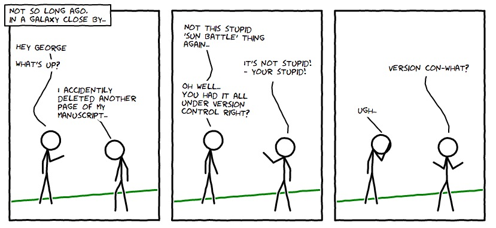

# Datalaag en CRUD

> "Did you hear they're making a Source Code 2?
> It's gonna be called Source Code: The SQL!"

## Budget app startpunt

```bash
~> git clone git@github.com:HOGENT-Web/webservices-budget.git (of git pull als het niet de eerste keer is)
~> cd webservices-budget
~/webservices-budget$> git checkout -b les4 37a0083
~/webservices-budget$> yarn install
```

Voer [dit SQL-script uit](./data/budget.sql). Zonder dit script kan je geen queries uitvoeren tot het einde van dit hoofdstuk.

## Gelaagde architectuur

**Gelaagde architectuur** is een veel gebruikte architectuur waarin code is opgebouwd uit diverse lagen, in de context van het web:

- REST API
- Servicelaag
- Repositorylaag (optioneel indien je gebruik maakt van ORM)
- Datalaag

Veel frameworks zijn opgebouwd rond deze architectuur (Spring, .NET...). In NodeJS heb je de keuze, er is geen verplichte structuur.

Een alternatieve structuur, veel gebruikt bij microservices, is de [**hexagonale structuur**](https://medium.com/idealo-tech-blog/hexagonal-ports-adapters-architecture-e3617bcf00a0).

Dit hoofdstuk focust op de twee onderste lagen: **datalaag** en **repository**

## Datalaag

De datalaag is een typische laag in de gelaagde architectuur voor het web. Het handelt de communicatie met de databank af:

- connectie opzetten, onderhouden en afsluiten indien nodig
- databank aanmaken en up-to-date houden (= migraties)
- In development: het seeden van de database met testdata
- CRUD-operaties
  Dit wordt vaak afgehandeld door een framework dat een soort repository-interface beschikbaar maakt, maar DIY kan ook.

### Datalaag: de mogelijkheden

- zelf queries schrijven
- querybuilder
- Object Relational Mapper (ORM)

### Datalaag: zelf queries schrijven

Dit is waarschijnlijk de eerste mogelijkheid die in je opkomt wanneer je data moet ophalen in een applicatie. Het is zeker geen slecht idee, in de juiste context. Het zelf schrijven van queries is altijd een mogelijkheid maar het geeft je meestal meer werk dan nodig is om de code te onderhouden of om bepaalde zaken te implementeren.

In deze mogelijkheid schrijf je zelf queries in string-vorm (in JavaScript) die je vervolgens doorgeeft aan een bepaalde client die voor jou de query naar de databank zal sturen en je het antwoord teruggeeft. Deze queries kunnen placeholders bevatten voor bepaalde parameters (bv. WHERE-clauses of INSERT-queries). Hierbij handelt de client meestal SQL injection af. Gebruik je totaal geen client? Dan moet je zelf opletten voor SQL injection. Daarnaast geven deze clients vaak het pure resultaat terug zoals het van de query engine terugkwam, het is dus aan de developer om deze data te mappen naar het juiste formaat.

Dit is een mogelijkheid die heel geschikt is voor een kleine applicatie die weinig speciaals vereist van de databank, typische een applicatie met weinig tot geen relaties en/of CUD-queries. Nee, dit is geen schrijffout: weinig tot geen Create, Update of Delete queries. Indien de applicatie meer relaties krijgt en complexere tabellen, wordt het al gauw moeilijk om zelf geschreven queries te onderhouden.

Samengevat

- (grondige) kennis van SQL vereist
- queries in stringvorm
- je krijgt pure resultaten uit de databank terug (relaties zelf groeperen in aggregaten...)
- ideaal voor kleine applicaties
- bv. [mysql](https://www.npmjs.com/package/mysql),[pg](https://www.npmjs.com/package/pg), [PostgreSQL](https://www.npmjs.com/package/pg), [mongoDb](https://www.npmjs.com/package/mongodb), [redis](https://www.npmjs.com/package/redis):

### Datalaag: querybuilder

Een tweede optie is om de queries dynamisch te laten opbouwen door een bepaald framework. Hierbij vermijd je dat je zelf queries moet schrijven en onderhouden, het framework zal dit voor jou afhandelen. Daarbij krijg je ook gratis en voor niets bescherming tegen SQL injection bij deze frameworks.

Afhankelijk van het gekozen framework zijn relaties al dan niet ondersteund. Echter blijft de ondersteuning beperkt aangezien deze frameworks focussen op het bouwen van queries en niet op het eenvoudig maken van bepaalde OO-concepten in databanken. Vaak moet je dus zelf nog je relaties (en bijbehorende referentiële integriteit) afhandelen om een consistente databank te hebben.

Een heel bekende querybuilder voor NodeJS is [knex.js](https://www.npmjs.com/package/knex). Het biedt een eennvoudige interface m.b.v. het Builder patroon en heeft native ondersteuning voor async/await.

Om een meer OO-aanpak te krijgen, kan je gebruik maken van [objection.js](https://www.npmjs.com/package/objection). Objection laat je toe om eenvoudig en automatisch relaties op te halen. Er is ook ondersteuning voor CUD-operaties voor relaties, maar de documentatie raadt af om deze intensief te gebruiken.

Samengevat:

- dynamisch queries opbouwen
- soms ondersteuning voor eenvoudig gebruik van relaties
- nog steeds kennis van SQL vereist
- bv. [knex.js](https://www.npmjs.com/package/knex) of [objection.js](https://www.npmjs.com/package/objection)

### Datalaag: Object Relational Mapper (ORM)

Dit is de meest eenvoudige aanpak voor ontwikkelaars die geen of beperkte kennis hebben van SQL en databankontwerp. Een ORM neemt de noodzaak van SQL-kennis weg en zal zelf queries genereren om data op te halen. Het enige wat een ORM moet weten is hoe het databankschema eruit ziet. Hierbij kan de ontwikkelaar gebruik maken van alle OO-concepten, het ORM zal ervoor zorgen dat de gegeven data weggeschreven kan worden naar de databank. Dat is letterlijk wat de naam beschrijft: Object Relational Mapper.

Enige voorzichtigheid met ORMs is noodzakelijk aangezien deze niet altijd de meest optimale query genereren voor de data die opgehaald moet worden. Ook kan de interface van het gekozen framework sommige aspecten juist moeilijker maken dan simpelweg de query schrijven of dynamisch opbouwen.

Het is dus belangrijk om te controleren of je effectief een ORM nodig hebt aangezien dit een redelijke complexiteit toevoegt aan je applicatie. Indien je bv. gebruik maakt van GraphQL is het overkill om een ORM te gaan gebruiken aangezien de gebruiker hierbij zelf kan kiezen welke data hij wel en niet ophaalt. Bij REST kan het dan weer een meerwaarde zijn. Het hangt sterk af van project tot project: bv. het aantal relaties, de moeilijkheid van de uitgevoerde queries.

Samengevat

- geen kennis van SQL vereist, genereert zelf queries
- eenvoudige interface om data op te vragen of weg te schrijven
- diepgaande ondersteuning voor relaties
- model definiëren kan complex zijn
- bv. [Sequelize](https://www.npmjs.com/package/sequelize) of [Prisma](https://www.npmjs.com/package/prisma), [TypeORM (enkel voor TypeScript)](https://www.npmjs.com/package/typeorm), [Mongoose (enkel voor MongoDB)](https://www.npmjs.com/package/mongoose)

### Datalaag: wat kiezen we nu?

Wij kiezen **knex.js** als querybuilder voor ons voorbeeld. Dit is prima voor wat we maar nodig hebben.

Voel je vrij om voor het project bv. een ORM framework te gebruiken!

### Packages

```bash
~/webservices-budget$ yarn add knex
~/webservices-budget$ yarn add mysql2
```

We maken gebruik van de packages [**knex**](https://www.npmjs.com/package/knex) en [**mysql2**](https://www.npmjs.com/package/mysql2).

- [**knex**](https://www.npmjs.com/package/knex) is een querybuilder en vormt onze interface naar de databank
- [**mysql2**](https://www.npmjs.com/package/mysql2) is een MySQL client voor NodeJS, gefocust op performantie én met ondersteuning voor async/await

### Databank configuratie

Eerst moeten we onze configuratie uitbreiden met de gegevens van onze databank.

`src/config/development.js`

```js
module.exports = {
  // ...
  database: {
    client: 'mysql2',
    host: 'localhost',
    port: 3306,
    name: 'budget',
    username: 'root',
    password: '',
  },
};
```

We splitsen deze zo klein mogelijk op. Pas de instellingen aan jouw lokale instellingen aan of voorzie environment variables in de `custom-environment-variables.js` en `.env bestanden`.

## Connectie met de databank

We maken een module voor onze datalaag (index.js). In de `data` folder maak je het bestand`index.js` aan.

`src/data/index.js`

```js
const knex = require('knex'); // 👈 4
const { getLogger } = require('../core/logging'); // 👈 8

// 👈 1 - start config
const config = require('config');

const NODE_ENV = config.get('env');
const isDevelopment = NODE_ENV === 'development';

const DATABASE_CLIENT = config.get('database.client');
const DATABASE_NAME = config.get('database.name');
const DATABASE_HOST = config.get('database.host');
const DATABASE_PORT = config.get('database.port');
const DATABASE_USERNAME = config.get('database.username');
const DATABASE_PASSWORD = config.get('database.password');
// 👈 1 einde config

let knexInstance; // 👈 5

// 👈 2
async function c() {
  const logger = getLogger(); // 👈 8
  logger.info('Initializing connection to the database'); // 👈 8
  const knexOptions = {
    client: DATABASE_CLIENT,
    connection: {
      host: DATABASE_HOST,
      port: DATABASE_PORT,
      database: DATABASE_NAME,
      user: DATABASE_USERNAME,
      password: DATABASE_PASSWORD,
      insecureAuth: isDevelopment,
    },
  }; // 👈 6
  knexInstance = knex(knexOptions); // 👈 7

  try {
    await knexInstance.raw('SELECT 1+1 AS result');
  } catch (error) {
    logger.error(error.message, { error });
    throw new Error('Could not initialize the data layer');
  } // 👈 8

  return knexInstance; // 👈 7
}

// 👈 9
function getKnex() {
  if (!knexInstance)
    throw new Error(
      'Please initialize the data layer before getting the Knex instance'
    );
  return knexInstance;
}

// 👈 11
const tables = Object.freeze({
  transaction: 'transactions',
  user: 'users',
  place: 'places',
});

// 👈 3
module.exports = {
  initializeData,
  getKnex, // 👈 10
  tables, // 👈 11
};
```

1. Importeren eerst onze configuratie en maak een variabele aan voor elk van de databank instellingen.
2. Maak vervolgens een functie `ìnitializeData` die onze datalaag zal aanmaken
3. Exporteer deze functie alvast
4. Importeer knex
5. Maak een globale variabele om onze connectie in te bewaren. Hierdoor kunnen we deze later gebruiken om queries uit te voeren of om correct af te sluiten.
6. Definiëer de connectie-opties voor knex. We gaan er hierbij vanuit dat de databank reeds bestaat
7. Vervolgens maken we een nieuwe Knex-instantie en retourneren deze
8. Als laatste checken we of de connectie goed functioneert door een simpele query uit te voeren
9. Nu is de datalaag klaar voor gebruik.We moeten enkel onze connectie nog beschikbaar maken voor gebruik. We definiëren een `getter` voor de Knex-instantie
10. en exporteren deze ook
11. We definiëren ook een constant object `tables` met de namen van onze tabellen. Nee, we coderen deze niet hard! Zo hoeven we maar één aanpassing te maken indien nodig.

Nu dienen we de `initializeData` aan te roepen in ons opstartscript.

`src/index.js`

```js
// andere imports
const { initializeData } = require('./data'); // 👈 1
// configuratie

// 👈 2
async function main() {
  // logger initialiseren

  await initializeData(); // 👈 4

  // andere code
}
main(); // 👈 3
```

1. We importeren de `initializeData` functie in ons opstartscript.
2. Wrap alle code uit dit bestand in een `async main` functie. We mogen nl. geen `await` doen buiten een `async` functie
3. Roep deze functie vervolgens aan
4. Initialiseer de datalaag na het initialiseren van de logger. Zo kunnen we gebruik maken van de logger in de datalaag

### Oefening

Voeg de datalaag toe aan je eigen project.

Tip: je kan ook gebruik maken van een ORM framework. Zoek op wat de Best Practices zijn voor het gebruik van een ORM framework in node.js. Implementeer het maken van een verbinding met de database.

## Repository

- abstractie voor de datalaag
- definieert een aantal functies (CRUD...) die queries uitvoeren en ,indien nodig, de query resultaten omvormen naar OO-objecten
- tussenpersoon tussen domein en databank. Zo is het "eenvoudig" om te switchen tussen databanken. Dit is eenvoudiger in een taal met interface en klassen (bv. TypeScript).
- [Lees meer over het Repository pattern](https://medium.com/@pererikbergman/repository-design-pattern-e28c0f3e4a30)
- niet altijd nodig. Maak zelf de afweging of de extra laag nut heeft. Een simpel "doorgeefluik" naar de databank heeft geen nut. Dit heeft wel nut indien bv. data omgevormd moet worden
- zorg voor één lijn in een applicatie: ofwel voor alles een repository ofwel voor niets
- meestal niet nuttig bij het gebruik van een ORM (ORM = repository)

### Voorbeeld: findAll places

Een repository exporteert verschillende functies die data ophalen: findAll, findById, create, updateById, deleteById, .. We nemen findAll places als voorbeeld. Maak een folder `repository` aan en de file `place.js`.

`src/repository/place.js`

```js
const { tables, getKnex } = require('../data/index'); // 👈 1

const findAll = () => {
  return getKnex()(tables.place) // 👈 2
    .select()
    .orderBy('name', 'ASC');
};

// 👈 3
module.exports = {
  findAll,
};
```

1. We importeren onze tabelnamen en de knex-getter. De repository gebruikt de querybuilder om de query op te bouwen. De services hoeven niet te weten hoe de query opgebouwd moet worden. Zo kan je eenvoudig switchen tussen databanken. Maar dit gebeurt niet vaak
2. We vragen dus de Knex-instantie op en starten een query voor de `places` tabel. Deze functie bouwt de SELECT-query op. Als voorbeeld sorteren we ook op de naam van de plaats.
3. We exporteren vervolgens de gedefinieerde functie

### Oefening

Maak de repository laag aan in je eigen project.

Indien je werkt met een ORM framework.

- definieer het model
- voorziet je ORM in een repository. Op welke manier?

### voorbeeld: findById transactions

Nog een extra voorbeeld om één specifieke transactie op te halen o.b.v. het id.

`src/repository/transaction.js`

```js
const { tables, getKnex } = require('../data/index'); // 👈 1

const SELECT_COLUMNS = [
  `${tables.transaction}.id`,
  'amount',
  'date',
  `${tables.place}.id as place_id`,
  `${tables.place}.name as place_name`,
  `${tables.user}.id as user_id`,
  `${tables.user}.name as user_name`,
]; // 👈 2

const formatTransaction = ({
  place_id,
  place_name,
  user_id,
  user_name,
  ...rest
}) => ({
  ...rest,
  place: {
    id: place_id,
    name: place_name,
  },
  user: {
    id: user_id,
    name: user_name,
  },
}); // 👈 5

// 👈 3
const findById = async (id) => {
  const transaction = await getKnex()(tables.transaction)
    .join(
      `${tables.place}`,
      `${tables.place}.id`,
      '=',
      `${tables.transaction}.place_id`
    )
    .join(
      `${tables.user}`,
      `${tables.user}.id`,
      '=',
      `${tables.transaction}.user_id`
    )
    .where('id', id)
    .first(SELECT_COLUMNS); // 👈 4

  return transaction && formatTransaction(transaction); // 👈 5
};

// 👈 3
module.exports = {
  findById,
};
```

1. Importeer de tabelnamen en knex getter
2. We definiëren een array met alle op te halen kolommen. Merk op: we maken aliassen voor de kolommen uit de tabellen `places` en `transactions` aangezien deze identiek zijn aan elkaar en voor conflicten zullen zorgen
3. Definieer een functie findById en exporteer.
4. Haal de transactie op

- We gebruiken opnieuw de Knex-instantie (`getKnex()`) om een nieuwe query te starten voor de `transactions` tabel.
- We filteren op id (`where`-clause)
- en kiezen het eerste record (`first()`, er is er logischerwijs maar één), anders kan het id geen primary key zijn...
- en selecteren de gedefinieerde kolommen(`first(SELECT_COLUMNS)`). We kunnen de array hergebruiken in findAll
- we joinen ook nog de tabellen waarmee een transactie een relatie heeft: `places` en `users`

5. we definiëren een functie die een transactie uit de databank omvormt naar een mooi object. Als er een transactie gevonden werd, dan vormen we het resultaat om naar het gewenste formaat. Return eens de niet omgevormde transactie om het verschil te zien (dit is dan het pure query-antwoord).

### Oefening

Maak een findById functie aan in je project.

TIP: Je kan als 'EXTRA' gebruik maken van een **mapper package** om de mapping te definiëren.

### Voorbeeld: create transaction

We definiëren een functie om een transactie toe te voegen.

`src/repository/transaction.js`

```js
// ...

// 👈 1
const create = async ({ amount, date, placeId, userId }) => {
  const [id] = await getKnex()(tables.transaction).insert({
    amount,
    date,
    place_id: placeId,
    user_id: userId,
  }); // 👈 2 en 3
  return id; // 👈 3
};

// 👈 4
module.exports = {
  findById,
  create,
};
```

1. Voeg de functie `create` toe
2. We starten een INSERT-query en geven de nodige data voor de transactie mee. De repository zet data van de service-laag om naar het juiste formaat voor de tabel waarmee hij werkt. Dit gebeurt hier voor place_id en user_id. De kolomnaam is immers place_id en niet placeId.
3. We krijgen van MySQL een array terug met op de eerste positie het id van de aangemaakte entiteit, vandaar `[id]`.
4. We retourneren de id van de aangemaakte entiteit
5. Exporteer de functie

Merk op dat we in de repository laag geen errors opvangen. Dit gebeurt in de service laag (zie verder).

### Oefening

- Maak een `create` functie aan in je project.
- Maak ook `updateById` en `deleteById` aan.

## Services

Om deze repositories nu te gebruiken, importeren we alle functies die in de modules gedefinieerd werden.

`src/service/place.js`

```js
const placesRepository = require('../repository/place'); // 👈 1

const getAll = async () => {
  const items = await placesRepository.findAll(); // 👈 2
  return {
    items,
    count: items.length,
  }; // 👈 3
};
```

1. importeer alle functies uit de module place.
2. in de functie getAll halen we de data nu op via de repository
3. en retourneren dit in een object, samen met de count (het aantal elementen in de lijst)
   merk op: deze functie is async geworden doordat we een await doen op de functie uit de transaction repository

Doordat deze functie async geworden is dienen we de Rest-laag ook aan te passen.

`src/rest/place.js`

```js
const placeService = require('../service/place');

const getAllPlaces = async (ctx) => {
  const places = await placeService.getAll();
  ctx.body = places;
};

// ...
```

Voorlopig halen we simpelweg de lijst van places op in onze handler voor `GET /api/places`, maar deze functie is async geworden. Vergeet dus niet om await toe te voegen of je zal geen correct antwoord krijgen!

### Repository in NodeJS

- Er is geen gouden graal, dit is een voorbeeld-aanpak
- mappenstructuur. De `src` folder bevat o.a. volgende folders
- `data`: connectie met databank opzetten en beheren, met in deze folder ook

1. `migrations`: zie verder
2. `seeds`: zie verder

- `repository`: bevat repositories
  ...

### Oefening

- Pas de service, rest laag aan in je eigen project voor de `getAll` methode uit de repository
- Voeg een findCount methode toe in je repository, deze haalt het totaal aantal rijen op in de betreffende tabel. Meer in [de knex documentatie](https://knexjs.org/guide/query-builder.html#count)
- Gebruik deze in de getAll om een property count toe te voegen aan de returnwaarde.
- Doe dit ook voor de andere methodes: `getById`, `create`, `updateById` en de `deleteById`. Een voorbeeld kan je vinden in de branch **TODO??????**

Indien je voor een ORM framework gaat, pas dan de `service` en `rest` laag aan.

### Problemen!

Wie zal ervoor zorgen dat het databank-schema up to date is met de laatste versie van het schema?
nieuwe tabellen, kolommen, procedures, triggers...
hernoemde tabellen, kolommen...
verdwenen tabellen, kolommen...
...
Wie zal ervoor zorgen dat we degelijke dummy data hebben in de databank?
Het antwoord: we doen dit niet handmatig, zelfs geen dummy data!

## Migrations

- version control voor de databank
- kijkt op welke versie het databank-schema zit
- doet eventueel updates en brengt het schema naar een nieuwere versie
- maakt deze ongedaan indien er iets fout liep (zeer belangrijk in production databanken!)
- let op volgorde (bv. bij foreign keys)!
  

### Migrations: KnexJS

- KnexJS heeft dit [builtin](https://knexjs.org/#Migrations)
- enkel aangeven waar migrations staan bij [configuratie](https://knexjs.org/#Installation-migrations)
- zijn JavaScript modules die twee functies exporteren:

1. up: bevat de code die deze migratie uitvoert
2. down: bevat de code die de migratie ongedaan maakt

- er is één bestand per migratie
- naming convention: `YYYYMMDDHHmm_description.js`, bv. `202309111840_createUserTable.js`. M.a.w.: een timestamp gevolgd door een underscore en een korte beschrijving van de migratie

### Migrations: budget app

- `places` tabel aanmaken
- `users` tabel aanmaken
- `transactions` tabel aanmaken
- een kolom `rating` aan een place toevoegen
  ...

### Migrations: voorbeeld

We starten met het aanmaken van een migratie voor de tabel `places`

`src/data/migrations/202309111845_createPlaceTable.js`

```js
const { tables } = require('..');
module.exports = {
  up: async (knex) => {
    await knex.schema.createTable(tables.place, (table) => {
      table.increments('id'); // 👈 1

      table.string('name', 255).notNullable(); // 👈 2

      table.unique('name', 'idx_place_name_unique'); // 👈 3
    });
  },
  down: (knex) => {
    return knex.schema.dropTableIfExists('places');
  },
};
```

- Een migration-file exporteert twee functies genaamd `up` en `down`. De `up` functie is `async` door het gebruik van `await`, nodig voor de creatie van de tabel.
- Beide functies krijgen de Knex-instantie mee als argument. Dit is de interface naar de databank.
- De `up`-functie zal de tabel `places` aanmaken. Hiervoor wordt de `createTable`-functie van de [Knex Schema API](https://knexjs.org/guide/schema-builder.html) gebruikt
- Het eerste argument van de `createTable` functie is de tabelnaam. Uiteraard codeer je dit niet hard, dit is maar een voorbeeld. Je kan het tables object uit de datalaag importeren.
- Het tweede argument is een functie die een interface naar de tabel meekrijgt. Met deze interface kunnen we de tabel volledig instellen (kolommen, indices...). Merk op: deze interface bouwt een CREATE TABLE DDL-statement op. Per functie-aanroep op deze interface wordt geen DDL-statement uitgevoerd! Enkel als de functie van dit 2e argument uitgevoerd is.

1. We maken eerst een kolom met als naam `id`, het type van deze kolom is `INT`. Deze kolom heeft een auto-increment en is daarom de primary key
2. We voegen nog een kolom `name` toe. Deze kolom is van het type `string` en heeft een maximum lengte van 255 karakters. Deze kolom mag ook geen `NULL` bevatten
3. We stellen ook nog een `UNIQUE INDEX` in op de kolom `name`. We geven deze index de naam `idx_place_name_unique` om eenvoudiger een mooie foutboodschap te kunnen retourneren naar de client. Je kan deze checks ook in de code uitvoeren
   maar databankservers zijn vaak meer uit de kluiten gewassen dan de backend-server. **Alles wat de databank kan doen, laat je de databank doen**

- de `down`-functie gooit simpelweg de eventueel gemaakte tabel weg. Waarom is hier geen async nodig? Deze functie retourneert de `Promise` meteen, dus `async` is niet nodig

### Migrations uitvoeren

Migrations worden typisch uitgevoerd voor de server opstart. we voegen deze code toe aan onze `initializeData`.
`src/data/index.js`

```js
async function initializeData() {
  const knexOptions = {
    // ...
    migrations: {
      tableName: 'knex_meta',
      directory: join('src', 'data', 'migrations'),
    }, // 👈 1
  };
  // ...

  // 👈 2
  try {
    await knexInstance.migrate.latest();
  } catch (error) {
    logger.error('Error while migrating the database', {
      error,
    });
    throw new Error('Migrations failed, check the logs');
  }

  return knexInstance;
}
```

1. We geven mee aan Knex waar onze migraties staan en in welke tabel hij metadata over de uitgevoerde migraties mag bijhouden
2. Nadat de connectie aangemaakt is en goed functioneert, voeren we de migraties uit. We gebruiken de `latest` functie van de Knex Migration API. Deze functie zal kijken op welke versie de databank zit en zal deze vervolgens up to date maken. Als de migraties gefaald zijn, gooien we een error waardoor de server crasht. Het heeft geen zin om de server te starten met een mogelijks corrupte databank, de developer moet dit zelf controleren en fixen.

### Oefening

- Maak voor een tabel in je project de migratie file aan en voer de migratie uit.

## Seeds

- voegen testdata toe aan een databank
- wordt enkel gebruikt in development (niet in testing of production)
- typisch één seed per tabel
- let op volgorde (bv. bij relaties)!

### seeds: KnexJS

- KnexJS heeft dit [builtin](https://knexjs.org/#Seeds-API)
- enkel aangeven waar seeds staan bij [configuratie](https://knexjs.org/#Seeds-CLI)
- zijn JavaScript modules die één functie exporteren. `seed`: bevat de code die de testdata toevoegt
- er is één bestand per seed (of dus per tabel)
- naming convention: YYYYMMDDHHmm_table.js, bv. `202309111930_places.js`. m.a.w. opnieuw een timestamp gevolgd door een underscore en een korte beschrijving

Maak de seed file aan voor de seeding van de places tabel: `src/data/seeds/202309111935_places.js`

```js
module.exports = {
  // 👈 1
  seed: async (knex) => {
    // first delete all entries
    await knex('places').delete(); // 👈 2

    // then add the fresh places
    await knex('places').insert([
      { id: 1, name: 'Loon', rating: 5 },
      { id: 2, name: 'Dranken Geers', rating: 3 },
      { id: 3, name: 'Irish Pub', rating: 4 },
    ]); // 👈 3
  },
};
```

1. Een seed-file exporteert één functie genaamd `seed`. Deze functie krijgt opnieuw de Knex-instantie mee als argument
   dit is de interface naar de databank.
2. Het is nuttig om eerst de tabel leeg te maken. Mogelijks bleef er nog data achter van een vorige opstart en
   dit kan dan zorgen voor id-conflicten, e.d
3. Vervolgens voegen we onze testdata toe. Je kan kiezen om vaste ids te nemen of om deze te laten genereren door de databank. Wat is een voordeel van vaste ids? Een voordeel van vaste ids is de eenvoud om relaties te definiëren. Logisch want je kent het id van elke record, bij generatie is dit telkens verschillend

### seeds uitvoeren

Seeds worden typisch uitgevoerd voor de server opstart.

`src/data/index.js`

```js
async function initializeData() {
  const knexOptions = {
    // ...
    seeds: {
      directory: join('src', 'data', 'seeds'),
    }, // 👈 1
  };
  // ...
  if (isDevelopment) {
    // 👈 2
    try {
      await knexInstance.seed.run();
    } catch (error) {
      logger.error('Error while seeding database', {
        error,
      });
    } // 👈 3
  }

  return knexInstance;
}
```

1. We geven aan Knex mee waar de seeds staan. We voegen deze code toe aan onze initializeData
2. We voeren de seed enkel uit indien we in development mode zijn
3. We gebruiken de run functie van de Knex Seed API. Hierna is de datalaag pas echt opgestart. Het is niet erg als de seeds falen; we loggen dit enkel, de server kan nadien gewoon opstarten

### Oefening

- maak de seeding aan voor 1 tabel en zorg ervoor dat de seeding kan worden uitgevoerd

## Het totaalplaatje

hoe en wanneer moeten migrations en seeds uitgevoerd worden?

- vóór de start van de server

geeft een aantal mogelijkheden:

- externe service die hiervoor zorgt
- scripts die uitgevoerd worden voor de server start (voor npm start)
- de server doet het zelf

we kiezen de laatste

- let op! onze aanpak is niet aangepast voor/getest op servers die parallel draaien!
- de server is niet op de hoogte van de andere servers
- gevolg? mogelijke conflicten tussen meerdere servers die tegelijk migreren of seeden

## Opstarten van de datalaag

1. connectie maken met databank (zonder databank te specifiëren)
2. connectie controleren
3. databank aanmaken (indien onbestaand)
4. connectie weggooien
5. nieuwe connectie maken (op de aangemaakte databank)
6. migraties uitvoeren. Maar indien gefaald: server stopt
7. indien in development: seeds uitvoeren. Maar indien gefaald: geen probleem, server start verder op
8. datalaag is succesvol opgestart

   Code: zie [GitHub](https://github.com/HOGENT-Web/webservices-budget/blob/main/src/data/index.js)

## Oefening

werk aan je eigen project!

- vervolledig je repositories en services in je project met alle benodigde CRUD-operaties
- vervolledig ook de migrations en seedings
