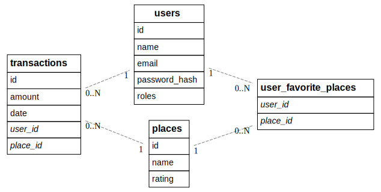

# Relaties

> **Startpunt voorbeeldapplicatie**
>
> ```bash
> git clone https://github.com/HOGENT-frontendweb/webservices-budget.git
> cd webservices-budget
> git checkout -b les5 e27a0a6
> pnpm install
> docker compose up -d
> pnpm db:migrate
> pnpm db:seed
> pnpm start:dev
> ```

## Leerdoelen

- Je kan meerdere tabellen definiëren en gebruiken met Drizzle
- Je kan relaties tussen tabellen definiëren en gebruiken met Drizzle
- Je kan complexe queries maken met Drizzle

## Inleiding

In een vorig hoofdstuk hebben we de basis gelegd voor het werken met Drizzle ORM. Nu gaan we dieper in op het definiëren van relaties tussen tabellen en het uitvoeren van complexe queries.

Hier zie je nogmaals het ERD waar we in dit hoofdstuk naartoe werken:



In het vorige hoofdstuk hebben we de places tabel reeds aangemaakt. We gaan nu de users, transactions en user_favorite_places tabellen toevoegen, inclusief de nodige relaties.

### Oefening - Schema aanvullen

Vul het schema aan met de tabellen voor transactions, users en favoriete places:

- Definieer enkel de kolommen, laat de foreign keys nog weg.
- Definieer voor de user tabel enkel de kolommen `id` en `name`.
- Voor de tabel user_favorite_places definieer je een samengestelde primary key met behulp van de `primaryKey` functie: <https://orm.drizzle.team/docs/indexes-constraints#composite-primary-key>

<br />

- Oplossing +

  Voeg toe aan `src/drizzle/schema.ts`:

  ```ts
  // src/drizzle/schema.ts

  import {
    // ...
    datetime,
    json,
    primaryKey,
  } from 'drizzle-orm/mysql-core';

  // ...

  export const users = mysqlTable('users', {
    id: int('id', { unsigned: true }).primaryKey().autoincrement(),
    name: varchar('name', { length: 255 }).notNull(),
  });

  export const transactions = mysqlTable('transactions', {
    id: int('id', { unsigned: true }).primaryKey().autoincrement(),
    amount: int('amount').notNull(),
    date: datetime('date').notNull(),
    userId: int('user_id', { unsigned: true }).notNull(),
    placeId: int('place_id', { unsigned: true }).notNull(),
  });

  export const userFavoritePlaces = mysqlTable(
    'user_favorite_places',
    {
      userId: int('user_id', { unsigned: true }).notNull(),
      placeId: int('place_id', { unsigned: true }).notNull(),
    },
    (table) => [primaryKey({ columns: [table.userId, table.placeId] })],
  );
  ```

## Relaties definiëren

In Drizzle moet je relaties op twee plaatsen definiëren:

1. In de tabeldefinities: dit wordt door de databank gebruikt om foreign keys en indices aan te maken, en de referentiële integriteit te waarborgen.
2. In de relatie-definities: dit wordt door Drizzle gebruikt om de relaties tussen de tabellen te begrijpen en te beheren. Hierdoor kan je later in de ORM-like interface makkelijk de gerelateerde data opvragen.
   - **Merk op:** dit heeft enkel gevolgen voor jou als programmeur, de databank zelf maakt hier geen gebruik van. Hierdoor krijg je betere type-inferentie en autocompletion in je code editor.
   - Deze definities kan je bijgevolg in sommige gevallen weglaten. Denk bijvoorbeeld aan relaties die slechts in één richting worden gebruikt.

Lees de documentatie over dit verschil: <https://orm.drizzle.team/docs/relations#foreign-keys>.

In ons ERD hebben we volgende relaties:

1. Een user kan meerdere transactions hebben.
2. Een place kan meerdere transactions hebben.
3. Een transactie heeft één user en één place.
4. Een user kan meerdere favoriete places hebben.
5. Een place kan favoriet zijn bij meerdere users.

Welk soort relaties zijn dit: één-op-veel of veel-op-veel?

- Oplossing +

  Relaties 1, 2 en 3 zijn onderdeel van dezelfde veel-op-veel relatie tussen users en places via transactions. De tabel transactions is in dit geval een tussentabel met extra kolommen.

  Relaties 4 en 5 zijn onderdeel van dezelfde veel-op-veel relatie tussen users en places via de tabel user_favorite_places. De tabel user_favorite_places is in dit geval een pure tussentabel zonder extra kolommen.

Lees eerst de documentatie over de `foreignKey` functie: <https://orm.drizzle.team/docs/indexes-constraints#foreign-key>.

### Foreign keys toevoegen

Als eerste voegen we de foreign keys toe in de tabeldefinities in `src/drizzle/schema.ts`:

```ts
// src/drizzle/schema.ts

// ...
export const transactions = mysqlTable('transactions', {
  // ...
  userId: int('user_id', { unsigned: true })
    .references(() => users.id, { onDelete: 'cascade' }) // 👈
    .notNull(),
  placeId: int('place_id', { unsigned: true })
    .references(() => places.id, { onDelete: 'no action' }) // 👈
    .notNull(),
});

export const userFavoritePlaces = mysqlTable(
  'user_favorite_places',
  {
    userId: int('user_id', { unsigned: true })
      .references(() => users.id, { onDelete: 'cascade' }) // 👈
      .notNull(),
    placeId: int('place_id', { unsigned: true })
      .references(() => places.id, { onDelete: 'cascade' }) // 👈
      .notNull(),
  },
  (table) => [primaryKey({ columns: [table.userId, table.placeId] })],
);
```

Met deze foreign keys zorgen we ervoor dat:

- Als een user verwijderd wordt, ook alle bijhorende transactions en user_favorite_places verwijderd worden (cascade delete).
- Een place verwijderen faalt als er nog transacties aan gekoppeld zijn (no action). Je kan enkel een place verwijderen als er geen transacties meer aan gekoppeld zijn.

Hiermee zijn de relaties in de databank gedefinieerd.

### Relaties toevoegen in Drizzle

Vervolgens voegen we de relaties toe in de relatie-definities in `src/drizzle/schema.ts` onder de tabel-definities:

```ts
// src/drizzle/schema.ts
// ...
import { relations } from 'drizzle-orm';

// ...
export const placesRelations = relations(places, ({ many }) => ({
  transactions: many(transactions),
}));

export const usersRelations = relations(users, ({ many }) => ({
  transactions: many(transactions),
}));

export const transactionsRelations = relations(transactions, ({ one }) => ({
  place: one(places, {
    fields: [transactions.placeId],
    references: [places.id],
  }),
  user: one(users, {
    fields: [transactions.userId],
    references: [users.id],
  }),
}));

export const userFavoritePlacesRelations = relations(
  userFavoritePlaces,
  ({ one }) => ({
    // Relatie in de richting van user niet gebruikt
    place: one(places, {
      fields: [userFavoritePlaces.placeId],
      references: [places.id],
    }),
  }),
);
```

Merk op dat we in de `userFavoritePlacesRelations` enkel de relatie naar `places` definiëren. De relatie naar `users` wordt niet gebruikt in onze applicatie, dus die laten we weg.

Merk ook op dat de `relations` functie geïmporteerd wordt vanuit `drizzle-orm` en niet vanuit `drizzle-orm/mysql-core`. Hieraan zie je ook dat dit puur een Drizzle concept is en geen databank-concept.

### Oefening - Migratie maken en uitvoeren

1. Maak een nieuwe migratie aan.
2. Voer de migratie uit.

- Oplossing +

  Voer volgende commando's uit:

  ```bash
  pnpm db:generate
  pnpm db:migrate
  ```

## Seeds aanvullen

We gaan nu de seed data aanvullen met users, transactions en favoriete places. Vervolledig eerst de `resetDatabase` functie in `src/drizzle/seed.ts`:

```ts
// src/drizzle/seed.ts

async function resetDatabase() {
  console.log('🗑️ Resetting database...');

  await db.delete(schema.userFavoritePlaces);
  await db.delete(schema.transactions);
  await db.delete(schema.places);
  await db.delete(schema.users);

  console.log('✅ Database reset completed\n');
}
```

Denk eraan om de tabellen in de juiste volgorde te verwijderen om foreign key problemen te vermijden.

Vervolgens definiëren we de functies om data toe te voegen aan de nieuwe tabellen:

```ts
// src/drizzle/seed.ts

async function seedUsers() {
  console.log('👥 Seeding users...');

  await db.insert(schema.users).values([
    {
      id: 1,
      name: 'Thomas Aelbrecht',
    },
    {
      id: 2,
      name: 'Pieter Van Der Helst',
    },
    {
      id: 3,
      name: 'Karine Samyn',
    },
  ]);

  console.log('✅ Users seeded successfully\n');
}

async function seedTransactions() {
  console.log('💰 Seeding transactions...');

  await db.insert(schema.transactions).values([
    // User Thomas
    // ===========
    {
      id: 1,
      userId: 1,
      placeId: 1,
      amount: 3500,
      date: new Date(2021, 4, 25, 19, 40),
    },
    {
      id: 2,
      userId: 1,
      placeId: 2,
      amount: -220,
      date: new Date(2021, 4, 8, 20, 0),
    },
    {
      id: 3,
      userId: 1,
      placeId: 3,
      amount: -74,
      date: new Date(2021, 4, 21, 14, 30),
    },
    // User Pieter
    // ===========
    {
      id: 4,
      userId: 2,
      placeId: 1,
      amount: 4000,
      date: new Date(2021, 4, 25, 19, 40),
    },
    {
      id: 5,
      userId: 2,
      placeId: 2,
      amount: -220,
      date: new Date(2021, 4, 9, 23, 0),
    },
    {
      id: 6,
      userId: 2,
      placeId: 3,
      amount: -74,
      date: new Date(2021, 4, 22, 12, 0),
    },
    // User Karine
    // ===========
    {
      id: 7,
      userId: 3,
      placeId: 1,
      amount: 4000,
      date: new Date(2021, 4, 25, 19, 40),
    },
    {
      id: 8,
      userId: 3,
      placeId: 2,
      amount: -220,
      date: new Date(2021, 4, 10, 10, 0),
    },
    {
      id: 9,
      userId: 3,
      placeId: 3,
      amount: -74,
      date: new Date(2021, 4, 19, 11, 30),
    },
  ]);

  console.log('✅ Transactions seeded successfully\n');
}

async function seedUserFavoritePlaces() {
  console.log('💰 Seeding UserFavoritePlaces...');

  await db.insert(schema.userFavoritePlaces).values([
    {
      userId: 1,
      placeId: 1,
    },
    {
      userId: 1,
      placeId: 2,
    },
    {
      userId: 2,
      placeId: 1,
    },
  ]);

  console.log('✅ UserFavoritePlaces seeded successfully\n');
}
```

Pas tot slot de `main` functie aan om deze nieuwe functies aan te roepen:

```ts
// src/drizzle/seed.ts

async function main() {
  console.log('🌱 Starting database seeding...\n');

  await resetDatabase();
  await seedUsers();
  await seedPlaces();
  await seedTransactions();
  await seedUserFavoritePlaces();

  console.log('🎉 Database seeding completed successfully!');
}
```

Voer de seeding uit:

```bash
pnpm db:seed
```

## Creatie TransactionService

De volgende service die we gaan maken is de `TransactionService`. Deze service bevat de basis CRUD-methoden voor transacties. Alvorens we deze implementeren, maken we als oefening eerst de controller en de bijhorende DTO's aan.

### Oefening - TransactionController

Definieer een nieuwe module `TransactionModule` en een controller `TransactionController` met de volgende routes:

- `GET /transactions` - Haal alle transacties op
- `GET /transactions/:id` - Haal een transactie op basis van zijn id
- `POST /transactions` - Maak een nieuwe transactie aan
- `PUT /transactions/:id` - Werk een bestaande transactie bij
- `DELETE /transactions/:id` - Verwijder een transactie

Laat alle routes momenteel nog een `Error` gooien met de boodschap "Not implemented".

Maak ook de bijhorende DTO's aan in `src/transactions/transaction.dto.ts`.

- Oplossing +

  Maak eerst een nieuwe module aan:

  ```bash
  nest generate module transaction
  ```

  Maak vervolgens de controller aan:

  ```bash
  nest generate controller transaction --no-spec
  ```

  Controleer of deze controller in de `TransactionModule` gedefinieerd werd (in de `controllers` array).

  Maak vervolgens het DTO bestand aan. Als we een transactie ophalen, halen we ook de bijhorende place en user op. Definieer eerst een `PublicUserResponseDto` in `src/user/user.dto.ts`:

  ```ts
  // src/user/user.dto.ts
  export class PublicUserResponseDto {
    id: number;
    name: string;
  }
  ```

  Definieer dan de nodige transaction dto's in `src/transaction/transaction.dto.ts`:

  ```ts
  // src/transactions/transaction.dto.ts
  import { PlaceResponseDto } from '../place/place.dto';
  import { PublicUserResponseDto } from '../user/user.dto';

  export class TransactionListResponseDto {
    items: TransactionResponseDto[];
  }

  export class TransactionResponseDto {
    id: number;
    amount: number;
    date: Date;
    user: PublicUserResponseDto;
    place: PlaceResponseDto;
  }

  export class CreateTransactionRequestDto {
    placeId: number;
    userId: number;
    amount: number;
    date: Date;
  }

  export class UpdateTransactionRequestDto extends CreateTransactionRequestDto {}
  ```

  Definieer tot slot de routes in de controller:

  ```ts
  // src/transactions/transaction.controller.ts
  import {
    Body,
    Controller,
    Delete,
    Get,
    HttpCode,
    HttpStatus,
    Param,
    ParseIntPipe,
    Post,
    Put,
  } from '@nestjs/common';
  import {
    CreateTransactionRequestDto,
    UpdateTransactionRequestDto,
    TransactionResponseDto,
    TransactionListResponseDto,
  } from './transaction.dto';

  @Controller('transactions')
  export class TransactionController {
    @Get()
    async getAllTransactions(): Promise<TransactionListResponseDto> {
      throw new Error('Not implemented');
    }

    @Post()
    async createTransaction(
      @Body() createTransactionDto: CreateTransactionRequestDto,
    ): Promise<TransactionResponseDto> {
      throw new Error('Not implemented');
    }

    @Get(':id')
    async getTransactionById(
      @Param('id') id: string,
    ): Promise<TransactionResponseDto> {
      throw new Error('Not implemented');
    }

    @Put(':id')
    async updateTransaction(
      @Param('id') id: string,
      @Body() updateTransactionDto: UpdateTransactionRequestDto,
    ): Promise<TransactionResponseDto> {
      throw new Error('Not implemented');
    }

    @Delete(':id')
    @HttpCode(HttpStatus.NO_CONTENT)
    async deleteTransaction(@Param('id') id: string): Promise<void> {
      throw new Error('Not implemented');
    }
  }
  ```

### Oefening - TransactionService

Maak een `TransactionService` aan met de nodige methoden (zie vorige oefening). Je mag de methoden voorlopig nog een `Error` laten gooien met de boodschap "Not implemented".

- Oplossing +

  Maak een nieuwe service aan:

  ```bash
  nest generate service transaction --no-spec
  ```

  Controleer of deze service in de `TransactionModule` gedefinieerd werd (in de `providers` array). Exporteer de service ook in de `TransactionModule`.

  Definieer vervolgens de methoden in de service:

  ```ts
  import { Injectable } from '@nestjs/common';
  import {
    CreateTransactionRequestDto,
    TransactionListResponseDto,
    TransactionResponseDto,
    UpdateTransactionRequestDto,
  } from './transaction.dto';

  @Injectable()
  export class TransactionService {
    async getAll(): Promise<TransactionListResponseDto> {
      throw new Error('Not implemented');
    }

    async getById(id: number): Promise<TransactionResponseDto> {
      throw new Error('Not implemented');
    }

    async create(
      dto: CreateTransactionRequestDto,
    ): Promise<TransactionResponseDto> {
      throw new Error('Not implemented');
    }

    async updateById(
      id: number,
      { amount, date, placeId, userId }: UpdateTransactionRequestDto,
    ): Promise<TransactionResponseDto> {
      throw new Error('Not implemented');
    }

    async deleteById(id: number): Promise<void> {
      throw new Error('Not implemented');
    }
  }
  ```

## Implementatie TransactionService

In de vorige oefening hebben we de `TransactionService` aangemaakt met de nodige methoden. We gaan nu een aantal van deze methoden implementeren om te tonen hoe we de relaties in Drizzle kunnen gebruiken.

Als we een transactie ophalen willen we ook de bijhorende user en place ophalen.

Lees eerst de sectie "Include relations" in de Drizzle documentatie: <https://orm.drizzle.team/docs/rqb#include-relations>.

Daarnaast heb je ook de mogelijk om SQL-like joins uit te voeren, lees hierover de documentatie t.e.m. "Full Join": <https://orm.drizzle.team/docs/joins>.

### getAll

Als eerst voorbeeld vullen we de methode `getAll` in de `TransactionService` aan:

```ts
// src/transactions/transaction.service.ts
// ...
import {
  type DatabaseProvider,
  InjectDrizzle,
} from '../drizzle/drizzle.provider';
import { desc } from 'drizzle-orm';

export class TransactionService {
  // 👇 1
  constructor(
    @InjectDrizzle()
    private readonly db: DatabaseProvider,
  ) {}

  async getAll(): Promise<TransactionListResponseDto> {
    const items = await this.db.query.transactions.findMany({
      // 👇 2
      columns: {
        id: true,
        amount: true,
        date: true,
      },
      // 👇 3
      with: {
        place: true,
        user: true,
      },
      // 👇 4
      orderBy: desc(transactions.date),
    });

    return { items };
  }

  // ...
}
```

1. We injecteren onze Drizzle provider in de constructor.
2. We selecteren enkel de kolommen `id`, `amount` en `date`.
   - De kolommen `placeId` en `userId` wensen we niet in ons response. De eindgebruiker hoeft niet te weten hoe de transactions gekoppeld zijn aan de place en user. Dit is een voorbeeld van informatie verbergen, een belangrijke best practice in API design.
3. We selecteren de place en de user. Met de `with` optie halen we gerelateerde gegevens op in de ORM-like manier. In dit geval laden we bijbehorende user- en place-informatie.
   - Merk op dat we toch de place en de user kunnen ophalen zonder hun foreign keys in de `columns` te zetten. Drizzle gebruikt die wel in de query maar zet ze niet in de `SELECT`.
4. Vaak is het retourneren van gesorteerde data belangrijk in een API! In dit geval willen we de transacties gesorteerd op datum teruggeven, zodat de frontend ze in de juiste volgorde kan tonen, de meest recentste eerst.

Merk op dat we `with` kunnen nesten om ook relaties van relaties op te halen. Stel dat we bij wijze van voorbeeld bij het ophalen van een place ook alle transacties en van de transacties de user willen ophalen. Bovendien worden de transacties gesorteerd op datum. Dit zou er als volgt uitzien:

```ts
const place = await this.db.query.places.findFirst({
  where: eq(places.id, id),
  with: {
    transactions: {
      with: {
        user: true,
      },
      orderBy: desc(transactions.date),
    },
  },
});
```

Importeer de `DrizzleModule` in de `TransactionModule` om de Drizzle provider te kunnen gebruiken:

```ts
import { Module } from '@nestjs/common';
import { TransactionController } from './transaction.controller';
import { TransactionService } from './transaction.service';
import { DrizzleModule } from '../drizzle/drizzle.module'; // 👈

@Module({
  imports: [DrizzleModule], // 👈
  controllers: [TransactionController],
  providers: [TransactionService],
  exports: [TransactionService],
})
export class TransactionModule {}
```

Injecteer de `TransactionService` en roep deze methode in de `TransactionController` aan:

```ts
// src/transactions/transaction.controller.ts
import { TransactionService } from './transaction.service';

@Controller('transactions')
export class TransactionController {
  constructor(private transactionService: TransactionService) {} // 👈

  @Get()
  async getAllTransactions(): Promise<TransactionListResponseDto> {
    return this.transactionService.getAll(); // 👈
  }
}
```

### Oefening - getById

Vul de methode `getById` in de `TransactionService` aan. Hierbij willen we de transaction ophalen samen met de bijhorende user en place.

Roep deze methode in de `TransactionController` aan.

- Oplossing +

  Vul de methode `getById` in de `TransactionService` aan:

  ```ts
  // src/transactions/transaction.service.ts
  import { Injectable, NotFoundException } from '@nestjs/common';
  import { eq } from 'drizzle-orm';
  import { transactions } from '../drizzle/schema';

  async getById(id: number): Promise<TransactionResponseDto> {
    const transaction = await this.db.query.transactions.findFirst({
      columns: {
        id: true,
        amount: true,
        date: true,
      },
      where: eq(transactions.id, id),
      with: {
        place: true,
        user: true,
      },
    });

    if (!transaction) {
      throw new NotFoundException(`No transaction with this id exists`);
    }

    return transaction;
  }
  ```

Merk op dat we vaak meer data nodig hebben in de `getById` methode dan in de `getAll` methode. De `getAll` methode geeft enkel een overzicht met algemene informatie om de response licht te houden, terwijl `getById` ook details en meer gerelateerde data ophaalt.

In het geval van de transacties is dit anders: we willen ook in de lijst al de naam van de place en de gebruiker tonen, waardoor we in beide methodes vergelijkbare data ophalen. Dit is een uitzondering op de algemene regel.

Ga na in jouw eigen project of je de gegevens die je ophaalt bij `getAll` kan beperken en meer details ophaalt bij de `getById` methode.

Roep deze methode in de `TransactionController` aan:

```ts
// src/transactions/transaction.controller.ts
@Get(':id')
async getTransactionById(
  @Param('id') id: string,
): Promise<TransactionResponseDto> {
  return this.transactionService.getById(Number(id)); // 👈
}
```

### create

Vul de methode `create` in de `TransactionService` aan. Hierbij willen we een nieuwe transaction aanmaken en deze nieuwe transactie vervolgens teruggeven.

```ts
// src/transactions/transaction.service.ts
async create(dto: CreateTransactionRequestDto): Promise<TransactionResponseDto> {
  const [newTransaction] = await this.db
    .insert(transactions)
    .values({
      ...dto,
      date: new Date(dto.date),
    })
    .$returningId();

  return this.getById(newTransaction.id);
}
```

Voorlopig moeten we de `date` kolom manueel omzetten naar een `Date` object. Wanneer we invoervalidatie toevoegen kunnen we dit automatisch laten doen.

Merk op dat je in MySQL de `$returningId()` functie moet gebruiken om de id van de nieuw aangemaakte rij op te halen. Je hebt geen mogelijkheid om de volledige transactie terug te krijgen. PostgreSQL heeft wel een `$returning()` functie waarmee je de volledige rij kan terugkrijgen. Daarom roepen we hierna de `getById` methode aan om de volledige transactie op te halen en terug te geven.

Roep deze methode in de `TransactionController` aan:

```ts
// src/transactions/transaction.controller.ts
@Post()
async createTransaction(
  @Body() createTransactionDto: CreateTransactionRequestDto,
): Promise<TransactionResponseDto> {
  return this.transactionService.create(createTransactionDto);
}
```

### deleteById

Als laatste voorbeeld implementeren we de `deleteById` methode in de `TransactionService`:

```ts
// src/transactions/transaction.service.ts

async deleteById(id: number): Promise<void> {
  const [result] = await this.db
    .delete(transactions)
    .where(eq(transactions.id, id));

  if (result.affectedRows === 0) {
    throw new NotFoundException('No transaction with this id exists');
  }
}
```

Roep deze methode in de `TransactionController` aan:

```ts
// src/transactions/transaction.controller.ts

@Delete(':id')
@HttpCode(HttpStatus.NO_CONTENT)
async deleteTransaction(
  @Param('id') id: string,
): Promise<void> {
  return this.transactionService.deleteById(Number(id));
}
```

### Oefening - updateById

Vul de methode `updateById` in de `TransactionService` aan. Hierbij willen we een bestaande transactie bijwerken en deze bijgewerkte transactie vervolgens teruggeven.

Roep deze methode in de `TransactionController` aan.

- Oplossing +

  Vul de methode `updateById` in de `TransactionService` aan:

  ```ts
  // src/transactions/transaction.service.ts
  // ...
  import { eq, and } from 'drizzle-orm';

  async updateById(
    id: number,
    { amount, date, placeId, userId }: UpdateTransactionRequestDto,
  ): Promise<TransactionResponseDto> {
    await this.db
      .update(transactions)
      .set({
        amount,
        date: new Date(date),
        placeId,
      })
      .where(and(eq(transactions.id, id), eq(transactions.userId, userId)));

    return this.getById(id);
  }
  ```

  Roep deze methode in de `TransactionController` aan:

  ```ts
  // src/transactions/transaction.controller.ts
  @Put(':id')
  async updateTransaction(
    @Param('id') id: string,
    @Body() updateTransactionDto: UpdateTransactionRequestDto,
  ): Promise<TransactionResponseDto> {
    return this.transactionService.updateById(
      Number(id),
      updateTransactionDto,
    );
  }
  ```

## Favorite places

We gaan nu de `PlaceService` uitbreiden met een methode om de favoriete places van een user op te halen.

### Best practices tussentabellen

De favoriete places worden bewaard in een tussentabel tussen user en place. Bij het gebruik van tussentabellen in een REST API moet je rekening houden met een aantal best practices. Hier worden door studenten, en in bedrijven, heel wat fouten tegen gemaakt. Hou bijgevolg steeds rekening met deze twee best practices:

- Maak nooit een service voor de tussentabel. Bevraag deze altijd via één van de entiteiten, in ons geval de user of de place.
  - In ons geval mogen we dus geen service `UserFavoritePlacesService` voorzien.
- Maak nooit een controller voor de tussentabel. Voorzie altijd routes in de controller van één van de entiteiten, in ons geval opnieuw de user en de place.
  - In ons geval mogen we dus geen route `/api/userfavoriteplaces` voorzien.

!> Let goed op het correct gebruik van tussentabellen! Er worden typisch heel wat fouten tegen gemaakt in de examenopdracht.

### Implementatie

```ts
// src/place/place.service.ts
import { userFavoritePlaces } from '../drizzle/schema';

async getFavoritePlacesByUserId(userId: number): Promise<PlaceResponseDto[]> {
  const favoritePlaces = await this.db.query.userFavoritePlaces.findMany({
    where: eq(userFavoritePlaces.userId, userId),
    with: { place: true },
  });
  return favoritePlaces.map((fav) => fav.place);
}
```

Om de favoriete places van een user op te halen, maken we gebruik van de tussentabel `user_favorite_places`. We filteren op `userId` en laden de bijbehorende place met `with: { place: true }`. Vervolgens mappen we de resultaten om enkel de places terug te geven.

Maak vervolgens een `UserModule` met bijbehorende `UserController` aan:

```bash
nest generate module user
nest generate controller user --no-spec
```

Definieer in de `UserController` een route om de favoriete places van een user op te halen:

```ts
// src/user/user.controller.ts
import { Controller, Get, Param } from '@nestjs/common';
import { PlaceService } from '../place/place.service';
import { PlaceResponseDto } from '../place/place.dto';

@Controller('users')
export class UserController {
  constructor(private placeService: PlaceService) {} // 👈 1

  // 👇 2
  @Get('/:id/favoriteplaces')
  async getFavoritePlaces(
    @Param('id') id: string,
  ): Promise<PlaceResponseDto[]> {
    return await this.placeService.getFavoritePlacesByUserId(Number(id));
  }
}
```

1. We injecteren de `PlaceService` in de constructor van de `UserController`.
2. We definiëren een `GET` route `/users/:id/favoriteplaces` om de favoriete places van een user op te halen.
3. We roepen de `getFavoritePlacesByUserId` methode van de `PlaceService` aan om de favoriete places op te halen.

Importeer de `PlaceModule` in de `UserModule` om de `PlaceService` te kunnen gebruiken

## Paginatie

Paginatie is een essentiële best practice voor API's om verschillende redenen:

- Database load: Zonder paginatie haalt SELECT \* alle records op, wat zwaar wordt bij duizenden records
- Netwerkbandbreedte: Grote JSON responses vertragen de data transfer
- Memory gebruik: Server/client moet alle data in geheugen laden en serialiseren
- Response tijd: Gebruiker wacht (te) lang op complete response

We voegen de route `GET /api/transactions?page=1&pageSize=10` toe. Deze query parameters geven aan welke pagina (`page`) we willen ophalen en hoeveel items er per pagina (`pageSize`) moeten worden weergegeven. We passen de `getAllTransactions` route aan om deze query parameters te accepteren. Query parameters komen in de controller binnen als strings. We zetten deze om naar nummers en geven ze door aan de service. We voorzien ook default waarden voor deze parameters, zodat als ze niet meegegeven worden, we toch een geldige paginatie hebben.

```ts
// src/transaction/transaction.controller.ts
import { Query} from '@nestjs/common';
//...
  @Get()
  async getAllTransactions(
    @Query('pageSize') pageSize: string = '10',
    @Query('page') page: string = '1',
  ): Promise<TransactionListResponseDto> {
    return await this.transactionService.getAll(Number(page), Number(pageSize));
  }
  //...
```

Ook het `TransactionListResponseDto` passen we aan om de nodige paginatie informatie terug te geven:

```ts
//src/transaction/transaction.dto.ts
export class TransactionListResponseDto {
  items: TransactionResponseDto[];
  page: number;
  pageSize: number;
  total: number;
}
```

`total` geeft het totaal aantal transacties weer, ongeacht de paginatie. Deze informatie is belangrijk voor de frontend om te kunnen bepalen hoeveel pagina's er zijn.

Nu dienen we de `getAll` methode in de `TransactionService` aan te passen om deze paginatie parameters te gebruiken en het gevraagde resultaat terug te geven:

```ts
// src/transaction/transaction.service.ts
import { PaginationQuery } from '../common/common.dto';
//...
 // 👇 1
 async getAll(
    page: number = 1,
    pageSize: number = 10,
  ): Promise<TransactionListResponseDto> {
    // 👇 4
  const [countResults, items] = await Promise.all([
      this.db
        .select({ count: count() })
        .from(transactions),// 👈2
      this.db.query.transactions.findMany({
        columns: {
          id: true,
          amount: true,
          date: true,
        },
        with: {
          place: true,
          user: {
            columns: {
              id: true,
              name: true,
              email: true,
            },
          },
        },
        orderBy: [desc(transactions.date), asc(transactions.id)],
        limit: pageSize,
        offset: (page - 1) * pageSize,
      }),// 👈3
    ]);

    return { items, page, pageSize, total: countResults[0].count };
  }
```

1. We accepteren de `pageSize` en `page` parameters in de `getAll` methode.
2. We voeren eerst een aparte query uit om het totaal aantal transacties te tellen.
3. We passen de `limit` en `offset` toe in de `findMany` query om enkel de transacties voor de gevraagde pagina op te halen. Bovendien sorteren we eerst op datum en dan op id. We moeten op een unieke kolom sorteren om consistente resultaten te garanderen bij paginatie: geen duplicaten of missende items bij paginatie naar een volgende/vorige pagina.
4. We gebruiken `Promise.all` om beide queries gelijktijdig uit te voeren, wat efficiënter is dan ze na elkaar uit te voeren.

Merk op: Query parameters worden ook gebruikt om te sorteren of te filteren. Bijvoorbeeld, om transacties te sorteren op datum of bedrag, kunnen we volgende query parameters toevoegen: `sortBy` en `sortOrder`. Een GET request zou er dan als volgt uitzien: `GET /transactions?page=1&pageSize=10&sortBy=date&sortOrder=desc`.

Meer info over paginatie in drizzle vind je hier: <https://orm.drizzle.team/docs/guides/limit-offset-pagination>.

## Oefening - PlaceController uitbreiden

Voorzie nu ook een route in de `PlaceController` om de transacties van een place op te halen. Het endpoint moet er als volgt uitzien: `GET /places/:id/transactions`.
Implementeer deze route en de bijhorende service methode. Voorzie ook paginatie voor deze route.
In de service pas je de `getAll` methode aan om een optionele `placeId` parameter te accepteren. Als deze parameter meegegeven wordt, worden enkel de transacties van die place opgehaald. Zo niet, worden alle transacties opgehaald. Voorzie een interface `TransactionFilter` met een optionele `placeId` property om deze filteroptie door te geven aan de `getAll` methode. Zo kan later makkelijk extra filteropties toegevoegd worden zonder de methodesignature van `getAll` te moeten aanpassen.

```ts
// src/transaction/transaction.service.ts
interface GetAllTransactionFilters {
  placeId?: number;
}
```

- Oplossing +

  De oplossing vind je in onze voorbeeldapplicatie in commit `b1ed447`.

## Oefening - UserService

Definieer de overige endpoints in de `UserController`:

- `GET /users` - Haal alle users op
- `GET /users/:id` - Haal een user op basis van zijn id
- `POST /users` - Maak een nieuwe user aan
- `PUT /users/:id` - Werk een bestaande user bij
- `DELETE /users/:id` - Verwijder een user

Maak een `UserService` aan met de nodige methoden (getAll, getById, create, update, delete). Implementeer deze methoden. Voorzie ook de nodige DTO's.

Definieer de `UserService` en de `UserController` in de `UserModule`, exporteer enkel de service.

- Oplossing +

  De oplossing vind je in onze voorbeeldapplicatie in commit `b1ed447`.

> **Oplossing voorbeeldapplicatie**
>
> ```bash
> git clone https://github.com/HOGENT-frontendweb/webservices-budget.git
> cd webservices-budget
> git checkout -b les5-opl b1ed447
> pnpm install
> docker compose up -d
> pnpm db:migrate
> pnpm start:dev
> ```
>
> Vergeet geen `.env` aan te maken! Bekijk de [README](https://github.com/HOGENT-frontendweb/webservices-budget?tab=readme-ov-file#webservices-budget) voor meer informatie.
