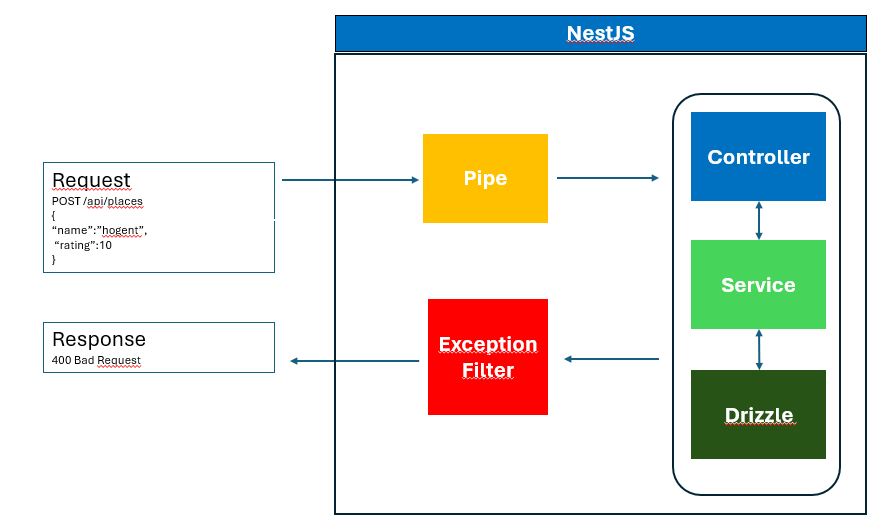

# Validatie en foutafhandeling

> **Startpunt voorbeeldapplicatie**
>
> ```bash
> git clone https://github.com/HOGENT-frontendweb/webservices-budget.git
> cd webservices-budget
> git checkout -b les4 TODO:
> yarn install
> yarn start:dev
> ```

## Leerdoelen

- Je krijgt inzicht in invoervalidatie en pipes in NestJS
  - Je weet hoe je ValidationPipe gebruikt voor automatische validatie
  - Je weet hoe je class-validator decorators toepast op DTO's
  - Je begrijpt het verschil tussen transformatie en validatie pipes
  - Je kan custom validatieregels implementeren
- Je krijgt inzicht in logging en middleware in NestJS
  - Je weet hoe je een custom logger implementeert
  - Je weet hoe je middleware gebruikt voor request logging
  - Je begrijpt de verschillende log levels en wanneer je ze gebruikt
- Je krijgt inzicht in foutafhandeling en exception filters
  - Je weet hoe je standaard HTTP exceptions gebruikt
  - Je weet hoe je custom exception filters implementeert
  - Je begrijpt hoe je structured error responses maakt
- Je krijgt inzicht in configuratiebeheer
  - Je weet hoe je environment variables gebruikt
  - Je weet hoe je `ConfigModule` en `ConfigService` implementeert
  - Je begrijpt hoe je configuratie per omgeving beheert

!> De wijzigingen die we hier bespreken, kan je meteen toepassen in je eigen project. Terwijl de lector in de les de code demonstreert in het voorbeeldproject, pas jij de aanpassingen best al direct toe in jouw eigen project. Zo leer je het meteen in jouw eigen context en heb je achteraf minder werk

## Invoervalidatie

Een belangrijk principe bij het ontwikkelen van een API is het valideren van de invoer. Dit is belangrijk om de integriteit van de data te garanderen. Het is ook belangrijk om de gebruiker van de API te beschermen tegen zichzelf. Als de gebruiker een fout maakt, dan moet de API dit opvangen en een duidelijke foutmelding terugsturen.

Je mag geen aannames maken over de invoer die je ontvangt. **Je moet er vanuit gaan dat de invoer altijd fout kan zijn.** Enkel validatie in de front-end is onvoldoende, dit is eenvoudig te omzeilen. Ooit zal iemand een verzoek sturen dat iets zal breken.

Welke soorten invoer kan een HTTP request bevatten?

- Antwoord +

  - **URL parameters:** je kan bijvoorbeeld het id van een plaats meegeven in de URL, bv. `/api/places/1`.
  - **Query parameters:** je kan bijvoorbeeld een zoekopdracht meegeven in de URL, bv. `/api/places?name=loon`.
  - **Body:** als je een nieuwe plaats maakt, dan geef je de nodige gegevens mee in de body van het request.
  - **Headers:** in het volgende hoofdstuk gaan we zien hoe we een token meegeven in de headers van een request, zo kunnen we de gebruiker authenticeren.

  In ons voorbeeldproject voegen we invoervalidatie toe voor de URL parameters, query parameters en de body van het request.

Invoervalidatie is gericht op het verifiëren van de ontvangen gegevens. Bijvoorbeeld in de `POST /api/places` moet het bedrag van de plaats een geldig getal zijn (geen string, object...) én is het verplicht op te geven. Indien aan de validatie niet voldaan is, retourneer je een status code 400 (= bad request) en geef je details over de fout. Zonder bijkomende informatie is de HTTP 400 nutteloos. Bij validatiefouten stop je onmiddellijk de verdere verwerking van het request en retourneer je een passende foutboodschap voor de client. Stuur het response zo snel mogelijk terug naar de client (= **fail-fast principe**). De oorzaak van de validatiefout moet goed worden uitgelegd en begrepen door de client. Technische aspecten mag je om veiligheidsredenen niet retourneren.

?> In geen geval is het goed om een HTTP 500 terug te geven bij fouten die de client kan vermijden. De HTTP 500 dient enkel voor serverfouten die de client niet kan vermijden. Een HTTP 400 is een fout veroorzaakt door de client en moet dus ook door de client worden opgelost.

### Pipes

Lees de documentatie over [pipes](https://docs.nestjs.com/pipes) t.e.m. "Schema based validation".

In NestJS zijn pipes een soort middleware die o.a. gebruikt worden om:

- Data te transformeren – bv. een string "123" omzetten naar een number.
- Data te valideren – bv. checken of een parameter een geldig e-mailadres is.

👉 Concreet: pipes werken voordat je data in je controller terechtkomt. Ze pakken de inkomende request-gegevens, passen transformaties en/of validaties toe, en geven het resultaat door aan je endpoint. Als de data ongeldig is, kan een pipe meteen een exception gooien.

NestJS voorziet bv. in volgende built-in pipes:

- `ParseIntPipe`: zet een string query param "5" om naar een getal 5.
- `ParseBoolPipe`: zet "true" (als string) om naar true (als boolean).
- `ValidationPipe`: valideert data met behulp van [class-validator](https://npmjs.com/package/class-validator).

Gebruik in een controller:

```typescript
// src/place/place.controller.ts
import { /* ... */ ParseIntPipe} from '@nestjs/common';

@Get(':id')
getPlaceById(@Param('id', ParseIntPipe) id: number): PlaceResponseDto { // 👈
  console.log(typeof id);
  return this.placeService.getById(id); // 👈
}
```

Het type van de id parameter wordt nu een `number`. We hoeven het id niet langer naar een `number` om te zetten bij aanroep van de methode `getById` uit de `PlaceService`.

### ValidationPipe

In NestJS gebruik je DTO’s vooral om:

- Te bepalen welke velden een request/response mag bevatten.
- Validatie toe te passen op binnenkomende data.
- De structuur van data duidelijk en voorspelbaar te maken.

Lees de documentatie over [validatie](https://docs.nestjs.com/techniques/validation) t.e.m. "Transform payload objects".

Validatie voeg je toe door gebruik te maken van `class-validator`. Je kan decorators van class-validator gebruiken om validatieregels op te leggen.

```bash
pnpm i class-validator
```

Pas de `CreatePlaceRequestDto` klasse aan:

```typescript
// src/places/place.dto.ts
import { IsNumber, IsString, Max, Min } from "class-validator";

export class CreatePlaceRequestDto {
  @IsString()
  name: string;

  @IsNumber()
  @Min(1)
  @Max(5)
  rating: number;
}
```

De `ValidationPipe` zorgt ervoor dat alle inkomende DTO’s automatisch worden gevalideerd a.d.h.v. de decorators uit `class-validator`. Als een request niet voldoet, geeft NestJS een duidelijke foutmelding terug.

De `ValidationPipe` dien je te activeren in `main.ts` zodat deze wordt toegepast op alle inkomende requests.

```typescript
// src/main.ts
import { NestFactory } from '@nestjs/core';
import { AppModule } from './app.module';
import { ValidationPipe } from '@nestjs/common'; // 👈

async function bootstrap() {
  const app = await NestFactory.create(AppModule);

  // 👇
  app.useGlobalPipes(new ValidationPipe({
    whitelist: true, // verwijdert de properties die niet in de DTO staan
    forbidNonWhitelisted:true, // gooit fout als er foute properties binnenkomen
    forbidUnknownValues: true, // gooit fout bij onbekende types/waarden
  }));

  await app.listen(process.env.PORT ?? 9000);
}

bootstrap();
```

Whitelisting is een functie van de `ValidationPipe` in NestJS die ervoor zorgt dat alleen de velden die je expliciet hebt gedefinieerd in je DTO worden geaccepteerd. Alle andere (onverwachte) velden worden automatisch verwijderd. Het request gaat gewoon door, maar zonder de extra velden. Als je ook nog `forbidNonWhitelisted: true` toevoegt, dan wordt er een fout gegooid als er ongewenste velden zijn. Het request wordt geweigerd met een duidelijke foutmelding. `forbidUnknownValues: true` gooit een foutmelding bij onbekende types/waarden.

Probeer een POST request uit en:

- verwijder `user` uit de JSON
- geef een datum op die in de toekomst ligt
- voeg een extra veld toe.

We krijgen een HTTP 400 terug en de reden van de fout.

### Auto transform payloads naar DTO's

In NestJS krijg je vaak data binnen als platte JSON-objecten (bijvoorbeeld uit een HTTP-request). Maar in je code wil je werken met echte instanties van een klasse, zodat je bijvoorbeeld methodes kan gebruiken, of zodat validatie en andere decorators goed werken. Class transformers zetten gewone JavaScript-objecten om naar instances van classes en omgekeerd.

Pas de `create` methode aan en doe een POST request. Bekijk de console.

```typescript
// src/place/place.controller.ts

@Post()
@HttpCode(HttpStatus.CREATED)
createplace(@Body() createPlaceDto:CreatePlaceRequestDto): PlaceResponseDto {
  console.log(createPlaceDto instanceof CreatePlaceRequestDto); // 👈
  return this.placeService.create(createPlaceDto);
}
```

Om ervoor te zorgen dat dit een instantie is van de DTO klasse, installeren we `class-transformer`:

```bash
pnpm i class-transformer
```

En voegen we in `main.ts` onderstaande optie toe:

```typescript
// src/main.ts
import { NestFactory } from '@nestjs/core';
import { AppModule } from './app.module';
import { ValidationPipe } from '@nestjs/common';

async function bootstrap() {
  // ...

  app.useGlobalPipes(new ValidationPipe({
    whitelist: true,
    forbidNonWhitelisted:true,
    forbidUnknownValues: true,
    transform: true // 👈 zet inkomende JSON om naar instantie van DTO-klasse
  }));

  // ...
}

bootstrap();
```

`transform:true`: zet de inkomende JSON om naar een instance van de DTO-klasse m.b.v. `plainToInstance` methode van `class-transformer`.

Voer een POST request uit en bekijk het type.

Class transformers kunnen ook primitieve types omzetten. Alles wat via `@Param()`, `@Query()`, enz. binnenkomt is van type `string`. Als we in de `getPlaceById` methode het type van de id veranderen in `number` zal `ValidationPipe` dit proberen om te zetten. Verwijder de `ParseIntPipe` en pas aan.

```typescript
// src/place/place.controller.ts

@Get(':id')
getPlaceById(@Param('id') id: number): PlaceResponseDto { // 👈
  console.log(typeof id);
  return this.placeService.getById(id);
}
```

Doe dit ook voor PUT en DELETE. We hoeven Number-functie niet langer te gebruiken. Merk op dat deze feature invloed heeft op de performantie van je applicatie.

### Formatteren van validatie fouten

Standaard gooit de `ValidationPipe` een `BadRequestException` met een array van validatiefouten (`ValidationError[]`). Als je dat gedrag wil aanpassen, kan je een eigen `exceptionFactory` functie meegeven.

Momenteel zal een POST met onderstaande JSON:

```json
{
  "name": "HOGENT",
  "rating":10,
  "review":"dit is een review"
}
```

Deze respons retourneren:

```json
{
  "message": [
    "property review should not exist",
    "rating must not be greater than 5"
  ],
  "error": "Bad Request",
  "statusCode": 400
}
```

We willen deze fouten formatteren zodat we mooi per parameter de fouten gegroepeerd zien. Zo is het voor de front-end makkelijker om bv. per inputveld de bijhorende error te tonen.

```typescript
// src/main.ts
// ...
app.useGlobalPipes(
  new ValidationPipe({
    whitelist: true,
    transform: true,
    forbidNonWhitelisted: true,
    forbidUnknownValues: true,

    // 👇
    exceptionFactory: (errors: ValidationError[] = []) => {
      const formattedErrors = errors.reduce(
        (acc, err) => {
          acc[err.property] = Object.values(err.constraints || {});
          return acc;
        },
        {} as Record<string, string[]>,
      );

      return new BadRequestException({
        details: { body: formattedErrors },
      });
    },
  }),
);
// ...
```

Voer het POST request terug uit en bekijk de output.

### Samenvatting

Samenvattend gebeuren volgende validatiestappen alvorens de invoer bij de juiste methode in de controller terechtkomt:


### Oefening - DTO voor paginatie

Annoteer het DTO voor de paginatie. De parameters `page` en `limit` zijn optioneel.

- Oplossing +

  ```typescript
  // pagination.dto.ts
  import { Type } from 'class-transformer';
  import { IsInt, Min, IsOptional } from 'class-validator';

  export class PaginationQuery {
    @IsOptional()
    @Type(() => Number)
    @IsInt()
    @Min(1)
    page?: number = 1;

    @IsOptional()
    @Type(() => Number)
    @IsInt()
    @Min(1)
    limit?: number = 10;
  }
  ```

## Logging

Lees [Best practices for logging](https://betterstack.com/community/guides/logging/nodejs-logging-best-practices/).

Manueel links en rechts wat `console.log` instructies toevoegen om iets te loggen is natuurlijk niet zo handig. Een goede logger laat toe om eenvoudig meer of minder te loggen al naargelang we in productie of development draaien.

Logs kan je ook met een zeker 'level' loggen, zodat je niet telkens alles moet in/uit commentaar zetten als je wat meer/minder detail wil. En nog veel meer..., een goede logger is best een uitgebreid stuk software.

NestJS bevat een ingebouwde tekstlogger via de `Logger`klasse uit `@nestjs/common`.
Neem [Logging](https://docs.nestjs.com/techniques/logger) door.

We maken een eigen `CustomLogger` aan. In de `src` folder maak je een `core` folder aan. Voeg een bestand `customLogger.ts` toe.

```ts
// src/core/customLogger.ts
import type { LoggerService } from '@nestjs/common';
import { ConsoleLogger } from '@nestjs/common';

export class CustomLogger extends ConsoleLogger implements LoggerService {
  log(message: string) {
    super.log('📢 ' + message);
  }

  error(message: string, trace: string) {
    super.error('❌  ' + message, trace);
  }

  warn(message: string) {
    super.warn('⚠️  ' + message);
  }

  debug(message: string) {
    super.debug('🐞 ' + message);
  }

  verbose(message: string) {
    super.verbose('📖 ' + message);
  }
}

```

  `CustomLogger` implementeert alle methodes die in de `LoggerService`-interface van NestJS zijn gedefinieerd. Zo werkt  `CustomLogger` als een geldige logger binnen het NestJS-framework. `CustomLogger` breidt de standaard `ConsoleLogger` van NestJS uit.

- log: 📢 voor algemene logs
- error: ❌ voor fouten
- warn: ⚠️ voor waarschuwingen
- debug: 🐞 voor debugberichten
- verbose: 📖 voor gedetailleerde logs

Elke methode (log, error, warn, debug, verbose) roept de overeenkomstige methode van de `ConsoleLogger` aan, maar voegt eerst de emoji toe aan het bericht. Zo krijg je visueel onderscheid tussen verschillende soorten logberichten in je console.

Om de `CustomLogger` te gebruiken in de app, stel je deze logger in bij het opstarten van de applicatie. Dit doe je in het entrypoint-bestand, `main.ts`.

```ts
// src/main.ts
import { NestFactory } from '@nestjs/core';
import { AppModule } from './app.module';
import { ValidationPipe, Logger } from '@nestjs/common';// 👈 3
import { CustomLogger } from './core/customLogger'; // 👈 1

async function bootstrap() {
  const app = await NestFactory.create(AppModule);
  app.useLogger(new CustomLogger());  //👈 2
  ...
  await app.listen(process.env.PORT ?? 9000, () => {
    new Logger().log('🚀 Server listening on http://127.0.0.1:9000');//👈 3
});
}
bootstrap();
```

1. Importeer `CustomLogger`
2. In de app gebruik je een aangepaste logger (`CustomLogger`)  in plaats van de standaard logger van NestJS
3. We loggen een bericht wanneer de server opgestart is. Nu worden alle logs van je applicatie via de `CustomLogger` verwerkt.

Bekijk het resultaat in de terminal. Zijn dit geen mooie logs?

## Foutafhandeling

[Lees Exception filters](https://docs.nestjs.com/exception-filters) tot aan [sectie Exception filters](https://docs.nestjs.com/exception-filters#exception-filters-1)

### Standaard exceptions

NestJS levert een set HTTP-exceptions mee die je direct kan gebruiken. Ze komen uit `@nestjs/common` en gooien een response met de juiste HTTP-statuscode en een standaard JSON-body.

Voorbeeld: NotFoundException

```typescript
// src/place/place.service.ts
  import { Injectable, NotFoundException } from '@nestjs/common';// 👈1

  getById(id: number): PlaceResponseDto {
    const place = PLACES.find(item => item.id === id);// 👈2
    if (!place) {
      throw new NotFoundException(`place #${id} not found`);
    }// 👈3
    return place;// 👈3
  }
```

Als de plaats niet bestaat dan krijg je automatisch een `404 NOT FOUND` exception met volgende respons :

```json
{
    "message": "place #10 not found",
    "error": "Not Found",
    "statusCode": 404
}
```

### Exception filters

Exception Filters zijn klassen die afhandelen hoe exceptions worden omgezet naar responses. Standaard gebruikt NestJS een Global Exception Filter (`BaseExceptionFilter`), die alle `HttpException` vertaalt naar JSON. Als je echter meer controle wil (bv. logging, een andere JSON-structuur, errors wegschrijven naar een monitoring tool) kan je hiervoor een Exception filter aanmaken.



Lees [Exception filters](https://docs.nestjs.com/exception-filters#exception-filters-1)

Maak een bestand `http-exception.filter.ts` aan in de folder `src/lib/`. We definiëren de respons structuur voor een exception.

```typescript
// src/lib/http-exception.filter.ts
interface HttpExceptionResponse {
  statusCode: number;    // HTTP status code (400, 404, 500, etc.)
  timestamp: string;     // Wanneer de error optrad
  message: string;       // Error boodschap
  details?: object | null; // Extra error details (optioneel)
}
```

### Oefening

- Maak een klasse `HttpExceptionFilter`. Zorg ervoor dat de `ExceptionFilter` onderstaande retourneert indien de plaats niet bestaat.
- Log bovendien de fout.
- Maak de filter beschikbaar in de volledige app

```json
{
    "statusCode": 404,
    "timestamp": "2025-09-12T08:55:15.039Z",
    "message": "place #10 not found",
    "details": null
}
```

- Oplossing +

  ```typescript
  // src/lib/http-exception.filter.ts
  import type { ExceptionFilter, ArgumentsHost } from '@nestjs/common';
  import { Catch, HttpException } from '@nestjs/common';
  import type { Response } from 'express';

  interface HttpExceptionResponse {
    statusCode: number;
    timestamp: string;
    message: string;
    details?: object | null;
  }

  @Catch(HttpException)// 👈1
  export class HttpExceptionFilter implements ExceptionFilter {// 👈2
    catch(exception: HttpException, host: ArgumentsHost) {// 👈3
      const ctx = host.switchToHttp();// 👈4
      const response = ctx.getResponse<Response>();// 👈5
      const status = exception.getStatus();// 👈6

      const responseBody: HttpExceptionResponse = {
        statusCode: status,
        timestamp: new Date().toISOString(),
        message: exception.message,
        details: null,
      };// 👈7

      new Logger('HttpExceptionFilter').error(
        `HTTP Exception: ${JSON.stringify(responseBody)}`,
      );// 👈8

      response.status(status).json(responseBody);// 👈9
    }
  }
  ```

  1. `@Catch`: Als er ergens in de applicatie een `HttpException` gegooid wordt, zal deze filter de fout afhandelen.
  2. De klasse implementeert de `ExceptionFilter` interface, met de catch methode.
  3. De `catch` methode bevat 2 argumenten
     - `exception`: dit is de fout die gegooid werd (bv. een NotFoundException).
     - `host`: bevat alle context-informatie over de request/response.
  4. Omdat NestJS ook andere platformen ondersteunt (WebSockets, gRPC…), moet je expliciet zeggen dat je in HTTP context wil werken.
  5. Daarna haal je het response object op (van Express).
  6. Vervolgens haal je de status op. Dit geeft de juiste HTTP-statuscode terug (bv. 404).
  7. Hier herschrijf je de response. De status, tijdstip en basis error message van de Exception worden aan de respons toegevoegd.
  8. De json wordt gelogd.
  9. De status en json wordt ingesteld in de respons.

  Maak de filter Global-scoped:

  ```typescript
  // src/main.ts
  import { HttpExceptionFilter } from './lib/http-exception.filter';
  ...
    app.useGlobalFilters(new HttpExceptionFilter());
  ...
  ```

Vraag een onbestaande plaats op en bekijk de respons.

Je kan een eenvoudige exception throwen

```typescript
throw new NotFoundException('Place not found');
```

Of je kan ook meer detail meegeven met je exception

```typescript
throw new NotFoundException({
  message: 'Place not found'
  details: { id : 10}
});
```

Om ook de custom message en de details weer te geven in de respons passen we de code verder aan.

```typescript
 // src/lib/http-exception.filter.ts
...
@Catch(HttpException)
export class HttpExceptionFilter implements ExceptionFilter {
  catch(exception: HttpException, host: ArgumentsHost) {
    const ctx = host.switchToHttp();
    const response = ctx.getResponse<Response>();
    const status = exception.getStatus();

    const responseBody: HttpExceptionResponse = {
      statusCode: status,
      timestamp: new Date().toISOString(),
      message: exception.message,
      details: null,
    };

    // 👇
    if (exception instanceof HttpException) {
      const exceptionResponse = exception.getResponse();

      if (
        typeof exceptionResponse === 'object' &&
        exceptionResponse !== null &&
        'message' in exceptionResponse &&
        typeof exceptionResponse.message === 'string'
      ) {
        responseBody.message = exceptionResponse.message; //we nemen de custom message over ipv de basis error message
      }

      if (
        typeof exceptionResponse === 'object' &&
        exceptionResponse !== null &&
        'details' in exceptionResponse &&
        typeof exceptionResponse.details === 'object'
      ) {
        responseBody.details = exceptionResponse.details;
      }
    }
    // 👈

    new Logger('HttpExceptionFilter').error(
        `HTTP Exception: ${JSON.stringify(responseBody)}`,
      );

    response.status(status).json(responseBody);
  }
}
```

Voer een POST request uit met validatie fouten en bekijk het resultaat.

## Logging middleware

Middleware is code die uitgevoerd wordt tussen de inkomende request en de uitgaande response. Je kan het zien als een soort "tussenstop" die iets kan doen met de request of response.

Middleware functies kunnen de volgende taken uitvoeren:

- elke code uitvoeren.
- wijzigingen aanbrengen in de request- en response objecten.
- de request-response cyclus beëindigen.
- de volgende middleware functie in de stack aanroepen.
- als de huidige middleware functie de request-response cyclus niet beëindigt, moet deze next() aanroepen om de controle over te dragen aan de volgende middleware functie. Anders blijft de aanvraag hangen.

Voorbeeld: Stel je wil kunnen volgen welke requests binnenkomen in je API. Dat helpt bij debugging en monitoring. Zonder logger weet je niet wat er allemaal langs je server passeert. Nu loggen we enkel een foutmelding.(verwijder de logging code uit  `src/lib/http-exception.filter.ts`). Alle logging zal nu gebeuren in de logging middleware.

Lees [logging middleware](https://docs.nestjs.com/middleware)


Maak een bestand `logger.middleware.ts`aan in de `src/lib` folder.

```ts
import type { NestMiddleware } from '@nestjs/common';
import { Injectable, Logger } from '@nestjs/common';
import type { Request, Response, NextFunction } from 'express';

@Injectable() // 👈1
export class LoggerMiddleware implements NestMiddleware {// 👈1
  private readonly logger = new Logger(LoggerMiddleware.name);// 👈2

  use(req: Request, res: Response, next: NextFunction) {// 👈3
    res.on('finish', () => {// 👈4
     // 👇5
      const statusCode = res.statusCode;

      const message = `${req.method} ${req.originalUrl} - ${statusCode}`;

      if (statusCode >= 500) {
        this.logger.error(message);
      } else if (statusCode >= 400) {
        this.logger.warn(message);
      } else {
        this.logger.log(message);
      }
    });

    next();// 👈6
  }
}
```

1. Een middleware is gewoon een klasse die de interface `NestMiddleware` implementeert. Deze klasse in injecteerbaar.
2. Maak een instantie van de Logger aan. Geef de naam van de klasse door. Zo weet je in de logs altijd welk onderdeel van je applicatie het bericht heeft gelogd.
3. `use` is de te implementeren methode. Request, Response, NextFunction: types uit Express, omdat NestJS onder de motorkap Express gebruikt.

   - Request: alle info over de inkomende request (bv. URL, headers, body, method).
   - Response: het antwoord dat je terugstuurt naar de client.
   - extFunction: een functie die je moet oproepen om verder te gaan naar de volgende middleware of controller.

4. res.on('finish', () => { ... }) "luistert" naar het moment dat de response klaar is en verstuurd wordt. Waarom? Omdat je dan ook de statusCode kent (200, 404, 500, ...).
5. Statuscode wordt gecontroleerd en dit wordt gelogd
6. Logging is gebeurd. Geef de controle door aan de volgende functie in de pipeline

In de App Module geven we mee dat we bij elke request de LoggerMiddleware wensen te gebruiken. Er is echter geen plaats voor middleware in de @Module()-decorator. In plaats daarvan stellen we ze in met de `configure()`-methode van de moduleklasse. Modules die middleware bevatten, moeten de `NestModule-interface` implementeren.

```typescript
import { Module, MiddlewareConsumer } from '@nestjs/common';
import { LoggerMiddleware } from './lib/logger.middleware';
...
export class AppModule {
  configure(consumer: MiddlewareConsumer) {// 👈1
    consumer.apply(LoggerMiddleware).forRoutes('*path');// 👈2
  }
}
```

1. `configure()`: Deze methode wordt automatisch aangeroepen door NestJS om middleware te configureren
2. `consumer.apply(LoggerMiddleware)`: Registreert de LoggerMiddleware bij de DI container. `forRoutes('*path')`: Zorgt ervoor dat de LoggerMiddleware wordt uitgevoerd voor alle routes in je applicatie (de wildcard * matcht alle paden)

Roep een endpoint aan en bekijk de logs

## Configuratie

In een project wil je geen veranderlijke of gevoelige data hardcoden. Typisch wil je verschillende instellingen (bv. op welke poort de server luister, databank connectie-gegevens(locatie, poort, ...), logging niveau, ...) al naargelang je in een development, productie of test omgeving bent.  Ook gevoelige data zoals databasewachtwoorden en API keys wil je niet op git pushen. De configuratie doen we liefst op 1 plaats.

Een voorbeeld: In `src/main.ts` verwijzen we naar poort 9000, dit zetten we best niet in code!

Het `@nestjs/config` pakket in NestJS maakt het mogelijk om met configuratiebestanden te werken:

- Het leest waarden uit .env-bestanden (environment variables).
- Die variabelen worden beschikbaar gemaakt in je hele applicatie.

Lees [Configuration](https://docs.nestjs.com/techniques/configuration)

```bash
pnpm add @nestjs/config
```

### .env

Maak een `.env` bestand aan in de root met onderstaande code. Dit bevat key value paren voor elke environment variable

```ini
NODE_ENV=development
PORT=9000
```

Dit `.env` bestand zal niet in GitHub komen door onze `.gitignore` (en dat is de bedoeling!). Dus het is ook de ideale plaats om 'geheimen' (API keys, JWT secrets...) in op te nemen, later meer hierover. Later maken we ook een `.env.test` aan.

### ConfigModule

De `ConfigModule` maakt de configuratie beschikbaar in onze applicatie. We importeren deze module in de `AppModule` en controleren het gedrag gebruik makend van de statische methode `forRoot()`. De `isGlobal` property maakt de configuratie globaal beschikbaar. Je hoeft deze module dus niet meer te importeren in elke andere module.

```typescript
// src/app.module.ts
import { ConfigModule } from '@nestjs/config';
...
 imports: [
    ConfigModule.forRoot({
      isGlobal: true,
    }),...
```

### Custom configuration files

Lees [Custom configuration files](https://docs.nestjs.com/techniques/configuration#custom-configuration-files)

A.d.h.v. custom config files kunnen we de instellingen per domein groeperen. Maak een `src/config` map aan en een bestand `configuration.ts`.

```typescript
export default () => ({
  env: process.env.NODE_ENV,// 👈2
  port: parseInt(process.env.PORT || '9000'),
}) // 👈1

export interface ServerConfig {
  env: string;
  port: number;
} // 👈3
```

1. Het `config` package verplicht om de configuratiebestanden te exporteren als een object in de `default export`. Het `default` keyword zorgt ervoor dat je het object kan importeren zonder accolades, bv. `import configuration from './config/configuration`.
2. Je kan de environment variabelen expliciet opvragen, via het `env` uit `node:process`. `node:process` is een ingebouwde module om informatie op te vragen over het proces, zoals de omgevingsvariabelen via `env`.
3. Maak tevens een interface aan voor de typering van het object

We laden deze configuratie via de `load` property van het `options` object die we doorgeven aan de methode `forRoot`.

```typescript
import configuration from './config/configuration';
...
 imports: [
    ConfigModule.forRoot({
      load: [configuration],
      isGlobal: true,
    }),...
```

Meer hoeven we niet te doen, we kunnen de config beginnen gebruiken. De `ConfigService` is een injectable service die NestJS voorziet zodra je de `ConfigModule` installeert. Dit laat je toe om environment-variabelen op te vragen binnen je services, controllers of guards.

bv.

```typescript
@Controller()
export class SomeController {
  constructor(private configService: ConfigService) {}
}
```

We dienen de poort op te halen in `bootstrap` functie in `main.ts`. Dit is geen class dus constructor injectie is hier niet mogelijk.

```typescript
import { ConfigService } from '@nestjs/config';// 👈1
import { ServerConfig } from './config/configuration';// 👈1
async function bootstrap() {
  const app = await NestFactory.create(AppModule);

  const config = app.get(ConfigService<ServerConfig>);// 👈2
  const port = config.get<number>('port') || 9000;// 👈3
  await app.listen(port, () => {
    new Logger().log(`🚀 Server listening on http://127.0.0.1:${port}`);
  });// 👈4
```

1. Importeer de `ConfigService` en het `configuratie` object.
2. Gebruik een Service Locator om een instantie van de `ConfigService` op te halen uit de DI Container.
3. Alle gedefinieerde configuratievariabelen zijn beschikbaar via een `.get()`. Let op dat je de types meegeeft tussen de `<>` haakjes. Dit zijn generieke types, je kan ze zien als een soort van argumenten die je meegeeft aan een functie. In dit geval geef je het type van de waarde die je verwacht terug te krijgen mee. TypeScript zorgt er vervolgens voor dat de returnwaarde van `config.get` van dat type is.

In de Nest CLI kan je gebruik maken van `--env-file` optie om een .env bestand mee te geven. In de package.json zou je bij wijze van test het volgende kunnen meegeven

```json
 "start:dev": "nest start --watch --env-file .env.production",
```
