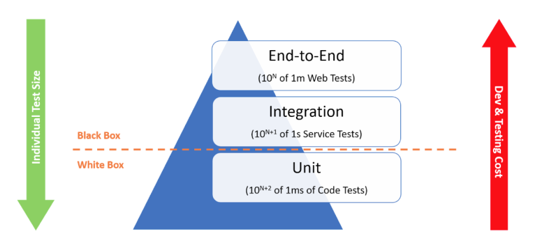

# Testing

## Startpunt voorbeeldapplicatie

```bash
git clone https://github.com/HOGENT-frontendweb/webservices-budget.git
cd webservices-budget
git checkout -b les5 0eca476
yarn install
yarn start:dev
```

## Soorten testen

We onderscheiden 3 soorten testen:

- **Unit testen**:
  - testen van een unit (een functie, een klasse, een component...) zonder externe dependencies
  - FIRST: Fast, Isolated, Repeatable, Self validating, Timely
  - Testen van logica, conditionele statements en loops - test elk pad in de code
- **Integratietesten**:
  - testen van een applicatie met zijn externe dependencies
- **e2e testen**:
  - testen van een applicatie vanuit het perspectief van de gebruiker
  - UI testen - hier dus niet van toepassing



Hoe hoger je in de piramide gaat, hoe trager de testen zijn en hoe meer ze kosten. Daarom zie je typisch heel veel testen onderaan de piramide, en veel minder bovenaan.

## Test Driven Development (TDD)

Binnen Test Driven Development (TDD) ga je als volgt te werk:

1. Schrijf een test
2. Doe de test falen
3. Pas de code aan
4. Doe de test slagen
5. Refactor: verbeter de code zonder de functionaliteit te wijzigen

Probeer om dit principe zoveel mogelijk toe te passen in je eigen project, het is een goeie gewoonte om TDD te werken.

## Tools

Om testen te kunnen maken heb je nood aan een test library en een test runner. Binnen JavaScript zijn er verschillende mogelijkheden:

- [Jest](https://jestjs.io/)
- [Mocha](https://mochajs.org/)
- [Jasmine](https://jasmine.github.io/)
- [Vitest](https://vitest.dev/)
- ...

Node.js heeft tegenwoordig ook een [ingebouwde test runner](https://nodejs.org/api/test.html), maar deze is nog steeds experimenteel en momenteel nog beperkt op het gebied van coverage.

## Integratietesten

In deze cursus focussen we ons op integratietesten. We schrijven hier integratietesten om te testen of de verschillende onderdelen van onze applicatie goed samenwerken (bv. validatie, authenticatie...). We gebruiken hiervoor [Jest](https://jestjs.io/), een populaire test library voor JavaScript. Jest is een te groot framework om volledig in detail te behandelen, dus we beperken ons tot wat wij specifiek nodig hebben. Zoals elke developer, moet jij in staat zijn om zelfstandig een nieuwe functionaliteit op te zoeken en te leren gebruiken.

Om integratietesten uit te voeren, heb je een draaiende server nodig. Dat is niet zo handig want dan moet je steeds twee commando's uitvoeren: 1) server starten en 2) testen uitvoeren. Wij gaan ervoor zorgen dat we met één commando de testen kunnen uitvoeren zonder onze server expliciet te hoeven starten.

We installeren eerst de nodige dependencies:

```bash
yarn add --dev jest supertest env-cmd ts-node ts-jest @types/jest @types/supertest
```

- [**jest**](https://jestjs.io/): de test library en test runner
- [**supertest**](https://www.npmjs.com/package/supertest): een library om HTTP requests te maken naar een server en het response te testen
  - wij gaan dit enkel gebruiken om HTTP requests te kunnen sturen zonder een echte server te moeten opzetten
  - we gebruiken de in Jest ingebouwde functionaliteiten om het response te testen
- [**env-cmd**](https://www.npmjs.com/package/env-cmd): een library om environment variabelen in te laden vanuit een bestand
- [**ts-node**](https://www.npmjs.com/package/ts-node): Typescript runtime
- [**ts-jest**](https://www.npmjs.com/package/ts-jest): Typescript preprocessor voor Jest
- @types/jest: Typescript definities voor Jest global
- @types/supertest: Typescript definities voor supertest

### Configuratie

Eerst en vooral moeten we onze server configureerbaar maken in test modus. Maak een bestand `config/testing.ts` aan en kopieer de inhoud van `config/development.ts` hiernaar. Maak vervolgens een `.env.test` aan in de root map, met volgende inhoud (pas aan waar nodig):

```ini
NODE_ENV=testing
DATABASE_URL=mysql://<USERNAME>:<PASSWORD>@localhost:3306/budget_test
```

Later gebruiken we dit bestand om ervoor te zorgen dat het juiste configuratiebestand wordt ingeladen. Voor het gemak voegen we twee scripts toe aan onze `package.json`:

```json
{
  "scripts": {
    "migrate:dev": "prisma migrate dev",
    "migrate:test": "env-cmd -f .env.test prisma migrate dev --skip-seed"
  }
}
```

Hiermee kunnen we de databank migreren in development en test modus. Het commando `env-cmd -f .env.test` zorgt ervoor dat de environment variabelen in `.env.test` worden ingeladen alvorens `prisma migrate dev` wordt uitgevoerd. Bij onze migraties voor de testen slaan we ook de seeding over. We willen immers in onze testen de volledige controle hebben over de data die we in de databank plaatsen.

Maak alvast de database budget_test aan via migrations:

```bash
yarn migrate:test
```

We laten Jest een leeg configuratiebestand aanmaken:

```bash
yarn jest --init
```

Antwoord op de vragen als volgt:

- Would you like to use Jest when running "test" script in "package.json"?: yes
- Would you like to use Typescript for the configuration file?: yes
- Choose the test environment that will be used for testing: node
- Do you want Jest to add coverage reports?: no
- Which provider should be used to instrument code for coverage?: v8
- Automatically clear mock calls, instances, contexts and results before every test?: no

Dit commando maakt een bestand `jest.config.ts` aan. Je vindt de nodige informatie over deze configuratie op <https://jestjs.io/docs/configuration>.

Jest zoekt standaard naar testen met volgende reguliere expressies: `**/__tests__/**/*.[jt]s?(x)` en `**/?(*.)+(spec|test).[tj]s?(x)`. Het zoekt dus naar bestanden die zich in een map `__tests__` bevinden, of bestanden die eindigen op `.spec.js`, `.test.js`, `.spec.ts` of `.test.ts`. Pas in dit bestand volgende property aan en plaats uit commentaar:

```ts
{
  testMatch: [
    "**/__tests__/**/?(*.)+(spec|test).[jt]s?(x)",
  ],
}
```

Hierdoor worden enkel testen uitgevoerd die zich in een map `__tests__` bevinden. Met de `preset` instelling zorgen we ervoor dat de TypeScript bestanden vertaald worden met `ts-jest`.

```ts
{
  preset: 'ts-jest',
}
```

Je kan ervoor opteren om unit testen te maken voor bv. de servicelaag. In dat geval maak je een map `__tests__` aan in de `src/service` map en plaats je daar je unit testen in. We plaatsen onze testen in een map `__tests__` in de root map van onze applicatie, want het zijn integratietesten voor de hele applicatie.

We moeten wel nog het automatisch gegenereerde `test` script aanpassen zodat ons `.env.test` bestand wordt ingeladen. Pas het `test` script in `package.json` aan als volgt en voeg een `test:coverage` script toe om de coverage te berekenen. Je kan er ook voor kiezen om altijd coverage te berekenen door de `test` script of `jest.config.ts` aan te passen.

```json
{
  "scripts": {
    "test": "env-cmd -f .env.test jest --runInBand",
    "test:coverage": "env-cmd -f .env.test jest --runInBand --coverage"
  }
}
```

We gebruiken hier ook de `runInBand` optie van Jest zodat onze testen niet parallel worden uitgevoerd. Dit zorgt er o.a. voor dat het werken met testdata iets eenvoudiger is.

### Linting configuratie

Alvorens we aan de slag gaan, configureren we ook de ESLint plugin voor Jest. Installeer de plugin:

```bash
yarn add --dev eslint-plugin-jest
```

En voeg de plugin toe aan de ESLint configuratie:

```js
// eslint.config.mjs
// ... (imports)
import jest from 'eslint-plugin-jest';

export default tseslint.config(
  // ...
  {
    files: ['**/*.spec.ts'],
    plugins: { jest },
  },
);
```

We linten hierbij enkel de testbestanden, omdat we enkel daar Jest gebruiken. Voeg dit onderaan toe.

## Refactoring

We gaan onze code wat refactoren zodat we onze testen kunnen schrijven. We gaan ervoor zorgen dat:

1. de installatie van onze middlewares afgezonderd is in een aparte functie;
2. onze server gestart kan worden zonder dat de server effectief luistert naar requests;

### Installatie middlewares afzonderen

Maak een nieuw bestand `src/core/installMiddlewares.ts`. Maak en exporteer een functie `installMiddlewares` die alle huidige middlewares (buiten de routers) installeert in een Koa applicatie. Deze Koa applicatie wordt meegegeven als parameter. Kopieer ook de nodige imports en configuratievariabelen.

```ts
// src/core/installMiddlewares.ts
import config from 'config';
import bodyParser from 'koa-bodyparser';
import koaCors from '@koa/cors';
import type { KoaApplication } from '../types/koa';

const CORS_ORIGINS = config.get<string[]>('cors.origins');
const CORS_MAX_AGE = config.get<number>('cors.maxAge');

export default function installMiddlewares(app: KoaApplication) {
  app.use(
    koaCors({
      origin: (ctx) => {
        if (CORS_ORIGINS.indexOf(ctx.request.header.origin!) !== -1) {
          return ctx.request.header.origin!;
        }
        // Not a valid domain at this point, let's return the first valid as we should return a string
        return CORS_ORIGINS[0] || '';
      },
      allowHeaders: ['Accept', 'Content-Type', 'Authorization'],
      maxAge: CORS_MAX_AGE,
    }),
  );

  app.use(bodyParser());
}
```

Importeer deze functie in `src/index.ts` en gebruik ze om de middlewares te installeren:

```ts
// imports
// ...
import installMiddlewares from './core/installMiddlewares'; // 👈

// ... (configuratievariabelen)
// ... (app initialiseren)

installMiddlewares(app); // 👈

// ...
```

Start de server en controleer of alles nog werkt.

### Server starten zonder luisteren

We hernoemen `src/index.ts` naar `src/createServer.ts`.

```ts
// src/createServer.ts
import Koa from 'koa';

import { getLogger } from './core/logging';
import { initializeData, shutdownData } from './data';
import installMiddlewares from './core/installMiddlewares';
import installRest from './rest';
import type {
  KoaApplication,
  BudgetAppContext,
  BudgetAppState,
} from './types/koa'; // 👈 1

// 👇 1
export interface Server {
  getApp(): KoaApplication;
  start(): Promise<void>;
  stop(): Promise<void>;
}

// 👇 2
export default async function createServer(): Promise<Server> {
  const app = new Koa<BudgetAppState, BudgetAppContext>();

  installMiddlewares(app);
  await initializeData();
  installRest(app);

  // 👇 3
  return {
    getApp() {
      return app;
    },

    start() {
      return new Promise<void>((resolve) => {
        app.listen(9000, () => {
          getLogger().info('🚀 Server listening on http://localhost:9000');
          resolve();
        });
      });
    },

    async stop() {
      app.removeAllListeners();
      await shutdownData();
      getLogger().info('Goodbye! 👋');
    },
  };
}
```

1. Definieer een interface voor het object dat we gaan retourneren. Dit object bevat:
   - een functie `getApp` die de Koa applicatie teruggeeft.
   - een functie `start` die de server start
   - een functie `stop` die de server stopt
     Importeer het type `KoaApplication`
2. De functie retourneert een `Server` object, maar de functie is `async` dus het returntype is een `Promise<Server>`.
3. We retourneren een object met de drie functies die we hebben gedefinieerd.
   - `getApp` retourneert de Koa applicatie.
   - `start` start de server en retourneert een `Promise<void>`. Hier maken we zelf een `Promise` aan omdat `app.listen` geen `Promise` retourneert. Als de callback van `app.listen` aangeroepen wordt, luistert de server naar requests. We roepen in die callback de `resolve` functie aan.
   - `stop` stopt de server. We verwijderen eerst alle listeners van de app, sluiten de databankconnectie en loggen een afscheidsbericht. Zonder het sluiten van de databankconnectie, zal bv. Jest nooit stoppen met uitvoeren van de testen. Openstaande connecties is een van de dingen waarop een Node.js proces blijft wachten.

Vervolgens maken we een nieuwe `src/index.ts`:

```ts
// src/index.ts
import createServer from './createServer'; // 👈 3

// 👇 1
async function main() {
  // 👇 4
  try {
    const server = await createServer(); // 👈 5
    await server.start(); // 👈 5

    // 👇 6
    async function onClose() {
      await server.stop(); // 👈 6
      process.exit(0); // 👈 8
    }

    process.on('SIGTERM', onClose); // 👈 7
    process.on('SIGQUIT', onClose); // 👈 7
  } catch (error) {
    console.log('\n', error); // 👈 4
    process.exit(-1); // 👈 4
  }
}

main(); // 👈 2
```

1. We maken een `main` functie aan die we `async` maken zodat we `await` kunnen gebruiken.
2. We roepen deze functie aan zodat de server effectief wordt gestart.
3. We importeren de `createServer` functie die we eerder hebben aangemaakt.
4. We maken een `try/catch` blok aan om eventuele fouten op te vangen. Als er een fout optreedt, loggen we deze en stoppen we de applicatie met een exit code `-1`.
   - Herinner je: alle exit codes verschillend van `0` betekenen dat er een fout is opgetreden.
5. We maken een server aan en starten deze meteen.
6. We maken een functie `onClose` aan die we gebruiken om de server te stoppen en de applicatie af te sluiten. Als we deze functie niet zouden gebruiken, dan wordt bv. de databankconnectie niet mooi afgesloten en gaat Jest nooit stoppen met uitvoeren van de testen.
7. We registreren deze functie als handler voor de `SIGTERM` en `SIGQUIT` events. Deze events worden getriggerd als de applicatie wordt gestopt (bv. door Jest).
8. Het is belangrijk om de applicatie zelf ook expliciet te stoppen met een exit code `0`. Dit wordt niet meer automatisch gedaan als je een handler registreert voor `SIGTERM` en `SIGQUIT`.

Door deze refactoring kunnen we onze server gebruiken in onze testen zonder dat we deze hoeven op te starten. Zonder deze refactoring zouden we twee terminals nodig hebben: één om de server te starten en één om de testen uit te voeren. Dit zou ook onhandig zijn in CI/CD pipelines.

## Integratietesten schrijven

Jest voorziet een aantal globale functies die je kan gebruiken in je testen. De belangrijkste zijn:

- `describe`: definieert een test suite (= groeperen van testen)
- `test` of `it`: definieert een test
- `beforeAll`: definieert een functie die wordt uitgevoerd voor alle testen
- `afterAll`: definieert een functie die wordt uitgevoerd na alle testen
- `beforeEach`: definieert een functie die wordt uitgevoerd voor elke test
- `afterEach`: definieert een functie die wordt uitgevoerd na elke test

### GET /api/transactions

#### De opzet

Maak een nieuwe map `__tests__` aan in de root map van je applicatie. Maak hierin een map `rest` met een bestand `transactions.spec.ts` aan. Voor we effectief kunnen testen, moeten we ervoor zorgen dat de server klaar is voor gebruik.

```ts
import supertest from 'supertest'; // 👈 1
import createServer from '../../src/createServer'; // 👈 1
import type { Server } from '../../src/createServer'; // 👈 3

// 👇 2
describe('Transactions', () => {
  // 👇 3
  let server: Server;
  let request: supertest.Agent;

  // 👇 4
  beforeAll(async () => {
    server = await createServer(); // 👈 5
    request = supertest(server.getApp().callback()); // 👈 6
  });

  // 👇 7
  afterAll(async () => {
    await server.stop();
  });

  const url = '/api/transactions'; // 👈 8
});
```

1. Importeer `supertest` en `createServer` zodat we een server kunnen starten zonder dat deze luistert naar requests.
2. We groeperen onze testen voor de transacties in een test suite met naam "Transactions".
   - `describe` definieert een test suite. De functie verwacht een naam en een functie als argument. De functie bevat de testen die we willen uitvoeren.
3. Definieer een aantal variabelen voor later.
4. We gebruiken de functie `beforeAll` om een aantal dingen uit te voeren voor alle testen uitgevoerd worden.
5. We maken een server.
6. We maken een supertest instantie waarmee we HTTP requests kunnen sturen naar de server.
7. Na alle testen stoppen we de server.
   - Je kan dit eens weglaten en dan zal je zien dat Jest de uitvoering nooit stopt. Dit komt omdat de connectie met de databank niet wordt afgesloten en Jest dus blijft wachten tot deze connectie wordt afgesloten.
8. We definiëren een constante `url` die we gebruiken om de URL van de API te definiëren. Dit is een goede gewoonte omdat je zo maar op één plaats de URL moet aanpassen als deze zou wijzigen.

#### De test zelf

Nu is het tijd om een eerste echte integratietest te schrijven!

```ts
describe('Transactions', () => {
  // ...

  // 👇 1
  describe('GET /api/transactions', () => {
    // 👇 2
    it('should 200 and return all transactions', async () => {
      const response = await request.get(url); // 👈 3
      expect(response.status).toBe(200); // 👈 4
    });
  });
});
```

1. We maken een nieuwe test suite aan voor de `GET /api/transactions` endpoint. Zo kan je alle testen voor dit endpoint groeperen en krijg je een mooie en overzichtelijke uitvoer in de console.
2. We definiëren een test om te checken of alle transacties opgehaald kunnen worden.
3. We sturen een GET request naar `/api/transactions`.
4. We verwachten dat de statuscode van het response gelijk is aan 200.
   - Merk op: Deze test is te algemeen. We moeten nl. ook verifiëren of de verwachte transacties in het response aanwezig zijn. Hiervoor moet de database aangevuld worden met testdata.

Voer de test uit met `yarn test` en controleer of de test slaagt.

#### Testdata

We definiëren wat testdata bovenaan in het bestand `transactions.spec.ts`, we zien hier drie transacties, één place en één user:

```ts
const data = {
  transactions: [
    {
      id: 1,
      user_id: 1,
      place_id: 1,
      amount: 3500,
      date: new Date(2021, 4, 25, 19, 40),
    },
    {
      id: 2,
      user_id: 1,
      place_id: 1,
      amount: -220,
      date: new Date(2021, 4, 8, 20, 0),
    },
    {
      id: 3,
      user_id: 1,
      place_id: 1,
      amount: -74,
      date: new Date(2021, 4, 21, 14, 30),
    },
  ],
  places: [
    {
      id: 1,
      name: 'Test place',
      rating: 3,
    },
  ],
  users: [
    {
      id: 1,
      name: 'Test User',
    },
  ],
};
```

De data zal ook verwijderd moeten worden uit de database. We definiëren bovenaan ook een `dataToDelete` die de id's bevat die uit de database verwijderd dienen te worden.

```ts
const dataToDelete = {
  transactions: [1, 2, 3],
  places: [1],
  users: [1],
};
```

We voegen de testdata toe aan de databank voor alle testen omtrent `GET /api/transactions` uitgevoerd worden:

```ts
import { prisma } from '../../src/data'; // 👈 1

describe('Transactions', () => {
  // ...

  describe('GET /api/transactions', () => {
    // 👇 2
    beforeAll(async () => {
      await prisma.place.createMany({ data: data.places });
      await prisma.user.createMany({ data: data.users });
      await prisma.transaction.createMany({ data: data.transactions });
    });

    // 👇 3
    afterAll(async () => {
      await prisma.transaction.deleteMany({
        where: { id: { in: dataToDelete.transactions } },
      });
      await prisma.place.deleteMany({
        where: { id: { in: dataToDelete.places } },
      });
      await prisma.user.deleteMany({
        where: { id: { in: dataToDelete.users } },
      });
    });

    it('should 200 and return all transactions', async () => {
      const response = await request.get(url);
      expect(response.status).toBe(200);
      expect(response.body.items.length).toBe(3); // 👈 4
    });
  });
});
```

1. We importeren `prisma` zodat we de data kunnen toevoegen en verwijderen.
2. We gebruiken de `beforeAll` functie om de testdata toe te voegen aan de databank voor alle testen uit deze test suite uitgevoerd worden. We gebruiken de `createMany` functie van Prisma om de data toe te voegen.
3. De data moet ook verwijderd worden na alle testen. We gebruiken de `afterAll` functie om dit te doen nadat alle testen uit deze test suite uitgevoerd zijn. We gebruiken de `deleteMany` functie van Prisma om de data te verwijderen. We verwijderen enkel de data die we hebben toegevoegd.
4. Controleer nu of het aantal opgehaalde transacties het verwachte aantal is.

We breiden de test uit om te controleren of de juiste transacties worden opgehaald:

```ts
it('should 200 and should return all transactions', async () => {
  const response = await request.get(url);
  expect(response.status).toBe(200);
  expect(response.body.items.length).toBe(3);

  // 👇
  expect(response.body.items).toEqual(
    expect.arrayContaining([
      {
        id: 2,
        user: {
          id: 1,
          name: 'Test User',
        },
        place: {
          id: 1,
          name: 'Test place',
          rating: 3,
        },
        amount: -220,
        date: new Date(2021, 4, 8, 20, 0).toJSON(),
      },
      {
        id: 3,
        user: {
          id: 1,
          name: 'Test User',
        },
        place: {
          id: 1,
          name: 'Test place',
          rating: 3,
        },
        amount: -74,
        date: new Date(2021, 4, 21, 14, 30).toJSON(),
      },
    ]),
  );
});
```

Met `expect.arrayContaining` controleren we of de array `response.body.items` minstens de objecten bevat die we verwachten. De objecten moeten niet in dezelfde volgorde staan, maar ze moeten wel allemaal aanwezig zijn. Hier testen we of de transacties met id 2 en 3 aanwezig zijn in het response.

Voer de test uit en controleer of hij slaagt.

### Oefening 1 - GET /api/transactions/:id

Schrijf een test voor het endpoint `GET /api/transactions/:id`:

1. Maak een nieuwe test suite aan voor het endpoint `GET /api/transactions/:id`.
2. Zorg ervoor dat wat testdata aanwezig is in de databank.
3. Ruim deze data ook op na de testen.
4. Voer de test uit:
   1. Check of de statuscode gelijk is aan 200.
   2. Check of de geretourneerde transactie zoals verwacht is.

- Oplossing +

  Check uit op commit `b0e5bb4` van onze [voorbeeldapplicatie](https://github.com/HOGENT-frontendweb/webservices-budget).

  Als we validatie toevoegen aan de back-end, moeten we nog volgende testen voorzien:

  - testen of de statuscode 404 is als de transactie niet bestaat
  - testen of de statuscode 400 is als de id geen nummer is

### POST /api/transactions

Maak een nieuwe test suite aan voor het endpoint `POST /api/transactions` (in de overkoepelende `Transactions` test suite):

```ts
describe('POST /api/transactions', () => {
  const transactionsToDelete: number[] = []; // 👈 2

  // 👇 1
  beforeAll(async () => {
    await prisma.place.createMany({ data: data.places });
    await prisma.user.createMany({ data: data.users });
  });

  afterAll(async () => {
    // 👇 2
    await prisma.transaction.deleteMany({
      where: { id: { in: transactionsToDelete } },
    });

    // 👇 3
    await prisma.place.deleteMany({
      where: { id: { in: dataToDelete.places } },
    });

    // 👇 3
    await prisma.user.deleteMany({
      where: { id: { in: dataToDelete.users } },
    });
  });
});
```

1. We voegen de places en users toe aan de databank. We hebben beide nodig om een transactie aan te maken.
2. We voegen een array toe om de id's van de transacties bij te houden die we moeten verwijderen na de testen. We zullen er nl. één toevoegen hier, daarvan weten we het id nog niet.
3. We verwijderen nadien de toegevoegde places en users.

Daarna schrijven we de test:

```ts
it('should 201 and return the created transaction', async () => {
  // 👇 1
  const response = await request.post(url).send({
    amount: 102,
    date: '2021-05-27T13:00:00.000Z',
    placeId: 1,
    userId: 1,
  });

  expect(response.status).toBe(201); // 👈 2
  expect(response.body.id).toBeTruthy(); // 👈 3
  expect(response.body.amount).toBe(102); // 👈 4
  expect(response.body.date).toBe('2021-05-27T13:00:00.000Z'); // 👈 4
  // 👇 5
  expect(response.body.place).toEqual({
    id: 1,
    name: 'Test place',
    rating: 3,
  });
  // 👇 5
  expect(response.body.user).toEqual({
    id: 1,
    name: 'Test User',
  });

  // 👇 6
  transactionsToDelete.push(response.body.id);
});
```

1. Voer het POST request uit. Met de `send` functie kan je de request body doorgeven.
2. Check of de statuscode gelijk is aan 201.
3. Check of het response een id bevat. De waarde maakt hier niet uit, het moet enkel bestaan.
4. Controleer of het response de juiste waarden bevat.
5. Controleer of het response de juiste place en user bevat.
6. Voeg het id toe aan de array zodat we de transactie kunnen verwijderen na de testen.

Voer de test uit en controleer of hij slaagt. De test zou moeten falen omdat ons POST request een statuscode 200 retourneert. Pas de code aan zodat de test slaagt. Je moet waarschijnlijk de nog aanwezige testdata manueel verwijderen uit de databank voor je de test opnieuw uitvoert.

Als we validatie toevoegen aan de back-end, moeten we nog volgende testen voorzien:

- testen of de statuscode 400 is als de request body niet geldig is (bv. een property ontbreekt of heeft een ongeldige waarde)
- testen of de statuscode 404 is als de place niet bestaat

### Oefening 2 - PUT /api/transactions/:id

Schrijf een test voor het endpoint `PUT /api/transactions/:id`:

1. Maak een nieuwe test suite aan voor het endpoint `PUT /api/transactions/:id`.
2. Zorg ervoor dat wat testdata aanwezig is in de databank.
3. Ruim deze data ook op na de testen.
4. Voer de test uit:
   1. Check of de statuscode gelijk is aan 200.
   2. Check of de geretourneerde transactie zoals verwacht is.

- Oplossing +

  Check uit op commit `201fba4` van onze [voorbeeldapplicatie](https://github.com/HOGENT-frontendweb/webservices-budget).

  Als we validatie toevoegen aan de back-end, moeten we nog volgende testen voorzien:

  - testen of de statuscode 400 is als de request body niet geldig is (bv. een property ontbreekt of heeft een ongeldige waarde)
  - testen of de statuscode 404 is als de place niet bestaat

### Oefening 3 - DELETE /api/transactions/

Schrijf een test voor het endpoint `DELETE /api/transactions/:id`:

1. Maak een nieuwe test suite aan voor het endpoint `DELETE /api/transactions/:id`.
2. Zorg ervoor dat wat testdata aanwezig is in de databank.
3. Ruim deze data ook op na de testen.
4. Voer de test uit:
   1. Check of de statuscode gelijk is aan 204.
   2. Check of de body leeg is.

- Oplossing +

  Check uit op commit `730fbaf` van onze [voorbeeldapplicatie](https://github.com/HOGENT-frontendweb/webservices-budget).

  Als we validatie toevoegen aan de back-end, moeten we nog volgende testen voorzien:

  - testen of de statuscode 400 is als het id geen nummer is
  - testen of de statuscode 404 is als de transactie niet bestaat

### Oefening 4 - Coverage

Vraag de coverage op van je testen met `yarn test:coverage`. Bekijk de gegenereerde HTML pagina in het bestand `coverage/lcov-report/index.html`. Wat merk je op?

- Oplossing +

  Je ziet dat we al een coverage van 100% hebben op alle API call van de transacties.

  In de service laag hebben we nog geen 100% omdat we bv. nog niet checken of een foutmelding wordt geretourneerd als de gevraagde entiteit niet bestaat. Dit zullen we oplossen in een volgend hoofdstuk.

### Oefening 5 - Testen voor de andere endpoints

Maak de testen aan voor alle endpoints onder `/api/places`, `/api/users` en `/api/health`. Denk na over de testen die je nu al kan schrijven en welke je pas kan schrijven als validatie is toegevoegd aan de back-end.

- Oplossing +

  Als we validatie toevoegen aan de back-end, moeten we nog volgende testen voorzien:

  - testen of de statuscode 400 is als de request body, URL... niet geldig is (bv. een property ontbreekt of heeft een ongeldige waarde)
  - testen of de statuscode 404 is als de place niet bestaat

## Oefening 6 - README

Vervolledig je `README.md` met de nodige informatie over het testen van je applicatie.

## Oplossing voorbeeldapplicatie

```bash
git clone https://github.com/HOGENT-frontendweb/webservices-budget.git
cd webservices-budget
git checkout -b les5-opl 88651f0
yarn install
yarn start:dev
```

## Extra's voor de examenopdracht

- Gebruik een andere test library (bv. [Mocha](https://mochajs.org/), [Jasmine](https://jasmine.github.io/), [Vitest](<http://localhost:3000/[https://](https://vitest.dev/)>)...)
