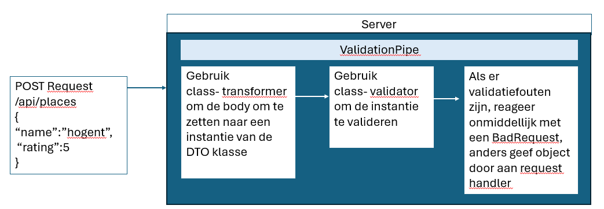
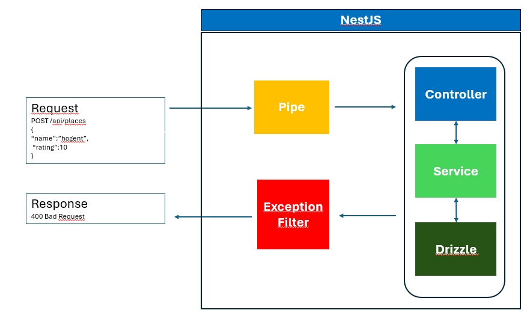
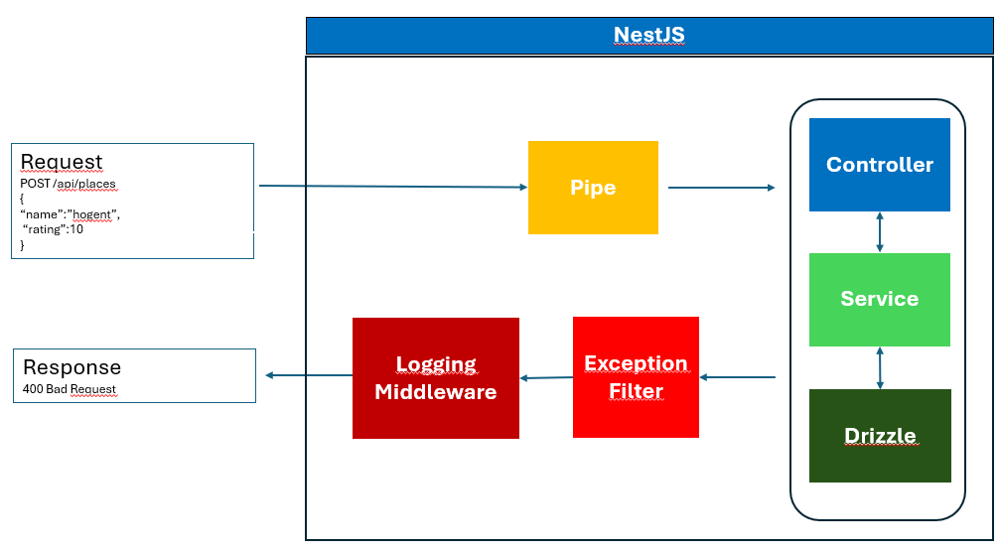

# Validatie en foutafhandeling

> **Startpunt voorbeeldapplicatie**
>
> ```bash
> git clone https://github.com/HOGENT-frontendweb/webservices-budget.git
> cd webservices-budget
> git checkout -b les6 b1ed447
> yarn install
> yarn start:dev
> ```

## Leerdoelen

- Je kan invoervalidatie implementeren a.d.h.v. pipes en DTO's
- Je kan een custom logger implementeren
- Je kan custom exception filters implementeren
- Je kan middleware gebruiken voor request logging

!> De wijzigingen die we hier bespreken, kan je meteen toepassen in je eigen project. Terwijl de lector in de les de code demonstreert in het voorbeeldproject, pas jij de aanpassingen best al direct toe in jouw eigen project. Zo leer je het meteen in jouw eigen context en heb je achteraf minder werk

## Invoervalidatie

Een belangrijk principe bij het ontwikkelen van een API is het valideren van de invoer. Dit is belangrijk om de integriteit van de data te garanderen. Het is ook belangrijk om de gebruiker van de API te beschermen tegen zichzelf. Als de gebruiker een fout maakt, dan moet de API dit opvangen en een duidelijke foutmelding terugsturen.

Je mag geen aannames maken over de invoer die je ontvangt. **Je moet er vanuit gaan dat de invoer altijd fout kan zijn.** Enkel validatie in de front-end is onvoldoende, dit is eenvoudig te omzeilen. Ooit zal iemand een verzoek sturen dat iets zal breken.

Welke soorten invoer kan een HTTP request bevatten?

- Antwoord +

  - **URL parameters:** je kan bijvoorbeeld het id van een plaats meegeven in de URL, bv. `/api/places/1`.
  - **Query parameters:** je kan bijvoorbeeld een zoekopdracht meegeven in de URL, bv. `/api/places?name=loon`.
  - **Body:** als je een nieuwe plaats maakt, dan geef je de nodige gegevens mee in de body van het request.
  - **Headers:** in het volgende hoofdstuk gaan we zien hoe we een token meegeven in de headers van een request, zo kunnen we de gebruiker authenticeren.

  In ons voorbeeldproject voegen we invoervalidatie toe voor de URL parameters, query parameters en de body van het request.

Invoervalidatie is gericht op het verifiëren van de ontvangen gegevens. Bijvoorbeeld in de `POST /api/transactions` moet het bedrag een geldig getal zijn (geen string, object...) én is het verplicht op te geven. Indien aan de validatie niet voldaan is, retourneer je een status code 400 (= bad request) en geef je details over de fout. Zonder bijkomende informatie is de HTTP 400 nutteloos. Bij validatiefouten stop je onmiddellijk de verdere verwerking van het request en retourneer je een passende foutboodschap voor de client. Stuur het response zo snel mogelijk terug naar de client (= **fail-fast principe**). De oorzaak van de validatiefout moet goed worden uitgelegd en begrepen door de client. Technische aspecten mag je om veiligheidsredenen niet retourneren.

?> In geen geval is het goed om een HTTP 500 terug te geven bij fouten die de client kan vermijden. De HTTP 500 dient enkel voor serverfouten die de client niet kan vermijden. Een HTTP 400 is een fout veroorzaakt door de client en moet dus ook door de client worden opgelost.

### Pipes

Lees de documentatie over [pipes](https://docs.nestjs.com/pipes) t.e.m. "Schema based validation".

In NestJS zijn pipes een soort middleware die o.a. gebruikt worden om:

- Data te transformeren – bv. een string "123" omzetten naar een number.
- Data te valideren – bv. checken of een parameter een geldig e-mailadres is.

👉 Concreet: pipes werken voordat je data in je controller terechtkomt. Ze pakken de inkomende request-gegevens (params, query, body), passen transformaties en/of validaties toe, en geven het resultaat door aan je endpoint. Als de data ongeldig is, kan een pipe meteen een exception gooien.

NestJS voorziet bv. in volgende built-in pipes:

- `ParseIntPipe`: zet een string "5" om naar een getal 5.
- `ParseBoolPipe`: zet "true" (als string) om naar true (als boolean).
- `ValidationPipe`: valideert data met behulp van [class-validator](https://npmjs.com/package/class-validator).

Gebruik in een controller:

```ts
// src/place/place.controller.ts
import { /* ... */ ParseIntPipe} from '@nestjs/common';

@Get(':id')
getPlaceById(@Param('id', ParseIntPipe) id: number): PlaceResponseDto { // 👈 1
  console.log(typeof id);
  return this.placeService.getById(id); // 👈 2
}
```

1. We geven een klasse (`ParseIntPipe`) door, niet een instantie. We laten de verantwoordelijkheid voor instantiëring over aan het framework en maken daarmee dependency injection mogelijk. Je kan ook een instantie doorgeven met extra opties.
2. Het type van de id parameter wordt nu een `number`. We hoeven het id niet langer naar een `number` om te zetten bij aanroep van de methode `getById` uit de `PlaceService`.

### ValidationPipe

In NestJS gebruik je DTO’s vooral om:

- Te bepalen welke velden een request/response mag bevatten.
- Validatie toe te passen op binnenkomende data.

Lees de documentatie over [validatie](https://docs.nestjs.com/techniques/validation) t.e.m. "Transform payload objects".

Pipes maken gebruik van de `class-validator` en `class-transformer` libraries. Installeer deze libraries:

```bash
pnpm i class-validator class-transformer
```

Je kan decorators van `class-validator` gebruiken om validatieregels toe te voegen aan een DTO.
Pas de `CreatePlaceRequestDto` klasse aan:

```ts
// src/places/place.dto.ts
import {
  IsString,
  IsNotEmpty,
  MaxLength,
  Min,
  Max,
  IsInt,
} from 'class-validator';

export class CreatePlaceRequestDto {
  @IsString()
  @IsNotEmpty()
  @MaxLength(255)
  name: string;

  @IsInt()
  @Min(1)
  @Max(5)
  rating: number;
}
```

Voor een overzicht van alle beschikbare decorators, zie de [class-validator documentatie](https://github.com/typestack/class-validator#validation-decorators).

De `ValidationPipe` zorgt ervoor dat alle inkomende DTO’s automatisch worden gevalideerd a.d.h.v. de decorators uit `class-validator`. Als een request niet voldoet, geeft NestJS een duidelijke foutmelding terug.

De `ValidationPipe` dien je te activeren in `main.ts` zodat deze wordt toegepast op alle inkomende requests.

```ts
// src/main.ts
import { ValidationPipe } from '@nestjs/common'; // 👈
// ...
async function bootstrap() {
  const app = await NestFactory.create(AppModule);
  app.setGlobalPrefix('api');
  // 👇
  app.useGlobalPipes(
    new ValidationPipe({
      whitelist: true, // verwijdert de properties die niet in de DTO staan
      forbidNonWhitelisted: true, // gooit fout als er foute properties binnenkomen
      forbidUnknownValues: true, // gooit fout bij onbekende types/waarden
    }),
  );
  // ...
}

bootstrap();
```

- `whitelist: true`: alleen de velden die je expliciet hebt gedefinieerd in je DTO worden geaccepteerd. Alle andere (onverwachte) velden worden automatisch verwijderd. Het request gaat gewoon door, maar zonder de extra velden.
- `forbidNonWhitelisted: true`: gooit bovendien een fout als er ongewenste velden zijn. Het request wordt geweigerd met een duidelijke foutmelding.
- `forbidUnknownValues: true`: gooit een foutmelding bij onbekende types/waarden.

Probeer een POST request uit en:

- geef een rating op die groter is dan 5
- voeg een extra veld toe

We krijgen een HTTP 400 terug en de reden van de fout.

### Transformeren van payloads naar DTO's

In NestJS krijg je vaak data binnen als platte JSON-objecten (bijvoorbeeld uit een HTTP-request). Maar in je code wil je werken met echte instanties van een klasse, zodat je bijvoorbeeld methodes kan gebruiken, of zodat validatie en andere decorators goed werken. `Class transformers` zetten gewone JavaScript-objecten om naar instances van classes en omgekeerd.

Pas de `create` methode aan en doe een POST request. Bekijk de console.

```ts
// src/place/place.controller.ts
@Post()
@HttpCode(HttpStatus.CREATED)
async createPlace(
  @Body() createPlaceDto: CreatePlaceRequestDto,
): Promise<PlaceResponseDto> {
  console.log(createPlaceDto instanceof CreatePlaceRequestDto); // 👈
  return this.placeService.create(createPlaceDto);
}
```

De `ValidationPipe` kan automatisch payloads omzetten naar een instance van de DTO-klasse. Om automatische transformatie in te schakelen, stel je `transform` in op `true` in `main.ts`.

```ts
// src/main.ts
import { NestFactory } from '@nestjs/core';
import { AppModule } from './app.module';
import { ValidationPipe } from '@nestjs/common';

async function bootstrap() {
  // ...

  app.useGlobalPipes(
    new ValidationPipe({
      whitelist: true,
      forbidNonWhitelisted: true,
      forbidUnknownValues: true,
      transform: true, // 👈 zet inkomende JSON om naar instantie van DTO-klasse
    }),
  );

  // ...
}

bootstrap();
```

`transform:true`: zet de inkomende JSON om naar een instance van de DTO-klasse m.b.v. `plainToInstance` methode van `class-transformer`.

Voer een POST request uit en bekijk het type.

### Primitieve types transformeren

Class transformers kunnen ook primitieve types omzetten. Alles wat via `@Param()`, `@Query()`,... binnenkomt is van type `string`. Als we in de `getPlaceById` methode het type van de id veranderen in `number` zal `ValidationPipe` dit proberen om te zetten. Verwijder de `ParseIntPipe` en pas aan.

```ts
// src/place/place.controller.ts

@Get(':id')
async getPlaceById(@Param('id') id: number): Promise<PlaceResponseDto> {
    console.log(typeof id);
    return this.placeService.getById(id);
}
```

Doe dit ook voor PUT en DELETE. We hoeven `Number` functie niet langer te gebruiken. Merk op dat deze feature invloed heeft op de performantie van je applicatie.

### Formatteren van validatie fouten

Standaard gooit de `ValidationPipe` een `BadRequestException` met een array van validatiefouten (`ValidationError[]`). Als je dat gedrag wil aanpassen, kan je een eigen `exceptionFactory` functie meegeven.

Momenteel zal een POST met onderstaande JSON:

```json
{
  "name": "HOGENT",
  "rating": 10,
  "review": "dit is een review"
}
```

Deze respons retourneren:

```json
{
  "message": [
    "property review should not exist",
    "rating must not be greater than 5"
  ],
  "error": "Bad Request",
  "statusCode": 400
}
```

We willen deze fouten formatteren zodat we mooi per parameter de fouten gegroepeerd zien. Zo is het voor de front-end makkelijker om bv. per inputveld de bijhorende error te tonen.

```ts
// src/main.ts
import {
  ValidationPipe,
  ValidationError,
  BadRequestException,
} from '@nestjs/common';
// ...
app.useGlobalPipes(
  new ValidationPipe({
    whitelist: true,
    transform: true,
    forbidNonWhitelisted: true,
    forbidUnknownValues: true,

    // 👇
    exceptionFactory: (errors: ValidationError[] = []) => {
      const formattedErrors = errors.reduce((acc, err) => {
        acc[err.property] = Object.values(err.constraints || {});
        return acc;
      }, {} as Record<string, string[]>);

      return new BadRequestException({
        details: { body: formattedErrors },
      });
    },
  }),
);
// ...
```

Voer het POST request terug uit en bekijk de output.

### Samenvatting

Samenvattend gebeuren volgende validatiestappen alvorens de invoer bij de juiste methode in de controller terechtkomt:



### Oefening

Voeg invoervalidatie toe

- voor de endpoints `/api/transactions` en `/api/users`
- voor de pagination, zie `PaginationQuery`. De parameters `page` en `limit` zijn optioneel.

<br />

- Oplossing +

  ```ts
  //  src/transactions/transaction.dto.ts
  import { Min, IsDate, MaxDate, IsPositive, IsInt } from 'class-validator';
  import { Type } from 'class-transformer';
  // ...
  export class CreateTransactionRequestDto {
    @IsInt()
    @Min(1)
    placeId: number;

    @IsInt()
    @Min(1)
    userId: number;

    @IsPositive()
    amount: number;

    @Type(() => Date)
    @IsDate()
    @MaxDate(new Date(), { message: 'Date must not be in the future' })
    date: Date;
  }
  ```

  ```ts
  // src/users/user.dto.ts
  import { IsString, IsNotEmpty, MaxLength } from 'class-validator';
  export class CreateUserRequestDto {
    @IsString()
    @IsNotEmpty()
    @MaxLength(255)
    name: string;
  }
  ```

  ```ts
  // src/common/pagination.dto.ts
  import { Type } from 'class-transformer';
  import { IsInt, Min, IsOptional } from 'class-validator';

  export class PaginationQuery {
    @IsOptional()
    @Type(() => Number)
    @IsInt()
    @Min(1)
    page?: number = 1;

    @IsOptional()
    @Type(() => Number)
    @IsInt()
    @Min(1)
    limit?: number = 10;
  }
  ```

  - `@Type`: Type transformatie, converteert de waarde automatisch naar het opgegeven type wanneer de data wordt gedeserialiseerd (bijvoorbeeld van JSON naar een class instance). Query parameters komen altijd als strings binnen in HTTP requests. De validation decorators zoals `@IsInt()` en `@Min(1)` verwachten numbers. Zonder deze transformatie zouden de validaties falen. Dit geldt ook voor Date types die via JSON worden aangeleverd.

## Logging

Lees deze [best practices for logging](https://betterstack.com/community/guides/logging/nodejs-logging-best-practices/).

Manueel links en rechts wat `console.log` instructies toevoegen om iets te loggen is natuurlijk niet zo handig. Een goede logger laat toe om eenvoudig meer of minder te loggen al naargelang we in productie of development draaien.

Logs kan je ook met een zeker "level" loggen zodat je niet telkens alles moet in/uit commentaar zetten als je wat meer/minder detail wil. Een goede logger is best een uitgebreid stuk software, het kan nog veel meer.

NestJS bevat een ingebouwde tekstlogger via de `Logger` klasse uit `@nestjs/common`.

Neem de NestJS documentatie over [logging](https://docs.nestjs.com/techniques/logger) door tot aan de sectie 'JSON logging'. En neem dan sectie [Custom implementation](https://docs.nestjs.com/techniques/logger#custom-implementation) door.

We maken een eigen `CustomLogger` aan. In de `src` map maak je een `core` map aan. Voeg hierin een bestand `customLogger.ts` toe.

```ts
// src/core/customLogger.ts
import type { LoggerService } from '@nestjs/common';
import { ConsoleLogger } from '@nestjs/common';

export default class CustomLogger
  extends ConsoleLogger
  implements LoggerService
{
  log(message: string) {
    super.log('📢 ' + message);
  }

  error(message: string, trace: string) {
    super.error('❌  ' + message, trace);
  }

  warn(message: string) {
    super.warn('⚠️  ' + message);
  }

  debug(message: string) {
    super.debug('🐞 ' + message);
  }

  verbose(message: string) {
    super.verbose('📖 ' + message);
  }
}
```

`CustomLogger` implementeert alle methodes die in de `LoggerService`-interface van NestJS zijn gedefinieerd. `CustomLogger` breidt de standaard `ConsoleLogger` van NestJS uit met een emoji:

- log: 📢 voor algemene logs
- error: ❌ voor fouten
- warn: ⚠️ voor waarschuwingen
- debug: 🐞 voor debugberichten
- verbose: 📖 voor gedetailleerde logs

Elke methode roept de overeenkomstige methode van de `ConsoleLogger` aan, maar voegt eerst de emoji toe aan het bericht. Zo krijg je visueel onderscheid tussen verschillende soorten logberichten in je console.

Om de `CustomLogger` te gebruiken in de app, stel je deze logger in bij het opstarten van de applicatie. Dit doe je in het entrypoint-bestand, `main.ts`.

```ts
// src/main.ts
import { NestFactory } from '@nestjs/core';
import { AppModule } from './app.module';
import {
  ValidationPipe,
  ValidationError,
  BadRequestException,
  Logger,
} from '@nestjs/common'; // 👈 3
import CustomLogger from './core/customLogger'; // 👈 1

async function bootstrap() {
  // ...

  app.useLogger(new CustomLogger()); //👈 2

  // ...

  await app.listen(process.env.PORT ?? 3000, () => {
    new Logger().log('🚀 Server listening on http://127.0.0.1:3000'); //👈 3
  });
}

bootstrap();
```

1. Importeer `CustomLogger`.
2. Configureer de app zodat een aangepaste logger (`CustomLogger`) gebruikt wordt in plaats van de standaard logger van NestJS.
3. We loggen een bericht wanneer de server opgestart is. Nu worden alle logs van je applicatie via de `CustomLogger` verwerkt.

Bekijk het resultaat in de terminal. Zijn dit geen mooie logs?

### Oefening

Maak gebruik van `loglevels` om in productie en test-omgeving minder te loggen.

- Oplossing +

  ```ts
  // src/`config/configuration.ts
  export default () => ({
    env: process.env.NODE_ENV,
    port: parseInt(process.env.PORT || '9000'),
    cors: {
      origins: process.env.CORS_ORIGINS
        ? (JSON.parse(process.env.CORS_ORIGINS) as string[])
        : [],
      maxAge: parseInt(process.env.CORS_MAX_AGE || String(3 * 60 * 60)),
    },
    database: {
      url: process.env.DATABASE_URL,
    },
    log: {
      levels: process.env.LOG_LEVELS
        ? (JSON.parse(process.env.LOG_LEVELS) as LogLevel[])
        : ['log', 'error', 'warn'],
    },
  });

  export interface ServerConfig {
    env: string;
    port: number;
    cors: CorsConfig;
    database: DatabaseConfig;
    log: LogConfig;
  }
  // ...
  export interface LogConfig {
    levels: LogLevel[];
  }

  type LogLevel = 'log' | 'error' | 'warn' | 'debug' | 'verbose' | 'fatal';
  ```

  ```ts
  // src/main.ts
  // ...
  const log = config.get<LogConfig>('log')!;

  app.useLogger(
    new CustomLogger({
      logLevels: log.levels,
    }),
  );
  // ...
  ```

  ```ini
  # .env
  LOG_LEVELS=["log","error","warn","debug"]
  ```

  Pas ook de README aan.

## Foutafhandeling

Lees de documentatie over [exception filters](https://docs.nestjs.com/exception-filters) tot aan de sectie "Exception filters".

### Standaard exceptions

NestJS voorziet een set HTTP exceptions die je direct kan gebruiken. Ze komen uit `@nestjs/common` en gooien een response met de juiste HTTP-statuscode en een standaard JSON-body.

Een voorbeeld van zo'n exception is de `NotFoundException`:

```ts
// src/place/place.service.ts
import { Injectable, NotFoundException } from '@nestjs/common';
// ...

 async getById(id: number): Promise<PlaceResponseDto> {
    const place = await this.db.query.places.findFirst({
      where: eq(places.id, id),
      with: {
        transactions: {
          with: {
            user: true,
            place: true,
          },
        },
      },
    });

    if (!place) {
      throw new NotFoundException(`No place with this id exists`); // 👈
    }

    return place;
  }
```

Als de plaats niet bestaat dan krijg je automatisch een HTTP 404 exception met volgende respons:

```json
{
  "message": "No place with this id exists",
  "error": "Not Found",
  "statusCode": 404
}
```

### Exception filters

Exception filters zijn klassen die afhandelen hoe exceptions worden omgezet naar responses. Standaard gebruikt NestJS een global exception filter (`BaseExceptionFilter`) die alle `HttpException` vertaalt naar JSON. Als je echter meer controle wil (bv. logging, een andere JSON-structuur, errors wegschrijven naar een monitoring tool) kan je hiervoor een Exception filter aanmaken.



Lees de sectie over [exception filters](https://docs.nestjs.com/exception-filters#exception-filters-1) in de NestJS documentatie.

Maak een bestand `http-exception.filter.ts` aan in de map `src/lib/`. Hierin definiëren we de structuur van het response voor een exception.

```ts
// src/lib/http-exception.filter.ts
interface HttpExceptionResponse {
  statusCode: number; // HTTP status code (400, 404, 500, etc.)
  timestamp: string; // Wanneer de error optrad
  message: string; // Error boodschap
  details?: object | null; // Extra error details (optioneel)
}
```

### Oefening

- Maak een klasse `HttpExceptionFilter` in `http-exception.filter.ts`. Zorg ervoor dat de `ExceptionFilter` onderstaande retourneert indien de plaats niet bestaat.
- Log bovendien de fout.
- Maak de filter beschikbaar in de volledige app

```json
{
  "statusCode": 404,
  "timestamp": "2025-09-12T08:55:15.039Z",
  "message": "No place with this id exists",
  "details": null
}
```

<br />

- Oplossing +

  ```ts
  // src/lib/http-exception.filter.ts
  import type { ExceptionFilter, ArgumentsHost } from '@nestjs/common';
  import { Catch, HttpException, Logger } from '@nestjs/common';
  import type { Response } from 'express';

  interface HttpExceptionResponse {
    statusCode: number;
    timestamp: string;
    message: string;
    details?: object | null;
  }

  @Catch(HttpException) // 👈 1
  export class HttpExceptionFilter implements ExceptionFilter {
    // 👈 2
    catch(exception: HttpException, host: ArgumentsHost) {
      // 👈 3
      const ctx = host.switchToHttp(); // 👈 4
      const response = ctx.getResponse<Response>(); // 👈 5
      const status = exception.getStatus(); // 👈 6

      // 👇 7
      const responseBody: HttpExceptionResponse = {
        statusCode: status,
        timestamp: new Date().toISOString(),
        message: exception.message,
        details: null,
      };

      // 👇 8
      new Logger('HttpExceptionFilter').error(
        `HTTP Exception: ${JSON.stringify(responseBody)}`,
      );

      response.status(status).json(responseBody); // 👈 9
    }
  }
  ```

  1. `@Catch`: Als er ergens in de applicatie een `HttpException` gegooid wordt, zal deze filter de fout afhandelen.
  2. De klasse implementeert de `ExceptionFilter` interface, met de catch methode.
  3. De `catch` methode krijgt 2 argumenten
     - `exception`: dit is de fout die gegooid werd (bv. een `NotFoundException`).
     - `host`: bevat alle context-informatie over de request/response.
  4. Omdat NestJS ook andere platformen ondersteunt (WebSockets, gRPC...), moet je expliciet zeggen dat je in HTTP context wil werken.
  5. Daarna haal je het response object op (van Express).
  6. Vervolgens haal je de status op. Dit geeft de juiste HTTP-statuscode terug (bv. 404).
  7. Hier herschrijf je de response. De status, tijdstip en basis error message van de Exception worden aan de respons toegevoegd.
  8. De json wordt gelogd.
  9. De status en json wordt ingesteld in de respons.

  Maak de filter global scoped:

  ```ts
  // src/main.ts
  import { HttpExceptionFilter } from './lib/http-exception.filter';

  // ...
  app.useGlobalFilters(new HttpExceptionFilter());
  // ...
  ```

  Vraag een onbestaande plaats op en bekijk de respons.

Je kan een eenvoudige exception gooien met enkel een custom message:

```ts
throw new NotFoundException('Place not found');
```

Of je kan ook meer detail meegeven met je exception:

```ts
throw new NotFoundException({
  message: 'Place not found'
  details: { id : 10}
});
```

Om ook de custom message en de details weer te geven in de respons passen we de code verder aan.

```ts
// src/lib/http-exception.filter.ts
// ...

@Catch(HttpException)
export class HttpExceptionFilter implements ExceptionFilter {
  catch(exception: HttpException, host: ArgumentsHost) {
    const ctx = host.switchToHttp();
    const response = ctx.getResponse<Response>();
    const status = exception.getStatus();

    const responseBody: HttpExceptionResponse = {
      statusCode: status,
      timestamp: new Date().toISOString(),
      message: exception.message,
      details: null,
    };

    // 👇
    if (exception instanceof HttpException) {
      const exceptionResponse = exception.getResponse();

      if (
        typeof exceptionResponse === 'object' &&
        exceptionResponse !== null &&
        'message' in exceptionResponse &&
        typeof exceptionResponse.message === 'string'
      ) {
        responseBody.message = exceptionResponse.message; // we nemen de custom message over ipv de basis error message
      }

      if (
        typeof exceptionResponse === 'object' &&
        exceptionResponse !== null &&
        'details' in exceptionResponse &&
        typeof exceptionResponse.details === 'object'
      ) {
        responseBody.details = exceptionResponse.details;
      }
    }

    new Logger('HttpExceptionFilter').error(
      `HTTP Exception: ${JSON.stringify(responseBody)}`,
    );

    response.status(status).json(responseBody);
  }
}
```

Voer een POST request uit met validatie fouten en bekijk het resultaat.

## Logging middleware

Middleware is code die uitgevoerd wordt tussen de inkomende request en de uitgaande response. Je kan het zien als een soort "tussenstop" die iets kan doen met de request of response.

Middleware functies kunnen de volgende taken uitvoeren:

- code uitvoeren.
- wijzigingen aanbrengen in de request- en response objecten.
- de request-response cyclus beëindigen.
- de volgende middleware functie in de stack aanroepen.
- als de huidige middleware functie de request-response cyclus niet beëindigt, moet deze next() aanroepen om de controle over te dragen aan de volgende middleware functie. Anders blijft de aanvraag hangen.

Voorbeeld: Stel je wil kunnen volgen welke requests binnenkomen in je API. Dat helpt bij debugging en monitoring. Zonder logger weet je niet wat er allemaal langs je server passeert. Nu loggen we enkel een foutmelding. Verwijder de logging code uit `src/lib/http-exception.filter.ts`. Alle logging zal nu gebeuren in de logging middleware.

Lees de documentatie over [logging middleware](https://docs.nestjs.com/middleware).



Maak een bestand `logger.middleware.ts`aan in de `src/lib` map.

```ts
// src/lib/logger.middleware.ts
import type { NestMiddleware } from '@nestjs/common';
import { Injectable, Logger } from '@nestjs/common';
import type { Request, Response, NextFunction } from 'express';

@Injectable() // 👈 1
export class LoggerMiddleware implements NestMiddleware {
  // 👈 1
  private readonly logger = new Logger(LoggerMiddleware.name); // 👈 2

  use(req: Request, res: Response, next: NextFunction) {
    // 👈 3
    res.on('finish', () => {
      // 👈 4
      // 👇 5
      const statusCode = res.statusCode;

      const message = `${req.method} ${req.originalUrl} - ${statusCode}`;

      if (statusCode >= 500) {
        this.logger.error(message);
      } else if (statusCode >= 400) {
        this.logger.warn(message);
      } else {
        this.logger.log(message);
      }
    });

    next(); // 👈 6
  }
}
```

1. Een middleware is gewoon een klasse die de interface `NestMiddleware` implementeert. Deze klasse in injecteerbaar.
2. Maak een instantie van de `Logger` aan. Geef de naam van de klasse door. Zo weet je in de logs altijd welk onderdeel van je applicatie het bericht heeft gelogd.
3. `use` is de te implementeren methode. `Request`, `Response`, `NextFunction` zijn types uit Express omdat NestJS onder de motorkap Express gebruikt.

   - Request: alle info over de inkomende request (bv. URL, headers, body, method).
   - Response: het antwoord dat je terugstuurt naar de client.
   - NextFunction: een functie die je moet oproepen om verder te gaan naar de volgende middleware of controller.

4. `res.on('finish', () => { ... })` "luistert" naar het moment dat de response klaar is en verstuurd wordt. Waarom? Omdat je dan ook de status code kent (200, 404, 500, ...).
5. De status code wordt gecontroleerd en wordt gelogd.
6. De logging is gebeurd. Geef de controle door aan de volgende functie in de pipeline.

In de `AppModule` geven we mee dat we bij elke request de `LoggerMiddleware` wensen te gebruiken. Er is echter geen plaats voor middleware in de `@Module()` decorator. In plaats daarvan stellen we ze in met de `configure()` methode van de moduleklasse. Modules die middleware bevatten, moeten de `NestModule` interface implementeren.

```ts
// src/app.module.ts
import { Module, MiddlewareConsumer, NestModule } from '@nestjs/common';
import { LoggerMiddleware } from './lib/logger.middleware';

// ...
export class AppModule implements NestModule {
  configure(consumer: MiddlewareConsumer) {
    // 👈 1
    consumer.apply(LoggerMiddleware).forRoutes('*path'); // 👈 2
  }
}
```

1. `configure()`: Deze methode wordt automatisch aangeroepen door NestJS om middlewares te configureren
2. `consumer.apply(LoggerMiddleware)`: Registreert de `LoggerMiddleware` bij de DI container.
   - `forRoutes('*path')`: Zorgt ervoor dat de `LoggerMiddleware` wordt uitgevoerd voor alle routes in je applicatie (de wildcard \* matcht alle paden)

Roep een endpoint aan en bekijk de logs.

## Oefening - Je eigen project (indien nog niet gebeurd is)

Voeg volgende functionaliteiten toe aan je eigen project:

- invoervalidatie voor alle endpoints
- transformatie van payloads naar DTO's, transformatie van primitieve types
- foutafhandeling met exception filters
- logging met een custom logger en logging middleware
- werk de `README.md` in de root van je repository bij met instructies voor de .env file

> **Oplossing voorbeeldapplicatie**
>
> ```bash
> git clone https://github.com/HOGENT-frontendweb/webservices-budget.git
> cd webservices-budget
> git checkout -b les6-opl 6504e86
> pnpm install
> pnpm start:dev
> ```
