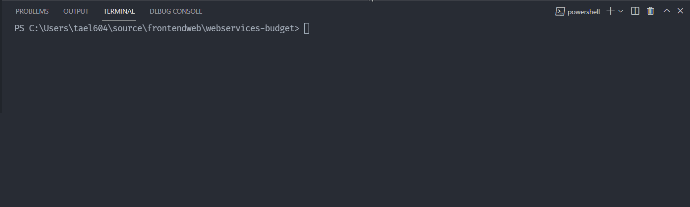

# Authenticatie en autorisatie

> **Startpunt voorbeeldapplicatie**
>
> Het volstaat om uit te checken op de `main` branch
>
> ```bash
> git clone https://github.com/HOGENT-Web/webservices-budget.git
> cd webservices-budget
> git checkout -b les7
> yarn install
> yarn start
> ```

## Jest: configuratie

We maken eerst een configuratiebestand voor Jest. Het is eenvoudiger om Jest in te stellen via dit bestand dan via de parameters van het commando

```git bash
yarn run jest --init
```



Voeg deze test scripts toe aan de `package.json` (jest heeft het origineel overschreven).

```bash
"test": "npx env-cmd -f .env.test jest",
"test:coverage": "npx env-cmd -f .env.test jest --coverage",
```

Als je alle testen nu uitvoert, falen ze. Dat is logisch: je moet voor elke API call aangemeld zijn en we melden nergens in de testen aan.

We vullen ook deze properties van `jest.config.js` in.

- `collectCoverageFrom`: mappen waarvan we coverage willen zien
- `coverageDirectory`: map waar de coverage opgeslagen moet worden
- `testMatch`: de paden waar Jest zoekt naar testen

```js
collectCoverageFrom: [
  './src/repository/**/*.js',
  './src/service/**/*.js',
  './src/rest/**/*.js',
],
coverageDirectory: '__tests__/coverage',
testMatch: [
  "**/__tests__/**/?(*.)+(spec|test).[jt]s?(x)",
],
```

## Jest: Globale setup

We gaan een beetje globale setup toevoegen. Deze wordt uitgevoerd alvorens één test suite uitgevoerd wordt, dit is dus perfect voor het toevoegen van test data zoals gebruikers om aan te melden.

`test/global.setup.js`

```js
const config = require('config'); // 👈 2
const { initializeLogging } = require('../src/core/logging'); // 👈 2
const Role = require('../src/core/roles'); // 👈 4
const { initializeData, getKnex, tables } = require('../src/data'); // 👈 3 en 4

// 👈 1
module.exports = async () => {
  // Create a database connection
  initializeLogging(config.get('log.level'), config.get('log.disabled')); // 👈 2
  await initializeData(); // 👈 3

  // Insert a test user with password 12345678
  const knex = getKnex(); // 👈 3

  await knex(tables.user).insert([
    {
      id: 1,
      name: 'Test User',
      email: 'test.user@hogent.be',
      password_hash:
        '$argon2id$v=19$m=2048,t=2,p=1$NF6PFLTgSYpDSex0iFeFQQ$Rz5ouoM9q3EH40hrq67BC3Ajsu/ohaHnkKBLunELLzU',
      roles: JSON.stringify([Role.USER]),
    },
    {
      id: 2,
      name: 'Admin User',
      email: 'admin.user@hogent.be',
      password_hash:
        '$argon2id$v=19$m=2048,t=2,p=1$NF6PFLTgSYpDSex0iFeFQQ$Rz5ouoM9q3EH40hrq67BC3Ajsu/ohaHnkKBLunELLzU',
      roles: JSON.stringify([Role.ADMIN, Role.USER]),
    },
  ]);
}; // 👈 4
```

1. Maak een bestand global.setup.js in de `test` map. We moeten een async functie, die de globale setup bevat, exporteren
2. We moeten eerst de logging initialiseren want op dit punt hebben we nog geen server
3. Dan maken we een connectie met de databank en halen we onze instantie van Knex op
4. en we voegen twee gebruikers toe: een gewone gebruiker en een admin. Beiden met wachtwoord `12345678`
5. Als laatste stellen we `globalSetup` van `jest.config.js` in met het pad naar dit bestand: `./tests/global.setup.js`.
   Haal dit property uit comment!

## Jest: globale teardown

We moeten nu ook de geopende databank-connectie sluiten, anders zal Jest nooit afsluiten aangezien er nog een resource in gebruik is.

`test/global.teardown.js`

```js
const { shutdownData, getKnex, tables } = require('../src/data'); // 👈 2 en 3

// 👈 1
module.exports = async () => {
  // Remove any leftover data
  await getKnex()(tables.transaction).delete(); // 👈 2
  await getKnex()(tables.user).delete(); // 👈 2
  await getKnex()(tables.place).delete(); // 👈 2

  // Close database connection
  await shutdownData(); // 👈 3
};
```

1. We exporteren opnieuw een functie die onze globale teardown (of "opruimcode") bevat
2. We verwijderen alle data uit de tabellen, moest die er nog zijn. Dit voorkomt dat de testen nadien falen door niet opgeruimde data van bepaalde test suites
3. Sluit de databank-connectie
4. Als laatste stellen we `globalTeardown` van `jest.config.js` in met het pad naar dit bestand: `./test/global.teardown.js`. Haal dit property uit comment!

## Jest: refactoring

We gaan het starten en stoppen van de server een beetje meer abstraheren zodat we dit eenvoudig kunnen hergebruiken in de verschillende test suites. Maak een bestand `supertest.setup.js` in de map `test`.

`tests/supertest.setup.js`

```js
const supertest = require('supertest'); // 👈 4
const createServer = require('../src/createServer'); // 👈 3
const { getKnex } = require('../src/data'); // 👈 4

// 👈 6
const login = async (supertest) => {
  const response = await supertest.post('/api/users/login').send({
    email: 'test.user@hogent.be',
    password: '12345678',
  }); // 👈 7

  if (response.statusCode !== 200) {
    throw new Error(response.body.message || 'Unknown error occured');
  } // 👈 8

  return `Bearer ${response.body.token}`; // 👈 9
};

// 👈 1
const withServer = (setter) => {
  // 👈 5
  let server; // 👈 2

  beforeAll(async () => {
    server = await createServer(); // 👈 3

    setter({
      knex: getKnex(),
      supertest: supertest(server.getApp().callback()),
    }); // 👈 4
  });

  afterAll(async () => {
    await server.stop(); // 👈 5
  });
};

module.exports = {
  login,
  withServer,
}; // 👈 1 en 6
```

1. Definieer en exporteer hierin een functie `withServer`. Deze heeft als taak om de juiste lifecycle hooks van Jest aan te roepen om de server starten/stoppen
2. Maak een variabele om de server bij te houden (binnen de functie)
3. En maak een nieuwe server in de `beforeAll`. Nu hebben we nog een probleem: hoe krijgen we de instantie van Knex en supertest uit de functie (we kunnen geen return doen in `beforeAll`)
4. Geef een soort "`setter`-functie" mee aan de withServer functie en roep deze aan met de juiste instanties
5. Sluiten de server in de `afterAll`
6. Als laatste schrijven we nog een helper-functie `login` waarmee we kunnen aanmelden voor elke test. Deze functie krijgt de juiste instantie van supertest mee als argument
7. We voeren het `POST /api/users/login` request uit met de juiste testdata. Herinner je: die wordt toegevoegd door de `global.setup.js`
8. Als het geen succesvol request was, dan gooien we een error. De error zal onze test(s) laten falen, in de meeste gevallen is dit een hele test suite
9. We retourneren de correct geformatteerde `Authorization` header

### Oefening

Definieer een helper genaamd `loginAdmin` die hetzelfde doet voor de admin user.

Dit is de oplossing voor het aanmelden van een admin.

`test/supertest.setup.js`

```js
//..
const loginAdmin = async (supertest) => {
  const response = await supertest.post('/api/users/login').send({
    email: 'admin.user@hogent.be',
    password: '12345678',
  });

  if (response.statusCode !== 200) {
    throw new Error(response.body.message || 'Unknown error occured');
  }

  return `Bearer ${response.body.token}`;
};
//..
module.exports = {
  //..
  loginAdmin,
};
```

We voegen een module toe die de nagaat of voor een bepaalde url de juiste statuscode geretourneerd wordt als de gebruiker niet is aangemeld of een ongeldig token wordt verstuurd. Daar de testen voor elk van de endpoints dient te gebeuren maken we hiervoor een aparte module aan.

`test/common/auth.js`

```js
// 👈 1
const testAuthHeader = (requestFactory) => {
  test('it should 401 when no authorization token provided', async () => {
    const response = await requestFactory();

    expect(response.statusCode).toBe(401);
    expect(response.body.code).toBe('UNAUTHORIZED');
    expect(response.body.message).toBe('You need to be signed in');
  });

  test('it should 401 when invalid authorization token provided', async () => {
    const response = await requestFactory().set(
      'Authorization',
      'INVALID TOKEN'
    );

    expect(response.statusCode).toBe(401);
    expect(response.body.code).toBe('UNAUTHORIZED');
    expect(response.body.message).toBe('Invalid authentication token');
  });
};

module.exports = {
  testAuthHeader,
};
```

1. de functie heeft 1 parameter, nl `requestFactory`. Deze factory creëert de request voor een bepaalde method en url.
2. de eerste test controleert het retourneren van een statuscode 401 als de gebruiker niet is aangemeld en hierdoor niet gemachtigd is om het endpoint te bevragen.
3. de tweede test controleert het retourneren van een statuscode 401 als een ongeldig token wordt meegestuurd en de gebruiker hierdoor niet gemachtigd is om het endpoint te bevragen.

## Transaction testen

We gaan de testen van transactions terug laten slagen.

`test/rest/transactions.spec.js`

```js
\\..
const {  testAuthHeader,} = require('../common/auth');// 👈 5
//..
const data = {
  // ...
  /* 👈 1
	users: [{
		id: '7f28c5f9-d711-4cd6-ac15-d13d71abff80',
		name: 'Test User'
	}]
  */
};

const dataToDelete = {
  // ...
  //users: ['7f28c5f9-d711-4cd6-ac15-d13d71abff80']  👈 1
};

describe('Transactions', () => {
  //let server;    👈 2
 let supertest, knex, authHeader; // 👈 3

  withServer(({
    supertest: s,
    knex: k,
  }) => {
    supertest = s;
    knex = k;
  }); // 👈 2

  beforeAll(async () => {
    /*👈 2
		server = await createServer();
		request = supertest(server.getApp().callback());
		knex = getKnex();
    */
    loginHeader = await login(request); // 👈 3
  });

  /*👈 2
	afterAll(async () => {
		await server.stop();
	});
  */

  // ...

  describe('GET /api/transactions', () => {
    // ...

    test('it should 200 and return all transactions', async () => {
      const response = await request.get(url).set('Authorization', authHeader); // 👈 4

      // expects hier
    });
  });
  // ...
    testAuthHeader(() => supertest.get(url));// 👈 5
});
```

1. Verwijder alle dummy data van users. Verwijder ook alle code die met Knex gebruikers toevoegt of verwijdert
2. Gebruik de nieuwe `withServer` helper om de server te starten. Stel via de `setter` knex en request in. Vergeet de imports niet op te ruimen.
3. Gebruik nu de `login` helper om aan te melden. De `login` header houden we bij voor later.
4. Voeg aan elk request deze login header toe
5. Voeg ook de testen toe die controleren of de juiste statuscode geretourneerd wordt als een gebruiker niet geauthenticeerd of geauthorizeerd is

### Oefening

Herhaal hetzelfde voor alle andere testen van transactions en places en users.

- voeg de login header toe
- test voor elke url of de juiste statuscode geretourneerd wordt als een gebruiker niet geauthenticeerd of geauthorizeerd is

### Oplossing: integratietesten

check uit op branch authenticatie van onze [voorbeeldapplicatie](https://github.com/HOGENT-Web/webservices-budget/tree/authenticatie)

```bash
git pull
git checkout -b authenticatie-testen origin/authenticatie
```
